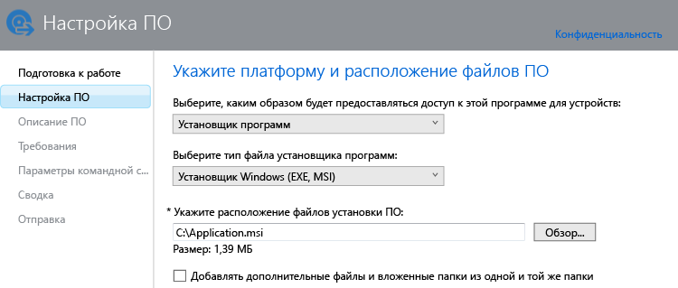

# Добавление приложений для компьютеров с ОС Windows в Microsoft Intune

В этом разделе описывается, как добавить приложения в Intune перед их развертыванием.

> [!IMPORTANT]
> Сведения в этом разделе помогут вам добавить приложения для компьютеров с Windows, которые управляются с помощью клиентского ПО Intune. Если нужно добавить приложения для зарегистрированных компьютеров с Windows и мобильных устройств, см. раздел [Добавление приложений для мобильных устройств в Microsoft Intune](add-apps-for-mobile-devices-in-microsoft-intune.md).

## Добавление приложения
В этой процедуре используется издатель ПО Intune для настройки свойств приложения и его отправки в облачное хранилище.

1.  В [консоли администрирования Microsoft Intune](https://manage.microsoft.com) последовательно выберите **Приложения** &gt; **Добавить приложения**, чтобы запустить издатель ПО Intune.

    > [!TIP]
    > Перед запуском издателя может потребоваться ввести имя пользователя и пароль Intune.

2.  На странице **Установка ПО** издателя программного обеспечения настройте следующие параметры.

    **Выберите, каким образом будет предоставляться доступ к этой программе для устройств** — выберите **Установщик программ**, а затем укажите:

    - **Выберите тип файла установщика программ**: указывает тип программного обеспечения, которое нужно развернуть. Для компьютера с Windows выберите **Установщик Windows**.
    - **Укажите расположение файлов установки ПО**: введите расположение файлов установки или нажмите кнопку **Обзор**, чтобы выбрать расположение из списка.
    - **Добавлять дополнительные файлы и вложенные папки из одной и той же папки**: для некоторых программ, использующих установщик Windows, требуются вспомогательные файлы, которые обычно находятся в одной папке с файлами установки. Выберите этот параметр, если помимо прочего требуется развернуть эти дополнительные файлы.

    Например, если вы хотите опубликовать приложение с именем Application.msi в Intune, страница будет выглядеть так: 

   Этот тип установки использует определенное пространство в облачном хранилище.

3.  На странице **Описание программного обеспечения** настройте следующие параметры.

    В зависимости от используемого файла установщика некоторые из этих значений могут быть введены автоматически или могут не отображаться.

    - **Издатель**: введите имя издателя приложения.
    - **Имя**: введите имя приложения так, как оно будет отображаться на корпоративном портале.  Убедитесь, что все имена приложений являются уникальными. Если имя приложения существует два раза, пользователи корпоративного портала увидят только одно из приложений.
    - **Описание**: введите описание приложения. Оно будет отображаться для пользователей на корпоративном портале.
    - **URL-адрес страницы сведений о ПО** (необязательно): введите URL-адрес веб-сайта со сведениями об этом приложении. Этот URL-адрес будет отображаться для пользователей на корпоративном портале.
    - **URL-адрес политики конфиденциальности** (необязательно). Введите URL-адрес веб-сайта со сведениями о политике конфиденциальности для этого приложения. Этот URL-адрес будет отображаться для пользователей на корпоративном портале.
    - **Категория** (необязательно): выберите одну из встроенных категорий приложений. Это облегчит поиск приложения при просмотре пользователями корпоративного портала.
    - **Значок** (необязательно): отправьте значок, который будет связан с приложением. Это значок, который будет отображаться с приложением при просмотре пользователями корпоративного портала.

4.  На странице **Требования** укажите требования, которые должны быть выполнены перед установкой приложения на устройстве. **Архитектура**: укажите ОС для установки: 32-разрядная, 64-разрядная версия или обе. **Операционная система**: выберите минимальную операционную систему, в которой можно установить это приложение.

5.  На странице **Правила обнаружения** можно настроить правила для определения того, установлено ли уже на компьютере настраиваемое вами приложение, или использовать правила обнаружения по умолчанию для автоматической перезаписи всех ранее установленных версий приложения. Этот параметр предназначен для установщика Windows (только EXE-файлы).
6.  
    Ниже приведены правила, которые вы можете настроить.
    - **Файл существует**: укажите путь к файлу, который нужно обнаружить. Вы можете выполнить поиск в разделе **%ProgramFiles%** (поиск выполняется в **Program Files**\*&lt;путь&gt;* и **Program Files (x86)**\*&lt;путь&gt;*) на ПК или в **%SystemDrive%** (поиск выполняется с корня диска ПК, обычно с диска C:).
    - **Код продукта MSI существует**: нажмите кнопку **Обзор** для выбора файла установщика Windows (MSI), который нужно обнаружить. 
    - **Раздел реестра существует**: укажите раздел реестра, который начинается с **HKEY_LOCAL_MACHINE\**. Поиск выполняется по обоим путям к реестру в 32- и 64-разрядной версиях. Если указанный раздел существует, правило обнаружения удовлетворяется.

    Если приложение соответствует любому настроенному правилу, оно не устанавливается.

7.  Только для типа файла **установщика Windows** (MSI и EXE): на странице **Аргументы командной строки** выберите, нужно ли указывать необязательные аргументы командной строки для установщика. Например, некоторые установщики могут поддерживать аргумент **/q** для установки в автоматическом режиме без вмешательства пользователя.

8.  Только для типа файла **установщика Windows** (только EXE): на странице **Коды возврата** вы можете добавить новые коды ошибок, которые интерпретируются Intune при установке приложения на управляемый компьютер с Windows.
    По умолчанию Intune использует стандартные коды возврата для оповещения об успешной или неправильной установке пакета приложения: **0** — успешно; **3010** — успех при перезапуске. Кроме того, в этот список вы можете добавить собственные коды возврата. Если указан список кодов возврата и при установке приложения возвращается код, который отсутствует в списке, он интерпретируется как ошибка.

9.  На странице **Сводка** проверьте указанные сведения. Когда вы будете готовы, нажмите кнопку **Отправить**.

10. Чтобы завершить работу мастера, нажмите кнопку **Закрыть**.

Приложение отображается в узле **Приложения** в рабочей области **Приложения**.

## Дальнейшие действия

После создания приложения его необходимо развернуть. Дополнительные сведения см. в статье [Развертывание приложений в Microsoft Intune](deploy-apps.md).

<!--HONumber=Jul16_HO3-->

