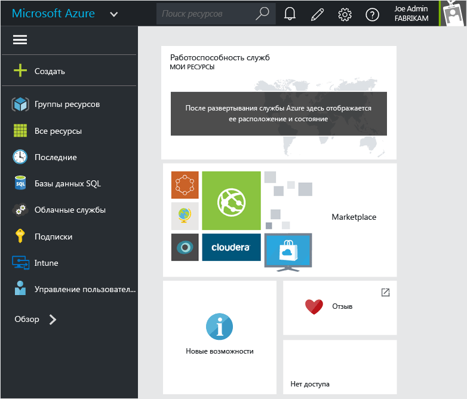
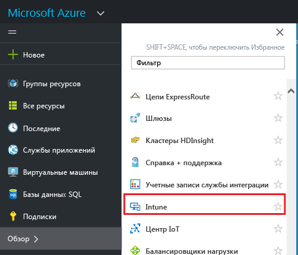
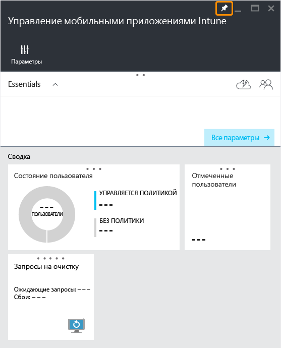
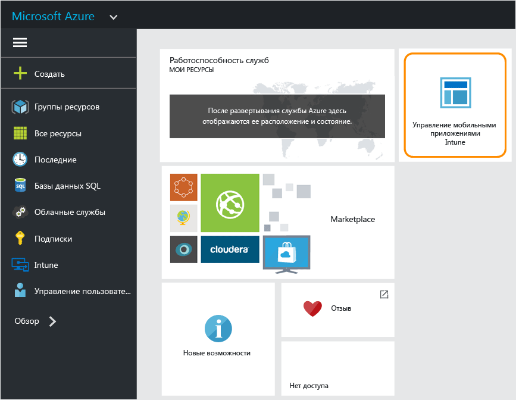

# Портал Azure для политик управления мобильными приложениями Microsoft Intune
## Доступ к порталу Azure
**Портал Azure** позволяет создавать политики управления мобильными приложениями (MAM) и управлять ими.

Портал Azure поддерживает создание политик MAM для следующих приложений:
- приложения, работающие на устройствах, **зарегистрированных в службе Intune и управляемых ей**;
- приложения, работающие на устройствах, которые **не зарегистрированы** в каком-либо решении для управления мобильными устройствами;
- приложения, работающие на устройствах, которые **зарегистрированы в решении для управления мобильными устройствами стороннего производителя**.

Если вы используете **консоль администрирования Intune** для управления устройствами, вы можете создать политику MAM, поддерживающую приложения на устройствах, зарегистрированных в Intune, с помощью [этой консоли](configure-and-deploy-mobile-application-management-policies-in-the-microsoft-intune-console.md).
>[!IMPORTANT]
> В консоли администрирования Intune могут отображаться не все параметры политики MAM. Портал Azure — это новая консоль администрирования для создания политик MAM. При создании политики MAM в консоли администрирования Intune и на портале Azure политики, созданные на портале Azure, применяются к приложениям и разворачиваются для пользователей.

## Вход на портал Azure и настройка начальной страницы

1.  Перейдите на [портал Azure](https://portal.azure.com) и выполните вход с помощью своих учетных данных [!INCLUDE[wit_nextref](../includes/wit_nextref_md.md)].

    

2.  После успешного входа вы увидите **панель мониторинга**. На странице **панели мониторинга** доступен набор элементов по умолчанию, которые можно удалять и добавлять для настройки страницы.

    

3.  В меню **Обзор** найдите пункт **Intune**.

4.  Щелкните **Intune > Управление мобильными приложениями Intune > Параметры**.

    

    > [!TIP]
    > Чтобы закрепить колонку на **начальной** странице, можно использовать параметр **закрепить** в этой колонке.  Щелкните значок закрепления в **колонке управления мобильными приложениями Intune**, чтобы закрепить ее на **начальной** странице.

    

    
## Дальнейшие действия
[Подготовка к настройке политик управления мобильными приложениями](get-ready-to-configure-mobile-app-management-policies-with-microsoft-intune.md)

<!--HONumber=Jun16_HO4-->

