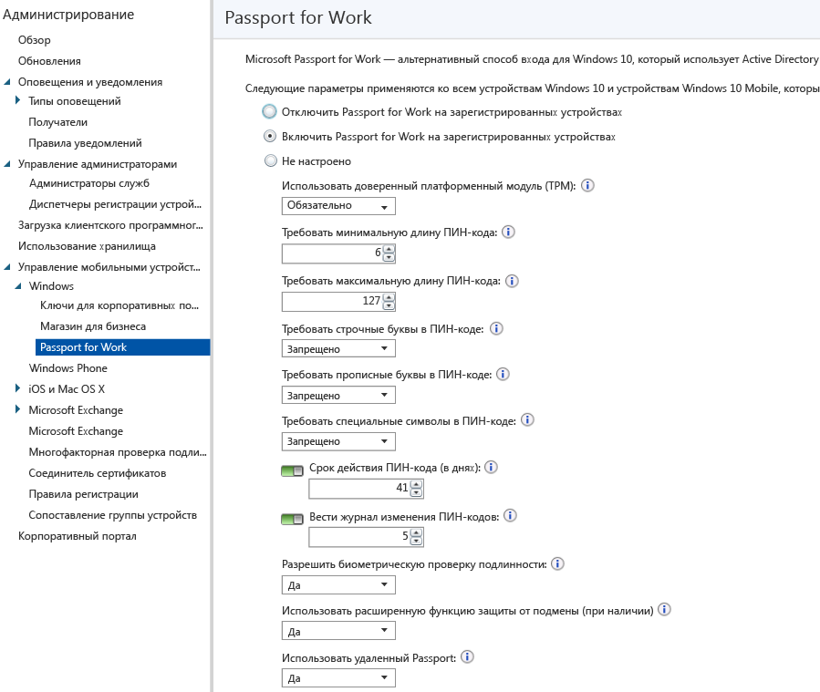

---
# required metadata

title: Управление параметрами Microsoft Passport на устройствах | Microsoft Intune
description:
keywords:
author: robstackmsft
manager: jeffgilb
ms.date: 04/28/2016
ms.topic: article
ms.prod:
ms.service: microsoft-intune
ms.technology:
ms.assetid: 402bc5a1-ada3-4c4c-a0de-292d026b4444

# optional metadata

#ROBOTS:
#audience:
#ms.devlang:
ms.reviewer: jeffgilb
ms.suite: ems
#ms.tgt_pltfrm:
#ms.custom:

---

# Управление параметрами Microsoft Passport на устройствах с помощью Microsoft Intune
Microsoft Intune позволяет интегрировать **Microsoft Passport for Work**, который является альтернативным методом входа, использующим Active Directory или учетную запись Azure Active Directory для замены пароля, смарт-карты или виртуальной смарт-карты.

Passport позволяет использовать для входа **жест пользователя**, а не пароль. Жестом пользователя может быть простой ПИН-код, биометрическая проверка подлинности, например Windows Hello, или внешнее устройство, например считыватель отпечатков пальцев.

Intune интегрируется с Passport for Work двумя способами:

-   Использование политики Intune для управления тем, какие жесты пользователи могут и не могут использовать для входа.

-   Хранение сертификатов проверки подлинности в поставщике хранилища ключей (KSP) Passport for Work. Дополнительные сведения см. в разделе [Защита доступа к ресурсам с помощью профилей сертификатов в Microsoft Intune](secure-resource-access-with-certificate-profiles.md).

## Создание политики Passport for Work

1.  В [консоли администрирования Microsoft Intune](https://manage.microsoft.com) щелкните **Администрирование** &gt; **Управление мобильными устройствами** &gt; **Windows** &gt; **Passport for Work**, чтобы открыть страницу Passport for Work, как показано ниже.

    

2.  Выберите один из указанных ниже параметров.
    - **Отключить Passport for Work на зарегистрированных устройствах**. Если вы не хотите использовать Passport for Work на устройствах с Windows 10, выберите этот параметр. Все другие параметры на экране будут отключены.
    - **Включить Passport for Work на зарегистрированных устройствах**. Выберите этот параметр, чтобы настроить параметры Passport for Work на всех устройствах с Windows 10.
    - **Не настроено**. Выберите этот параметр, если вы не хотите использовать Intune для управления параметрами Passport for Work. Существующие параметры Passport for Work на устройствах с Windows 10 не изменятся. Все другие параметры на экране будут отключены.
3.  Если вы выбрали параметр **Включить Passport for Work на зарегистрированных устройствах**, настройте необходимые параметры, которые будут применяться ко всем зарегистрированным устройствам с Windows 10 и Windows 10 Mobile.
3.  По завершении нажмите кнопку **Сохранить**.

## Passport for Work: параметры ПИН-кода

  
- **Установить минимальную длину PIN-кода**/**Установить максимальную длину PIN-кода**. Настройте для устройств минимальную и максимальную длину ПИН-кода, чтобы обеспечить безопасный вход. По умолчанию длина ПИН-кода равна 6 символам, но вы можете установить минимальную длину равной 4 символам. Максимальная длина ПИН-кода составляет 127 символов.
- **Требовать строчные буквы в PIN-коде**/**Требовать прописные буквы в PIN-коде**/**Требовать специальные символы в PIN-коде**. Кроме того, можно повысить надежность ПИН-кодов, потребовав использования в них строчных и прописных букв, а также специальных символов. Выберите один из следующих типов.
    - **Разрешено**. Пользователи могут использовать символы указанных типов в ПИН-кодах, но это не обязательно.
    - **Обязательно**. Пользователь должен включить по меньшей мере один символ указанного типа в свой ПИН-код. Например, зачастую требуется включать по крайней мере одну прописную букву и один специальный символ.
    - **Запрещено** (по умолчанию). Пользователь не должен использовать символы указанного типа в своем ПИН-коде (то же самое верно, если параметр не задан).
    > [!TIP] В число специальных символов входят следующие: **! " # $ % &amp; ' ( ) &#42; + , - . / : ; &lt; = &gt; ? @ [ \ ] ^ _ &#96; { &#124; } ~**.
- **Срок действия ПИН-кода (в днях)**. Рекомендуется указывать срок действия ПИН-кода, по истечении которого пользователю необходимо сменить его. Значение по умолчанию — 41 день. 
- **Вести журнал изменения ПИН-кодов**. Этот параметр используется для запрета повторного использования ранее использовавшихся ПИН-кодов. По умолчанию нельзя использовать повторно последние 5 использовавшихся ПИН-кодов.

## Passport for Work: прочие параметры

- **Используйте доверенный платформенный модуль (TPM)**. Микросхема доверенного платформенного модуля (TPM) обеспечивает дополнительный уровень защиты данных. Выберите одно из следующих значений:
    - **Обязательный** (по умолчанию). Подготавливать Passport for Work могут только устройства с доступным доверенным платформенным модулем.
    - **Предпочитаемый**. Устройства сначала пытаются использовать доверенный платформенный модуль. Если оно недоступно, они могут использовать шифрование программного обеспечения
- **Разрешить биометрическую проверку подлинности**. Включает биометрическую аутентификацию, например распознавание лиц или отпечатков пальцев, в качестве альтернативы ПИН-коду для Passport for Work. В случае сбоя биометрической проверки подлинности пользователи по-прежнему должны будут настраивать рабочий ПИН-код. Выберите один из следующих типов.
    - **Да** — Passport for Work разрешает биометрическую аутентификацию.
    - **Нет** — Passport for Work запрещает биометрическую аутентификацию (для всех типов учетных записей).
- **Использовать расширенную защиту от спуфинга, когда возможно**. Настраивает использование функций защиты от спуфинга Windows Hello на устройствах, поддерживающих их (например, определение фотографии, а не настоящего лица). Если задано значение **Да**, Windows требует, чтобы все пользователи прибегали к функции защиты от подмены в случае применения возможностей распознавания лиц (если поддерживается).
- **Использовать службу Remote Passport**. Если этому параметру присвоено значение **Да**, пользователи могут использовать службу Remote Passport в качестве переносимого устройства-компаньона для аутентификации компьютера. Настольный компьютер должен входить в состав Azure Active Directory, а устройство-компаньон должно быть настроено для использования ПИН-кода Passport for Work.

## Дополнительные сведения
Дополнительные сведения о Microsoft Passport см. в [руководстве](https://technet.microsoft.com/library/mt589441.aspx) в документации по Windows 10.

<!--HONumber=May16_HO2-->

