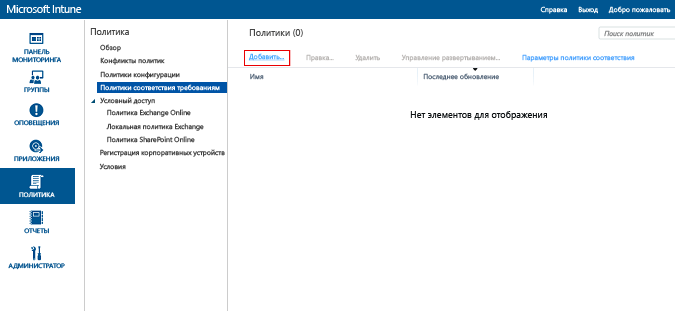

---
# required metadata

title: Создание политики соответствия устройств в Microsoft Intune | Microsoft Intune
description:
keywords:
author: karthikaraman
manager: jeffgilb
ms.date: 04/28/2016
ms.topic: article
ms.prod:
ms.service: microsoft-intune
ms.technology:
ms.assetid: 5336dac0-a2cc-4cd4-8511-67e4f95bd700

# optional metadata

#ROBOTS:
#audience:
#ms.devlang:
ms.reviewer: jeffgilb
ms.suite: ems
#ms.tgt_pltfrm:
#ms.custom:

---

# Создание политики соответствия устройств в Microsoft Intune
В этом разделе приведены инструкции по созданию политики соответствия, которая должна соблюдаться устройством, чтобы оно считалось соответствующим.

##  Шаг 1. Добавление новой политики
  В [консоли администрирования Microsoft Intune](https://manage.microsoft.com) выберите **Политика** &gt; **Политики соответствия** &gt; **Добавить**.

  

##  Шаг 2. Настройка параметров
На странице **Создание политики** включите необходимые параметры:
  -   параметры безопасности системы, такие как пароль и шифрование;
  -   параметры работоспособности устройства, например, снята ли защита на устройстве и определяется ли устройство как работоспособное службой подтверждения работоспособности устройства Windows;
  -   параметры свойств устройства, например минимальная необходимая версия ОС или максимальная допустимая версия ОС.

##  Шаг 3. Сохранение политики
По завершении нажмите кнопку **Сохранить политику**.

Вы можете развернуть политику сразу после сохранения или позже. Новая политика отображается в узле **Политики соответствия** рабочей области **Политика**.

## Поддерживаемые параметры политики
В таблице ниже перечислены параметры политики соответствия и платформы, на которых они поддерживаются.

-------------
|Параметр|iOS|Android|Windows|
|-----|----|-----|-----|
|Требовать пароль для разблокировки мобильных устройств|iOS 6 и более поздних версий|Android 4.0 и более поздней версии  Samsung KNOX Standard 4.0 и более поздние версии|Windows Phone 8 и более поздней версии.|
|Разрешить простые пароли|iOS 6 и более поздних версий|Не поддерживается|Windows Phone 8 и более поздней версии.|
|Минимальная длина пароля|iOS 6 и более поздних версий| Android 4.0 и более поздней версии Samsung KNOX Standard 4.0 и более поздние версии| Windows Phone 8 и более поздней версии. Windows 8.1|
|Требуемый тип пароля|iOS 6 и более поздних версий|Недоступно|Windows Phone 8 и более поздней версии.  Windows RT  Windows RT 8.1  Windows 8.1|
|Минимальное число наборов символов|iOS 6 и более поздних версий|Недоступно|Windows Phone 8 и более поздней версии.  Windows RT  Windows RT 8.1  Windows 8.1|
|Качество пароля|Недоступно|Android 4.0 и более поздней версии  Samsung KNOX Standard 4.0 и более поздние версии|Недоступно|
|Минут бездействия до требования пароля|iOS 6 и более поздних версий|Android 4.0 и более поздней версии Samsung KNOX Standard 4.0 и более поздние версии|Windows Phone 8 и более поздней версии. Windows RT и Windows RT 8.1 Windows 8.1|
|Окончание срока действия пароля (дней)|iOS 6 и более поздних версий|Android 4.0 и более поздней версии Samsung KNOX Standard 4.0 и более поздние версии|Windows Phone 8 и более поздней версии. Windows RT и Windows RT 8.1 Windows 8.1|
|Запоминать историю паролей|iOS 6 и более поздних версий|Android 4.0 и более поздней версии Samsung KNOX Standard 4.0 и более поздние версии|Windows Phone 8 и более поздней версии. Windows RT и Windows RT 8.1 Windows 8.1|
|Запретить использование предыдущих паролей|iOS 6 и более поздних версий|Android 4.0 и более поздней версии Samsung KNOX Standard 4.0 и более поздние версии|Windows Phone 8 и более поздней версии. Windows RT и Windows RT 8.1 Windows 8.1|
|Требовать пароль при возвращении устройства из состояния простоя| Недоступно| Недоступно|Windows 10 Mobile|
|Требовать шифрование на мобильном устройстве|Неприменимо|Android 4.0 и более поздней версии Samsung KNOX Standard 4.0 и более поздние версии|Windows Phone 8 и более поздней версии.  Windows 8.1|
|Require devices to be reported as healthy (Требовать причисления устройств к работоспособным)| Недоступно| Недоступно|Windows  Windows 10 Mobile|
|На устройстве не должно быть снятой защиты или административного доступа.|iOS 6 и более поздних версий|Android 4.0 и более поздней версии Samsung KNOX Standard 4.0 и более поздние версии|Недоступно|
|Учетная запись электронной почты должна находиться под управлением Intune|iOS 6 и более поздних версий|Недоступно| Недоступно|
|Выберите профиль электронной почты, которым должна управлять служба Intune|iOS 6 и более поздних версий|Недоступно| Недоступно|
|Минимальная требуемая ОС|iOS 6 и более поздних версий|Android 4.0 и более поздней версии Samsung KNOX Standard 4.0 и более поздние версии| Windows Phone 8 и более поздней версии. Windows 8.1|
|Максимально допустимая версия ОС|iOS 6 и более поздних версий|Android 4.0 и более поздней версии Samsung KNOX Standard 4.0 и более поздние версии|Windows Phone 8 и более поздней версии. Windows 8.1|

Чтобы узнать больше о параметрах соответствия, поддерживаемых каждой платформой, выберите один из пунктов ниже.
> [!div class="op_single_selector"]
- [Параметры политики соответствия для устройств iOS](ios-compliance-policy-settings-in-microsoft-intune.md)
- [Параметры политики соответствия для устройств Android](android-compliance-policy-settings-in-microsoft-intune.md)
- [Параметры политики соответствия для устройств Windows и Windows Phone ](windows-compliance-policy-settings-in-microsoft-intune.md)

## Дальнейшие действия
[Развертывание и мониторинг политики соответствия](deploy-and-monitor-a-device-compliance-policy-in-microsoft-intune.md)

### См. также
[Общие сведения о политиках соответствия устройств](introduction-to-device-compliance-policies-in-microsoft-intune.md)

<!--HONumber=May16_HO2-->

