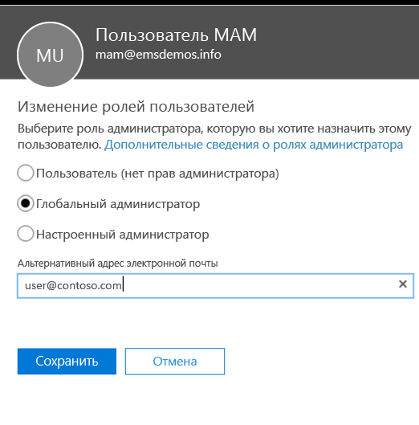
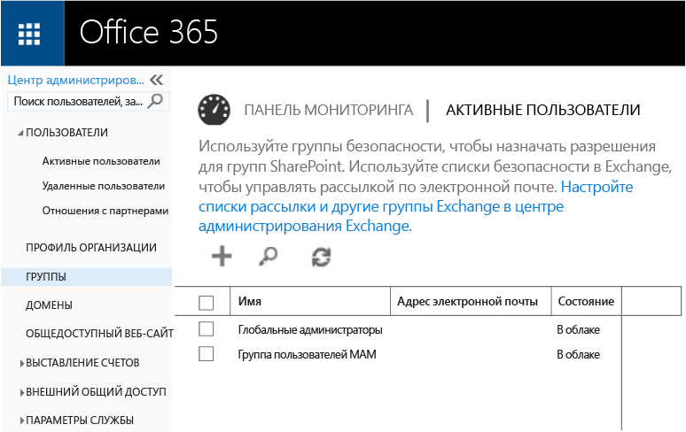
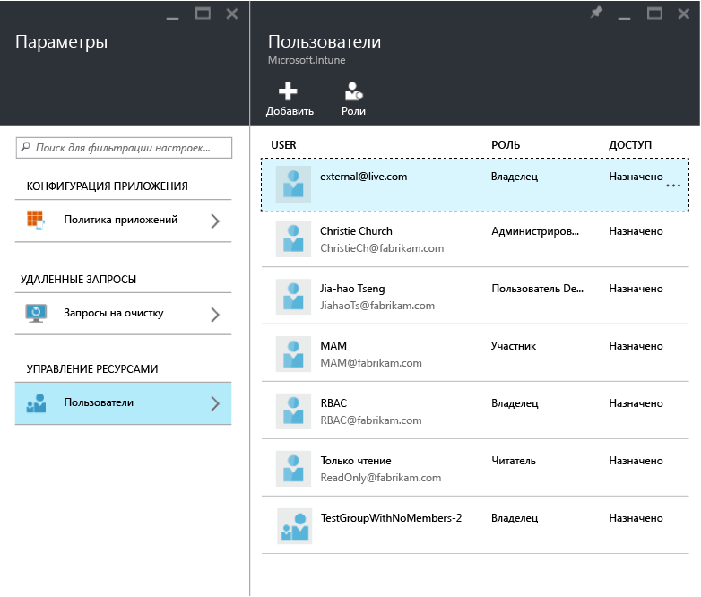
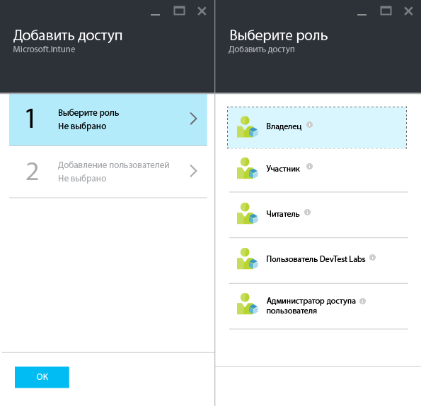
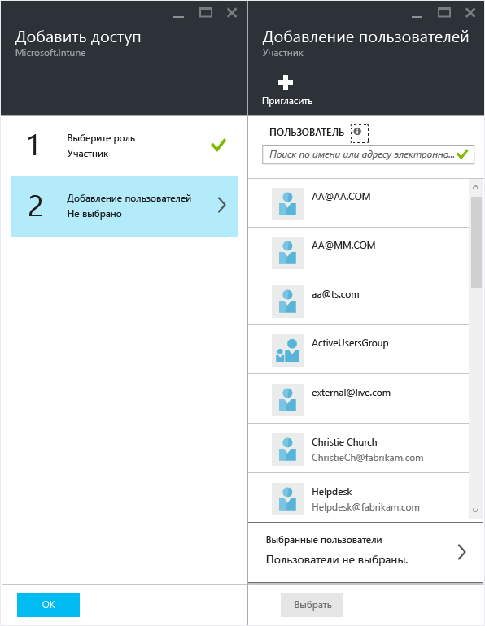

---
# required metadata

title: Подготовка к настройке политик управления мобильными приложениями | Microsoft Intune
description:
keywords:
author: karthikaraman
manager: jeffgilb
ms.date: 04/28/2016
ms.topic: article
ms.prod:
ms.service: microsoft-intune
ms.technology:
ms.assetid: 7e6a85e7-e007-41b6-9034-64d77f547b87

# optional metadata

#ROBOTS:
#audience:
#ms.devlang:
ms.reviewer: jeffgilb
ms.suite: ems
#ms.tgt_pltfrm:
#ms.custom:

---

# Подготовка к настройке политик управления мобильными приложениями в Microsoft Intune
В этом разделе описывается, что необходимо для того, чтобы приступить к созданию политик управления мобильными приложениями (MAM) на портале Azure.
Если в настоящее время для управления устройствами вы используете **консоль администрирования Intune**, то с ее помощью вы можете создать политику MAM, поддерживающую приложения на устройствах, зарегистрированных в Intune.
>[!IMPORTANT]
> В консоли администрирования Intune могут отображаться не все параметры политики MAM. Портал Azure — это новая консоль администрирования для создания политик MAM.

##  Поддерживаемые платформы
- iOS 8.1 или более поздняя версия

- Android 4 или более поздняя версия

##  Поддерживаемые приложения
Чтобы просмотреть полный список поддерживаемых приложений, посетите [коллекцию мобильных приложений Microsoft Intune](https://www.microsoft.com/en-us/server-cloud/products/microsoft-intune/partners.aspx) на странице приложений Microsoft Intune от партнеров.
Щелкните приложение, чтобы просмотреть поддерживаемые сценарии, платформы и сведения о поддержке приложением множественной идентификации.

**Перед** настройкой политик MAM требуются указанные ниже компоненты.

-   **Подписка на Microsoft Intune**.    Конечным пользователям необходимы лицензии [!INCLUDE[wit_nextref](../includes/wit_nextref_md.md)] для получения приложений с помощью политики MAM.

-   В качестве **центра управления мобильными устройствами** следует задать **Intune** или **Configuration Manager** в зависимости от того, используете ли вы для управления устройствами отдельно Intune или Configuration Manager, интегрированный с Intune. При использовании встроенных в Office 365 функций управления мобильными устройствами необходимо приобрести подписку Intune и [задать Intune в качестве центра управления мобильными устройствами](get-ready-to-enroll-devices-in-microsoft-intune.md#set-mobile-device-management-authority).
-   Подписка на **Office 365**, которая требуется в следующих целях:
  - для применения политик MAM к приложениям с поддержкой множественной идентификации;
  - для создания рабочих учетных записей SharePoint Online и Exchange Online. Локальные версии Exchange и SharePoint не поддерживаются.

- **Azure Active Directory (Azure AD)** для создания пользователей. Azure AD проверяет подлинность пользователя, когда он запускает приложение и вводит свои рабочие учетные данные.

    > Если вы настраиваете пользователей с помощью консоли [!INCLUDE[wit_nextref](../includes/wit_nextref_md.md)], имейте в виду, что в дальнейшем конфигурация политики MAM перемещается на портал Azure и, чтобы использовать этот портал, необходимо настроить группы пользователей Azure AD с помощью портала Office 365.

## Создание пользователей и назначение лицензий Microsoft Intune

1. Вам необходима подписка на Intune: у вас уже есть подписка на [!INCLUDE[wit_nextref](../includes/wit_nextref_md.md)], если вы используете [!INCLUDE[wit_nextref](../includes/wit_nextref_md.md)] для управления устройствами.  Вы также располагаете подпиской на [!INCLUDE[wit_nextref](../includes/wit_nextref_md.md)], если приобрели лицензию EMS. Если вы пробуете работать с [!INCLUDE[wit_nextref](../includes/wit_nextref_md.md)], чтобы ознакомиться с возможностями MAM, пробную учетную запись можно получить [здесь](http://www.microsoft.com/en-us/server-cloud/products/microsoft-intune/).

    Чтобы проверить, есть ли у вас подписка на [!INCLUDE[wit_nextref](../includes/wit_nextref_md.md)], перейдите на страницу выставления счетов на портале Office.  Под подписками для [!INCLUDE[wit_nextref](../includes/wit_nextref_md.md)] должно быть указано значение **Активен**.

2.  Выполните вход на   [портал Office](http://portal.office.com) , используя свои учетные данные администратора.

3.  Перейдите на страницу **Активные пользователи**, чтобы добавить пользователей и назначить лицензии [!INCLUDE[wit_nextref](../includes/wit_nextref_md.md)].

    

4.  Чтобы предоставить пользователю возможность доступа к порталу Office, порталу Azure AD и порталу Azure, назначьте ему **роль глобального администратора**.

    

5.  Политики MAM развертываются для групп пользователей в Azure Active Directory. Чтобы создать группы пользователей, которые вы хотите использовать для политик MAM, перейдите на страницу **Группы** **портала Office** и щелкните значок **+**, чтобы создать группу безопасности.  Введите имя и описание, а затем нажмите кнопку **Создать**. При создании группы вы можете добавить в нее пользователя, щелкнув **Изменить элементы** в недавно созданной группе безопасности. Группа безопасности создается в Azure Active Directory.

    

В таблице ниже перечислены роли и разрешения, которые можно назначать пользователям с правами администратора.

|||
|--|----|
|**Роль**|**Разрешения**|
|Глобальный администратор (портал Office 365)|Доступ к порталу Office 365 и порталу Azure AD  Доступ к порталу Azure (позволяет выполнять задачи как по управлению ролями, так и по управлению мобильными приложениями).|
|Роль владельца (портал Azure)|Доступ к порталу Azure (позволяет выполнять задачи как по управлению ролями, так и по управлению мобильными приложениями).|
|Роль участника (портал Azure)|Доступ к порталу Azure (позволяет выполнять только задачи по управлению мобильными приложениями).|

## Назначение роли участника пользователю

**Глобальные администраторы** имеют доступ к порталу Azure.  Если вы хотите, чтобы другие пользователи с правами администратора могли настраивать политики и выполнять другие задачи по управлению мобильными приложениями, можете назначить пользователю **роль участника** , как описано ниже:

1.  В колонке **Параметры** раздела **Управление ресурсами** щелкните элемент **Пользователи**.

    

2.  Щелкните **Добавить** , чтобы открыть колонку **Добавить доступ** .

3.  Щелкните **Выберите роль**, а затем **Роль участника**.

    

4.  После выбора роли щелкните **Добавить пользователя**и выполните поиск пользователя по имени или адресу электронной почты. В этом списке отображаются первые 1000 пользователей, ранее созданных в Azure AD с помощью портала Office. Нажмите кнопку **ОК** в колонке **Добавить доступ** , чтобы сохранить изменения и назначить роль пользователю.

    

    > Если выбран пользователь, у которого нет назначенной лицензии [!INCLUDE[wit_nextref](../includes/wit_nextref_md.md)], он не сможет получить доступ к порталу.

## Дальнейшие действия
[Создание и развертывание политик управления мобильными приложениями с помощью Microsoft Intune](create-and-deploy-mobile-app-management-policies-with-microsoft-intune.md)

<!--HONumber=May16_HO2-->

