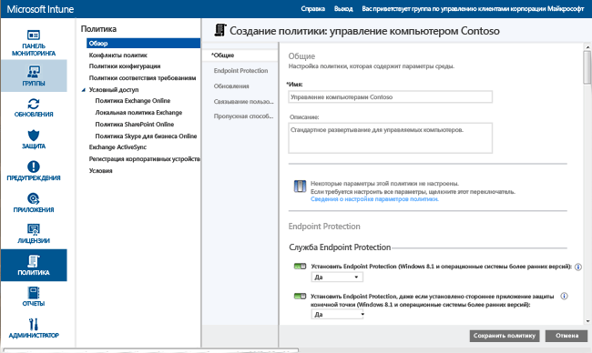
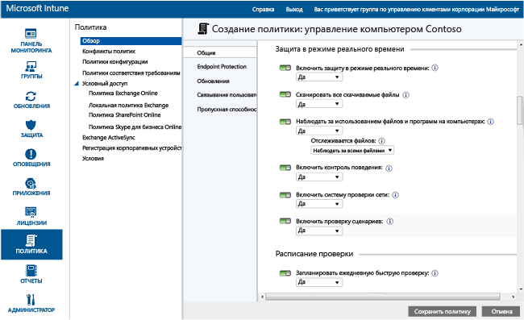

---
# required metadata

title: Endpoint Protection для компьютеров с ОС Windows| Microsoft Intune
description:
keywords:
author: NathBarn
manager: jeffgilb
ms.date: 04/28/2016
ms.topic: article
ms.prod:
ms.service: microsoft-intune
ms.technology:
ms.assetid: 002241bf-6cd0-4c75-a4f0-891ac7e6721a

# optional metadata

#ROBOTS:
#audience:
#ms.devlang:
ms.reviewer: jeffgilb
ms.suite: ems
#ms.tgt_pltfrm:
#ms.custom:

---

# Обеспечение защиты компьютеров с ОС Windows с помощью Endpoint Protection для Microsoft Intune
Microsoft Intune позволяет защищать управляемые компьютеры различными способами, в том числе с помощью механизма Endpoint Protection, который обеспечивает защиту в реальном времени от угроз вредоносных программ, регулярно обновляет определения вредоносных программ и выполняет автоматическую проверку компьютеров. Endpoint Protection также предоставляет средства, которые помогают контролировать и отслеживать атаки со стороны вредоносных программ.

Если вы еще не установили клиент Intune на своих компьютерах, см. статью [Установка клиента на компьютере Windows с помощью Microsoft Intune](install-the-windows-pc-client-with-microsoft-intune.md).

Следующие разделы содержат сведения о настройке, развертывании и отслеживании Endpoint Protection.

## Ситуации использования Endpoint Protection
Одной из приоритетных задач ИТ-администратора является обеспечение отсутствия вирусов и вредоносных программ на управляемых компьютерах. Перед развертыванием Intune на компьютерах с ОС Windows в организации необходимо определиться со стратегией их защиты, выбрав один из следующих вариантов и настроив соответствующие параметры политик.

|Необходимо|Параметры политики Endpoint Protection|Дополнительные сведения|
|--------------|---------------------------------------|--------------------|
|Использование Microsoft Intune Endpoint Protection только при отсутствии стороннего приложения защиты конечной точки.  Microsoft Intune Endpoint Protection можно использовать на всех компьютерах, где не установлено стороннее приложение защиты конечной точки.|Установить Endpoint Protection = **Да**  Включить Endpoint Protection = **Да**  Установить Endpoint Protection, даже если установлено стороннее приложение защиты конечной точки = **Нет**|Если обнаруживается стороннее приложение защиты конечной точки, компонент Microsoft Intune Endpoint Protection не устанавливается или удаляется, если уже был установлен.|
|Использование Microsoft Intune Endpoint Protection, даже если установлено стороннее приложение защиты конечной точки.  В рамках этого подхода Microsoft Intune Endpoint Protection и стороннее приложение защиты конечной точки (при его наличии) будут выполняться параллельно. Это нерекомендуемая конфигурация в связи с потенциальными проблемами производительности.|Установить Endpoint Protection = **Да**  Включить Endpoint Protection = **Да**  Установить Endpoint Protection, даже если установлено стороннее приложение защиты конечной точки = **Да**|Используется, когда:  — требуется перейти на использование Microsoft Intune Endpoint Protection; — выполняется развертывание нового клиента, который будет использовать Microsoft Intune Endpoint Protection; — выполняется обновление клиента, который будет использовать Microsoft Intune Endpoint Protection.|
|Использование Intune без Microsoft Intune Endpoint Protection. Вместо этого вы будете использовать стороннее приложение защиты конечной точки.|Установить Endpoint Protection = **Нет**|Если вы не используете стороннее приложение защиты конечной точки, эта конфигурация не рекомендуется, так как подвергает компьютеры организации риску со стороны вредоносных программ и других атак.  Microsoft Intune Endpoint Protection не устанавливается или удаляется, если был установлен раньше.|
Если требуется перейти с текущего приложения защиты конечной точки на Microsoft Intune Endpoint Protection, выполните следующую процедуру.

1.  Не отключайте текущее приложение защиты конечной точки в процессе развертывания клиентского ПО Intune на компьютерах.

2.  Убедитесь, что компонент Microsoft Intune Endpoint Protection установлен и помогает защищать клиентские компьютеры.

3.  Удалите стороннее программное обеспечение защиты конечных точек следующим образом.

    -   Используйте функцию распространения программного обеспечения Intune, чтобы развернуть средство удаления ПО, предоставленное поставщиком стороннего приложения защиты конечных точек. Дополнительные сведения см. в разделе [Развертывание и настройка приложений с помощью Microsoft Intune](deploy-apps.md).

    -   Вручную удалите стороннее приложение защиты конечной точки.

> [!NOTE] Intune не выполняет автоматического удаления сторонних приложений для защиты конечной точки.

## Настройка Microsoft Intune Endpoint Protection
Ниже приведена процедура настройки Microsoft Intune Endpoint Protection.

1.  В [консоли администрирования Microsoft Intune](https://manage.microsoft.com/) щелкните **Политика** > **Добавить политику**.

2.  Разверните **Управление компьютером** и выберите **Параметры агента Microsoft Intune**. Выберите **Создание и развертывание настраиваемой политики**, чтобы указать политику для параметров Endpoint Protection, а затем нажмите кнопку **Создать политику**. Можно использовать рекомендуемые параметры или настроить параметры. Дополнительные сведения о способах создания и развертывания политик см. в разделе [Общие задачи управления ПК Windows с клиентом Microsoft Intune](common-windows-pc-management-tasks-with-the-microsoft-intune-computer-client.md).

  

Развернутая политика Endpoint Protection появится на странице **Все политики** рабочей области **Политика**.

## Параметры службы Endpoint Protection

|Параметр политики|Подробные сведения|
|------------------|--------------------|
|**Установить Endpoint Protection**|Задайте значение **Да**, чтобы установить Endpoint Protection на управляемых компьютерах. Если во время установки обнаружено стороннее приложение для защиты конечной точки, Endpoint Protection будет установлено только в том случае, если для параметра **Установить Endpoint Protection, даже если установлено стороннее приложение для защиты конечной точки**, выбрано значение **Да**. **Примечание.** Служба Intune Endpoint Protection устанавливается на управляемых компьютерах по умолчанию. Если установка Endpoint Protection на управляемых компьютерах не требуется, необходимо явно задать значение **Нет** для этой политики. Если компонент Endpoint Protection был установлен раньше и значение политики изменяется на **Нет**, то клиент Endpoint Protection будет удален. Рекомендуемое значение: **Да**|
|**Установить Endpoint Protection, даже если установлено стороннее приложение защиты конечной точки**|Задайте значение **Да**, чтобы установить Microsoft Intune Endpoint Protection, даже при наличии стороннего приложения защиты конечной точки.  Рекомендуемое значение: **Да**|
|**Включение Endpoint Protection**|Задайте значение **Да**, чтобы включить Microsoft Intune Endpoint Protection на компьютерах с клиентом Endpoint Protection.  Если задано значение **Нет** и Microsoft Intune Endpoint Protection установлен, пользовательский интерфейс клиента Endpoint Protection не отображается для пользователей, а все функции защиты находятся в неактивном состоянии.  Рекомендуемое значение: **Да**|
|**Отключить интерфейс клиента**|Задайте значение **Да**, чтобы скрыть пользовательский интерфейс клиента Microsoft Intune Endpoint Protection от пользователей (для вступления в силу требуется перезагрузка клиентского компьютера).  Рекомендуемое значение: **Нет**|
|**Установить Endpoint Protection, даже если установлено стороннее приложение защиты конечной точки**|Задайте значение **Да**, чтобы выполнить принудительную установку Microsoft Intune Endpoint Protection даже при наличии стороннего приложения защиты конечной точки.  Рекомендуемое значение: **Нет**|
|**Создавать точку восстановления системы перед устранением вредоносных программ**|Задайте значение **Да** , чтобы создать точку восстановления системы Windows перед началом процедуры устранения вредоносных программ.  Рекомендуемое значение: **Да**|
|**Период отслеживания устраненных вредоносных программ (дни)**|Endpoint Protection отслеживает устраненные вредоносные программы в течение указанного времени, что позволяет вручную проверить ранее зараженные компьютеры.  Можно указать любое значение от 0 до 30 дней.  Рекомендуемое значение: **7 дней**|
Если вы задали для параметров политики **Установить Endpoint Protection** и **Включить Endpoint Protection** значение **Да** и значение **Нет** для параметра **Установить Endpoint Protection, даже если установлено стороннее приложение защиты конечной точки**, Microsoft Intune Endpoint Protection определит наличие другого приложения защиты конечной точки и не будет установлен или будет удален, если он уже был установлен раньше (однако Microsoft Intune Endpoint Protection сообщает о работоспособности другого приложения защиты конечной точки в Intune).

  В режиме защиты в реальном времени Microsoft Security Essentials оповещает пользователя о потенциальных угрозах, таких как вирусы и шпионские программы, которые пытаются самостоятельно установиться или запуститься на компьютере. Если это произойдет, вы увидите сообщение в области уведомлений в правой части панели задач.

### Защита в режиме реального времени

|Параметр политики|Подробные сведения|
|------------------|--------------------|
|**Включить защиту в режиме реального времени**|Включение наблюдения и проверки всех файлов и приложений, к которым запрашивается доступ. При этом все вредоносные файлы и приложения блокируются до их выполнения на компьютерах.  Рекомендуемое значение: **Да**|
|**Проверять все загружаемые файлы**|Включение проверки всех файлов и вложений, загруженных из Интернета на компьютер.  Рекомендуемое значение: **Да**|
|**Наблюдать за использованием файлов и программ на компьютерах**|Включение мониторинга входящих и исходящих файлов и активности программ на компьютерах. Этот параметр позволяет Endpoint Protection отслеживать запуск файлов и программ и оповещать вас о любых выполняемых ими или с ними действиях.  Рекомендуемое значение: **Да**|
|**Отслеживается файлов**|Если параметр **Наблюдать за действиями файлов и программ на компьютере** включен, он позволяет выбирать наблюдение только за входящими, только за исходящими или за всеми файлами.  Рекомендуемое значение: **Наблюдать за всеми файлами**|
|**Включить контроль поведения**|Этот параметр политики позволяет включить в Microsoft Intune Endpoint Protection проверку определенных типичных подозрительных действий на клиентских компьютерах.  Рекомендуемое значение: **Да**|
|**Включить систему проверки сети**|Включение системы проверки сети (NIS) на клиентских компьютерах. Система NIS использует сигнатуры известных уязвимостей из [Центра Майкрософт по защите от вредоносных программ](http://go.microsoft.com/fwlink/?LinkId=234249) для обнаружения и блокировки вредоносного сетевого трафика.  Рекомендуемое значение: **Да**|

  

### Параметры расписания проверки

|Параметр политики|Дополнительные сведения|
|------------------|--------------------|
|**Запланировать ежедневную быструю проверку**|Планирование ежедневной быстрой проверки наиболее часто используемых файлов и важных системных файлов на компьютере. Быстрая проверка почти не влияет на производительность.  Рекомендуемое значение: **Да**|
|**Выполнить быструю проверку, если пропущены две быстрые проверки подряд**|Настраивает Endpoint Protection для автоматического выполнения быстрой проверки на компьютерах, если пропущены две запланированные быстрые проверки.  Рекомендуемое значение: **Да**|
|**Запланировать полную проверку**|Настройка полной проверки всех файлов и ресурсов на локальных жестких дисках компьютеров. Такая проверка может занять некоторое время и повлиять на производительность компьютера (в зависимости от количества проверяемых файлов и ресурсов).  Рекомендуемое значение: **Нет**|
|**Выполнить полную проверку, если пропущены две полные проверки подряд**|Настраивает Endpoint Protection для автоматического выполнения полной проверки на компьютерах, если пропущены две запланированные полные проверки.  Рекомендуемое значение: Не настроено|

### Параметры проверки

|Параметр политики|Подробные сведения|
|------------------|--------------------|
|**Выполнить полную проверку после установки Endpoint Protection**|Настраивает Endpoint Protection для автоматического выполнения полной проверки системы после установки на компьютерах. Эта проверка выполняется только при бездействии компьютеров, чтобы минимизировать влияние на производительность работы пользователей.  Рекомендуемое значение: **Да**|
|**При необходимости автоматически выполнять полную проверку после удаления вредоносных программ**|Задайте значение **Да**, чтобы разрешить Endpoint Protection автоматически выполнять полную проверку системы на компьютерах после удаления вредоносных программ, чтобы гарантировать, что другие файлы не затронуты.  Рекомендуемое значение: **Да**|
|**Запускать запланированную проверку только при простое компьютера**|Задайте значение **Да** , чтобы предотвратить выполнение запланированных проверок на клиентских компьютерах, которые в данный момент используются (чтобы избежать потери производительности труда пользователей).  Рекомендуемое значение: **Да**|
|**Проверять наличие последних определений вредоносных программ перед началом проверки**|Задайте значение **Да**, чтобы разрешить Endpoint Protection автоматически проверять последние определения вредоносных программ перед запуском проверки на компьютере.  Рекомендуемое значение: **Да**|
|**Проверять архивные файлы**|Задайте значение **Да**, чтобы настроить Endpoint Protection для проверки вредоносных программ в архивных файлах (таких как ZIP или CAB) на компьютерах.  Рекомендуемое значение: **Нет**|
|**Проверять сообщения электронной почты**|Задайте значение **Да**, чтобы настроить Endpoint Protection для проверки входящих сообщений электронной почты, когда они поступают на компьютеры.  Рекомендуемое значение: **Да**|
|**Проверять файлы, открытые из общих сетевых папок**|Задайте значение **Да**, чтобы настроить Endpoint Protection для проверки файлов, открываемых из общих папок в сети. Как правило доступ к таким файлам осуществляется с помощью UNC-путей. Включение этой функции может нарушить работу пользователей с доступом только для чтения, поскольку они не имеют возможности удаления вредоносных программ.  Рекомендуемое значение: **Нет**|
|**Проверять подключенные сетевые диски**|Задайте значение **Да**, чтобы настроить Endpoint Protection для проверки файлов на подключенных сетевых дисках. Включение этой функции может нарушить работу пользователей с доступом только для чтения, поскольку они не имеют возможности удаления вредоносных программ.  Рекомендуемое значение: **Нет**|
|**Проверять съемные носители**|Задайте значение **Да**, чтобы настроить Endpoint Protection для проверки наличия вредоносных и нежелательных программ в содержимом съемных носителей, таких как USB-устройства флеш-памяти, когда вы запускаете полную проверку на компьютерах.  Рекомендуемое значение: **Да**|
|**Ограничить загрузку ЦП при проверке**|Этот параметр задает максимальную загрузку ЦП (в процентах) во время запланированных проверок на компьютерах. Можно задать значение от 1 до 100 процентов.  Рекомендуемое значение: **50%**|

### Параметры действий по умолчанию

Параметр **Выбрать действия Endpoint Protection при обнаружении вредоносных программ со следующими уровнями оповещения** определяет действие по умолчанию, выполняемое Endpoint Protection при обнаружении вредоносных программ с различными уровнями оповещения. Для каждого уровня оповещения можно настроить удаление вредоносных программ, помещение в карантин или выполнение действия, рекомендованного Майкрософт. Рекомендуемое значение: **Рекомендуемое действие**, которое позволяет Endpoint Protection определить действие.   

### Параметры исключенных файлов и папок

Параметр **Файлы и папки, которые следует пропускать при выполнении проверки или использовании защиты в режиме реального времени** позволяет исключить определенные файлы или папки при выполнении проверки или применении защиты в реальном времени на компьютерах.

### Параметры исключенных процессов

Параметр **Процессы, которые следует пропускать при проверке или использовании защиты в режиме реального времени** позволяет исключить определенные процессы при выполнении проверки или применении защиты в режиме реального времени. Можно исключить только файлы со следующими расширениями: **.exe**, **.com** или **.scr**.

### Параметры типов исключаемых файлов

Параметр **Расширения файлов, которые следует пропускать при проверке или использовании защиты в режиме реального времени** позволяет исключить определенные расширения файлов при выполнении проверки или применении защиты в реальном времени на компьютерах.

### Параметры Microsoft Active Protection Service
Microsoft Active Protection Service — это интернет-сообщество, где можно найти сведения о том, как реагировать на потенциальные угрозы. Кроме того, его участники помогают остановить распространение новых вредоносных программ. Вы можете **присоединиться к Microsoft Active Protection Service**, выбрав **Да** и указав ваш **уровень членства**.
  - **Базовое** — отправка в Майкрософт основных сведений об обнаруженных вредоносных программах. К этим сведениям относятся источник программы, действия, выполненные пользователем или автоматически выполненные Endpoint Protection, а также данные об успешности этих действий.
  - **Расширенное** — отправка в Майкрософт сведений о вредоносных программах, программах-шпионах и потенциально нежелательных программах. Эти сведения включают расположение программ, имена файлов, описание способов работы программ и их воздействия на компьютер.

Вы также можете **получать динамические определения на основе данных, переданных в службу Microsoft Active Protection Service**.

## Задачи управления для Endpoint Protection
Ниже перечислены задачи, упрощающие выполнение различных задач управления на управляемых компьютерах с Endpoint Protection.
 - Обновление определений вредоносных программ
  - Из консоли Intune В рабочей области **Группы** выберите компьютеры для обновления. Щелкните **Удаленные задачи** &gt; **Обновить определения вредоносных программ**.
  - На управляемом компьютере: запустите клиентское ПО Endpoint Protection из области уведомлений Windows. Откройте вкладку **Обновление** и затем нажмите кнопку **Обновить**.
 - Запуск проверки наличия вредоносных программ
  - Из консоли Intune В рабочей области **Группы** выберите компьютеры для проверки. Щелкните **Запуск полной проверки наличия вредоносных программ** или **Запуск быстрой проверки наличия вредоносных программ**.
  - На управляемом компьютере: запустите клиентское ПО Endpoint Protection из области уведомлений Windows. Выберите **Быстрая**, **Полная**или **Настраиваемая**, а затем нажмите кнопку **Проверить сейчас**.

Состояние выполнения удаленной задачи можно проверить, щелкнув ссылку **Удаленные задачи** в нижнем правом углу консоли Intune. В диалоговом окне **Состояние удаленных задач** указываются текущие удаленные задачи, состояние задач, имена устройств и ошибки и, если необходимо, находится ссылка на сведения об устранении неполадок.

## Наблюдение в Endpoint Protection
Для отслеживания состояния вредоносных программ на компьютерах организации используется рабочая область **Защита** на [консоли администрирования Microsoft Intune](https://manage.microsoft.com/). Эта рабочая область содержит две страницы:
 - **Обзор защиты** Отображение важных проблем в виде ссылок, по которым можно перейти для получения дополнительных сведений. Отображаемые проблемы могут включать следующие.
  - **Экземпляры вредоносных программ, для которых требуются дальнейшие действия** — щелкните ссылку, чтобы просмотреть список вредоносных программ, включая дальнейшие действия, которые требуются для устранения проблемы. Можно развернуть список дальше, чтобы просмотреть затронутые компьютеры.
  - **Компьютеры с вредоносными программами, для которых требуются дальнейшие действия** — щелкните ссылку, чтобы просмотреть список всех компьютеров с неразрешенными проблемами вредоносных программ, включая дальнейшие действия, которые требуются для устранения проблемы.
  - **Незащищенные устройства** — щелкните ссылку, чтобы просмотреть компьютеры, не защищенные приложением защиты конечной точки из-за его отсутствия или возникновения ошибки. Выберите компьютер для просмотра дополнительных сведений.
  - **Устройства, на которых запущено другое приложение защиты конечных точек** — щелкните ссылку, чтобы просмотреть компьютеры, на которых выполняется стороннее приложение защиты конечной точки.
 - **Все вредоносные программы** — отображение списка всех действующих вредоносных программ, обнаруженных на компьютерах. Можно просмотреть все компьютеры, подвергшиеся действию определенного фрагмента вредоносной программы, или выбрать одну из следующих задач.
  - **Просмотреть свойства** открывает страницу с дополнительными сведениями о выбранном вредоносном ПО.
  - **Дополнительные сведения о вредоносной программе** открывает раздел с дополнительными сведениями из Центра Майкрософт по защите от вредоносных программ.

> [!IMPORTANT] Рабочая область **Защита** будет отображаться на консоли администрирования, только если клиент установлен и управляет по крайней мере одним клиентом компьютера.

  

### Просмотр представления «Последние пути обнаружения» для вредоносных программ на компьютерах
Intune может отобразить пути до 10 недавно обнаруженных экземпляров вредоносных программ на устройстве. По умолчанию представление **Последние пути обнаружения** отключено. Чтобы включить его, выполните следующие действия.

1.  В [консоли администрирования Microsoft Intune](https://manage.microsoft.com/) щелкните **Группы** > **Все устройства**. **Вредоносные программы**.

2.  Щелкните правой кнопкой мыши заголовок столбца. Отображается список доступных столбцов.

3.  Установите флажок **Последние пути обнаружения** в списке. Отображается столбец **Последние пути обнаружения** , содержащий до 10 последних экземпляров вредоносных программ, отслеживаемых на данном устройстве.

## Проверка наличия вредоносных программ или обновление определений вредоносных программ на компьютере
Intune может выполнить полную или быструю проверку на наличие вредоносных программ с помощью Endpoint Protection или Защитника Windows на удаленном управляемом ПК, на котором установлен клиент Intune.

1. В [консоли администрирования Microsoft Intune](https://manage.microsoft.com/) выберите **Группы** > **Обзор** > **Все устройства** > **Все компьютеры** и затем выберите соответствующий компьютер.

2. Выберите задачу из раскрывающегося списка **Удаленные задачи**. Задачи для выполнения на удаленном компьютере.

## Требуется дополнительная помощь?
Для получения справки и поддержки см. раздел [Устранение неполадок Endpoint Protection в Microsoft Intune](/intune/troubleshoot/troubleshoot-endpoint-protection-in-microsoft-intune).

### См. также
[Политики для защиты компьютеров с ОС Windows](policies-to-protect-windows-pcs-in-microsoft-intune.md)

<!--HONumber=May16_HO3-->

