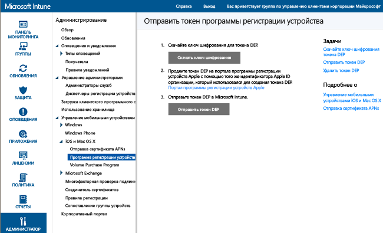

# Регистрация корпоративных устройств с помощью программы регистрации устройств iOS
Microsoft Intune позволяет развертывать профиль регистрации, который регистрирует устройства iOS, приобретенные по программе регистрации устройств (DEP), в автоматическом режиме. В пакет регистрации могут входить функции помощника по настройке для устройства. Регистрация устройств, выполненная с помощью программы DEP, не может быть отменена пользователями.

## Управление Apple DEP для устройств iOS с помощью Microsoft Intune
Для управления корпоративными устройствами iOS с помощью программы регистрации устройств Apple (DEP) организации необходимо присоединиться к этой программе и приобретать устройства через нее. Подробные сведения об этом процессе доступны по адресу  [https://deploy.apple.com](https://deploy.apple.com). К преимуществам программы относится автоматическая настройка устройств без подключения каждого из них к порту USB компьютера.

Перед регистрацией корпоративных устройств iOS с помощью программы DEP необходимо получить токен DEP от Apple. Этот токен позволяет службе Intune синхронизировать сведения о корпоративных устройствах, участвующих в программе DEP. Он также позволяет службе Intune выполнять отправку данных профилей регистрации в Apple и назначать устройства этим профилям.

1.  **Управление устройствами iOS с помощью Microsoft Intune** 
    Перед регистрацией устройств iOS с помощью программы регистрации устройств (DEP) необходимо включить управление iOS для Intune.

2.  **Получение ключа шифрования** 
    Как пользователь с правами администратора откройте [Консоль администрирования Microsoft Intune](http://manage.microsoft.com), выберите **Администрирование** &gt; **Управление мобильными устройствами** &gt; **iOS** &gt; **Программа регистрации устройств** и выберите пункт **Скачать ключ шифрования**. Сохраните файл ключа шифрования (.pem) локально. PEM-файл используется для запроса сертификата отношений доверия с портала программы регистрации устройств Apple.

      

3.  **Получение маркера программы регистрации устройств** 
    Перейдите на [Портал программы регистрации устройств](https://deploy.apple.com) (https://deploy.apple.com) и выполните вход с идентификатором Apple ID вашей организации. Этот идентификатор Apple ID в дальнейшем будет необходимо использовать для продления токена DEP.

    1.  На [портале программы регистрации устройств](https://deploy.apple.com) перейдите в меню **Программа регистрации устройств** &gt; **Управление серверами** и выберите пункт **Добавить сервер MDM**.

    2.  Введите **имя сервера MDM** и нажмите кнопку **Далее**. Имя сервера используется в качестве справочной информации для идентификации сервера управления мобильными устройствами (MDM). Это не имя или URL-адрес сервера Microsoft Intune.

    3.  Откроется диалоговое окно **Добавление &lt;имя_сервера&gt;**. Щелкните **Выбрать файл...** для отправки PEM-файла. Затем нажмите кнопку **Далее**.

    4.  В диалоговом окне **Добавить &lt;имя_сервера&gt;** отображается ссылка на **ваш токен сервера**. Скачайте файл токена сервера (P7M) на свой компьютер и нажмите кнопку **Готово**.

    Этот файл сертификата (.p7m) используется для установления отношений доверия между Intune и серверами программы регистрации устройств Apple.

4.  **Добавление маркера DEP в службу Intune** 
    В [консоли администрирования Microsoft Intune](http://manage.microsoft.com) перейдите в меню **Администрирование** &gt; **Управление мобильными устройствами** &gt; **iOS** &gt; **Программа регистрации устройств** и выберите пункт **Отправить токен DEP**. **Перейдите** к файлу сертификата (P7M), введите ваш идентификатор **Apple ID**и нажмите кнопку **Отправить**.

5.  **Добавление политики регистрации корпоративных устройств** 
    В [консоли администрирования Microsoft Intune](http://manage.microsoft.com) перейдите в меню **Политика** &gt; **Регистрация корпоративных устройств** и выберите пункт **Добавить**.

    Заполните **общие** сведения, в том числе поля **Имя** и **Описание**. Также укажите, принадлежат ли устройства профиля группе и имеют ли они сопоставление пользователей.
      - **Запрос на сходство пользователей**. Устройство должно быть связано с пользователем во время начальной настройки, после чего оно может получить разрешение на доступ к корпоративным данным и электронной почте от имени этого пользователя. **Сопоставление пользователей** необходимо настроить для устройств под управлением DEP, которые принадлежат пользователям и должны использовать корпоративный портал (для установки приложений).  **Примечание.** Устройства DEP при использовании сопоставления пользователей не поддерживают многофакторную проверку подлинности.

      > [!NOTE]
      > DEP с сопоставлением пользователей требует включения конечной точки WS-Trust 1.3 в режиме "Имя пользователя/Смешанный" для запроса токена пользователя.

      - **Без сопоставления пользователей**. Устройство не связано с пользователем. Используйте эту принадлежность для устройств, которые выполняют задачи без осуществления доступа к локальным данным пользователя. Приложения, для которых необходимо связывание с пользователем (включая приложение корпоративного портала, используемое для установки бизнес-приложений), не будут работать.

    Также можно **Присвоить устройства следующей группе**. Щелкните **Выбрать...**, чтобы выбрать группу.

    [!INCLUDE[groups deprecated](../includes/group-deprecation.md)]

    Затем включите параметр **Настройка параметров программы регистрации устройств для этой политики** для поддержки DEP.

      

     Для устройств под управлением DEP доступны следующие параметры:

     - **Отдел** — отображается, когда пользователь выбирает пункт **О конфигурации** во время активации.
     - **Телефон службы поддержки** — отображается, когда пользователь нажимает кнопку **Необходима помощь** во время активации.
     - **Режим подготовки** — устанавливается во время активации, и его нельзя изменить без сброса устройства до заводских настроек:
        - **Неконтролируемый** — ограниченные возможности управления.
        - **Контролируемый** — обеспечивает дополнительные возможности управления и отключает блокировку активации по умолчанию.
     - **Заблокировать профиль регистрации на устройстве** — это состояние устанавливается во время активации, и его нельзя изменить без сброса устройства до заводских настроек.
        - **Отключить** — позволяет удалить профиль управления из меню **Параметры**.
        - **Включить** (требуется выбрать **Режим подготовки** = **Контролируемый**) — отключает параметры iOS, которые делают возможным удаление профиля управления.
     - **Параметры помощника установки** — эти необязательные параметры можно настроить позже в меню **Параметры** iOS.
        - **Секретный код** — запрашивать секретный код во время активации. Всегда требовать секретный код, если устройство не защищено каким-либо другим способом или доступ к нему не управляется иным образом (например, полноэкранный режим, который ограничивает устройство до одного приложения).
        - **Службы определения местоположения** — если включено, помощник по установке будет запрашивать параметры службы во время активации.
        - **Восстановление** — если включено, помощник по установке будет запрашивать параметры резервного копирования iCloud во время активации.
        - **Apple ID** — если включено, iOS будет запрашивать у пользователей идентификатор Apple ID, когда Intune попытается установить приложение без идентификатора. Идентификатор Apple ID необходим для загрузки приложений Магазина iOS App Store, включая те, которые были установлены с помощью Intune.
        - **Положения и условия** — если включено, помощник по установке предложит пользователям принять положения и условия Apple во время активации.
        - **Touch ID** — если включено, помощник по установке будет запрашивать параметры службы во время активации.
        - **Apple Pay** — если включено, помощник по установке будет запрашивать параметры службы во время активации.
        - **Zoom** — если включено, помощник по установке будет запрашивать параметры службы во время активации.
        - **Siri** — если включено, помощник по установке будет запрашивать параметры службы во время активации.
        - **Отправить данные диагностики в Apple** — если включено, помощник по установке будет запрашивать параметры службы во время активации.
     -  **Включить дополнительное управление Apple Configurator** — установите этот параметр в **Запретить**, чтобы запретить синхронизацию файлов с iTunes и управление через Apple Configurator. Рекомендуется выбрать значение **Запретить**, экспортировать все дальнейшие настройки из Apple Configurator и затем выполнить развертывание в виде настраиваемого профиля конфигурации iOS через Intune вместо того, чтобы разрешать развертывание вручную с сертификатом или без него с помощью этого параметра.
        - **Запретить** — запрещает обмен данными устройства через USB (отключает связывание).
        - **Разрешить** — позволяет устройству взаимодействовать через USB-подключение любого компьютера с Windows или Mac OS.
        - **Требуется сертификат** — позволяет выполнить связывание с компьютером Mac с помощью сертификата, импортированного в профиль регистрации.

6.  **Назначение устройств DEP для управления** Перейдите на [портал программы регистрации устройств](https://deploy.apple.com) (https://deploy.apple.com) и выполните вход с идентификатором Apple ID вашей организации. Перейдите в меню **Программа развертывания** &gt; **Программа регистрации устройств** &gt; **Управление устройствами**. Укажите, каким образом вы будете **выбирать устройства**, предоставьте сведения об устройстве и укажите **серийный номер**и **номер заказа**для каждого устройства или **отправьте файл CSV**. Затем выберите **Назначить серверу**, &lt;имя_сервера&gt;, указанное для Microsoft Intune, и нажмите кнопку **ОК**.

7.  **Синхронизация устройств под управлением DEP**. В качестве пользователя с правами администратора откройте [консоль администрирования Microsoft Intune](http://manage.microsoft.com), перейдите в меню **Администрирование** &gt; **Управление мобильными устройствами** &gt; **iOS** &gt; **Программа регистрации устройств** и выберите пункт **Синхронизировать сейчас**. Запрос на синхронизацию будет отправлен в Apple. Для просмотра устройств под управлением DEP после синхронизации в [консоли администрирования Microsoft Intune](http://manage.microsoft.com) перейдите в меню **Группы** &gt; **Все устройства** &gt; **Корпоративные устройства с предварительной регистрацией** &gt; **По серийному номеру iOS**. В рабочей области **По серийному номеру iOS** в поле **Состояние** для управляемых устройств указывается "Не связано" до тех пор, пока устройство не будет включено и на нем не будет запущен помощник по настройке для регистрации устройства.

    В соответствии с условиями Apple относительно допустимого трафика DEP Intune налагает следующие ограничения.
     -  Полная синхронизация DEP может выполняться не чаще одного раза в семь дней. Во время полной синхронизации Intune обновляет каждый серийный номер, назначенный Apple для Intune, независимо от его предыдущей синхронизации. При попытке выполнения полной синхронизации в течение семи дней с момента предыдущей полной синхронизации Intune обновит только те серийные номера, которые еще не указаны в Intune.
     -  Любой запрос синхронизации выполняется в течение 10 минут. В течение этого времени или до успешного завершения запроса кнопка **Синхронизировать** будет отключена.

8.  **Распределение устройств пользователям** Корпоративные устройства теперь можно распределить между пользователями. При включении устройство iOS будет зарегистрировано для управления с помощью Intune.

## Изменения в назначениях групп Intune

Начиная с ноября управление группами устройств будет перемещено в Azure Active Directory. После перехода на группы Azure Active Directory интерфейс для назначения групп не будет отображаться в параметрах **Профиль регистрации в среде организации**. Поскольку это изменение будет внедряться в течение нескольких месяцев, изменения могут отобразиться не сразу. После перехода на новый портал новое динамическое назначение для групп устройств можно определить на основе имени профиля регистрации в среде организации. Этот процесс гарантирует, что устройства, уже назначенные группе устройств, будут автоматически зарегистрированы в группе с развернутыми приложениями и политикой. [Узнайте больше о группах Azure Active Directory.](https://azure.microsoft.com/documentation/articles/active-directory-accessmanagement-manage-groups/)

### См. также
[Предварительные требования для регистрации устройств](prerequisites-for-enrollment.md)

<!--HONumber=Oct16_HO3-->

