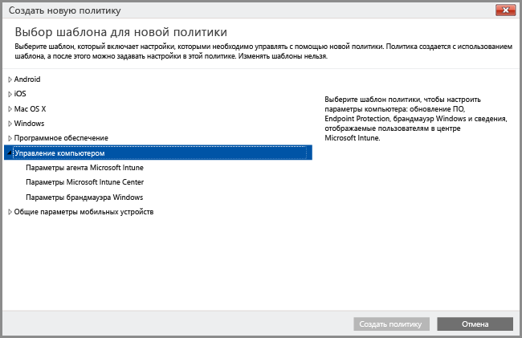

# Управление компьютерами с ОС с помощью клиентского программного обеспечения Intune
Компьютеры с Windows не обязательно [регистрировать как мобильные устройства](set-up-windows-device-management-with-microsoft-intune.md). Вместо этого можно установить клиентское программное обеспечение Intune для регистрации устройств и управления ими.

Intune управляет компьютерами Windows с помощью политик аналогично объектам групповой политики доменных служб Active Directory (AD DS) Windows Server. Если вы планируете управлять компьютерами, присоединенными к домену Active Directory, с помощью Intune, необходимо [убедиться, что политики Intune не конфликтуют с объектами групповой политики](resolve-gpo-and-microsoft-intune-policy-conflicts.md), используемыми в вашей организации.

Хотя программный клиент Intune поддерживает [возможности управления для защиты компьютеров](policies-to-protect-windows-pcs-in-microsoft-intune.md) за счет управления обновлениями программного обеспечения, брандмауэром Windows и Endpoint Protection, к компьютерам, управляемым с помощью программного клиента Intune, невозможно применить другие политики Intune, в том числе параметры политики **Windows**, предназначенные для управления мобильными устройствами.

> [!NOTE]
> Можно управлять устройствами с Windows 8.1 или более поздней версии с помощью клиента Intune или зарегистрировать их в качестве мобильных устройств. Эта статья применяется только к компьютерам с программным клиентом Intune. Установка клиента Intune и регистрация в системе управления мобильными устройствами не поддерживается.

## Требования к управлению с помощью клиентского ПО Intune

**Оборудование**. Для установки клиента Intune должны соблюдаться следующие минимальные требования к оборудованию.

|Требование|Дополнительные сведения|
|---------------|--------------------|
|Сеть|Для клиента требуется компьютер с подключением к Интернету.|
|Процессор и память|См. требования к процессору и ОЗУ для ОС компьютера.|
|Пространство на диске|200 МБ свободного места на диске до установки клиентского ПО.|

**Программное обеспечение**. Для установки клиента должны соблюдаться следующие требования к программному обеспечению.

|Требование|Дополнительные сведения|
|---------------|--------------------|
|Операционная система | На устройстве должна быть установлена Windows 7 или более поздняя версия |
|Разрешения администратора|Учетная запись, используемая для установки клиентского программного обеспечения, должна иметь разрешения локального администратора для этого устройства|
|Установщик Windows 3.1|Требуется как минимум установщик Windows 3.1.  Чтобы просмотреть версию установщика Windows на клиентском компьютере, выполните следующие действия.  — На компьютере правой кнопкой мыши щелкните файл **%windir%\System32\msiexec.exe**, а затем выберите пункт **Свойства**.  Последнюю версию установщика Windows можно загрузить на странице [Windows Installer Redistributables](http://go.microsoft.com/fwlink/?LinkID=234258) на веб-сайте сети разработчиков Майкрософт.|
|Удаление несовместимого клиентского программного обеспечения|Перед установкой клиентского программного обеспечения Intune с компьютера необходимо удалить любое клиентское ПО Configuration Manager или System Management Server.|

## Управление компьютером с помощью клиента Intune
После установки клиентское ПО Intune предоставляет ряд возможностей для управления, в том числе: [управление приложениями](deploy-apps-in-microsoft-intune.md), [мониторинг в режиме реального времени и Endpoint Protection](help-secure-windows-pcs-with-endpoint-protection-for-microsoft-intune.md), [управление параметрами брандмауэра Windows](help-protect-windows-pcs-using-windows-firewall-policies-in-microsoft-intune.md), инвентаризация оборудования и программного обеспечения, удаленное управление (с помощью запросов удаленного помощника), [параметры обновления программного обеспечения](keep-windows-pcs-up-to-date-with-software-updates-in-microsoft-intune.md) и создание отчетов о соответствии требованиям.

Некоторые возможности управления, доступные для компьютеров, управляемых в качестве мобильных устройств, недоступны для компьютеров, управляемых программным клиентом, включая следующие:

-   Полная очистка (выборочная очистка доступна)
-   Условный доступ
-   Политики Windows, отличные от политики **Управление компьютером**

Помимо действий клиентского агента Intune, выполняемых локально на отдельных компьютерах, можно также использовать консоль администратора Intune для выполнения других [стандартных задач управления](common-windows-pc-management-tasks-with-the-microsoft-intune-computer-client.md) на компьютерах Windows с установленным клиентом:

-   просмотр данных инвентаризации оборудования и программного обеспечения управляемых компьютеров;

-   удаленная перезагрузка компьютера;

-   снятие компьютера с учета для удаления клиентского программного обеспечения и удаления его из службы Intune;

-   привязка пользователей к определенным управляемым компьютерам;

-   реагирование на запросы удаленной помощи.

Агент клиента Intune обычно работает в фоновом режиме без необходимости частого вмешательства пользователя или устранения неполадок. При этом существует ряд [ресурсов, которые помогут вам](/intune/troubleshoot/troubleshoot-client-setup-in-microsoft-intune) в случае возникновения необходимости устранения проблем, связанных с управлением компьютером.

<!--HONumber=Sep16_HO1-->

