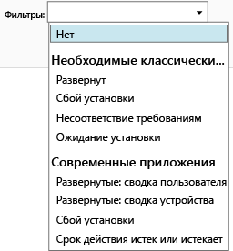

# Мониторинг развертываний приложений в Microsoft Intune

## Мониторинг развертывания приложения
В консоли администрирования Intune можно просматривать управляемые приложения и состояние любых развертываний.

### Просмотр управляемых приложений и их состояния
В рабочей области **Приложения** щелкните узел **Приложения**, а затем выберите **Приложения**.

Появится список управляемых приложений. Щелкните любое приложение, чтобы увидеть состояние установки в нижней части окна консоли. Щелкните это состояние, чтобы просмотреть дополнительные сведения. Например, если в строке состояния отображается **Это программное обеспечение доступно для одного пользователя**, вы можете щелкнуть сообщение, чтобы увидеть имя пользователя.

> [!TIP]
> Можно использовать раскрывающийся список **Фильтры** для отображения только приложений, которые соответствуют указанным критериям, например приложения, которые не удалось установить, или приложения, которые были успешно развернуты.
> 
> 

Кроме того, в рабочей области **Панель мониторинга** приведен обзор состояния приложений. Если щелкнуть в любом месте в обзоре, вы будете перенаправлены к списку приложений.

## Просмотр более подробных сведений о приложении
В списке приложений выберите любое приложение и нажмите кнопку **Просмотреть свойства**.

На странице **Свойства программного обеспечения** для приложения и щелкните одну из вкладок: **Общие** — отображение общих сведений о приложении и состоянии его установки, **Устройства** — отображение устройств, успешно установленных в целевом развертывании приложения, **Пользователи** — отображение пользователей, устройства которых успешно установлена в целевом развертывании приложения.

Как и раньше, можно использовать раскрывающийся список **Фильтры** для настройки значений, приведенных на каждой из вкладок.

<!--HONumber=Jul16_HO3-->

