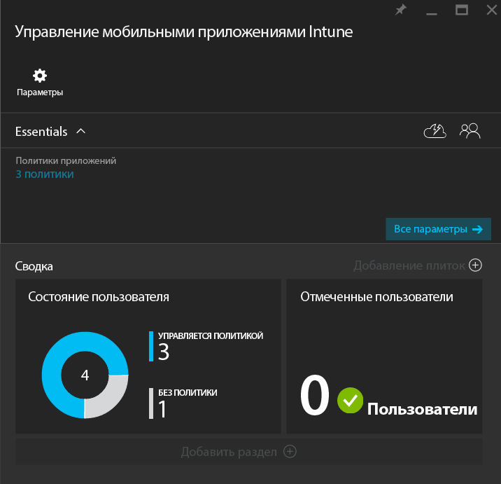
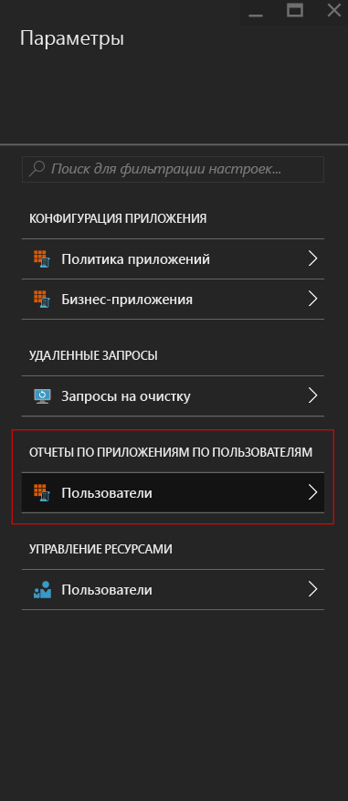
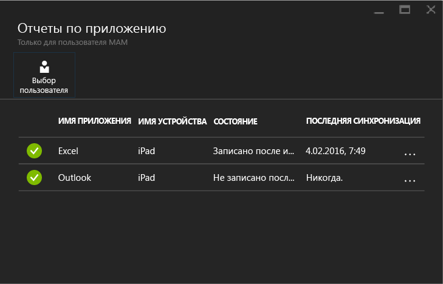

---
# required metadata

title: Мониторинг политик управления мобильными приложениями с помощью Microsoft Intune | Microsoft Intune
description:
keywords:
author: karthikaraman
manager: jeffgilb
ms.date: 04/28/2016
ms.topic: article
ms.prod:
ms.service: microsoft-intune
ms.technology:
ms.assetid: d3aa6c74-6b5d-4b50-aa66-a040ec44393e

# optional metadata

#ROBOTS:
#audience:
#ms.devlang:
ms.reviewer: joglocke
ms.suite: ems
#ms.tgt_pltfrm:
#ms.custom:

---

# Мониторинг политик управления мобильными приложениями с помощью Microsoft Intune
После настройки и применения политики MAM к пользователям можно отслеживать состояние соответствия на [портале Azure](https://portal.azure.com). На портале Azure отображаются сведения о пользователях, затронутых политикой, состояние соответствия и проблемы, которые могут возникать у конечных пользователей.
## Представление "Сводка"
В колонке **Управление мобильными приложениями Intune** можно просмотреть сводку состояния соответствия, как описано ниже.

-   **ПОЛЬЗОВАТЕЛИ.** Общее число пользователей в организации, которые используют приложения, которые связаны с политикой.

-   **УПРАВЛЯЮТСЯ ПОЛИТИКОЙ.** Число пользователей, которые использовали по крайней мере одно из приложений, связанных с политикой.

-   **БЕЗ ПОЛИТИКИ.** Число пользователей, которые используют приложения, связанные с политикой, но не затронуты политикой  Можно добавить этих пользователей в политику.

- **Отмеченные пользователи.** Число пользователей, у которых возникают проблемы. Сейчас в области **Отмеченные пользователи** отображаются только пользователи с устройствами, на которых снята защита.

## Представление подробных сведений
Чтобы открыть подробное представление сводки, щелкните платку **Состояние пользователя** и плитку **Отмеченные пользователи**.

### Состояние пользователя
Можно найти одного пользователя и просмотреть его состояние соответствия. В колонке **Отчеты по приложению** отображаются следующие сведения по выбранному пользователю.
- Устройства, которые связаны с учетной записью пользователя
- Приложения с политикой MAM на устройстве
- Состояние:

  **(Checked in) Использовалось.** Это означает, что политика была развернута для пользователя, и приложение по меньшей мере один раз использовалось для работы.

  **(Not checked in) Не использовалось.** Это означает, что политика была развернута для пользователя, но после этого приложение не использовалось для работы.

Чтобы просмотреть отчеты для пользователя, выполните следующие действия.

**Шаг 1.** Чтобы выбрать пользователя, щелкните плитку "Сводка" или выберите параметр **ОТЧЕТЫ ПО ПРИЛОЖЕНИЯМ ПО ПОЛЬЗОВАТЕЛЮ** в колонке **Параметры**, как показано ниже.

**Шаг 2.** Откроется колонка **Отчеты по приложениям**. Выберите **Выбрать пользователя** для поиска пользователя Azure Active Directory.

**Шаг 3.** Выбрав пользователя из списка, вы увидите сведения о состоянии соответствия для этого пользователя.

### Отмеченные пользователи
В представлении подробных сведений отображается сообщение об ошибке, приложение, которое было открыто в момент возникновения ошибки, платформа устройства и отметка времени.  

### См. также
[Управление передачей данных между приложениями iOS](manage-data-transfer-between-ios-apps-with-microsoft-intune.md)

[Работа конечных пользователей с приложениями с включенной поддержкой MAM](end-user-experience-for-mam-enabled-apps-with-microsoft-intune.md)

<!--HONumber=Jun16_HO2-->

