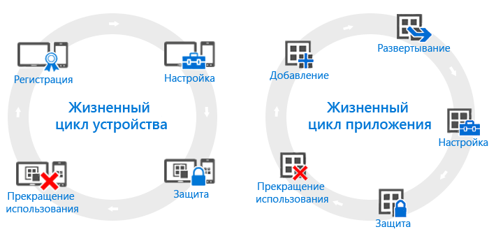

# Общие сведения о жизненных циклах устройств и приложений

Несмотря на то, что каждая организация может иметь собственные потребности, следует отметить наличие определенных общих шагов, которые требуется выполнять на постоянной основе. Их можно объединить в две основные категории, которые называются **жизненными циклами**. Жизненный цикл развертывания, которому вы следуете, зависит от реализуемого сценария. Например, может потребоваться только жизненный цикл устройств, жизненный цикл приложений или оба цикла.

Для целей управления все устройства имеют жизненный цикл, который начинается с первоначальной регистрации устройств и продолжается до снятия их с учета, когда они больше не нужны. [Жизненный цикл управления устройствами](overview-of-device-lifecycle-in-microsoft-intune.md) предполагает знакомство со всеми вариантами регистрации, способами настройки и защиты устройств и их последующего удаления из управления.

Точно так же, приложения имеют собственный [жизненный цикл](overview-of-app-lifecycle-in-microsoft-intune.md) с этапами от добавления приложений в Intune и вплоть до их удаления, когда они больше не требуются.

<!--HONumber=Jul16_HO3-->

