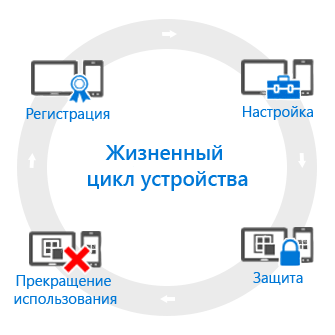

# Общие сведения о жизненном цикле системы управления мобильными устройствами (MDM)

Все управляемые устройства имеют так называемый *жизненный цикл*. Intune помогает управлять этим жизненным циклом, от регистрации, настройки и защиты до снятия устройства с учета, когда оно больше не требуется.

## Регистрация
Современные стратегии управления мобильными устройствами (MDM) распространяются на различные телефоны, планшеты и компьютеры (iOS, Android, Windows и Mac OS X). Чтобы реализовать возможность управления мобильными устройствами, что обычно нужно для устройств, которыми владеют организации, сначала необходимо [настроить регистрацию устройств](enroll-devices-in-microsoft-intune.md). Для управления компьютерами с Windows их также можно зарегистрировать в Intune (MDM) или путем [установки клиентского программного обеспечения Intune](manage-windows-pcs-with-microsoft-intune.md).

## Настройка
Регистрация устройств является лишь первым шагом. Чтобы воспользоваться всеми полезными возможностями Intune и обеспечить безопасность и соответствие устройства стандартам организации, можно обратиться к широкому набору политик. Они позволят настроить практически любой аспект функционирования управляемых устройств. Например, должны ли пользователи задавать пароли на устройствах с данными компании? Вы вправе потребовать это. Есть ли у вас сеть Wi-Fi в организации? Ее можно настроить автоматически. Далее приведены различные типы возможностей, связанных с настройкой.

- [**Политики конфигурации**](manage-settings-and-features-on-your-devices-with-microsoft-intune-policies.md). Они позволяют настраивать работу функций и возможностей управляемых вами устройств. Например, можно требовать использовать пароль на телефонах Windows Phone или отключить камеру на устройствах iPhone.
- [**Политики доступа к ресурсам компании**](enable-access-to-company-resources-with-microsoft-intune.md). Предоставление пользователям прав доступа к рабочим документами и приложениям на их личных устройствах может представлять сложность. Например, как обеспечить правильность настройки всех устройств, которым требуется доступ к корпоративной электронной почте? Как обеспечить доступ пользователей к сети организации через VPN-подключения и не заставлять их изучать необходимые и сложные настройки? Intune помогает упростить процессы за счет автоматической настройки управляемых устройств на доступ к общим ресурсам компании.
- [**Политики управления компьютерами с Windows (с клиентским программным обеспечением Intune)**](common-windows-pc-management-tasks-with-the-microsoft-intune-computer-client.md). Во время регистрации компьютеров с Windows в Intune вы получаете максимум возможностей по управлению устройствами. Кроме того, Intune продолжает поддерживать управление компьютерами с Windows с клиентским программным обеспечением Intune. Если вам нужны сведения о некоторых из задач, которые можно выполнять на компьютерах, начните отсюда.

## Защита
В современном мире ИТ-технологий защита устройств от несанкционированного доступа является одной из важнейших задач. Помимо элементов на этапе **Настройка** жизненного цикла устройства, Intune предоставляет следующие возможности для защиты управляемых устройств от несанкционированного доступа или вредоносных атак:
- [**Multi-Factor Authentication**](protect-windows-devices-with-multi-factor-authentication.md). Добавление дополнительного уровня проверки подлинности при входе пользователей на устройства повышает степень их защиты. Устройства с Windows, Windows Phone и Windows Mobile поддерживают Multi-Factor Authentication, требующую второго уровня проверки подлинности, такого как телефонный звонок или SMS, прежде чем пользователи смогут получить доступ.
- [**Настройки Microsoft Passport**](control-microsoft-passport-settings-on-devices-with-microsoft-intune.md). Microsoft Passport — это альтернативный метод входа с использованием *жеста*, например отпечатка пальца, или Windows Hello для входа без пароля.
- [**Политики для защиты компьютеров с Windows (с клиентским программным обеспечением Intune)**](policies-to-protect-windows-pcs-in-microsoft-intune.md). При управлении компьютерами с Windows с помощью клиентского программного обеспечения Intune вам доступны политики для управления настройками Endpoint Protection, обновлениями программного обеспечения и брандмауэром Windows на управляемых компьютерах.

## Прекратить использование
При потере или краже устройства, при необходимости его замены или вступлении пользователя в другую должность обычно требуется [снять устройство с учета или очистить его](use-remote-wipe-to-help-protect-data-using-microsoft-intune.md). Существует ряд способов выполнения этих процедур, включая сброс настроек устройства, вывод его из управления или удаление с него данных организации.

<!--HONumber=Aug16_HO2-->

