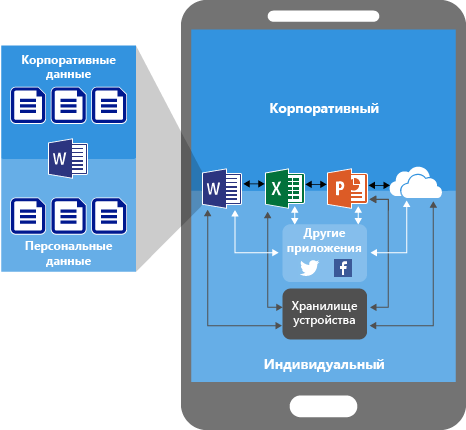
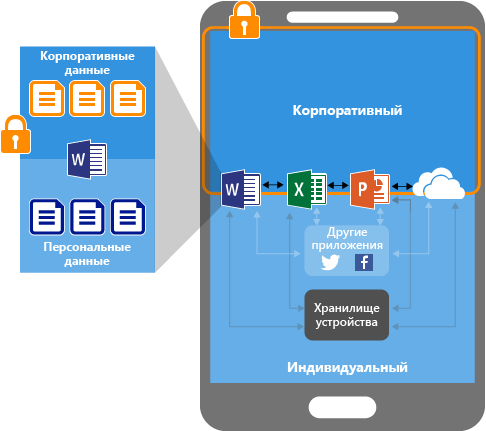
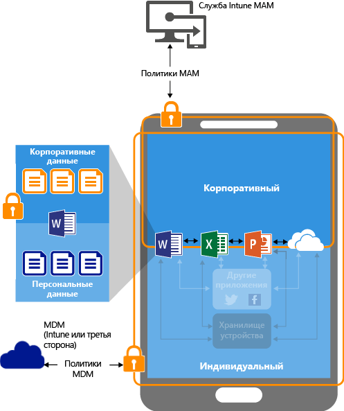
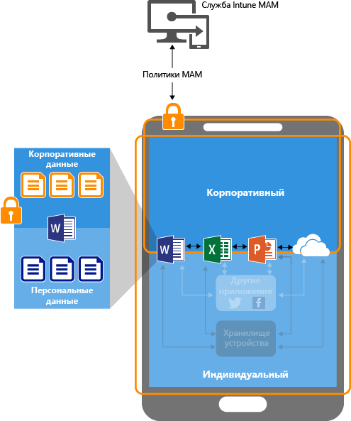

# Защита данных с помощью политик управления мобильными приложениями в Microsoft Intune

## Способы защиты данных приложения
Ваши сотрудники используют мобильные устройства для как в личных, так и в рабочих целях.  Предоставляя сотрудникам возможности для продуктивной работы, вы также желаете предотвратить потерю данных, как намеренную, так и случайную.  Кроме того, необходимо иметь возможность защитить корпоративные данные, даже если доступ к ним осуществляется с неподконтрольных вам устройств.

Вы можете использовать политики управления мобильными приложениями (MAM) Intune для защиты данных организации. Так как политики MAM Intune можно применять **независимо от любых решений по управлению мобильными устройствами**, их можно использовать для защиты корпоративных данных как с регистрацией устройств в решении для управления устройствами, так и без нее. Внедрив **политики уровня приложения**, вы можете ограничить доступ к ресурсам организации и оставить данные в поле зрения ИТ-отдела.

Политики MAM можно настроить для приложений, выполняющихся на следующих типах устройств.

- **Устройства, зарегистрированные в Microsoft Intune**. Обычно это устройства, принадлежащие компании.

-   **Устройства, зарегистрированные в стороннем решении по управлению мобильными устройствами**. Обычно это устройства, принадлежащие компании.

  > [!NOTE]
  > Политики управления мобильными приложениями не следует использовать со сторонними решениями для управления мобильными приложениями или создания безопасного контейнера.

-   **Устройства, не зарегистрированные в каком-либо решении по управлению мобильными устройствами**. Обычно это устройства, которые принадлежат сотрудникам и не управляются и не регистрируются в Intune или других решениях MDM.

> [!IMPORTANT]
> Можно создавать политики управления мобильными приложениями для мобильных приложений Office, которые подключаются к службам Office 365. Политики MAM не поддерживаются для приложений, подключающихся к локальным службам Exchange, SharePoint или Skype для бизнеса.

**Ниже перечислены важные преимущества использования политик MAM:**

-   Защита данных компании на уровне приложения.  Поскольку для управления мобильными приложениями не требуется управление устройствами, вы можете защитить данные компании как на управляемых, так и на неуправляемых устройствах. Управление основано на удостоверении пользователя, что устраняет необходимость в управлении устройствами.

-   Это позволяет конечным пользователям сохранить производительность труда, а также не применять политики при использовании устройства в личном контексте.  Политики применяются только в рабочем контексте, позволяя вам защитить данные компании, не затрагивая личные данные.

Одновременное использование MDM и политик MAM дает компании дополнительные преимущества, однако компания сама определяет потребность в таких политика в разных ситуациях. Например, сотрудник может использовать телефон, выданный компанией, а также личный планшет.  В этом случае телефон компании регистрируется в решении MDM и защищается политиками MAM, а личное устройство защищается только политиками MAM.

- **MDM обеспечивает защиту устройства**.  Например, вы можете запросить ПИН-код для доступа к устройству или развернуть на устройстве управляемые приложения. Кроме того, можно развертывать приложения на устройствах с помощью решения MDM, чтобы получить больше возможностей для управления приложениями.

- **Политики MAM обеспечивают защиту на уровне приложения**. Например, вы можете запросить ПИН-код для открытия приложения в рабочем контексте, включить или отключить общий доступ к данным в приложениях, а также запретить сохранение данных приложений компании в личном хранилище.

### В настоящее время политики MAM поддерживаются на следующих платформах:
-   iOS 8.1 или более поздняя версия

-   Android 4 или более поздняя версия

Устройства с Windows сейчас не поддерживаются.
##  Защита данных приложения с помощью политик MAM

####  Приложения без политик MAM:

При использовании приложений без ограничений данные компании и личные данные могут смешиваться.  Данные компании могут помещаться в такие расположения, как личное хранилище, или передаваться в приложения, находящиеся вне вашего поля зрения, что приводит к потере данных. Стрелки на схеме показывают неограниченное перемещение данных между приложениями (корпоративными и личными), а также в хранилищах.

### Защита данных с помощью политик MAM:

Политики MAM позволяют предотвратить сохранение корпоративных данных в локальном хранилище устройства, а также ограничивают перемещение данных в другие приложения, на которые эти политики не распространяются. К параметрам политик MAM можно отнести следующие:
- Политики перемещения данных, такие как **Запретить операцию "Сохранить как"**, **Ограничить операции "Вырезать", "Копировать" и "Вставить"**.
- Параметры политик доступа, такие как **Требовать простой ПИН-код для доступа**, **Блокировать запуск управляемых приложений на устройствах со снятой защитой или с административным доступом**.

### Защита данных с помощью политик MAM на устройствах под управлением решения MDM:

**Для устройств, зарегистрированных в решении MDM**-

На предыдущем рисунке показаны уровни защиты, обеспечиваемые политиками MAM и MDM.

Решение MDM:

-   регистрирует устройство;

-   развертывает приложения на устройстве;

-   на постоянной основе обеспечивает управление устройством и его соответствие требованиям.

**Политики MAM предоставляют дополнительные возможности:**

-   помогая защитить данные компании от утечки в потребительские приложения и службы;

-   применяя ограничения (сохранить как, буфер обмена, ПИН-код и т. д.) к мобильным приложениям;

-   удаляя данные компании из приложений без удаления самих этих приложений с устройства.

### Защита данных с помощью политик MAM для устройств без регистрации

На предыдущей схеме показано, как работают политики защиты данных на уровне приложения без MDM.

Для устройств BYOD, которые не регистрируются ни в каких решениях MDM, политики MAM помогают защитить данные компании на уровне приложения.
Однако существуют некоторые ограничения, которые следует учитывать:

-   Вы не можете развертывать приложения на устройстве.  Конечный пользователь должен получать приложения из Магазина.

-   Вы не можете подготавливать профили сертификатов на этих устройствах.

-   Вы не можете подготавливать параметры Wi-Fi и VPN компании на этих устройствах.

## Множественная идентификация

Приложения, поддерживающие множественную идентификацию, позволяют использовать разные учетные записи — рабочую и личную — для доступа к одним и тем же приложениям, тогда как политики MAM применяются только к приложениям в рабочем контексте.  

Например, когда пользователь запускает приложение OneDrive с помощью своей рабочей учетной записи, он не может перемещать файлы в личное хранилище. Однако когда пользователь открывает OneDrive с помощью личной учетной записи, он может копировать и перемещать данные из своего личного хранилища OneDrive без ограничений.  

Все мобильные приложения Office поддерживает множественное удостоверение.

##  Дальнейшие действия
[Подготовка к настройке политик управления мобильными приложениями](get-ready-to-configure-mobile-app-management-policies-with-microsoft-intune.md)

[Создание и развертывание политик управления мобильными приложениями с помощью Microsoft Intune](create-and-deploy-mobile-app-management-policies-with-microsoft-intune.md)

<!--HONumber=Oct16_HO3-->

