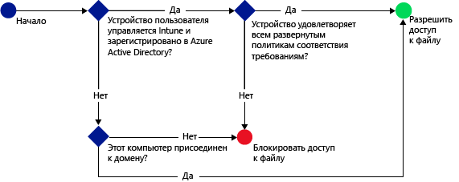

# Ограничение доступа к SharePoint Online с помощью Microsoft Intune
Используйте условный доступ [!INCLUDE[wit_firstref](../includes/wit_firstref_md.md)] для управления доступом к файлам в SharePoint Online.
Условный доступ состоит из двух компонентов:
- Политика соответствия устройств, которой устройства должны удовлетворять, чтобы считаться соответствующими.
- Политика условного доступа, где указываются условия, которым должно удовлетворять устройство для доступа к службе.
Дополнительные сведения о принципах работы условного доступа см. в статье [Ограничение доступа к электронной почте, Office 365 и другим службам](restrict-access-to-email-and-o365-services-with-microsoft-intune.md).

Политики соответствия требованиям и условного доступа развертываются для пользователя. Любое устройство, используемое пользователем для доступа к службам, проверяется на соответствие политикам.

Когда пользователь пытается подключиться к файлу с помощью поддерживаемого приложения (например, OneDrive) на устройстве, выполняется следующая оценка:

**Перед** настройкой политики условного доступа для SharePoint Online необходимо выполнить следующие условия:
- Получить **подписку SharePoint Online**, а пользователи должны иметь лицензию на SharePoint Online.
- Требуется **подписка Azure Active Directory Premium**. Дополнительные сведения см. на странице [Цены Azure Active Directory](https://azure.microsoft.com/en-us/pricing/details/active-directory/). **Подписка Enterprise Mobility Suite + Security** включает в подписки Intune и Azure Active Directory Premium. Дополнительные сведения см. на странице [Цены Enterprise Mobility Suite](https://www.microsoft.com/en-us/cloud-platform/enterprise-mobility-pricing).

  Для подключения к необходимым файлам устройство должно удовлетворять следующим требованиям:
-   **Регистрация** в [!INCLUDE[wit_nextref](../includes/wit_nextref_md.md)] или на ПК, присоединенном к домену.

-   **Устройство должно быть зарегистрировано** в Azure Active Directory (это происходит автоматически при регистрации устройства в [!INCLUDE[wit_nextref](../includes/wit_nextref_md.md)]).

-   Устройство должно удовлетворять всем развернутым политикам соответствия [!INCLUDE[wit_nextref](../includes/wit_nextref_md.md)].

Состояние устройства хранится в службе Azure Active Directory, которая предоставляет или блокирует доступ к файлам на основе указанных условий.

Если условие не выполняется, при входе пользователь получает следующие сообщения:

-   Если устройство не зарегистрировано в [!INCLUDE[wit_nextref](../includes/wit_nextref_md.md)] либо в Azure Active Directory, выводится сообщение с инструкциями о том, как установить приложение корпоративного портала и выполнить регистрацию.

-   Если устройство не соответствует требованиям, отображается сообщение, направляющее пользователя на веб-сайт корпоративного портала [!INCLUDE[wit_nextref](../includes/wit_nextref_md.md)], где можно найти сведения о данной проблеме и способах ее решения.

**Условный доступ применяется ко всем сайтам SharePoint, и внешние общие ресурсы блокируются.**

>[!NOTE]
>Если вы включили условный доступ для SharePoint Online, то рекомендуется отключить домен в списке, как описано в разделе [Remove-SPOTenantSyncClientRestriction](https://technet.microsoft.com/en-us/library/dn917451.aspx).  

## Поддержка мобильных устройств
- Устройства iOS 8.0 и более поздней версии
- Android 4.0 и более поздние версии, Samsung KNOX Standard 4.0 и более поздние версии
- Windows Phone 8.1 и более поздней версии

Можно ограничить доступ к SharePoint Online, если доступ осуществляется из браузера на устройствах под управлением **iOS** и **Android**.  Доступ будет разрешен только из поддерживаемых браузеров на соответствующих устройствах:
* Safari (iOS)
* Chrome (Android)
* Managed Browser (iOS и Android)

**Неподдерживаемые браузеры будут заблокированы**.

## Поддержка для ПК
- Windows 8.1 и более поздней версии (при регистрации Intune);
- Windows 7.0, Windows 8.1 или Windows 10 (при присоединении к домену)
> [!NOTE]
>Чтобы использовать условный доступ с компьютерами под управлением Windows 10, необходимо установить на них юбилейное обновление Windows 10.

  - Для ПК, присоединенных к домену, необходимо задать [автоматическую регистрацию](https://azure.microsoft.com/en-us/documentation/articles/active-directory-conditional-access-automatic-device-registration/) в Azure Active Directory.
Служба AAD DRS активируется автоматически для клиентов Intune и Office 365. Клиенты, которые уже развернули службу регистрации устройств ADFS, не будут видеть зарегистрированные устройства в своем локальном Active Directory.

  - Если политика требует присоединения к домену, а ПК не присоединен к домену, отображается сообщение, рекомендующее обратиться к ИТ-администратору.

  - Если политика требует присоединения к домену или соответствия политике, это означает, что ПК не соответствует какому-либо из требований, и отображается сообщение с инструкциями о том, как установить приложение корпоративного портала и выполнить регистрацию.
  >[!NOTE]
  >Условный доступ не поддерживается на компьютерах, где выполняется клиент Intune.

-    [Должна быть включена современная проверка подлинности Office 365](https://support.office.com/en-US/article/Using-Office-365-modern-authentication-with-Office-clients-776c0036-66fd-41cb-8928-5495c0f9168a), а также должны быть установлены все последние обновления Office.

    Современная проверка подлинности для клиентов Office 2013 под управлением Windows использует библиотеку проверки подлинности Active Directory (ADAL) и поддерживает более высокий уровень безопасности, обеспечиваемый **многофакторной проверкой подлинности** и **проверкой подлинности на основе сертификатов**.

## Настройка условного доступа для SharePoint Online

### Шаг 1. Настройка групп безопасности Active Directory
Прежде чем начать, настройте политику условного доступа в группах безопасности Azure Active Directory. Эти группы можно настроить в **Центре администрирования Office 365**или на **портале учетных записей Intune**. Они будут использоваться для назначения пользователей политике или исключения их из нее. Если на пользователя распространяется действие политики, каждое используемое им устройство должно соответствовать этой политике, чтобы он мог получить доступ к ресурсам.

В каждой политике SharePoint Online можно указать два типа групп:

-   **целевые группы** — группы пользователей, к которым применяется политика;

-   **исключенные группы** — группы пользователей, которые исключены из политики.

Если пользователь входит в обе группы, то он будет исключен из политики.

### Шаг 2. Настройка и развертывание политики соответствия требованиям
Если вы еще не сделали это, создайте и разверните политику соответствия для всех пользователей, на которые будет нацелена политика SharePoint Online.

> [!NOTE]
> Во время развертывания политик в группах [!INCLUDE[wit_nextref](../includes/wit_nextref_md.md)] политики условного доступа нацелены на группы безопасности Azure Active Directory.

Дополнительные сведения о настройке политики соответствия требованиям см. в статье [Create a compliance policy](create-a-device-compliance-policy-in-microsoft-intune.md) (Создание политики соответствия требованиям).

> [!IMPORTANT]
> Если политика соответствия не развернута, устройства считаются соответствующими.

Когда будете готовы, перейдите к **шагу 3**.

### Шаг 3. Настройка политики SharePoint Online
Далее настройте в политике требование, разрешающее доступ к SharePoint Online только для управляемых и соответствующих политике устройств. Эта политика будет храниться в Azure Active Directory.

#### 

>[!NOTE]
> Можно также создать политику условного доступа в консоли управления Azure AD. Консоль управления Azure AD позволяет создавать политики условного доступа для устройств Intune (в Azure AD их называют **политиками условного доступа на основе устройств**), а также другие политики условного доступа, такие как многофакторная проверка подлинности.  Можно также задать политики условного доступа для сторонних корпоративных приложений, таких как Salesforce и Box, которые поддерживает Azure AD. Дополнительные сведения см. в разделе [Настройка политики условного доступа на основе устройств Azure Active Directory для контроля доступа к подключенным приложениям Azure Active Directory](https://azure.microsoft.com/en-us/documentation/articles/active-directory-conditional-access-policy-connected-applications/).

1.  В [консоли администрирования Microsoft Intune](https://manage.microsoft.com) выберите **Политика** > **Условный доступ** > **Политика SharePoint Online**.

2.  Выберите **Включить политику условного доступа для SharePoint Online**.

3.  В разделе **Доступ приложения ** можно выбрать область применения политики условного доступа:

    -   **Все платформы**

        Любое устройство, используемое для доступа к **SharePoint Online**, регистрируется в Intune и удовлетворяет заданным политикам.  Любое клиентское приложение, использующее **современную проверку подлинности**, регулируется политикой условного доступа. Если в настоящее время платформа не поддерживается службой Intune, доступ к **SharePoint Online** блокируется.

        Выбор варианта **Все платформы** означает, что Azure Active Directory будет применять эту политику ко всем запросам проверки подлинности независимо от платформы, о которой сообщает клиентское приложение.  Все платформы должны быть зарегистрированными и соответствующими со следующими исключениями.
        *   Устройства Windows должны быть зарегистрированными и соответствующими, присоединенными к домену с локальным каталогом Active Directory, либо для них могут выполняться оба условия.
        * Неподдерживаемые платформы, такие как Mac OS.  Однако приложения, использующие современные способы проверки подлинности, реализованные в этих платформах, будут блокироваться.

    -   **Определенные платформы**

         Политика условного доступа применяется для любого клиентского приложения, использующего современную проверку подлинности, на выбранных вами платформах.

     ПК с Windows должны быть присоединены к домену или зарегистрированы в [!INCLUDE[wit_nextref](../includes/wit_nextref_md.md)] и соответствовать политике. Можно задать следующие требования.

     -   **Устройства должны быть присоединены к домену или соответствовать требованиям.** Выберите этот параметр, если хотите, чтобы ПК были присоединены к домену либо соответствовали политикам, заданным в [!INCLUDE[wit_nextref](../includes/wit_nextref_md.md)]. Если компьютер не соответствует тому или иному требованию, пользователю будет предложено зарегистрировать устройство в [!INCLUDE[wit_nextref](../includes/wit_nextref_md.md)].

     -   **Устройства должны быть присоединены к домену.** Выберите этот параметр, чтобы указать, что ПК должны быть присоединены к домену для доступа к Exchange Online. Если ПК не присоединен к домену, доступ к почте будет заблокирован, и пользователю будет предложено обратиться к ИТ-администратору.

     -   **Устройства должны соответствовать политикам.** Выберите этот параметр, чтобы указать, что ПК должны быть зарегистрированы в [!INCLUDE[wit_nextref](../includes/wit_nextref_md.md)] и соответствовать политикам. Если ПК не зарегистрирован, отобразится сообщение с инструкциями по регистрации.

4.   В разделе **Доступ браузера** для SharePoint Online и OneDrive для бизнеса можно разрешить доступ к Exchange Online только через поддерживаемые браузеры: Safari (iOS) и Chrome (Android). Доступ из других браузеров будет заблокирован.  Здесь применяются те же ограничения платформы, которые были выбраны для доступа приложения для OneDrive.

  На устройствах **Android** необходимо разрешить доступ браузера.  Для этого необходимо включить параметр "Включить доступ браузера" на зарегистрированном устройстве.
  1.    Запустите **приложение корпоративного портала**.
  2.    Перейдите на страницу **Настройки**, нажав кнопку с тремя точками (...) или аппаратную кнопку меню.
  3.    Нажмите кнопку **Включить доступ браузера**.
  4.  В браузере Chrome выйдите из Office 365 и перезагрузите Chrome.

  На платформах **iOS и Android**. Для идентификации устройства, используемого для доступа к службе, Azure Active Directory выдаст устройству сертификат безопасности TLS.  На устройстве этот сертификат отобразится вместе с запросом на выбор сертификата, как показано на снимках экрана ниже. Пользователь должен выбрать этот сертификат, прежде чем продолжить работу с браузером.

  **iOS**

  

  **Android**

  
5.  В разделе **Целевые группы** нажмите кнопку **Изменить**, чтобы выбрать группы безопасности Azure Active Directory, к которым будет применена политика. В качестве целевой аудитории можно выбрать всех пользователей или отдельные группы пользователей.

6.  Дополнительно в разделе **Исключенные группы** можно нажать кнопку **Изменить**, чтобы выбрать группы безопасности Azure Active Directory, которые будут исключены из этой политики.

6.  По завершении нажмите кнопку **Сохранить**.

Развертывать политику условного доступа не нужно, она вступает в силу немедленно.

### Шаг 4. Мониторинг соответствия требованиям и политик условного доступа
В рабочей области **Группы** можно просмотреть состояние своих устройств.

Выберите любую группу мобильных устройств, а затем на вкладке **Устройства** выберите один из следующих **фильтров**.

-   **Устройства, не зарегистрированные в AAD** — для этих устройств заблокирован доступ к SharePoint Online.

-   **Устройства, не соответствующие политике** — для этих устройств заблокирован доступ к SharePoint Online.

-   **Устройства, зарегистрированные в AAD и соответствующие политикам** — эти устройства могут получить доступ к SharePoint Online.

### См. также
[Ограничение доступа к электронной почте и службам Office 365 с помощью Microsoft Intune](restrict-access-to-email-and-o365-services-with-microsoft-intune.md)

<!--HONumber=Sep16_HO5-->

