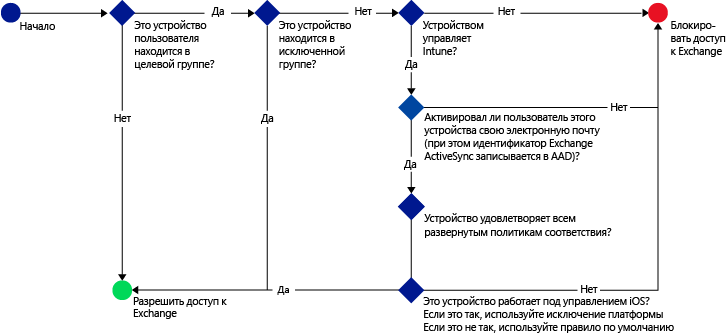
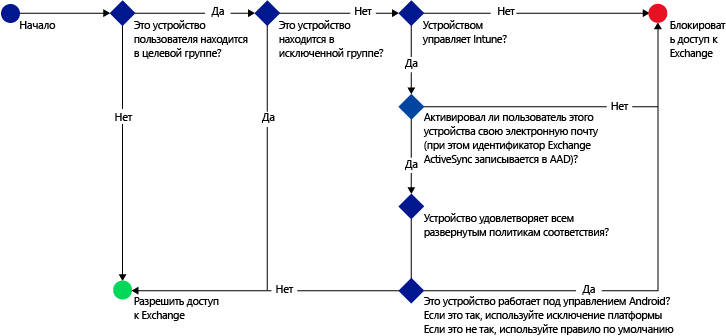

---
# required metadata

title: Примеры сценариев с ограничением доступа к электронной почте | Microsoft Intune
description:
keywords:
author: karthikaraman
manager: jeffgilb
ms.date: 04/28/2016
ms.topic: article
ms.prod:
ms.service: microsoft-intune
ms.technology:
ms.assetid: 454eab79-b620-42c9-b8e6-fada6e719fcd

# optional metadata

#ROBOTS:
#audience:
#ms.devlang:
ms.reviewer: chrisgre
ms.suite: ems
#ms.tgt_pltfrm:
#ms.custom:

---

# Ограничение доступа к электронной почте с помощью Microsoft Intune: примеры сценариев

## Запрет пользователям на использование несовместимых устройств для доступа к Exchange Online
### Требования сценария
- Всем пользователям в группе безопасности Active Directory **Бухгалтерия** необходимо заблокировать доступ к Exchange Online, если их устройства не соответствуют развернутой политике соответствия.
- Если в этой группе присутствуют какие-либо пользователи, чьи устройства не поддерживаются [!INCLUDE[wit_nextref](../includes/wit_nextref_md.md)], им необходимо заблокировать доступ к Exchange Online на соответствующем устройстве.
- Пользователи в группе безопасности Active Directory **Финансы** должны быть исключены из политики, даже если они также присутствуют в группе **Бухгалтерия** .

Для этого настройте в политике условного доступа к Exchange Online следующие параметры:

-   Выберите **Включить политику условного доступа**.

- Выберите платформы, к которым вы хотите разрешить доступ из приложений с современной проверкой подлинности.
- Для приложений Exchange ActiveSync выберите **Блокировать несовместимые устройства на платформах, поддерживаемых в Microsoft Intune** и **Блокировать все прочие устройства на платформах, не поддерживаемых в Microsoft Intune**.
-   В области **Выбранные группы безопасности** раздела **Целевая группа** выберите группу пользователей **Бухгалтерия**.

-   В области **Выбранные группы безопасности** раздела **Исключенные группы** выберите группу пользователей **Финансы**.

Чтобы определить устройства, которые могут получить доступ к Exchange Online, используется следующая процедура:

## Все устройства iOS, обращающиеся к локальной системе Exchange, должны находиться под управлением Intune
### Требования сценария
- Доступ к локальной организации Exchange должны иметь только устройства под управлением iOS.
- Устройства также должны быть зарегистрированы в Intune и удовлетворять правилам политики соответствия, прежде чем их можно будет использовать для доступа к Exchange.

Для этого настройте в политике условного доступа к локальной организации Exchange следующие параметры:

-   Выберите параметр **Блокировать доступ почтовых приложений к локальной организации Exchange, если устройство не соответствует политике или не зарегистрировано в Microsoft Intune**. При выборе этого параметра включается политика условного доступа, указывающая, что для доступа к Exchange все устройства должны быть зарегистрированы в Microsoft Intune и удовлетворять правилам политики соответствия.

-   Для использования дополнительных параметров Exchange Active Sync создайте следующее:

  -   Исключение платформы, которое позволяет устройствам под управлением iOS получить доступ к Exchange.   

  -   Правило по умолчанию, которое указывает, что когда на устройство не распространяется правило исключения платформы, доступ к Exchange для него должен быть заблокирован. Это правило гарантирует, что устройства, управляемые не iOS, не могут получить доступ к Exchange.

Чтобы определить устройства, которые могут получить доступ к Exchange, используется следующий поток.

## Устройства Android не могут обращаться к локальной организации Exchange.
### Требования сценария
- Необходимо заблокировать доступ к Exchange для всех устройств Android.
- Все остальные поддерживаемые устройства могут получить доступ Exchange, если они управляются [!INCLUDE[wit_nextref](../includes/wit_nextref_md.md)].

Для этого настройте в политике условного доступа к локальной организации Exchange следующие параметры:

-   Выберите параметр **Блокировать доступ почтовых приложений к локальной организации Exchange, если устройство не соответствует политике или не зарегистрировано в Microsoft Intune**. Выбор этого параметра указывает, что все устройства должны быть зарегистрированы в Intune и удовлетворять правилам политики соответствия.

- Для использования дополнительных параметров Exchange Active Sync создайте следующее:
  -   Исключение платформы, которое блокирует доступ к Exchange устройствам под управлением Android. Это правило гарантирует, что устройства Android нельзя использовать для доступа к Exchange.

  -   Правило по умолчанию, которое указывает, что когда на устройство не распространяются другие правила, ему должен быть разрешен доступ к Exchange. Это правило по умолчанию обеспечивает, что устройства платформ, отличных от Android, но поддерживаемых Microsoft Intune, можно использовать для доступа к Exchange. Тем не менее, они должны быть зарегистрированным в Intune и удовлетворять правилам политики соответствия.

Чтобы определить устройства, которые могут получить доступ к Exchange, используется следующий поток.

<!--HONumber=Jun16_HO2-->

