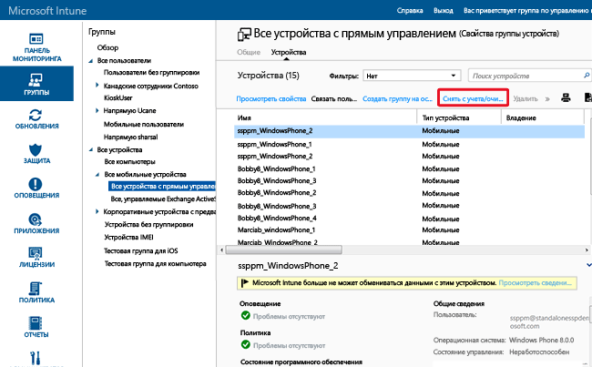

---
# required metadata

title: Использование удаленной очистки для защиты данных | Microsoft Intune
description:
keywords:
author: NathBarn
manager: jeffgilb
ms.date: 04/28/2016
ms.topic: article
ms.prod:
ms.service: microsoft-intune
ms.technology:
ms.assetid: 8519e411-3d48-44eb-9b41-3e4fd6a93112

# optional metadata

#ROBOTS:
#audience:
#ms.devlang:
ms.reviewer: jeffgilb
ms.suite: ems
#ms.tgt_pltfrm:
#ms.custom:

---

# Защита данных посредством полной или выборочной очистки с помощью Microsoft Intune
Как и в случае с устройствами, в определенный момент вам требуется [снять с учета ставшие ненужными приложения](retire-apps-using-microsoft-intune.md), развернутые на ПК и мобильных устройствах. Также может потребоваться удалить с устройства корпоративные данные. Для этого Intune предлагает возможности выборочной и полной очистки. Так как на мобильных устройствах все еще могут храниться важные корпоративные данные и может предоставляться доступ ко многим внутренними ресурсам, следует передать команду удаленной очистки из Intune, чтобы удалить данные с потерянного или украденного устройства. Кроме того, пользователи могут выполнять команду удаленной очистки устройства из Intune для личных устройств, зарегистрированных в Intune.

  > [!NOTE]
  > Эта статья посвящена исключительно очистке устройств, управляемых Intune. Кроме того, вы можете использовать [портал предварительной версии Azure](https://portal.azure.com) для [удаления корпоративных данных из приложений](wipe-managed-company-app-data-with-microsoft-intune.md).

## Полная очистка

**Полная очистка** восстанавливает заводские настройки, удаляя все корпоративные и пользовательские данные и параметры с устройства. Устройство удаляется из Intune. Полная очистка удобна для сброса устройства перед передачей его новому пользователю, а также в случае утери или кражи устройства.  **Соблюдайте осторожность при выборе полного удаления. Восстановить данные на устройстве будет невозможно**.

## Выборочная очистка

**Выборочная очистка** удаляет с устройства данные организации, включая данные управления мобильными приложениями (MAM), где это возможно, параметры и профили электронной почты. При выборочной очистке личные данные пользователя остаются на устройстве. Устройство удаляется из Intune. В следующих таблицах представлено описание удаляемых данных и воздействие на данные, оставшиеся на устройстве после выборочной очистки.

**iOS**

|Тип данных|iOS|
|-------------|-------|
|Приложения организации и связанные с ними данные, установленные Intune.|Удаляются приложения. Удаляются данные приложений компании.  Удаляются данные приложения из приложений Майкрософт, использующих мобильное управление приложениями. Приложение не удаляется.|
|Параметры|Настройки, заданные политикой Intune, больше не действуют. Пользователи могут изменять параметры.|
|Параметры профилей Wi-Fi и VPN|Удалено|
|Параметры профилей сертификатов|Сертификаты удаляются и отзываются.|
|Агент управления|Профиль управления удаляется.|
|Электронная почта|Профили электронной почты, подготовленные в Intune, и кэшированная электронная почта на устройстве удаляются.|
|Отсоединение Azure Active Directory (AAD)|Запись AAD удалена|
|Контакты | Контакты, синхронизированные напрямую из приложения в собственную адресную книгу, удаляются.  Все контакты, синхронизированные из собственной адресной книги в другой внешний источник, нельзя очистить.    Сейчас поддерживается только приложение Outlook.

**Android**

|Тип данных|Android|Android Samsung KNOX|
|-------------|-----------|------------------------|
|Веб-ссылки|Удаляются.|Удалено|
|Неуправляемые приложения Google Play|Приложения и данные остаются.|Приложения и данные остаются.|
|Неуправляемые бизнес-приложения|Приложения и данные остаются.|Приложения удаляются, а их локальные данные очищаются. Никакие данные за пределами приложения (на SD-карте и т. д.) не удаляются.|
|Управляемые приложения Google Play|Данные приложения удаляются. Само приложение не удаляется. Данные, защищенные с помощью шифрования MAM за пределами приложения (на SD-карте и т. д.), остаются зашифрованными и непригодными для использования, но не удаляются.|Данные приложения удаляются. Само приложение не удаляется. Данные, защищенные с помощью шифрования MAM за пределами приложения (на SD-карте и т. д.), остаются зашифрованными, но не удаляются.|
|Управляемые бизнес-приложения|Данные приложения удаляются. Само приложение не удаляется. Данные, защищенные с помощью шифрования MAM за пределами приложения (на SD-карте и т. д.), остаются зашифрованными и непригодными для использования, но не удаляются.|Данные приложения удаляются. Само приложение не удаляется. Данные, защищенные с помощью шифрования MAM за пределами приложения (на SD-карте и т. д.), остаются зашифрованными, но не удаляются.|
|Параметры|Настройки, заданные политикой Intune, больше не действуют. Пользователи могут изменять параметры.|Настройки, заданные политикой Intune, больше не действуют. Пользователи могут изменять параметры.|
|Параметры профилей Wi-Fi и VPN|Удалено|Удалено|
|Параметры профилей сертификатов|Сертификаты отзываются, но не удаляются.|Сертификаты удаляются и отзываются.|
|Агент управления|Права администратора устройств аннулируются.|Права администратора устройств аннулируются.|
|Электронная почта|Удаляются сообщения, полученные приложением Microsoft Outlook для Android.|Профили электронной почты, подготовленные в Intune, и кэшированная электронная почта на устройстве удаляются.|
|Отсоединение Azure Active Directory (AAD)|Запись AAD удалена|Запись AAD удалена|
|Контакты | Контакты, синхронизированные напрямую из приложения в собственную адресную книгу, удаляются.  Все контакты, синхронизированные из собственной адресной книги в другой внешний источник, нельзя очистить.    Сейчас поддерживается только приложение Outlook.|Контакты, синхронизированные напрямую из приложения в собственную адресную книгу, удаляются.  Все контакты, синхронизированные из собственной адресной книги в другой внешний источник, нельзя очистить.    Сейчас поддерживается только приложение Outlook.

**Windows**

|Тип данных|Windows 8.1 (MDM) и Windows RT 8.1|Windows RT|Windows Phone 8 и Windows Phone 8.1|Windows 10|
|-------------|----------------------------------------------------------------|--------------|-----------------------------------------|--------|
|Приложения организации и связанные с ними данные, установленные Intune.|У файлов, защищенных с помощью EFS, будут отозваны ключи и пользователь больше не сможет открыть эти файлы.|Приложения компании не удаляются.|Удаляются приложения, изначально установленные с помощью корпоративного портала. Удаляются данные приложений компании.|Удаляются приложения и ключи загрузки неопубликованных приложений.|
|Параметры|Настройки, заданные политикой Intune, больше не действуют. Пользователи могут изменять параметры.|Настройки, заданные политикой Intune, больше не действуют. Пользователи могут изменять параметры.|Настройки, заданные политикой Intune, больше не действуют. Пользователи могут изменять параметры.|Настройки, заданные политикой Intune, больше не действуют. Пользователи могут изменять параметры.|
|Параметры профилей Wi-Fi и VPN|Удалено|Удалено|Не поддерживается|Удалено|
|Параметры профилей сертификатов|Сертификаты удаляются и отзываются.|Сертификаты удаляются и отзываются.|Не поддерживается|Сертификаты удаляются и отзываются.|
|Электронная почта|Удаляет сообщение электронной почты с поддержкой EFS, включая приложение "Почта" для электронной почты Windows и вложений.|Не поддерживается|Профили электронной почты, подготовленные в Intune, и кэшированная электронная почта на устройстве удаляются.|Удаляет сообщение электронной почты с поддержкой EFS, включая приложение "Почта" для электронной почты Windows и вложений. Удаляет учетные записи почты, подготовленные Intune.|
|Отсоединение Azure Active Directory (AAD)|Нет|Нет|Запись AAD удалена|Неприменимо. Windows 10 не поддерживает выборочную очистку для устройств, присоединенных к Azure Active Directory|

### Порядок удаленной очистки устройства с помощью консоли администратора Intune.

1.  Выберите устройства для очистки. Поиск можно выполнять по пользователю или по устройству.

    -   **Пользователь**

        1.  В [консоли администратора Intune](https://manage.microsoft.com/) выберите **Группы** &gt; **Все пользователи**.

        2.  Выберите имя пользователя, мобильное устройство которого требуется очистить. Выберите **Просмотреть свойства**.

        3.  На странице **Свойства** пользователя выберите элемент **Устройства**, а затем выберите имя мобильного устройства, которое необходимо очистить. Удерживайте клавишу CTRL, чтобы выбрать несколько устройств.

    -   **Устройство**

        1.  В [консоли администратора Intune](https://manage.microsoft.com/) выберите **Группы** &gt; **Все мобильные устройства**.

      

        2.  Выберите **Устройства** и имя мобильного устройства, которое нужно очистить. Удерживайте клавишу CTRL, чтобы выбрать несколько устройств.

2.  Выберите **Снять с учета/очистить**.

3.  Появится сообщение с предложением подтвердить снятие устройства с учета.

    -   Чтобы выполнить **выборочную очистку**, при которой удаляются только корпоративные данные и приложения, нажмите кнопку **Да**.

    -   Для выполнения **полной очистки**, которая удаляет все приложения и данные и восстанавливает заводские настройки устройства, выберите параметр **Очистить устройство перед снятием с учета**. Это действие применяется ко всем платформам, за исключением Windows 8.1. **Невозможно восстановить данные, удаленные в рамках полной очистки**.

Время выполнения очистки на всех типах устройств не превышает 15 минут.

## Очистка содержимого с поддержкой шифрованной файловой системы EFS
Выборочная очистка содержимого, зашифрованного с помощью EFS, поддерживается в Windows 8.1 и Windows RT 8.1. Для выборочной очистки содержимого с поддержкой EFS справедливо следующее.

-   Выборочно удаляются только приложения и данные, защищенные EFS, использующие тот же домен Интернета, что и учетная запись Intune. Дополнительные сведения см. в статье [Выборочная очистка Windows для управления данными устройства](http://technet.microsoft.com/library/dn486874.aspx).

-   При наличии каких-либо изменений, выполненных в домене, связанном с EFS, может пройти до 48 часов, прежде чем приложения и данные, использующие этот новый домен, можно будет выборочно удалить.

-   Будут очищены данные всех доменов, зарегистрированных в Intune.

Данные и приложения, которые в настоящее время поддерживаются выборочной очисткой EFS:

-   приложение "Почта" для Windows;

-   рабочие папки;

-   файлы и папки, зашифрованные с помощью EFS; дополнительные сведения см. в статье [Рекомендации по использованию шифрованной файловой системы](http://support.microsoft.com/kb/223316).

-   Если ваша организация хранит удостоверение в Active Directory, для синхронизации сведений в AAD для выборочной очистки EFS без ошибок следует использовать средство синхронизации каталогов (DirSync).  Дополнительные сведения о DirSync см. в статье [Сценарий синхронизации каталогов](http://technet.microsoft.com/library/dn441212.aspx) в документации Azure Active Directory.

## Отслеживание действий списания, очистки и удаления
Чтобы получить отчет об устройствах, для которых было выполнено списание, удаление или очистка, и тех пользователях, которые выполнили эти операции, сделайте следующее.

1.  В [консоли администратора Intune](https://manage.microsoft.com/) выберите **Отчеты** &gt; **Отчеты о журналах устройства**.

2.  Укажите дату начала и окончания для отчета, а затем выберите **Просмотреть отчет**.

### См. также
[Снятие устройств с учета](retire-devices-from-microsoft-intune-management.md)

[Windows Selective Wipe for Device Data Management (Выборочная очистка Windows для управления данными устройства)](http://technet.microsoft.com/library/dn486874.aspx)

<!--HONumber=May16_HO4-->

