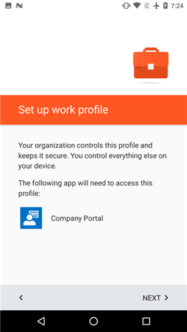

# Создание профиля работы и регистрация устройства в Intune

Регистрация устройства Android обеспечивает доступ к корпоративной электронной почте, приложениям и другим рабочим данным. В процессе регистрации вы настраиваете рабочий профиль, с помощью которого личные данные на устройстве отделяются от рабочих данных. ИТ-администратор может управлять только рабочим профилем, который содержит рабочие данные. ИТ-администратор не может управлять личными данными на вашем устройстве. Дополнительные сведения см. в разделе, где рассказывается о том, [что происходит при создании рабочего профиля](what-happens-when-you-create-a-work-profile-android.md).

Создание профиля работы:

1.  На экране **приветствия** корпоративного портала Android выберите **Войти**, а затем выполните вход с использованием рабочей или учебной учетной записи. Если вы еще не установили бесплатное приложение, загрузите и установите его из [Google Play](http://play.google.com/store/apps/details?id=com.microsoft.windowsintune.companyportal).

    

2. На экране **Настройка доступа к ресурсам организации** нажмите **НАЧАТЬ**.

    

3.  На экране **Для чего нужен профиль работы** прочитайте о доступных возможностях и нажмите **ПРОДОЛЖИТЬ**.

    

4.  Просмотрите данные о том, что именно ИТ-администратор сможет видеть на вашем устройстве, и выберите **ПРОДОЛЖИТЬ**.

    

5.  На экране **Дальнейшие действия** прочитайте о том, что произойдет дальше, а затем нажмите **ПРОДОЛЖИТЬ**.

    

6. На экране **Настройка профиля работы** нажмите **ДАЛЕЕ**, чтобы разрешить доступ приложению корпоративного портала к профилю работы.

    

7. Просмотрите экран Google, где описываются доступные для ИТ-администратора действия при создании профиля работы, а затем нажмите **ОК**.

    

    Вы увидите несколько сообщений с текстом "Настройка профиля работы" и "Регистрация устройства".

8. На экране **Почти готово** Снимок экрана с просьбой подождать, пока откроется приложение корпоративного портала.

    

9. На экране **приветствия** корпоративного портала Android выберите **Войти**, а затем выполните вход с помощью рабочей или учебной учетной записи, которую вы использовали для входа ранее в этой процедуре.

10. На экране **Настройка доступа к компании** обратите внимание, что настройка профиля работы завершена, а затем нажмите **ПРОДОЛЖИТЬ**.

    

    На короткое время появится сообщение "Регистрация устройства".

11. Когда на экране **Настройка доступа к компании** будет показано, что все настроено правильно, нажмите **ПРОДОЛЖИТЬ**. 

    

12. На экране **Настройка доступа к ресурсам организации завершена** нажмите **ГОТОВО**. Если ИТ-администратор добавил другие требования, может потребоваться выполнить дополнительные действия.

    

    Теперь можно получать приложения компании из магазина Play Store for Work.

    

По-прежнему нужна помощь? Обратитесь к ИТ-администратору. Его контактные данные доступны на [веб-сайте корпоративного портала](http://portal.manage.microsoft.com).

<!--HONumber=Oct16_HO2-->

