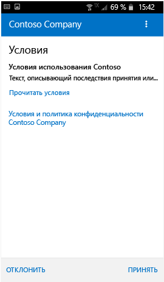
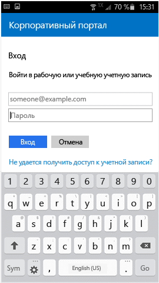

---
# required metadata

title: Регистрация устройства Android в Intune | Microsoft Intune
description:
keywords:
author: staciebarker
manager: jeffgilb
ms.date: 06/14/2016
ms.topic: article
ms.prod:
ms.service: microsoft-intune
ms.technology:
ms.assetid: 0ed3a002-7533-4001-ae24-e10b64b66620

# optional metadata

#ROBOTS:
#audience:
#ms.devlang:
ms.reviewer: arnab
ms.suite: ems
#ms.tgt_pltfrm:
#ms.custom:

---

# Регистрация устройства Android в Intune

Если в вашей компании или учебном заведении используется Microsoft Intune, вы можете зарегистрировать устройство Android, чтобы получить доступ к электронной почте, файлам и другим ресурсам организации. Регистрация устройств позволяет ИТ-отделу управлять рабочими или учебными ресурсами и обеспечивать их безопасность, предоставляя вам свободу выбора устройств для выполнения рабочих задач. Дополнительные сведения о регистрации см. в статье [What happens when I install and Company Portal app and enroll my device?](what-happens-if-you-install-the-Company-Portal-app-and-enroll-your-device-in-intune-android.md) (Что произойдет, если установить приложение "Корпоративный портал" и зарегистрировать устройство?).

Эти инструкции по регистрации предназначены для устройств Android Samsung Knox и "собственных" (отличных от Samsung Knox) устройств Android. Чтобы определить, используете ли вы устройство Samsung Knox, перейдите в раздел **Settings** (Настройки) &gt; **About device** (О телефоне). Если вы не видите строку KNOX version (версия KNOX), значит у вас "собственное" устройство с Android.

Возможно, до или после регистрации вам потребуется выбрать категорию, которая наилучшим образом соответствует характеру использования устройства. ИТ-администратор использует эту категорию, чтобы определить, какие приложения вам доступны.

Если при попытке регистрации устройства в Intune появляется сообщение об ошибке, вы можете [отправить данные об ошибке регистрации ИТ-администратору](send-enrollment-errors-to-your-it-administrator-android.md).

**Чтобы зарегистрировать устройство Android, выполните указанные ниже действия.**

1.  Установите бесплатное приложение корпоративного портала Intune из [Google Play](http://play.google.com/store/apps/details?id=com.microsoft.windowsintune.companyportal).

2.  Откройте приложение корпоративного портала Microsoft Intune.

3.  На экране **приветствия** корпоративного портала выберите **Войти**, а затем выполните вход с использованием рабочей или учебной учетной записи.

       

4.  Если ваш ИТ-администратор задал условия соглашения организации, нажмите **ПРИНЯТЬ**, чтобы принять их.

    

5.  Если вы используете Android 6.0 или более поздней версии, выполните это действие. В противном случае перейдите к следующему шагу. 

    Если ИТ-администратор настроил определенные политики, может появиться следующее сообщение:
    -   **Разрешить корпоративному порталу совершать телефонные звонки и управлять ими?**

    

    Если вы видите это сообщение, коснитесь элемента **Разрешить**. Это безопасно, так как **корпорация Майкрософт не выполняет телефонные вызовы и не управляет ими**. Текст сообщения устанавливается компанией Google, и корпорация Майкрософт не может изменить его. Предоставляя доступ, вы всего лишь разрешаете устройству записывать журналы данных на свою SD-карту, которые затем можно передать с помощью USB-кабеля.

    Если запретить доступ, сообщение появится снова при следующем входе на корпоративный портал, но отображение последующих сообщений можно отключить, установив флажок **Больше не спрашивать**.  Если вы захотите разрешить доступ в дальнейшем, потребуется перейти в раздел **Settings** (Настройки) &gt; **Apps** (Приложения) &gt; **Company Portal** (Корпоративный портал) &gt; **Permissions** (Разрешения) &gt; **Phone** (Телефон) и предоставить разрешение.

    -   **Разрешить корпоративному порталу доступ к вашим контактам?**

    

    Если вы видите это сообщение, коснитесь элемента **Разрешить**. Это безопасно, так как **корпорация Майкрософт не получает доступ к вашим контактам**. Текст сообщения устанавливается компанией Google, и корпорация Майкрософт не может изменить его. При разрешении доступа корпоративный портал сможет только создать вашу рабочую учетную запись, а также использовать ее и управлять ей.

    Если запретить доступ, сообщение появится снова при следующем выборе элемента **Отправить данные**, но отображение последующих сообщений можно отключить, установив флажок **Больше не спрашивать**. Если вы захотите разрешить доступ в дальнейшем, потребуется перейти в раздел **Settings** (Настройки) &gt; **Apps** (Приложения) &gt; **Company Portal** (Корпоративный портал) &gt; **Permissions** (Разрешения) &gt; **Storage** (Хранилище) и предоставить разрешение.

6.  Войдите в приложение корпоративного портала, выбрав рабочую или учебную учетную запись, указав пароль и нажав **Войти**.

    

7.  На экране **Настройка доступа к ресурсам организации** нажмите **НАЧАТЬ**.

    

8.  На экране **Зачем регистрировать устройство?** ознакомьтесь с возможностями, которые доступны при регистрации устройства, а затем выберите **ПРОДОЛЖИТЬ**.

    

9.  Просмотрите данные о том, что именно ИТ-администратор сможет видеть на вашем устройстве, и выберите **ПРОДОЛЖИТЬ**.

    

10.  На экране **Дальнейшие действия** прочитайте о том, что происходит во время регистрации, а затем нажмите **ЗАРЕГИСТРИРОВАТЬ**.

    

11.  На экране **Activate device administrator** (Активация администратора устройства) щелкните **Активировать**.

    

12.  Следуйте инструкциям на экране для ввода ПИН-кода или пароля. Если вы уже настроили ПИН-код или пароль на этом устройстве, этот экран не отображается либо потребуется ввести новый ПИН-код или пароль.

    

13.  Выполните приведенные ниже инструкции для используемого типа устройства (собственное устройство Android или Samsung Knox). Чтобы определить, используете ли вы устройство Samsung Knox, перейдите в раздел **Settings** (Настройки) &gt; **About device** (О телефоне). Если вы не видите строку KNOX version (версия KNOX), значит у вас "собственное" устройство с Android.

    -   На собственном устройстве (не Samsung Knox): на экране **Имя сертификата** нажмите **ОК**, чтобы принять сертификат по умолчанию.

    

    -   Для устройств Samsung Knox: примите политику конфиденциальности и выберите **ПОДТВЕРДИТЬ**.

    

    В процессе регистрации устройства в Intune вы увидите на экране приведенное ниже сообщение.

    

14. При появлении экрана **Настройка доступа к ресурсам организации** нажмите **ПРОДОЛЖИТЬ**. Если отображается сообщение о том, что устройство не соответствует требованиям, следуйте инструкциям для устранения проблемы, а затем нажмите **ПРОДОЛЖИТЬ**.

      

11. На экране **Настройка доступа к ресурсам организации завершена** нажмите **ГОТОВО**. Теперь ваше устройство зарегистрировано.

    

Перед установкой приложений компании выберите **Settings** (Настройки) &gt; **Security** (Безопасность) и включите параметр **Unknown sources** (Неизвестные источники). В противном случае при попытке установки выводится сообщение Install blocked. For security reasons, your device is set to block installations of apps obtained from unknown sources." (Установка заблокирована. По соображениям безопасности на вашем устройстве включена блокировка приложений, полученных из неизвестных источников). Можно нажать **Параметры** в диалоговом окне ошибки, чтобы перейти к параметру **Неизвестные источники**.

По-прежнему нужна помощь? Обратитесь к ИТ-администратору. Его контактные данные доступны на [веб-сайте корпоративного портала](http://portal.manage.microsoft.com).

### См. также
[Использование устройства Android с Intune](using-your-android-device-with-intune.md)

<!--HONumber=Jun16_HO2-->

