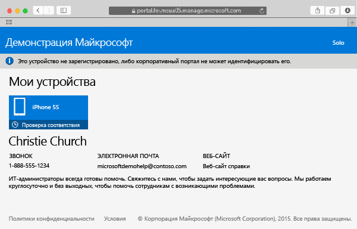

---
# required metadata

title: Регистрация устройства Mac OS X в Intune | Microsoft Intune
description:
keywords:
author: Staciebarker
manager: jeffgilb
ms.date: 04/28/2016
ms.topic: article
ms.prod:
ms.service: microsoft-intune
ms.technology:
ms.assetid: 58eb0e7a-1321-4c66-a281-88fb01e72c1c

# optional metadata

ROBOTS:
#audience:
#ms.devlang:
ms.reviewer: jeffgilb
ms.suite: ems
#ms.tgt_pltfrm:
#ms.custom:

---

# Регистрация устройства Mac OS X в Intune

Регистрация устройства Mac OS X в Intune позволяет получить доступ к сети компании, рабочей электронной почте и рабочим файлам, а также использовать корпоративные приложения. Дополнительные сведения о том, что происходит при регистрации устройства, см. в разделе [Что произойдет, если установить приложение корпоративного портала и зарегистрировать устройство в Intune?](what-happens-if-you-install-the-company-portal-app-and-enroll-your-device-in-intune-ios.md)

Если вы пытаетесь зарегистрировать устройство iOS, см. раздел [Регистрация устройства iOS в Intune](enroll-your-device-in-intune-ios.md).

Чтобы зарегистрировать устройство Mac OS X в Intune, выполните следующие действия.

1.  С помощью браузера Safari откройте [веб-сайт корпоративного портала](https://portal.manage.microsoft.com) и нажмите панель уведомлений.

2.  Нажмите элемент **Это устройство не зарегистрировано, либо портал компании не может идентифицировать его**.

     

3.  Нажмите **Установить** для начала регистрации устройства.

     

4.  В диалоговом окне **Install Management Profile** (Установить профиль управления) нажмите элемент **Установить**. Если отображается диалоговое окно с запросом на ввод учетных данных, введите имя пользователя и пароль, а затем нажмите **Продолжить** &gt; **Установить**.

     

    После регистрации отображается страница профиля управления с сообщением о проверке профиля.

     

### См. также
[Using your iOS or Mac OS X device with Intune](using-your-ios-or-mac-os-x-device-with-intune.md)

<!--HONumber=May16_HO2-->

