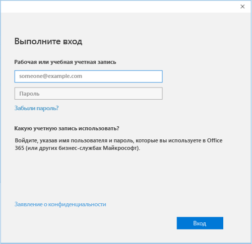

# Регистрация устройства на базе Windows 10 в Intune

1.  Перейдите в раздел **Параметры** Windows и нажмите **Учетные записи**.

    

2.  Коснитесь **Ваша учетная запись**.

    

3.  Нажмите **Добавить рабочую или учебную учетную запись**.

    

4.  Войдите, используя рабочую или учебную учетную запись.

    

По-прежнему не удается получить доступ к рабочей или учебной электронной почте, файлам или другим данным? Попробуйте восстановить доступ, [устранив неполадки со своей учетной записью](troubleshoot-your-windows-10-device-windows.md#troubleshooting-steps-to-follow-if-you-see-your-account). Если это не помогает, обратитесь за помощью к ИТ-администратору.

Чтобы без затруднений получить помощь от ИТ-администратора, используйте контактные данные, доступные в приложении корпоративного портала, где также можно найти и скачать рекомендуемые и обязательные приложения для повседневной работы. Возможно, приложение корпоративного портала уже установлено на вашем устройстве. Чтобы быстро проверить его наличие, найдите __Корпоративный портал__ в списке __Все приложения__.

Если вы не видите корпоративный портал в списке приложений, выполните следующие действия для его установки.

1.  Выберите **Пуск** &gt; **Магазин**.

2.  Нажмите **Поиск** и введите **корпоративный портал**.

3.  В списке результатов нажмите **Корпоративный портал** &gt; **Установить**.

4.  Нажмите **Установить** или **Бесплатно**. Для вас разницы между двумя этими вариантами нет. Показанный выбор зависит от настройки приложения корпоративного портала в вашей организации.

<!--HONumber=Dec16_HO2-->

