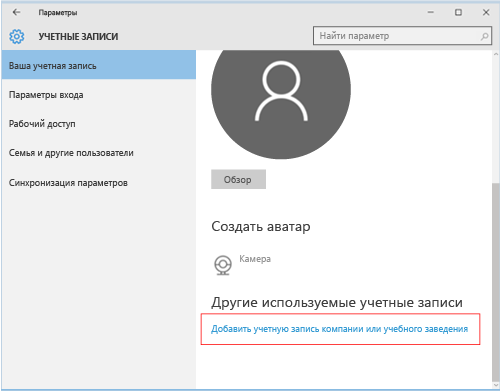

---
# required metadata

title: Регистрация устройства с ОС Windows 10 Mobile или Windows 10 Desktop в Intune | Microsoft Intune
description:
keywords:
author: Staciebarker
manager: jeffgilb
ms.date: 04/28/2016
ms.topic: article
ms.prod:
ms.service: microsoft-intune
ms.technology:
ms.assetid: 36250832-c6fd-4e8d-b681-de735023ebc3

# optional metadata

#ROBOTS:
#audience:
#ms.devlang:
ms.reviewer: jeffgilb
ms.suite: ems
#ms.tgt_pltfrm:
#ms.custom:

---

# Регистрация устройства с ОС Windows 10 Mobile или Windows 10 Desktop в Intune

Если в вашей компании или учебном заведении используется Microsoft Intune, вы можете зарегистрировать свои устройства, чтобы получить доступ к электронной почте, файлам и другим ресурсам организации. Регистрация устройств позволяет организации обеспечить безопасность корпоративных данных. Дополнительные сведения о регистрации см. в разделах [Что произойдет, если установить приложение корпоративного портала и зарегистрировать устройство в Intune?](what-happens-if-you-install-the-company-portal-app-and-enroll-your-device-in-intune-windows.md)

и [Что ИТ-администратор может просматривать на вашем устройстве](what-can-your-it-administrator-see-when-you-enroll-your-device-in-intune-windows.md).

1.  Чтобы зарегистрировать устройство с ОС Windows 10 Mobile или Windows 10 Desktop, выполните указанные ниже действия.

    

2.  settings-accounts

    

3.  your-account

    

4.  add-work-school-account

    

sign-in

-   Если вы выполнили описанные выше действия, но по-прежнему не можете получить доступ к рабочей или учебной электронной почте, файлам и другим данным, вернитесь в раздел **Учетные записи** и выберите **Рабочий доступ**. Если вы видите рабочую или учебную учетную запись, поздравляем,

-   вы подключены.

Если вы не видите рабочую или учебную учетную запись, нажмите **Подключиться**, а затем войдите с помощью рабочей или учебной учетной записи. Также рекомендуется установить приложение корпоративного портала, которое позволит легко определять и скачивать приложения организации, актуальные для вас и вашей роли. В зависимости от того, как ваша компания настроила Intune, приложение корпоративного портала могло быть установлено в рамках процесса регистрации. Чтобы проверить, есть ли у вас это приложение, найдите **Корпоративный портал** в списке приложений.

1.  Если вы не видите корпоративный портал в списке приложений, выполните следующие действия для его установки.

2.  Выберите **Пуск** &gt; **Магазин**.

3.  Нажмите **Поиск** и введите **корпоративный портал**.

4.  В списке результатов нажмите **Корпоративный портал** &gt; **Установить**. Нажмите **Установить** или **Бесплатно**.

### Отображаемый параметр зависит от того, как приложение настроено в компании.
[См. также](enroll-your-device-in-intune-windows.md) 
[Регистрация устройства Windows в Intune](using-your-windows-device-with-intune.md)

<!--HONumber=May16_HO2-->

