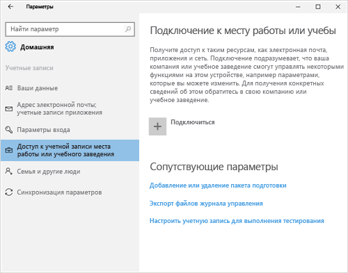

# Регистрация устройства с ОС Windows 10 Mobile или Windows 10 Desktop в Intune

Если в вашей компании или учебном заведении используется Microsoft Intune, вы можете зарегистрировать свои устройства, чтобы получить доступ к электронной почте, файлам и другим ресурсам организации. Регистрация устройств позволяет организации обеспечить безопасность корпоративных данных. Дополнительные сведения о регистрации см. в статьях [What happens if you install the Company Portal app and enroll your device in Intune?](what-happens-if-you-install-the-company-portal-app-and-enroll-your-device-in-intune-windows.md) (Что произойдет, если установить приложение "Корпоративный портал" и зарегистрировать устройство в Intune?) и [What your IT administrator can and can't see on your device](what-can-your-it-administrator-see-when-you-enroll-your-device-in-intune-windows.md) (Что ИТ-администратор может и не может видеть на вашем устройстве).

Чтобы зарегистрировать устройство с ОС Windows 10 Mobile или Windows 10 Desktop, выполните указанные ниже действия.

1.  Перейдите в раздел **Параметры** Windows и выберите **Учетные записи**.

    

2.  Посмотрите на следующие два снимка экрана и выберите тот, который похож на экран вашего устройства. Выполните действия, показанные на выбранном экране.

    Если вы видите этот экран, следуйте инструкциям из раздела [Действия при появлении элемента "Доступ к учетной записи места работы или учебного заведения"](#steps-to-follow-if-you-see-access-work-or-school).

    

    Если вы видите этот экран, следуйте инструкциям из раздела [Действия при появлении элемента "Ваша учетная запись"](#steps-to-follow-if-you-see-your-account).

    

## Действия при появлении элемента "Доступ к учетной записи места работы или учебного заведения"

1.  Коснитесь пункта **Доступ к учетной записи места работы или учебного заведения**, а затем — пункта **Подключиться**.

    

2.  Введите рабочий или учебный адрес электронной почты и нажмите кнопку **Далее**.

    

3. Выполните вход в Intune через рабочую или учебную учетную запись.

    

    Появится сообщение о том, что устройство регистрируется в вашей компании или учебном заведении.

4. При появлении страницы **Всё готово!** нажмите кнопку **Закрыть**. Все готово.

  

5. Если вы хотите еще раз убедиться, что подключение установлено правильно, вернитесь в раздел **Параметры**. Ваша рабочая или учебная учетная запись должна появиться в списке.

    

Если вы выполнили описанные выше действия, но по-прежнему не можете получить доступ к рабочей или учебной учетной записи электронной почты и файлам, выполните инструкции из раздела [Устранение неполадок при появлении элемента "Доступ к учетной записи места работы или учебного заведения"](troubleshoot-your-windows-10-device-windows.md#troubleshooting-steps-to-follow-if-you-see-access-work-or-school).

## Действия при появлении элемента "Ваша учетная запись"

1.  Перейдите в раздел **Параметры** Windows и нажмите **Учетные записи**.

    

2.  Коснитесь **Ваша учетная запись**.

    

3.  Нажмите **Добавить рабочую или учебную учетную запись**.

    

4.  Войдите, используя рабочую или учебную учетную запись.

    

Если вы выполнили описанные выше действия, но по-прежнему не можете получить доступ к рабочей или учебной электронной почте, файлам или другим данным, выполните инструкции из раздела [Устранение неполадок при появлении элемента "Ваша учетная запись"](troubleshoot-your-windows-10-device-windows.md#troubleshooting-steps-to-follow-if-you-see-your-account).

Также рекомендуется установить приложение корпоративного портала, которое позволит легко определять и скачивать приложения организации, актуальные для вас и вашей роли. В зависимости от того, как ваша организация настроила Intune, приложение корпоративного портала могло быть установлено в рамках процесса регистрации.

Чтобы проверить, есть ли у вас это приложение, найдите **Корпоративный портал** в списке приложений. Если вы не видите корпоративный портал в списке приложений, выполните следующие действия для его установки.

1.  Выберите **Пуск** &gt; **Магазин**.

2.  Нажмите **Поиск** и введите **корпоративный портал**.

3.  В списке результатов нажмите **Корпоративный портал** &gt; **Установить**.

4.  Нажмите **Установить** или **Бесплатно**. Отображаемый параметр зависит от того, как приложение настроено в организации.

По-прежнему нужна помощь? Обратитесь к ИТ-администратору. Его контактные данные доступны на [веб-сайте корпоративного портала](http://portal.manage.microsoft.com).

<!--HONumber=Oct16_HO1-->

