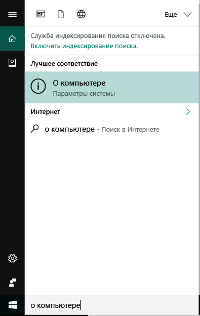
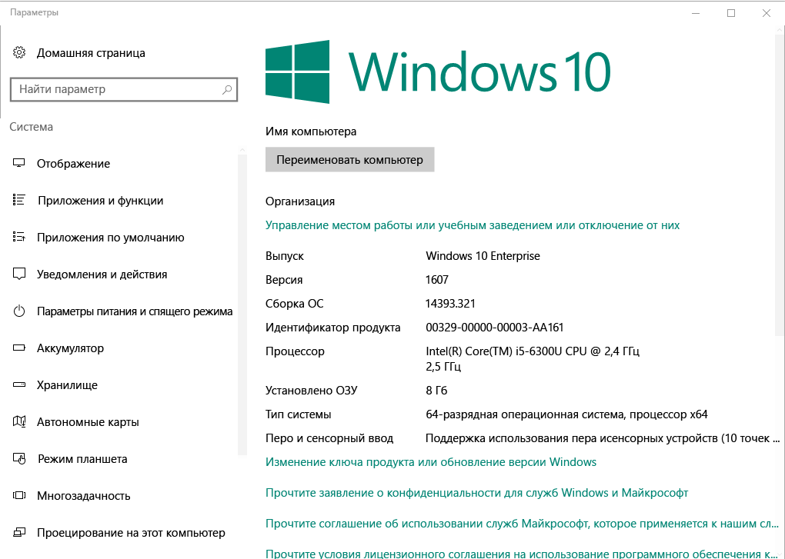

# Регистрация устройств Windows 10 в Intune

Регистрация устройств в Microsoft Intune позволяет устройствам Windows 10 получить доступ к защищенным данным организации, включая электронную почту, файлы и другие ресурсы. Это справедливо как для устройств с ОС Windows 10 Desktop, так и для устройств с ОС Windows 10 Mobile. Регистрация устройств позволяет защитить доступ как для вас, так и для вашей организации, и помогает отделить рабочие данные от персональных.

Хотите получить дополнительные сведения? Узнайте, что происходит при [регистрации устройства в Intune](what-happens-if-you-install-the-company-portal-app-and-enroll-your-device-in-intune-windows.md) и что это означает для [сведений на устройстве](what-can-your-it-administrator-see-when-you-enroll-your-device-in-intune-windows.md).

## Устройства Windows 10 Desktop
1.  Перейдите в меню __Пуск__.

 .

2. Введите фразу "о компьютере" в __строку поиска__, а затем выберите __О компьютере__.

 

2.  В области __Параметры__ появится список сведений о версии Windows 10, установленной на ПК. В этом списке найдите пункт __Версия__.

 

3.  Если ваша версия — __1607__, продолжите выполнять [эти шаги](enroll-your-w10-device-access-work-or-school.md). Если ваша версия — __1511__, продолжите выполнять [эти шаги](enroll-your-w10-device-your-account.md).

## Устройства Windows 10 Mobile

1.  В меню __Пуск__ проведите по экрану, чтобы перейти к списку __Все приложения__, а затем выберите приложение __Настройки__.
2.  Коснитесь пункта __Система__, а затем — __Сведения__.
3.  В разделе __Сведения об устройстве__ коснитесь кнопки __Дополнительные сведения__. Появится список сведений о вашем устройстве. В этом списке найдите пункт __Версия__.
4.  Если ваша версия — __1607__, продолжите выполнять [эти шаги](enroll-your-w10-device-access-work-or-school.md). Если ваша версия — __1511__, продолжите выполнять [эти шаги](enroll-your-w10-device-your-account.md).

По-прежнему нужна помощь? Обратитесь к ИТ-администратору. Его контактные данные доступны на [веб-сайте корпоративного портала](http://portal.manage.microsoft.com).

<!--HONumber=Dec16_HO2-->

