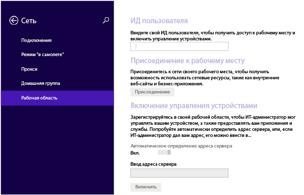
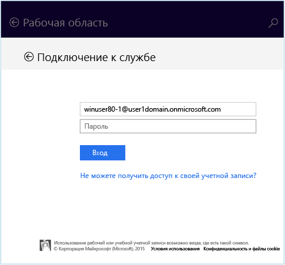
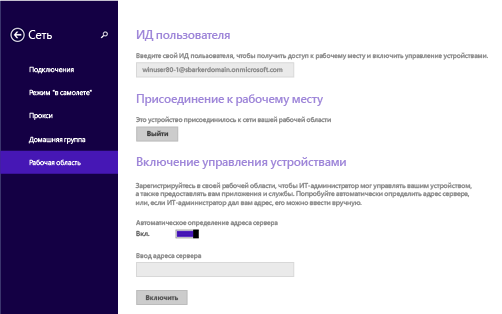
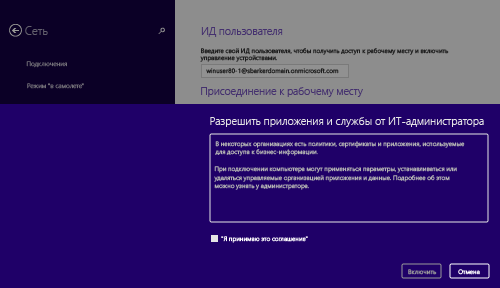

---
# required metadata

title: Регистрация устройства Windows 8.1 или Windows RT 8.1 в Intune | Microsoft Intune
description:
keywords:
author: Staciebarker
manager: jeffgilb
ms.date: 04/28/2016
ms.topic: article
ms.prod:
ms.service: microsoft-intune
ms.technology:
ms.assetid: 28984f26-1070-4f7a-877c-669a59375c0c

# optional metadata

#ROBOTS:
#audience:
#ms.devlang:
ms.reviewer: priyar
ms.suite: ems
#ms.tgt_pltfrm:
#ms.custom:

---

# Регистрация устройства Windows 8.1 или Windows RT 8.1 в Intune

Если в вашей компании или учебном заведении используется Microsoft Intune, вы можете зарегистрировать свои устройства, чтобы получить доступ к электронной почте, файлам и другим ресурсам организации. Регистрация устройств позволяет организации обеспечить безопасность корпоративных данных. Дополнительные сведения о регистрации см. в статьях [What happens if you install the Company Portal app and enroll your device in Intune?](what-happens-if-you-install-the-company-portal-app-and-enroll-your-device-in-intune-windows.md) (Что произойдет, если установить приложение "Корпоративный портал" и зарегистрировать устройство в Intune?) и [What your IT administrator can and can't see on your device](what-can-your-it-administrator-see-when-you-enroll-your-device-in-intune-windows.md) (Что ИТ-администратор может и не может видеть на вашем устройстве).

Чтобы зарегистрировать устройство Windows 8.1 или Windows RT 8.1, выполните указанные ниже действия.

1.  На устройстве последовательно выберите **Настройки** &gt; **Настройки компьютера** &gt; **Сеть** &gt; **Рабочая область**.

    

2.  Введите рабочий или учебный адрес электронной почты для идентификатора пользователя, если это необходимо, а затем выберите **Присоединиться**.

    Если идентификатор пользователя не требуется, используется адрес электронной почты, введенный при входе на это устройство.

3.  Введите пароль для рабочей или учебной электронной почты.

    

4.  В разделе **Turn on device management** (Включение управления устройством) нажмите **Включить**.

    

5.  В диалоговом окне **Разрешить приложения и службы от ИТ-администратора** установите флажок **Я принимаю**, а затем нажмите **Включить**.

    

    После успешной регистрации отображается следующий экран.

    

Также рекомендуется установить приложение корпоративного портала, которое позволит легко определять и скачивать приложения организации, актуальные для вас и вашей роли. В зависимости от того, как ваша компания настроила Intune, приложение корпоративного портала могло быть установлено в рамках процесса регистрации. Чтобы проверить, есть ли у вас это приложение, найдите **Корпоративный портал** в списке приложений. Если вы не видите корпоративный портал в списке приложений, выполните следующие действия для его установки.

1.  Выберите **Пуск** &gt; **Магазин**.

2.  Нажмите **Поиск** и введите **корпоративный портал**.

3.  В списке результатов нажмите **Корпоративный портал**.

4.  Нажмите **Установить** или **Бесплатно**. Отображаемый параметр зависит от того, как приложение настроено в компании.

По-прежнему нужна помощь? Обратитесь к ИТ-администратору. Его контактные данные доступны на [веб-сайте корпоративного портала](http://portal.manage.microsoft.com).

### См. также
[Регистрация устройства Windows в Intune](enroll-your-device-in-intune-windows.md) 
[Использование устройства Windows в Intune](using-your-windows-device-with-intune.md)

<!--HONumber=Jun16_HO2-->

