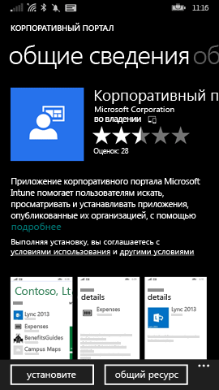
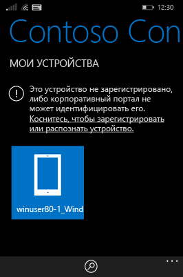
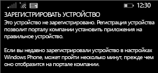

# Регистрация устройства Windows Phone 8.1 в Intune

Если в вашей компании или учебном заведении используется Microsoft Intune, вы можете зарегистрировать свои устройства, чтобы получить доступ к электронной почте, файлам и другим ресурсам организации. Регистрация устройств позволяет организации обеспечить безопасность корпоративных данных. Дополнительные сведения о регистрации см. в статьях [What happens if you install the Company Portal app and enroll your device in Intune?](what-happens-if-you-install-the-company-portal-app-and-enroll-your-device-in-intune-windows.md) (Что произойдет, если установить приложение "Корпоративный портал" и зарегистрировать устройство в Intune?) и [What your IT administrator can and can't see on your device](what-info-can-your-company-see-when-you-enroll-your-device-in-intune.md) (Что ИТ-администратор может и не может видеть на вашем устройстве).

Для регистрации устройства Windows Phone 8.1 в Intune выполните инструкции, которые применяются в вашей организации или учебном заведении.

-   [Если ваша компания позволяет использовать корпоративный портал из Магазина Windows](#if-your-company-lets-you-use-the-company-portal-from-the-windows-store)

-   [Если у вас нет прав на доступ к Магазину Windows со своего устройства Windows Phone или нет учетной записи Майкрософт](#if-you-are-not-allowed-to-access-the-windows-store-from-your-windows-phone-or-if-you-do-not-have-a-microsoft-account)

## Если ваша компания позволяет использовать корпоративный портал из Магазина Windows
Установите приложение корпоративного портала на устройство.

1.  Выберите **Пуск** &gt; **Магазин**.

2.  Нажмите **Поиск** и введите **корпоративный портал**.

3.  В списке результатов нажмите **Корпоративный портал**.

    

4.  Выберите **Корпоративный портал** &gt; **Установить**.

    

Регистрация устройства

1.  На устройстве откройте приложение **Корпоративный портал Microsoft Intune**.

2.  Укажите свои учетные данные. Вас могут попросить принять условия организации, если это применимо.

3.  Проведите по экрану, чтобы перейти в раздел **Мои устройства**.

4.  Нажмите **Коснитесь, чтобы зарегистрировать или распознать устройство**.

    

5.  Нажмите **Зарегистрировать это устройство**.

    

6.  Нажмите **Добавить учетную запись**.

    

7.  При запросе введите дополнительные сведения и нажмите **Войти**, чтобы завершить регистрацию. Теперь рабочая учетная запись должна появиться на странице **Настройки** &gt; **Рабочая область**.

    

## Если у вас нет права на доступ к Магазину Windows со своего устройства Windows Phone или если у вас нет учетной записи Майкрософт

1.  Выберите **Настройки** &gt; **Рабочая область**.

2.  Нажмите **Добавить учетную запись**, а затем войдите, используя рабочую учетную запись.

3.  При запросе введите дополнительные сведения и нажмите **Войти**, чтобы завершить регистрацию.

4.  Если будет предложено установить приложение или концентратор организации, установите необходимые флажки и нажмите **Готово**.

Если ИТ-администратор настроил установку корпоративного портала во время регистрации, корпоративный портал появится в списке приложений.

По-прежнему нужна помощь? Обратитесь к ИТ-администратору. Его контактные данные доступны на [веб-сайте корпоративного портала](http://portal.manage.microsoft.com).

