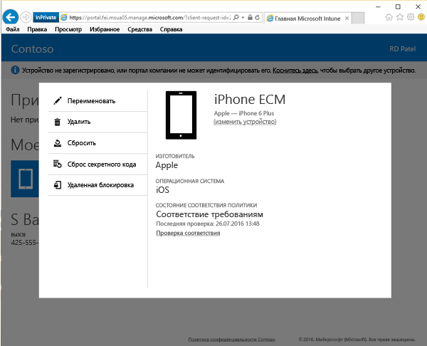

# Удаленная блокировка устройства с веб-сайта корпоративного портала

В случае потери или кражи устройство можно заблокировать с помощью функции удаленной блокировки на [веб-сайте корпоративного портала](http://portal.manage.microsoft.com). Удаленная блокировка подходит для следующих типов устройств:

Платформа  |Дополнительные сведения о поддержке  
---------|---------
Android | Поддерживается       
iOS | Поддерживается
Windows 10 Mobile | Поддерживается только в том случае, если на телефоне задан секретный код     
Windows 10 Desktop | Не поддерживается  
Windows Phone 8.1 | Поддерживается только в том случае, если на телефоне задан секретный код
Windows Phone 8.0 | Не поддерживается
ПК (Windows 8.0 и более ранних версий) | Не поддерживается       
ПК (Windows 8.1) | Не поддерживается

 
Использование удаленной блокировки для блокировки устройства

1.  На [веб-сайте корпоративного портала](http://portal.manage.microsoft.com) выберите имя устройства, которое требуется заблокировать.

2.  Выберите **Удаленная блокировка**.

    

3.  Прочтите предупреждающее сообщение о том, что устройство будет заблокировано, после чего коснитесь **Удаленная блокировка**, чтобы веб-сайт корпоративного портала попытался заблокировать ваше устройство.

    После выбора элемента **Удаленная блокировка** отображается состояние "Ожидается удаленная блокировка".  После успешной удаленной блокировки состояние меняется на "Удаленная блокировка успешно выполнена".

    Состояние удаленной блокировки отображается в трех местах:

    * Область уведомлений веб-сайта.
    * Страница сведений для устройства.
    * Плитку с именем устройства в разделе "Мои устройства" на странице.

    Если появляется уведомление "Сбой удаленной блокировки", подождите несколько минут и повторите попытку. После повторной попытки состояние снова меняется на "Ожидается удаленная блокировка".

    Если повторная попытка не работает, обратитесь к ИТ-администратору. Если вы нашли устройство и хотите разблокировать его после удаленной блокировки, просто введите секретный код.

По-прежнему нужна помощь? Обратитесь к ИТ-администратору. Его контактные данные доступны на [веб-сайте корпоративного портала](http://portal.manage.microsoft.com).

### См. также
[Использование веб-сайта корпоративного портала Intune](using-the-intune-company-portal-website.md)

<!--HONumber=Aug16_HO4-->

