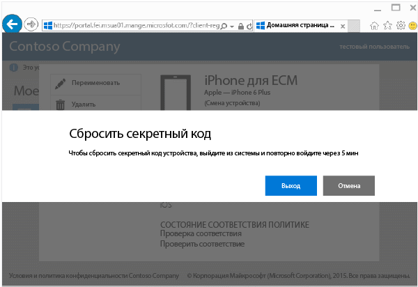
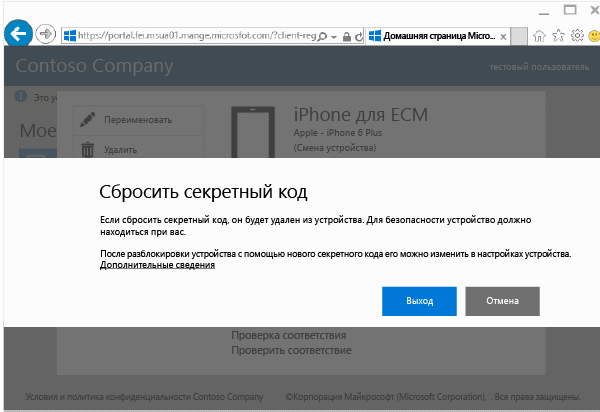

---
# required metadata

title: Сброс секретного кода устройства с веб-сайта корпоративного портала | Microsoft Intune
description:
keywords:
author: Staciebarker
manager: jeffgilb
ms.date: 04/28/2016
ms.topic: article
ms.prod:
ms.service: microsoft-intune
ms.technology:
ms.assetid: 4fa3255b-9d1e-42d5-bd8b-70963dcf2d86

# optional metadata

#ROBOTS:
#audience:
#ms.devlang:
ms.reviewer: mamoriss
ms.suite: ems
#ms.tgt_pltfrm:
#ms.custom:

---

# Сброс секретного кода устройства с веб-сайта корпоративного портала

В случае утери ПИН-кода или пароля для устройства, зарегистрированного в Intune, можно воспользоваться [веб-сайтом корпоративного портала](http://portal.manage.microsoft.com), чтобы сбросить его. Веб-сайт корпоративного портала — это веб-страница, которую можно использовать для управления компьютерами и устройствами, зарегистрированными в Intune. На этом веб-сайте доступно большинство тех задач, которые можно выполнить с помощью приложения корпоративного портала.

> [!NOTE] В зависимости от того, как администратор настроил Intune, кнопка "Сбросить секретный код" на веб-сайте корпоративного портала может отсутствовать. Сброс секретного кода не поддерживается на устройствах Windows 8.1 и Windows RT.

Сброс секретного кода

1.  Откройте [веб-сайт корпоративного портала](http://portal.manage.microsoft.com) и выберите устройство, секретный код которого хотите сбросить.

2.  Нажмите **Сбросить секретный код**.

    

3.  Выберите **Выйти** и снова войдите, используя рабочую или учебную учетную запись. Повторный вход необходимо выполнить в течение пяти минут.

    

4.  Нажмите **Сбросить секретный код**.

    

    Просмотрите таблицу, чтобы узнать, как сброс секретного кода работает на вашем устройстве.

    |Платформа|Support|
    |------------|-----------|
    |Android|Создает временный буквенно-цифровой секретный код.|
    |iOS|Удаляет секретный код устройства, не создавая новый временный секретный код. При использовании Touch ID потребуется его повторная настройка на устройстве, так как при сбросе секретного кода он удаляется.|
    |Windows 10 (только мобильные устройства)|Создает временный буквенно-цифровой секретный код. Windows Hello поддерживается.|
    |Windows Phone 8.1|Создает временный цифровой секретный код.|
    После разблокирования устройства можно задать новый секретный код, перейдя к разделу **Параметры** на устройстве.

5.  Разблокируйте устройство и задайте новый или измените временный секретный код в разделе **Параметры** на устройстве.

    Для просмотра уведомления об успешном сбросе пароля щелкните флаг уведомления в верхней правой части веб-сайта корпоративного портала.

По-прежнему нужна помощь? Обратитесь к ИТ-администратору. Его контактные данные доступны на [веб-сайте корпоративного портала](http://portal.manage.microsoft.com).

### См. также
[Использование веб-сайта корпоративного портала Intune](using-the-intune-company-portal-website.md)

<!--HONumber=Jun16_HO2-->

