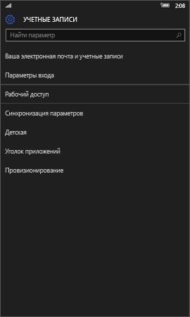
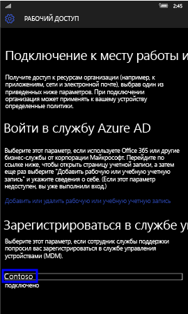
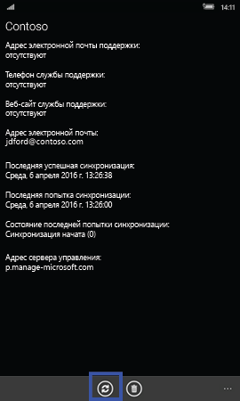
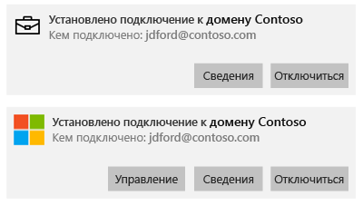
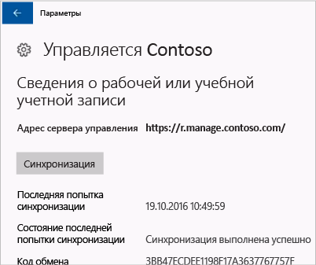
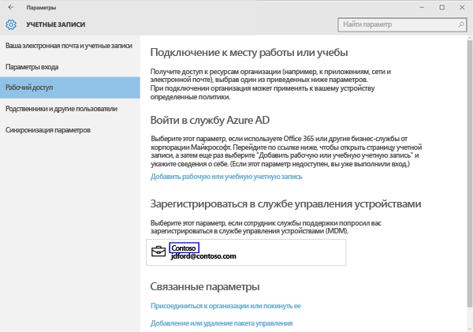
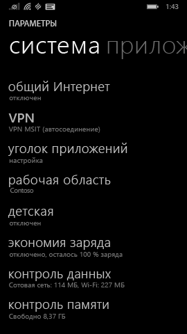
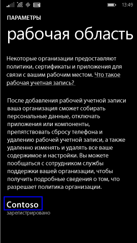
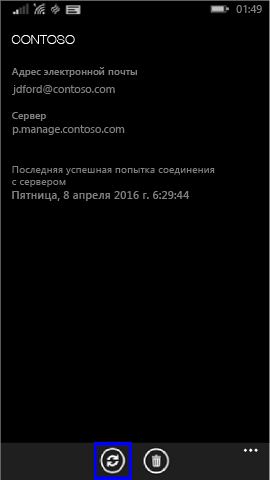

# Синхронизация устройства с Windows вручную.
Если установка приложения выполняется слишком долго, можно попробовать синхронизировать свое устройство Windows вручную. Синхронизация вручную может помочь ускорить установку.

Поддерживаются только следующие версии. Если устройства нет в списке, синхронизация не поддерживается. Выполните действия, соответствующие типу используемого вами устройства:

* [Windows 10 Mobile](#windows-10-mobile)
* [Windows 10 Desktop](#windows-10-desktop)
* [Windows Phone 8.1](#windows-phone-8-1)

## Windows 10 Mobile
Порядок ручной синхронизации устройства Windows 10 Mobile для ускорения установки медленно приложения

1. Последовательно выберите пункты **Все приложения** > **Параметры** > **Учетные записи**.

    

2. Выберите **Рабочий доступ**.

    

3. В разделе **Регистрация в системе управления устройствами** выберите название своей организации.

    

4. Выберите значок **Синхронизация**.

    

    В верхней части экрана появится сообщение "Синхронизация учетной записи". Кнопка **Синхронизация** остается неактивной до завершения синхронизации устройства.

## Windows 10 Desktop
Версий Windows 10 несколько, поэтому имеется два набора инструкций. Чтобы решить, какие инструкции следует выполнить, посмотрите на снимки экрана, а затем следуйте инструкциям, которые похожи на то, что вы видите на устройстве. 

1. Нажмите кнопку **Пуск**, а затем выберите **Параметры**.

    

2. На странице **Параметры** выберите **Учетные записи**.

    

3. Посмотрите на следующие два снимка экрана и выберите тот, который похож на экран вашего устройства. Выполните действия, показанные на выбранном экране.

    Если вы видите этот экран с элементом "Доступ к учетной записи места работы или учебного заведения", следуйте инструкциям из раздела [Действия при появлении элемента "Доступ к учетной записи места работы или учебного заведения"](#steps-to-follow-if-you-see-access-work-or-school).

    

    Если вы видите этот экран с элементом "Рабочий доступ", следуйте инструкциям из раздела [Действия при появлении элемента "Рабочий доступ"](#steps-to-follow-if-you-see-your-account).

     

### Действия при появлении элемента "Доступ к учетной записи места работы или учебного заведения"

1. На странице **Учетные записи** выберите **Доступ к учетной записи места работы или учебного заведения**.

    

2. Выберите рабочую или учебную учетную запись. В зависимости от настройки, произведенной ИТ-администратором, могут отображаться две учетные записи, как в приведенном ниже примере. Рядом с одной из них отображается значок портфеля, а рядом с другой — логотип Майкрософт. 

    - Если вы видите учетную запись со значком портфеля, выберите ее и найдите под ней кнопку **Сведения**. 
    - Если вы видите только учетную запись с логотипом Майкрософт, выберите ее и найдите под ней кнопку **Сведения**.

    

3. Нажмите кнопку **Сведения**. Откроется диалоговое окно, похожее на показанное в примере ниже.

    

4. Нажмите кнопку **Синхронизация**. Ваше устройство будет синхронизировано с Intune.

### Действия при появлении элемента "Рабочий доступ"
    
1. На странице **Учетные записи** выберите **Рабочий доступ**.

    

2. В разделе **Регистрация в системе управления устройствами** выберите название своей организации.

    

3. Нажмите кнопку **Синхронизация**.

    

   Кнопка становится неактивной до завершения синхронизации.

## Windows Phone 8.1
Порядок ручной синхронизации устройства Windows Phone 8.1 для ускорения установки медленно приложения

1. Последовательно выберите пункты **Все приложения** > **Параметры** > **Рабочая область**.

    

2. Выберите название своей компании.

    

3. Выберите значок **Синхронизация**.

    

   До завершения синхронизации в верхней части экрана отображается сообщение "Синхронизация учетной записи".

По-прежнему нужна помощь? Обратитесь к ИТ-администратору. Его контактные данные доступны на [веб-сайте корпоративного портала](http://portal.manage.microsoft.com).

<!--HONumber=Nov16_HO1-->

