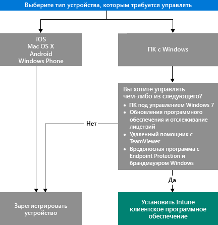

# Выбор способа управления устройствами

Чтобы воспользоваться преимуществами множества функций, предоставляемых Intune, таких как развертывание приложений и управление параметрами устройств, все устройства должны быть *управляемыми*. Способ управления устройствами зависит от возможностей Intune, которые вы хотите использовать.
Этот раздел поможет вам определить, какой метод наиболее полно соответствует вашим потребностям.

Чтобы управлять устройствами на базе iOS, Mac OS X, Android или Windows Phone, их следует *зарегистрировать*.

Для управления компьютерами на базе Windows используются два способа:

1. Регистрация устройства **либо**
2. Установка *программного клиента Intune*.

## Выбор применимого способа
Используйте эту диаграмму для принятия решения о способе управления устройствами.

Зарегистрируйте компьютеры Windows для получения максимального набора функций. Однако программный клиент Intune может оказаться более уместным в следующих случаях:

- Компьютер на базе Windows 7
- Требуется управлять обновлениями программного обеспечения Windows и использованием лицензий.
- Требуется управлять защитой от вредоносных программ с помощью Endpoint Protection и брандмауэра Windows.
- Требуется предоставлять удаленную помощь пользователям с помощью программного обеспечения TeamViewer.

Подробное описание возможностей управления, доступных при каждом из способов, см. в разделах [Возможности управления мобильными устройствами](mobile-device-management-capabilities-in-microsoft-intune.md) и [Возможности программного клиента Intune для ПК](windows-pc-management-capabilities-in-microsoft-intune.md).
Сведения об устройствах и компьютерах, поддерживаемых Intune, см. в разделе [Поддерживаемые мобильные устройства и компьютеры](/intune/get-started/supported-mobile-devices-and-computers).

## Управление с помощью Exchange ActiveSync
Кроме регистрации устройства или установки программного клиента Intune вы также можете управлять устройствами [с помощью Exchange ActiveSync](/intune/deploy-use/mobile-device-management-with-exchange-activesync-and-microsoft-intune). Для этого необходимо установить локальный соединитель On-Premises Connector или использовать встроенный соединитель служб Service-to-Service Connector для подключения к Exchange Server.
Хотя это третий способ для управления устройствами, он предоставляет ограниченный набор возможностей по сравнению с другими методами.

## Дальнейшие действия

- [Выбор способа регистрации мобильных устройств](/intune/get-started/choose-how-to-enroll-devices1)
- [Управление компьютерами с ОС Windows при помощи клиентского программного обеспечения Intune](/intune/deploy-use/manage-windows-pcs-with-microsoft-intune)

- [Управление мобильными устройствами Exchange ActiveSync с использованием Microsoft Intune](/intune/deploy-use/mobile-device-management-with-exchange-activesync-and-microsoft-intune).

<!--HONumber=Nov16_HO4-->

