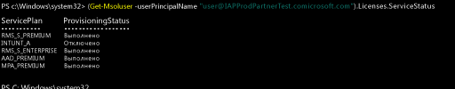

---
# required metadata

title: Управление лицензиями Intune | Microsoft Intune
description:
keywords:
author: Staciebarker
manager: jeffgilb
ms.date: 04/28/2016
ms.topic: get-started-article
ms.prod:
ms.service: microsoft-intune
ms.technology:
ms.assetid: bb4314ea-88b5-44d3-92ce-4c6aff0587a4

# optional metadata

#ROBOTS:
#audience:
#ms.devlang:
ms.reviewer: jeffgilb
ms.suite: ems
#ms.tgt_pltfrm:
#ms.custom:

---

# Управление лицензиями Intune
Для выполнения входа и использования службы или регистрации устройств в системе управления пользователям потребуется лицензия на подписку Intune. Пользователь с лицензией входит в группу пользователей [!INCLUDE[wit_firstref](../includes/wit_firstref_md.md)]. Эта группа включает всех пользователей, у которых есть лицензия на использование подписки. Каждая лицензия пользователя поддерживает регистрацию до 5 устройств.

## Назначение лицензий Intune
Когда учетные записи синхронизируются из локальной службы Active Directory или вручную добавляются в подписку облачных служб на портале учетных записей, лицензия Intune не назначается им автоматически. Вместо этого вы, как администратор клиента, должны изменить учетную запись пользователя, чтобы назначить ему лицензию с портала учетных записей.

Если подписка использует Azure AD совместно с другими облачными службами в вашей подписке, вы получаете доступ к пользователям, которые были добавлены для этих служб. У этих пользователей не будет лицензии на [!INCLUDE[wit_nextref](../includes/wit_nextref_md.md)] до тех пор, пока вы не назначите ее каждому из них.

> [!TIP]
> Если параметр назначения или отзыва лицензии [!INCLUDE[wit_nextref](../includes/wit_nextref_md.md)] недоступен, ваша подписка должна включать варианты корпоративного лицензирования, например доступные при использовании [Enterprise Mobility Suite](https://www.microsoft.com/en-us/server-cloud/enterprise-mobility/overview.aspx). Дополнительные сведения о назначении или отзыве лицензий см. в документации к вариантам лицензирования.

## Назначение лицензии пользователя Intune

Используйте **[!INCLUDE[wit_icp_2](../includes/wit_icp_2_md.md)]**, чтобы вручную добавить пользователей на основе облака и назначить лицензии облачным учетным записям пользователей, а также учетным записям, синхронизированным из локальной службы Active Directory в Azure AD.

1.  Войдите на портал учетных записей Intune, используя учетные данные администратора клиента.

2.  Выберите учетную запись пользователя, которой требуется назначить лицензию пользователя Intune, и установите флажок **Microsoft Intune** в свойствах учетной записи пользователя.

3.  Учетная запись пользователя добавляется в группу пользователей Microsoft Intune, которая предоставляет разрешения на использование службы и регистрацию устройств в системе управления.

### Использование PowerShell для избирательного управления пользовательскими лицензиями EMS
Организации, использующие Microsoft Enterprise Mobility Suite (EMS), могут иметь пользователей, которым в пакете EMS нужны только службы Azure Active Directory Premium или Intune. Можно назначить одну или подмножество служб с помощью [командлетов PowerShell для Azure Active Directory](https://msdn.microsoft.com/library/jj151815.aspx). 

Чтобы выборочно назначить лицензии пользователя для служб EMS, откройте PowerShell с правами администратора на компьютере с установленным [модулем Azure Active Directory для Windows PowerShell](https://msdn.microsoft.com/library/jj151815.aspx#bkmk_installmodule). PowerShell можно установить на локальном компьютере или на сервере ADFS.

Необходимо создать новое определение SKU для лицензии, которое применяется только к нужным планам обслуживания. Чтобы сделать это, отключите планы, которые не нужно применять. Например, можно создать определение SKU лицензии, не назначающее лицензию Intune. Чтобы просмотреть список доступных служб, введите:
 
    (Get-MsolAccountSku | Where {$_.SkuPartNumber -eq "EMS"}).ServiceStatus 

Можно выполнить следующую команду, чтобы исключить план обслуживания Intune. Вы можете воспользоваться тем же методом для работы со всей группой безопасности или применить более детализированные фильтры. 

Пример 1

    Connect-MsolService 
        
    New-MsolUser -DisplayName “Test User” -FirstName FName -LastName LName -UserPrincipalName user@<TenantName>.onmicrosoft.com –Department DName -UsageLocation US
    
    $CustomEMS = New-MsolLicenseOptions -AccountSkuId "<TenantName>:EMS" -DisabledPlans INTUNE_A
    Set-MsolUserLicense -UserPrincipalName user@<TenantName>.onmicrosoft.com -AddLicenses <TenantName>:EMS -LicenseOptions $CustomEMS 
    

Создайте нового пользователя в командной строке и назначьте лицензию EMS, не включая ту ее часть, которая относится к Intune:

    (Get-MsolUser -UserPrincipalName "user@<TenantName>.onmicrosoft.com").Licenses.ServiceStatus

Проверьте:

    Connect-MsolService 
    
    Set-MsolUserLicense -UserPrincipalName user@<TenantName>.onmicrosoft.com -RemoveLicenses IAPProdPartnerTest:EMS
    
    $CustomEMS = New-MsolLicenseOptions -AccountSkuId "<TenantName>:EMS" -DisabledPlans INTUNE_A
    Set-MsolUserLicense -UserPrincipalName user@<TenantName>.onmicrosoft.com -AddLicenses <TenantName>:EMS -LicenseOptions $CustomEMS
 
Пример 2
 
    (Get-MsolUser -UserPrincipalName "user@<TenantName>.onmicrosoft.com" .Licenses.ServiceStatus

### Проверьте:
PoSH-AddLic-Verify Дальнейшие действия
>Поздравляем!

>Вы завершили шаг 4 *краткого руководства по Intune*.  

<!--HONumber=May16_HO2-->

