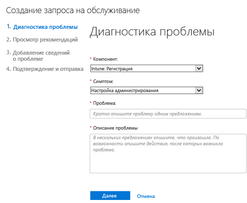
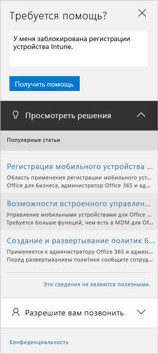

# Получение администраторами поддержки по Microsoft Intune

[!INCLUDE[classic-portal](../includes/classic-portal.md)]

Для каждой подписки Microsoft Intune Майкрософт предлагает услуги глобальной, технической и предпродажной поддержки, а также поддержки по выставлению счетов и продлению подписки. Для оплаченных и пробных подписок доступна поддержка в Интернете и по телефону. Техническая поддержка в Интернете доступна только на английском и японском языках. Поддержка по телефону и поддержка выставления счетов по сети доступны на дополнительных языках.

Поддержка Intune и для Intune с Configuration Manager предоставляется бесплатно. С клиентов службы поддержки уровня Premier взимается плата за вопросы о процедурах (например, как настроить функцию Intune).

## Поиск справки без обращения в службу поддержки

Поищите ответы в источниках ниже, прежде чем отправлять обращение в службу поддержки.

### Форумы TechNet по Microsoft Intune

Задайте вопрос техническим экспертам Майкрософт или начните обсуждение! На [форуме TechNet по Microsoft Intune](https://social.technet.microsoft.com/Forums/home) представлена ценная информация и мы отвечаем на вопросы.

    

### Сайт UserVoice с отзывами о Microsoft Intune

Вы знаете, как Майкрософт может улучшить Intune? Поделитесь идеями на сайте отзывов [UserVoice](https://microsoftintune.uservoice.com/forums/291681-ideas) о Microsoft Intune. Вы также можете голосовать за идеи, добавленные другими пользователями. 

    

## Создание запроса на обслуживание в Интернете

1.  Войдите в [Центр администрирования Office 365](https://portal.office.com), используя учетные данные Intune.
    >[!NOTE]
    >
    >Клиенты службы поддержки Premier могут открыть запрос в службу поддержки Intune на [странице поддержки Premier](https://support.microsoft.com/en-us/premier/contacts).

2.  Выберите плитку **Администрирование**.
3.  В левой части под заголовком **Служба поддержки** выберите пункт **Поддержка**, чтобы отправить запрос.

    

    >[!NOTE]
    >  Это сообщение появится для клиентов, у которых есть или была учетная запись Office 365, в которой 100 лицензий или меньше. Если оно отображается, см. раздел [Другой способ отправки запроса в службу поддержки](#create-a-support-ticket-with-alternate-methods).

    > 

    -   В случае проблем с выставлением счетов, лицензированием и оплатой выберите пункт **Billing and product info** (Сведения о выставлении счетов и продуктах).

    -   Для всех других проблем Intune выберите пункт **Управление мобильными устройствами**.

    > [!NOTE]
    > Для просмотра всех категорий щелкните пункт **Дополнительно** в нижней части списка.

3.  Следуйте инструкциям, чтобы отправить запрос.

### Другой способ отправки запроса в службу поддержки

Следуйте этой процедуре, если страница службы поддержки выглядит следующим образом:

1. Выберите пункт **Нужна помощь**.
2. В текстовом поле опишите свою проблему и нажмите кнопку **Получить помощь**.

    

3. Ознакомьтесь с предлагаемыми интернет-ресурсами или выберите вариант **Разрешите вам позвонить**, чтобы получить звонок от службы поддержки Майкрософт.

## Поддержка по телефону
Список номеров телефонов поддержки по странам и регионам, часы работы службы технической поддержки и поддерживаемые языки для каждого региона см. в статье [Контактные телефоны службы поддержки Microsoft Intune](contact-assisted-phone-support-for-microsoft-intune.md).

## Отслеживание запросов на обслуживание
1.  Войдите в [Центр администрирования Office 365](https://portal.office.com), используя учетные данные Intune.
2.  Выберите плитку **Администрирование**.
3.  В левой части под заголовком **Служба поддержки** выберите **Запросы на обслуживание**. Просмотрите свои запросы.

Скорость наших первых ответов на запросы на обслуживание зависит от сложности проблемы. На большинство сложных проблем клиенты уровня Professional получат первый ответ в течение двух часов. Для клиентов с уровнем поддержки Premier скорость ответа будет зависеть от соглашения на поддержку. Примеры запросов

- Одна или несколько служб недоступны или непригодны для использования.
- Ситуация оказывает серьезное воздействие на сроки производства или развертывания, а также на производительность или прибыльность.
- Затрагиваются несколько пользователей или служб.

Для проблем средней серьезности клиенты уровня Professional получат первый ответ в течение четырех часов. Для клиентов с уровнем поддержки Premier скорость ответа будет зависеть от соглашения на поддержку.  Примеры запросов

- Службу можно использовать, но с некоторыми нарушениями функционирования.
- Ситуация отказывает среднее воздействие на бизнес. Проблема может быть решена в рабочее время.
- Частично затрагивается один пользователь, клиент или служба.

В остальных случаях клиенты уровня Professional получат ответ в течение восьми часов. Для клиентов с уровнем поддержки Premier скорость ответа будет зависеть от соглашения на поддержку.  Примеры запросов

- Ситуация оказывает минимальное воздействие на бизнес.
- Проблема является серьезной, но не оказывает мгновенного и существенного влияния на текущую службу или производительность клиента.
- Частично нарушается работа одного пользователя. Существует приемлемое решение проблемы.

> [!NOTE]
> **Если вы используете Microsoft System Center Configuration Manager** или **Microsoft System Center Endpoint Protection**: для получения технической поддержки по Configuration Manager или Endpoint Protection обратитесь к своему партнеру или посетите [Microsoft System Center Configuration Manager и System Center Endpoint Protection Solution Center](http://www.microsoft.com/en-us/server-cloud/products/system-center-2012-r2/resources.aspx), где находится множество материалов для самостоятельного решения вопросов. Здесь также можно открыть запрос на поддержку через Интернет или по телефону.
>
> Техническая поддержка для System Center Configuration Manager или System Center Endpoint Protection является платной или будет относиться на счет существующих лицензионных соглашений или соглашений для поддержки Premier.

## Самостоятельное решение проблем

Возможно, вы сможете решить проблему, не отправляя запрос в службу поддержки.

Для самостоятельного устранения проблем с Intune изучите статью [Общие советы по устранению неполадок Microsoft Intune](general-troubleshooting-tips-for-microsoft-intune.md) или любой из разделов по устранению неполадок для конкретных проблем. Найти решение или опубликовать вопрос можно также на [форуме Intune](https://social.technet.microsoft.com/Forums/en-US/home?forum=microsoftintuneprod).

## Поддержка клиентов программы корпоративного лицензирования
Если организация уже приобрела лицензии в Майкрософт в рамках программы корпоративного лицензирования, она может найти поддержку на следующих ресурсах.

-   Для получения поддержки по лицензиям и поиску ключей следует перейти на веб-сайт [Volume Licensing Service Center (VLSC)](http://go.microsoft.com/fwlink/p/?LinkID=282016).

-   С вопросами по выставлению счетов обращайтесь в [службу поддержки по управлению выставлением счетов и подписками](http://support.microsoft.com/oas/default.aspx?prid=15371).

-   Общие сведения о корпоративном лицензировании см. на веб-сайте [корпоративного лицензирования](http://go.microsoft.com/fwlink/p/?LinkID=282015).

<!--HONumber=Jan17_HO4-->

