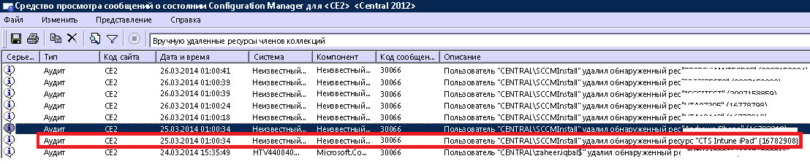

# Устранение проблем при регистрации устройств в Intune

В этом разделе приводятся рекомендации по устранению неполадок с регистрацией устройств. Если эти сведения не позволяют решить проблему, см. дополнительные справочные материалы в статье [Получение поддержки для Microsoft Intune](how-to-get-support-for-microsoft-intune.md).

## Первые действия по устранению неполадок

Прежде чем приступать к устранению неполадок, убедитесь, что в Intune должным образом настроена регистрация. О требованиях к настройке можно прочитать в следующих разделах.

-   [Подготовка к регистрации устройств в Microsoft Intune](/intune/deploy-use/get-ready-to-enroll-devices-in-microsoft-intune)
-   [Настройка управления устройствами в iOS и Mac](/intune/deploy-use/set-up-ios-and-mac-management-with-microsoft-intune)
-   [Настройка управления устройствами Windows 10 Mobile и Windows Phone с помощью Microsoft Intune](/intune/deploy-use/set-up-windows-phone-management-with-microsoft-intune)
-   [Настройка управления устройствами Windows](/intune/deploy-use/set-up-windows-device-management-with-microsoft-intune)

Пользователи управляемых вами устройств могут собирать данные из журналов регистрации и диагностики для дальнейшей проверки. Инструкции по сбору данных журналов для пользователей приведены в следующих статьях:

- [Отправка журналов диагностических данных Android ИТ-администратору по USB-кабелю](/intune/enduser/send-diagnostic-data-logs-to-your-it-administrator-using-a-usb-cable-android)
- [Отправка журналов диагностических данных Android ИТ-администратору по электронной почте](/intune/enduser/send-diagnostic-data-logs-to-your-it-administrator-using-email-android)
- [Отправка ошибок регистрации Android ИТ-администратору](/intune/enduser/send-enrollment-errors-to-your-it-administrator-android)
- [Отправка ошибок регистрации iOS ИТ-администратору](/intune/enduser/send-errors-to-your-it-admin-ios)

## Распространенные проблемы с регистрацией
Эти проблемы могут возникать на всех платформах устройств.

### Достигнут предел для устройств
**Проблема:** во время регистрации на устройстве произошла ошибка, например ошибка **Корпоративный портал временно недоступен** на устройстве iOS, а файл DMPdownloader.log в Configuration Manager содержит ошибку **DeviceCapReached**.

**Решение:** при разработке было заложено, что пользователи могут регистрировать не более 5 устройств.

#### Проверка количества зарегистрированных и разрешенных устройств.

1.  На портале администрирования Intune убедитесь, что пользователь имеет не более 5 назначенных устройств.

2.  На портале администрирования Intune в разделе "Администрирование\Управление мобильными устройствами\Правила регистрации" убедитесь, что параметр "Предел для регистрации устройств" равен 5.

Пользователи мобильных устройств могут удалять устройства по следующему URL-адресу: [https://byodtestservice.azurewebsites.net/](https://byodtestservice.azurewebsites.net/).

Администраторы могут удалять устройства на портале Azure Active Directory.

#### Порядок удаления устройств на портале Azure Active Directory

1.  Перейдите по адресу [http://aka.ms/accessaad](http://aka.ms/accessaad) или выберите **Администрирование** &gt; **Azure AD** на странице [https://portal.office.com](https://portal.office.com).

2.  Выполните вход с помощью идентификатора организации, используя ссылку в левой части страницы.

3.  Создайте подписку Azure, если у вас ее нет. Если у вас платная учетная запись, кредитная карта или оплата не потребуются (щелкните ссылку **Зарегистрировать бесплатную подписку Azure Active Directory**).

4.  Выберите **Active Directory** , а затем выберите вашу организацию.

5.  Откройте вкладку **Пользователи** .

6.  Выберите пользователя, устройства которого требуется удалить.

7.  Выберите **Устройства**.

8.  Удалите соответствующие устройства, например неиспользуемые или имеющие неверные определения.

> [!NOTE]

> Чтобы избежать достижения предельного количества зарегистрированных устройств, можно воспользоваться диспетчерами регистрации устройств, как описано в статье [Регистрация корпоративных устройств с помощью диспетчера регистрации устройств в Microsoft Intune](/intune/deploy-use/enroll-corporate-owned-devices-with-the-device-enrollment-manager-in-microsoft-intune).
>
> Учетная запись пользователя, добавленная в группу диспетчеров регистрации устройств, не сможет завершить регистрацию при применении политики условного доступа для этого конкретного имени входа.

### Корпоративный портал временно недоступен
**Проблема:** на устройстве появляется ошибка **Корпоративный портал временно недоступен**.

#### Устранение ошибки "Корпоративный портал временно недоступен"

1.  Удалите приложение корпоративного портала с устройства.

2.  Откройте на устройстве браузер, перейдите по адресу [https://portal.manage.microsoft.com](https://portal.manage.microsoft.com)и повторите попытку входа пользователя.

3.  Если пользователю не удается выполнить вход, попросите его попробовать другую сеть.

4.  В случае неудачи убедитесь, что учетные данные пользователя правильно синхронизированы с Azure Active Directory.

5.  Если пользователь успешно входит в систему, устройство iOS предлагает установить приложение корпоративного портала и выполнить регистрацию. На устройстве Android необходимо вручную установить приложение корпоративного портала, после чего можно повторить попытку регистрации.

### Центр управления мобильными устройствами не определен
**Проблема:** появляется ошибка **MDM authority not defined** (Центр MDM не определен).

#### Устранение ошибки "MDM authority not defined" (Центр MDM не определен)

1.  Убедитесь, что центр управления мобильными устройствами должным образом настроен для той версии службы Intune, которую вы используете, то есть для Intune, O365 MDM или System Center Configuration Manager с Intune. Для Intune центр MDM задается в разделе **Администрирование** &gt; **Управление мобильными устройствами**. Для Configuration Manager с Intune он задается при настройке соединителя Intune, а в Office 365 — с помощью параметра **Мобильные устройства**.

    > [!NOTE]
    > После задания центра управления мобильными устройствами его можно изменить, только обратившись в службу поддержки, как описано в статье [Получение поддержки для Microsoft Intune](how-to-get-support-for-microsoft-intune.md).

2.  Убедитесь, что учетные данные пользователя правильно синхронизированы с Azure Active Directory, для этого их имя участника-пользователя должно совпадать с со сведениями Active Directory на портале учетных записей.
    Если имя участника-пользователя не соответствует сведениям Active Directory:

    1.  Отключите DirSync на локальном сервере.

    2.  Удалите несоответствующего пользователя из списка пользователей на **портале учетных записей Intune** .

    3.  Подождите около одного часа, чтобы дать службе Azure возможность удалить неправильные данные.

    4.  Снова включите DirSync и проверьте правильность синхронизации пользователя.

3.  В сценарии, где вы используете System Center Configuration Manager с Intune, убедитесь, что пользователь имеет допустимый облачный идентификатор пользователя:

    1.  Откройте SQL Management Studio.

    2.  Подключитесь к соответствующей базе данных.

    3.  Откройте папку баз данных, а затем найдите и откройте папку **CM_DBName**, где DBName — это имя базы данных клиента.

    4.  В верхней части окна выберите **Создать запрос** и выполните следующие запросы:

        -   Для просмотра всех пользователей: `select * from [CM_ DBName].[dbo].[User_DISC]`

        -   Для просмотра определенных пользователей используйте следующий запрос, где %testuser1% представляет "имя_пользователя@домен.com" для пользователя, которого вы хотите найти: `select * from [CM_ DBName].[dbo].[User_DISC] where User_Principal_Name0 like '%testuser1%'`

        Написав запрос, нажмите кнопку **!Выполнить**.
        После возвращения результатов найдите идентификатор clouduser.  Если этот идентификатор не найден, пользователь не имеет лицензии на использование Intune.

### Не удается создать политику или зарегистрировать устройство, если название организации содержит специальные символы
**Проблема:** не удается создать политику или зарегистрировать устройства.

**Решение:** в [Центре администрирования Office 365](https://portal.office.com/) удалите специальные символы из имени организации и сохраните сведения об организации.

### Не удается выполнить вход или регистрацию устройств при наличии нескольких проверенных доменов
**Проблема:** при добавлении второго проверенного домена в AD FS пользователи с суффиксом имени субъекта-пользователя (UPN) этого второго домена могут не иметь возможности входить на порталы или регистрировать устройства. 

**Решение:** клиентам Microsoft Office 365, использующим единый вход (SSO) через AD FS 2.0 и имеющим несколько доменов верхнего уровня для суффиксов UPN пользователей в организации (например, @contoso.com или @fabrikam.com), следует развернуть отдельный экземпляр службы федерации AD FS 2.0 для каждого суффикса.  Сейчас существует [свертка для AD FS 2.0](http://support.microsoft.com/kb/2607496), работающая совместно с параметром **SupportMultipleDomain**, чтобы сервер AD FS поддерживал этот сценарий без дополнительных серверов AD FS 2.0. Дополнительные сведения см. в [этом блоге](https://blogs.technet.microsoft.com/abizerh/2013/02/05/supportmultipledomain-switch-when-managing-sso-to-office-365/).

## Проблемы в Android
### Сбой установки профиля
**Проблема:** на устройстве с Android появляется ошибка **Сбой установки профиля**.

### Действия по устранению неполадок в случае сбоя установки профиля

1.  Убедитесь, что пользователю назначена соответствующая лицензия для той версии службы Intune, которую вы используете.

2.  Убедитесь, что устройство не зарегистрировано у другого поставщика MDM и не имеет установленного профиля управления.

4.  Убедитесь, что в качестве браузера по умолчанию выбран Chrome для Android и включены файлы cookie.

### Проблемы с сертификатом Android

**Проблема**. На устройстве пользователя отобразилось следующее сообщение: *Вход невозможен, так как у вашего устройства нет необходимого сертификата*.

**Решение**. 

- Отсутствующий сертификат можно получить, выполнив [следующие инструкции](/intune/enduser/your-device-is-missing-a-required-certificate-android#your-device-is-missing-a-certificate-required-by-your-it-administrator).
- Если получить сертификат не удалось, возможно, на сервере ADFS отсутствуют промежуточные сертификаты. Эти сертификаты используются для установки отношения доверия между устройством Android и сервером. 

Чтобы импортировать сертификаты в промежуточное хранилище на сервере или прокси-сервере ADFS, сделайте следующее:

1.  На сервере ADFS откройте **консоль управления (MMC)** и добавьте оснастку "Сертификаты" для **учетной записи компьютера**. 
5.  Найдите сертификат, используемый службой ADFS, и просмотрите его родительский сертификат.
6.  Скопируйте родительский сертификат и вставьте его в следующее расположение: **Computer\Intermediate Certification Authorities\Certificates**.
7.  Скопируйте сертификаты ADFS, сертификаты подписи ADFS и сертификаты расшифровки ADFS и вставьте их в личное хранилище сертификатов для службы ADFS.
8.  Перезапустите серверы ADFS.

Теперь пользователь сможет войти на корпоративный портал с устройства Android.

## Проблемы в iOS
### Сбой установки профиля
**Проблема:** на устройстве с iOS появляется ошибка **Сбой установки профиля**.

### Действия по устранению неполадок в случае сбоя установки профиля

1.  Убедитесь, что пользователю назначена соответствующая лицензия для той версии службы Intune, которую вы используете.

2.  Убедитесь, что устройство не зарегистрировано у другого поставщика MDM и не имеет установленного профиля управления.

3.  Перейдите по адресу [https://portal.manage.microsoft.com](https://portal.manage.microsoft.com) и попробуйте установить профиль при появлении запроса.

4.  Убедитесь, что в качестве браузера по умолчанию выбран Safari для iOS и включены файлы cookie.

### Зарегистрированное устройство iOS не отображается в консоли при использовании System Center Configuration Manager с Intune
**Проблема:** пользователь регистрирует устройство iOS, но оно не отображается в консоли администрирования Configuration Manager. Устройство не сообщает о регистрации. Возможные причины.

- Возможно, вы зарегистрировали соединитель Intune в одной учетной записи, а затем — в другой. 
- Возможно, вы скачали сертификат MDM из одной учетной записи, а использовали в другой.

**Решение:** выполните следующие действия:

1. Отключите iOS внутри соединителя Windows Intune. 
    1. Щелкните правой кнопкой мыши подписку Intune и выберите **Свойства**.
    1. На вкладке iOS снимите флажок "Включить регистрацию в ОС iOS".

1. В SQL выполните следующие инструкции для базы данных сервера клиентского доступа:
  
    1. update SC_ClientComponent_Property set Value2 = '' where Name like '%APNS%' 
    1. delete from MDMPolicy where PolicyType = 7 
    1. delete from MDMPolicyAssignment where PolicyType = 7
    1. update SC_ClientComponent_Property set Value2 = '' where Name like '%APNS%' 
    1. delete from MDMPolicy where PolicyType = 11 
    1. delete from MDMPolicyAssignment where PolicyType = 11 
    1. DELETE Drs_Signals
1. Перезапустите службу SMS Executive или сервер CM. 

1. Получите новый сертификат APN и отправьте его: щелкните правой кнопкой мыши подписку Intune в левой области Configuration Manager. Выберите пункт **Создание запроса на сертификат APNs** и следуйте инструкциям.
## Проблемы при использовании System Center Configuration Manager с Intune
### Мобильные устройства исчезают 
**Проблема:** после успешной регистрации мобильного устройства в Configuration Manager оно пропадает из коллекции мобильных устройств, однако по-прежнему имеет профиль управления и отображается на шлюзе CSS.

**Решение:** это может произойти из-за того, что у вас есть пользовательский процесс, удаляющий не присоединенные к домену устройства, либо пользователь прекратил использование устройства в рамках подписки. Чтобы узнать, какой процесс или какая учетная запись пользователя удалили устройство из консоли Configuration Manager, выполните следующие действия:

#### Определение способа удаления устройства

1.  В консоли администрирования Configuration Manager выберите **Мониторинг** &gt; **Состояние системы** &gt; **Запросы сообщения о состоянии**.

2.  Щелкните элемент **Вручную удаленные ресурсы членов коллекций** правой кнопкой мыши и выберите пункт **Показать сообщения**.

3.  Выберите соответствующую дату и время или период за последние 12 часов.

4.  Найдите требуемое устройство и определите, как оно было удалено. В приведенном ниже примере показано, что устройство удалила учетная запись SCCMInstall с помощью неизвестного приложения.

    

5.  Убедитесь, что в Configuration Manager отсутствует запланированная задача, скрипт или другой процесс, которые могут выполнять автоматическую очистку недоменных, мобильных или связанных устройств.

### Другие ошибки регистрации в iOS
Список ошибок регистрации в iOS приведен в документации по устройствам для пользователей в статье [You see errors while trying to enroll your device in Intune](/intune/enduser/using-your-ios-or-mac-os-x-device-with-intune) (Ошибки при попытке регистрации устройства в Intune).

## Проблемы с компьютером

### Компьютер уже зарегистрирован — ошибка hr 0x8007064c
**Проблема:** регистрация завершается с ошибкой **компьютер уже зарегистрирован**. В журнале регистрации присутствует ошибка **hr 0x8007064c**.
  
Возможно, компьютер уже был зарегистрирован ранее, или существует клонированный образ компьютера, который и был зарегистрирован. На компьютере все еще находится сертификат предыдущей учетной записи.

**Решение.** 

1. В меню **Пуск** выберите **Выполнить** -> **MMC**. 
1. Выберите **Файл** -> **Добавление и удаление оснасток**.
1. Дважды щелкните **Сертификаты**, выберите **Учетная запись компьютера**, нажмите кнопку **Далее** и выберите **Локальный компьютер**.
1. Дважды щелкните **Сертификаты (локальный компьютер)** и выберите **Личные/Сертификаты**. 
1. Выполните поиск сертификата Intune, выданного Sc_Online_Issuing, и удалите его, если он существует.
1. Удалите этот раздел реестра, если он существует, а также все его подразделы: **HKEY_LOCAL_MACHINE\SOFTWARE\Microsoft\OnlineManagement regkey**.
1. Повторите регистрацию. 
1. Если компьютер по-прежнему не регистрируется, найдите и удалите этот раздел, если он существует: **KEY_CLASSES_ROOT\Installer\Products\6985F0077D3EEB44AB6849B5D7913E95**. 
1. Повторите регистрацию. 

    > [!IMPORTANT]
    > В этом разделе, методе или задаче описывается внесение изменений в реестр. При неправильном изменении реестра могут возникнуть серьезные проблемы. Поэтому будьте внимательны и в точности следуйте инструкциям. Для дополнительной защиты заархивируйте реестр перед внесением изменений. Это позволит восстановить реестр, если возникнут проблемы.
    > Дополнительные сведения об архивации и восстановлении реестра см. в статье [How to back up and restore the registry in Windows](https://support.microsoft.com/en-us/kb/322756) (Архивация и восстановление реестра в Windows).

## Коды общих ошибок регистрации

|Код ошибки|Возможная проблема|Предлагаемое решение|
|--------------|--------------------|----------------------------------------|
|0x80CF0437 |На клиентском компьютере установлено неправильное время.|Убедитесь в правильности установки времени и часового пояса на клиентском компьютере.|
|0x80240438, 0x80CF0438, 0x80CF402C|Не удается подключиться к службе Intune. Проверьте параметры прокси-сервера на клиентском компьютере.|Убедитесь, что конфигурация прокси-сервера на клиентском компьютере поддерживается Intune, и проверьте наличие доступа к Интернету с клиентского компьютера.|
|0x80240438, 0x80CF0438|Параметры прокси-сервера в браузере Internet Explorer и в локальной системе не настроены.|Не удается подключиться к службе Intune. Проверьте параметры прокси-сервера для клиента и убедитесь, что конфигурация прокси-сервера на клиентском компьютере поддерживается Intune, а также проверьте наличие доступа к Интернету с клиентского компьютера.|
|0x80043001, 0x80CF3001, 0x80043004, 0x80CF3004|Пакет регистрации устарел.|Скачайте и установите текущую версию клиентского программного обеспечения в рабочей области "Администрирование".|
|0x80043002, 0x80CF3002|Учетная запись находится в режиме обслуживания.|Если учетная запись находится в режиме обслуживания, невозможно зарегистрировать новые клиентские компьютеры. Для просмотра параметров учетной записи выполните вход в нее.|
|0x80043003, 0x80CF3003|Учетная запись удалена.|Убедитесь, что срок действия учетной записи и подписки на Intune не истек. Для просмотра параметров учетной записи выполните вход в нее.|
|0x80043005, 0x80CF3005|Клиентский компьютер был списан.|Подождите несколько часов, удалите все прежние версии клиентского программного обеспечения с компьютера и затем снова попытайтесь установить клиентское программное обеспечение.|
|0x80043006, 0x80CF3006|Превышено максимальное число рабочих мест для учетной записи организации.|Перед регистрацией дополнительных клиентских компьютеров в службе необходимо приобрести дополнительные рабочие места.|
|0x80043007, 0x80CF3007|Не удалось найти файл сертификата в папке программы установщика.|Извлеките все файлы перед началом установки. Не переименовывайте и не перемещайте извлеченные файлы; все файлы должны находиться в одной папке, в противном случае установка будет невозможна.|
|0x8024D015, 0x00240005, 0x80070BC2, 0x80070BC9, 0x80CFD015|Не удается установить клиентское программное обеспечение, поскольку ожидается перезагрузка клиентского компьютера.|Перезагрузите компьютер и затем снова попытайтесь установить клиентское программное обеспечение.|
|0x80070032|Не удалось найти как минимум один обязательный компонент для установки клиентского программного обеспечения на клиентском компьютере.|Убедитесь, что на клиентском компьютере установлены все требуемые обновления и затем снова попытайтесь установить клиентское программное обеспечение.|
|0x80043008, 0x80CF3008|Не удалось запустить службу Microsoft Online Management Updates.|Обратитесь в службу поддержки Майкрософт, как описано в статье [Как получить поддержку для Microsoft Intune](how-to-get-support-for-microsoft-intune.md).|
|0x80043009, 0x80CF3009|Клиентский компьютер уже зарегистрирован в службе.|Перед повторной регистрацией компьютера в службе необходимо снять его с учета.|
|0x8004300B, 0x80CF300B|Невозможно запустить пакет установки клиентского программного обеспечения, так как версия ОС Windows, установленная на клиентском компьютере, не поддерживается.|Intune не поддерживает версию ОС Windows, установленную на клиентском компьютере.|
|0xAB2|Установщику Windows не удалось получить доступ к среде выполнения VBScript для выполнения настраиваемого действия.|Эта ошибка вызвана настраиваемым действием на основе библиотек динамической компоновки (DLL). При устранении неполадок, связанных с библиотекой DLL, могут быть полезны средства, описанные в [статье 198038 базы знаний на сайте поддержки Майкрософт: "Полезные средства для решения вопросов упаковки и развертывания"](https://support.microsoft.com/en-us/kb/198038).|
|0x80cf0440|Подключение к конечной точке службы завершено.|Действие пробной или платной учетной записи приостановлено. Создайте новую пробную или платную учетную запись и повторите регистрацию.|

### Дальнейшие действия
Если эта информация не помогла, обратитесь в службу поддержки Майкрософт, как описано в статье [Получение поддержки для Microsoft Intune](how-to-get-support-for-microsoft-intune.md).

<!--HONumber=Jul16_HO3-->

