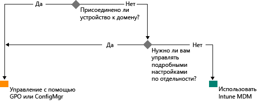

# Реализация современного управления Windows с помощью Microsoft Intune

Использование личных устройств для работы и наличие сотрудников, работающих вне офиса, меняет подход организаций к управлению устройствами. Тогда как для определенных компонентов инфраструктуры в некоторых организациях может требоваться глубокий и точный контроль над устройствами, в других организациях реализуется более простое, ориентированное на ситуации управление, соответствующее задачам современного предприятия.

Windows 10 продолжает многолетние традиции операционных систем Windows для предприятий, реализуя эффективные возможности управления. В Windows точное управление и безопасность обеспечиваются благодаря таким технологиям, как групповая политика, Active Directory и System Center Configuration Manager. Кроме того, в этой ОС реализован упрощенный современный подход к управлению, ориентированный на мобильные и облачные решения, который включает такие технологии для управления устройствами в облаке, как Microsoft Enterprise Mobility Suite (EMS). Будущие инновации в Windows, предоставляемые по принципу "Windows как служба", дополнены быстро развивающимися облачными службами, такими как Microsoft Intune, Azure Active Directory, служба управления правами Azure, Office 365 и Магазин Windows для бизнеса.

ИТ-организации получают дополнительную гибкость, реализуя преимущества, связанные с инновациями и снижением затрат. В этом документе приводятся рекомендации по стратегиям развертывания и управления Windows 10. Он также включает обзор стратегического подхода корпорации Майкрософт к инструментам управления устройствами. Рассматривая основы управления и способы его реализации для различных устройств, необходимо учесть следующие четыре этапа жизненного цикла устройства.

## Развертывание и подготовка.

В отличие от традиционного развертывания операционной системы, требующего сложных ИТ-операций, современный подход к управлению устройствами предполагает такой принцип, как "готовое управление". ИТ-специалистам требуется возможность легко преобразовывать новые устройства в полностью настроенные, полностью управляемые устройства без повторного создания образа.  Динамическая подготовка стала гораздо проще благодаря реализации с помощью облачных служб управления устройствами, таких как Microsoft Intune. Вы также можете создать автономные пакеты подготовки с помощью конструктора образов и конфигураций Windows (ICD). Разумеется, мы по-прежнему поддерживаем традиционные методы создания образов, поэтому организации могут развертывать пользовательские образы с помощью System Center Configuration Manager.

## Проверка подлинности и идентификация

Windows 10 и такие службы, как Azure Active Directory, открывают новые возможности для идентификации, проверки подлинности и управления в облаке. Такие сценарии, как BYOD и CYOD, позволяют предприятиям пересмотреть способы получения пользователями доступа к корпоративным ресурсам и приложениям. Управление пользователями и устройствами можно разделить на следующие две категории:

- корпоративные (CYOD) или личные устройства (BYOD), используемые мобильными пользователями для работы с SaaS-приложениями, такими как Office 365.

  Windows 10 позволяет сотрудникам самостоятельно подготавливать устройства к работе. Благодаря присоединению к Azure AD для корпоративных устройств можно легко настроить корпоративный уровень доступа. Аналогично, новая упрощенная среда настройки BYOD позволяет пользователям добавить свою рабочую учетную запись в Windows и получать доступ к рабочим ресурсам на личных устройствах. Сочетание присоединения к Azure AD и автоматической регистрации Intune MDM позволяет перевести устройства в состояние корпоративного управления в рамках [одной простой процедуры](https://blogs.technet.microsoft.com/ad/2015/08/14/windows-10-azure-ad-and-microsoft-intune-automatic-mdm-enrollment-powered-by-the-cloud/), исключительно в облачной среде. Присоединение к Azure AD также является оптимальным решением для временных сотрудников, партнеров или других сотрудников с неполным рабочим днем. Такие учетные записи можно развертывать отдельно от локального домена AD, и тем не менее они смогут получать доступ к нужным корпоративным ресурсам.
- Присоединенные к домену компьютеры и планшеты, использующие традиционные приложения и ресурсы, которые требуют проверки подлинности или получают доступ к конфиденциальным или классифицированным ресурсам в локальной среде

  Устройства Windows 10, присоединенные к локальному домену Active Directory, будут автоматически регистрироваться в Azure AD, поэтому пользователи смогут получать дополнительные преимущества среды Windows 10, такие как единый вход для повсеместного доступа к облачным и локальным ресурсам, роуминг параметров в среде предприятия, Microsoft Passport for Work и Windows Hello. Присоединенными к домену компьютерами и планшетами следует по-прежнему управлять с помощью клиента System Center Configuration Manager или групповой политики.

Проведите обзор ролей, используемых в организации. Определите пользователей или устройства, для которых требуется присоединение к домену: прочие компоненты среды можно перевести в Azure AD. Дополнительные сведения о том, как Windows 10 и Azure AD оптимизируют доступ к рабочим ресурсам при использовании разнообразных устройств и сценариев, см. в [этой статье](https://azure.microsoft.com/en-us/documentation/articles/active-directory-azureadjoin-windows10-devices/).

Вот как может выглядеть обобщенное дерево принятия решений. Естественно, в некоторых случаях возможны исключения.

## Параметры и конфигурации

Требования к конфигурации определяются необходимым уровнем управления, управляемыми устройствами и данными, а также требованиями отрасли. В то же время сотрудники часто озабочены тем, что ИТ-отделы применяют строгие политики к их личным устройствам, тем не менее они хотят получать доступ к корпоративной электронной почте и документам. Windows 10 предоставляет согласованный набор конфигураций для компьютеров, планшетов и телефонов в рамках общего уровня MDM. Подход MDM подразумевает конфигурацию, обеспечивающую цели администратора без настройки каждого из всех возможных параметров. С другой стороны, групповая политика предоставляет детальные параметры, настраиваемые администратором по отдельности. Одно из преимуществ MDM заключается в том, что это решение позволяет администраторам применять более широкие настройки конфиденциальности, безопасности и управления приложениями с помощью более простых и эффективных средств. Это делает MDM оптимальным выбором для устройств, которые постоянно используются для мобильной работы.

Многим организациям по-прежнему требуется управлять присоединенными к домену компьютерами на детальном уровне, например с помощью 1500 настраиваемых параметров групповой политики Internet Explorer или крайне специализированных правил брандмауэра Windows. Для таких организаций оптимальными решениями управления остаются групповая политика и System Center Configuration Manager. Групповая политика — это лучший способ точной настройки присоединенных к домену компьютеров и планшетов Windows, подключенных к корпоративной сети с помощью инструментов Windows. Корпорация Майкрософт продолжает добавлять новые параметры групповой политики в каждую новую версию Windows. Для точной настройки с надежным развертыванием программного обеспечения, обновлений Windows и операционной системы мы по-прежнему рекомендуем такое решение, как Configuration Manager.

## Обновление устройств Windows

В рамках подхода "Windows как служба" ИТ-отделам больше не требуется выполнять сложные процедуры создания образов (очистку и загрузку) при выпуске каждой новой версии Windows. В рамках вариантов обслуживания Current Branch (CB) и Current Branch For Business (CBB) устройства получают последние обновления компонентов и качества через простые (и зачастую автоматические) процедуры применения исправлений. MDM с Intune предоставляют средства для установки обновлений Windows на клиентских компьютерах организации. Configuration Manager включает широкие возможности управления этими обновлениями и их отслеживания, в том числе правила автоматического развертывания и периоды обслуживания.

## Сводка

Рассматривая вопрос о реализации современного управления устройствами в своей организации, прежде всего необходимо понять, с чего же начать этот путь.

1. **Есть инвестиции, которые можно сделать уже сегодня.** Какие компоненты традиционного управления устройствами необходимо сохранить, а какие можно модернизировать? Касается ли это сведения к минимуму усилий по созданию пользовательских образов, переоценки системы управления параметрами или реализации проверки подлинности и соответствия, преимущества можно получить немедленно.

2. **Оцените различные варианты использования в вашей среде.** Есть ли в среде группы устройств, которые выиграют от реализации упрощенного управления? Например, для устройств BYOD переход на облачное управление будет самым закономерным решением. Для проверки подлинности пользователей или устройств, обрабатывающих данные, к которым применяется более жесткое регулирование, может потребоваться развертывание локального домена AD. Configuration Manager и EMS обеспечивают гибкость поэтапного развертывания сценариев современного управления разными устройствами тем способом, который оптимально соответствует вашим потребностям. Выбор остается за вами.

## Дальнейшие действия

- **Оцените потребности управления в вашей среде.** Стандартное решение может не обеспечивать все ваши потребности, связанные с сотрудниками, их мобильностью, устройствами и данными, к которым они получают доступ.
- **Ориентируйтесь на потребности.** Windows 10, Configuration Manager и Enterprise Mobility Suite обеспечивают достаточную гибкость в выборе средств управления, работы с образами, проверки подлинности и настройки параметров для любых ситуаций.
- **Реализуйте изменения поэтапно.** Переход к современному управлению устройствами не требует масштабного и одномоментного преобразования.
- **Оптимизируйте имеющиеся инвестиции.** На пути от традиционного локального управления к современному управлению на основе облака вы можете воспользоваться преимуществами гибкой гибридной архитектуры Configuration Manager и Intune. По мере реализации новых возможностей в модели MDM и облачной идентификации корпорация Майкрософт приложит все усилия, чтобы предоставить вам четкий путь перехода от традиционного к современному управлению.

<!--HONumber=Sep16_HO2-->

