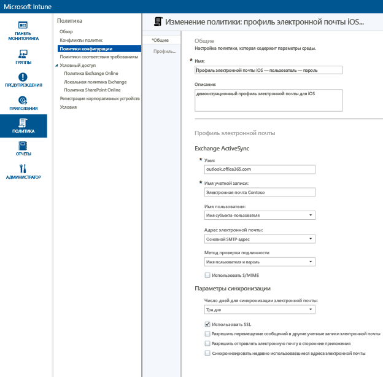
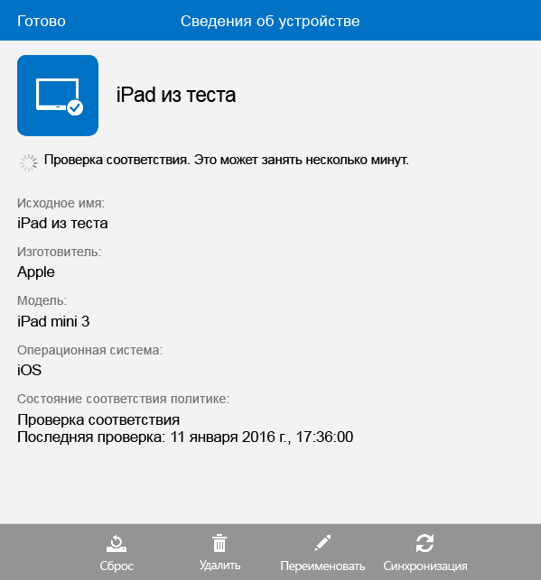

# Настройка доступа к электронной почте для устройств iOS с помощью Microsoft Intune
При регистрации устройств в Intune их можно настроить так, чтобы пользователи могли получить доступ к электронной почте компании. Один из способов такой настройки для определенных типов устройств заключается в создании и развертывании **профиля электронной почты**. Профили электронной почты — это своего рода политика Intune, которая настраивает устройство и подключает его к службе электронной почты компании.
Использование такого профиля автоматизирует доступ к электронной почте для зарегистрированных устройств, устраняя потребность в ручной настройке. Кроме того, профиль электронной почты гарантирует, что для разных пользователей доступ настраивается единообразно и с одинаковыми основными параметрами.

## Цели этого пошагового руководства

- Создание и развертывание профиля электронной почты для устройств iOS
- Проверка успешного применения политики профиля электронной почты

## Необходимые условия для работы с этим пошаговым руководством

- Exchange Server — локальный или размещенный в Azure в рамках подписки Office/E3.
- Имя узла для сервера Exchange вашей компании. Это полное доменное имя (FQDN), например **contosodemo55.onmicrosoft.com**.
- Группа пользователей, для которой нужно развернуть профиль электронной почты. Если вы выполнили пошаговое руководство [Запуск пробной версии Microsoft Intune и развертывание политики iOS в отношении ПИН-кодов](start-a-microsoft-intune-trial-and-deploy-ios-pin-policy.md), то можете использовать созданную при этом группу пользователей **GroupDemo**.
- Зарегистрированные устройства iOS, на которых требуется развернуть профиль. Опять же, если вы выполнили пошаговое руководство [Запуск пробной версии Microsoft Intune и развертывание политики iOS в отношении ПИН-кодов](start-a-microsoft-intune-trial-and-deploy-ios-pin-policy.md), то уже зарегистрировали несколько устройств iOS.

## Шаги по созданию и развертыванию профиля электронной почты для устройств iOS

В этом пошаговом руководстве мы используем размещенный сервер Exchange, входящий в пробную подписку.
1. В консоли Intune щелкните **Политика**, а затем нажмите кнопку **Добавить политику**.

2. В диалоговом окне **Создать новую политику** разверните узел **iOS**, выберите **Профиль электронной почты** и нажмите кнопку **Создать политику**.

3. На странице создания политики введите имя для политики, например **Профиль электронной почты iOS — пользователь/пароль**, и описание. Может потребоваться несколько профилей электронной почты для различных типов устройств и методов проверки подлинности, поэтому имя может иметь описательный характер.
4. Введите имя узла Exchange. Так как используется сервер Exchange, размещенный в Azure, в качестве имени узла вводится: **outlook.office365.com**

5. Введите имя учетной записи, которое будет отображаться пользователям устройства, чтобы упростить идентификацию службы электронной почты. Например, **Contoso Email**.
6. Так как мы используем имя пользователя и пароль в целях проверки подлинности пользователя для службы Exchange, просто оставьте параметры имени пользователя и пароля без изменений.
7. Настройте параметры синхронизации нужным образом. Если потребность в изменении конкретных параметров отсутствует, просто используйте значения по умолчанию.  
8. Нажмите кнопку **Сохранить политику**.
9. Отображается диалоговое окно с запросом на развертывание политики. Нажмите кнопку **Да**.

10. В появившемся окне выберите группу пользователей, для которой требуется развернуть профиль электронной почты, нажмите кнопку **Добавить**, а затем кнопку **ОК**.
 Через одну-две минуты после нажатия кнопки **ОК** начинается распространение политики на устройства.

## Шаги по проверке успешного применения профиля

Чтобы убедиться, что профиль был применен, потребуется доступ к одному из устройств, на которых он был развернут.
1. На устройстве iOS откройте приложение "Почта".
Приложение выводит запрос имени пользователя и пароля для электронной почты.

2. Введите имя пользователя и пароль для учетной записи электронной почты Exchange, а затем нажмите кнопку **ОК**.
 Открывается приложение "Почта" с учетной записью Exchange, и начинается синхронизация электронной почты на устройстве.

3. Проверьте параметры учетной записи приложение "Почта", чтобы убедиться, что имя учетной записи совпадает с введенным в профиле электронной почты (например, **Contoso Mail**), а параметры синхронизации заданы правильно.

 Если профиль электронной почты не был применен к устройству автоматически, можно вручную применить политику с помощью приложения корпоративного портала на устройстве.
1. Откройте приложение корпоративного портала.
2. Выберите **Мои устройства**.
3. Выберите имя устройства.

4. Выберите **Синхронизация** > **Проверка соответствия**.
 Через несколько секунд на устройстве применяется профиль электронной почты. После этого необходимо выполнить шаги проверки, чтобы убедиться в правильности применения профиля.

## См. также
[Руководство по оценке Intune](get-started-with-a-30-day-trial-of-microsoft-intune.md)

<!--HONumber=Jun16_HO4-->

