---
# required metadata

title: Запуск пробной версии Microsoft Intune и развертывание политики iOS в отношении ПИН-кодов | Microsoft Intune
description:
keywords:
author: Staciebarker
manager: jeffgilb
ms.date: 04/28/2016
ms.topic: article
ms.prod:
ms.service: microsoft-intune
ms.technology:
ms.assetid: 06cb9a73-0f17-44b3-b334-86c98020316e

# optional metadata

#ROBOTS:
#audience:
#ms.devlang:
ms.reviewer: jeffgilb
ms.suite: ems
#ms.tgt_pltfrm:
#ms.custom:

---

# Запуск пробной версии Microsoft Intune и развертывание политики iOS в отношении ПИН-кодов
Эти пошаговые инструкции помогут установить пробную версию Intune и настроить политики в отношении ПИН-кодов для устройств iOS. Список стандартных задач оценки Intune см. в статье [Общие задачи оценки Microsoft Intune](common-microsoft-intune-evaluation-tasks.md).

## Обзор предварительных требований для задачи

-   Компьютер Windows с Internet Explorer — для выполнения административных задач

-   Устройство iOS 7.1 или более поздней версии для проверки политики пользователей

-   Телефон для проверки подлинности при регистрации в пробной версии

## Создание бесплатной пробной учетной записи Intune
> Если у вас уже есть подписка Intune, перейдите к следующему разделу.

1.  На ПК Windows щелкните правой кнопкой мыши **Internet Explorer** (IE) и выберите пункт **Просмотр InPrivate**.

    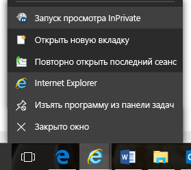

2.  Перейдите на [портал регистрации Intune](https://portal.office.com/Signup/Signup.aspx?OfferId=40BE278A-DFD1-470a-9EF7-9F2596EA7FF9&dl=INTUNE_A&ali=1), введите необходимые данные и нажмите кнопку **Далее**.

    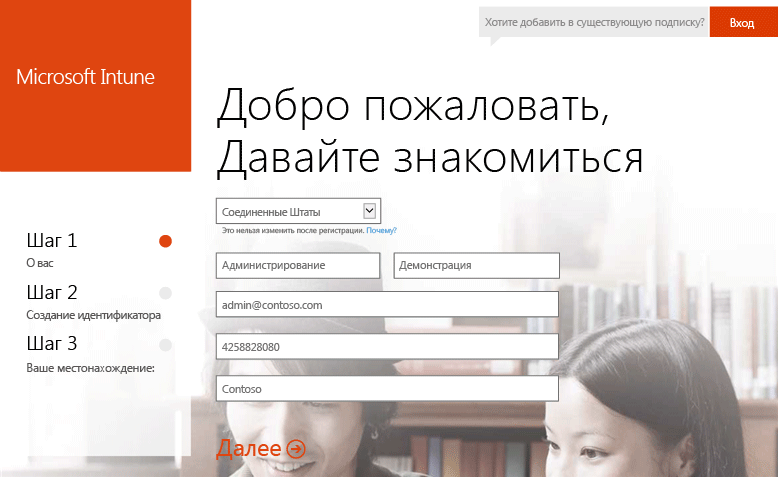

3.  Введите идентификатор пользователя и пароль для учетной записи администратора и нажмите кнопку **Далее**. Этот идентификатор будет использоваться при входе на портал Intune для выполнения задач администрирования.

    

4.  Введите свой номер мобильного телефона и нажмите кнопку **Отправить мне SMS**, чтобы проверить его.

    

5.  Сохраните отображаемые на экране сведения и щелкните элемент **You're ready to go...** (Все готово).

    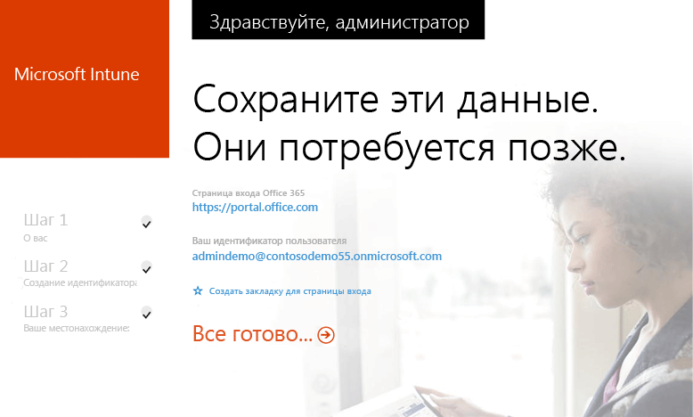

## Создание тестового пользователя

1.  На ПК Windows нажмите кнопку **Пуск**, чтобы перейти на страницу управления пользователями.

    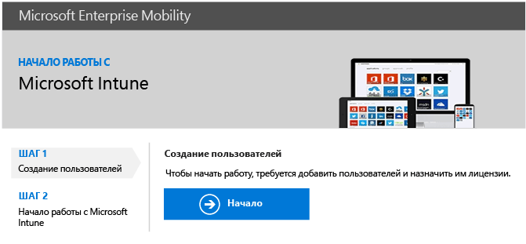

2.  Нажмите кнопку **+**, чтобы добавить пользователя.

    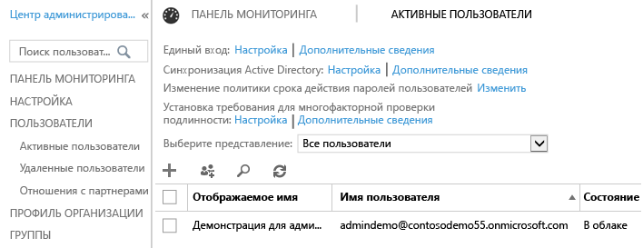

3.  На странице **Create new user account** (Создание новой учетной записи пользователя) выполните следующие действия.

    1.  Укажите сведения о тестовом пользователе.

    2.  Выберите параметр **Пароль**.

    3.  Снимите флажок **Make this person change their password the next time they sign in** (Потребовать смену пароля у пользователя при следующем входе).

    4.  Нажмите кнопку **Создать**.

    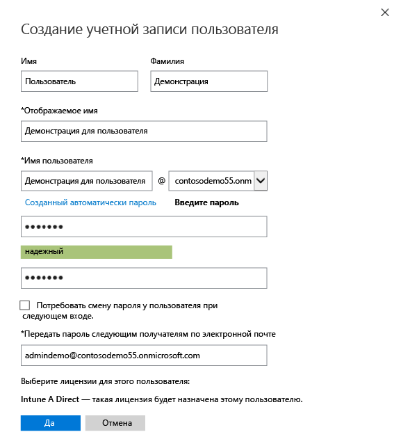

4.  На странице подтверждения создания пользователя нажмите кнопку **Закрыть**.

    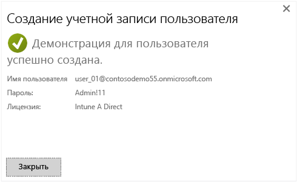

5.  Нажмите кнопку **Обновить**, чтобы просмотреть созданного тестового пользователя.

    

## Настройка политики iOS в отношении ПИН-кодов для тестового пользователя

1.  На ПК Windows установите Intune в качестве центра управления мобильными устройствами:

    1.  Перейдите в [консоль управления Intune](http://manage.microsoft.com/), войдите с помощью учетной записи администратора и щелкните элемент **Запуск управления мобильными устройствами**. Открывается страница центра управления мобильными устройствами.

        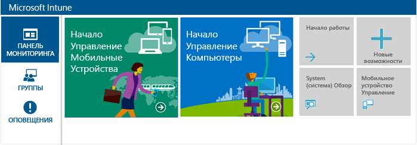

    2.  Щелкните ссылку **Задать центр управления мобильными устройствами**.

        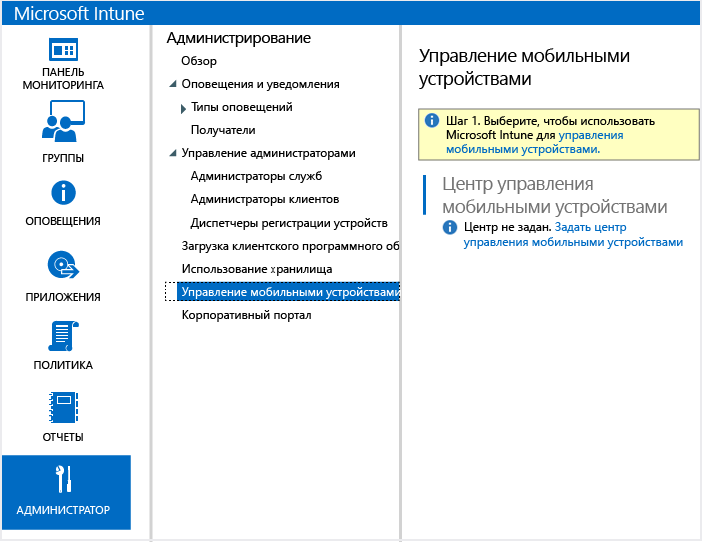

2.  Включите возможность регистрации для устройств iOS. При этом настраивается доверенный сертификат, действующий между службой push-уведомлений Apple (APNs) и вашей подпиской Intune.

    1.  Щелкните элемент **Включить платформу iOS и Mac OS X**.

        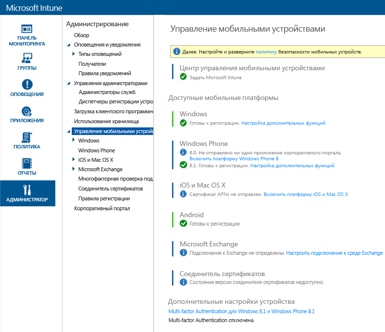

    2.  Щелкните **Загрузить запрос сертификата APNs**.

        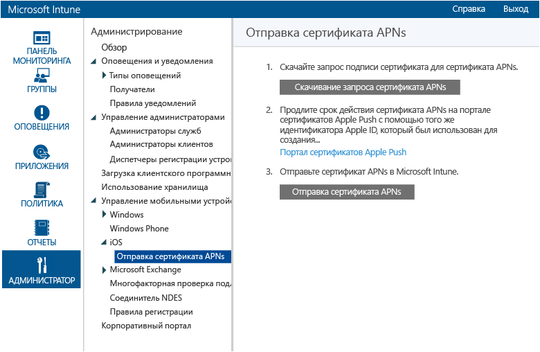

    3.  Укажите имя и расположение файла для запроса подписи сертификата (CSR) и нажмите кнопку **Сохранить**. Этот файл содержит открытый ключ, который соответствует закрытому ключу в вашей подписке Intune.

        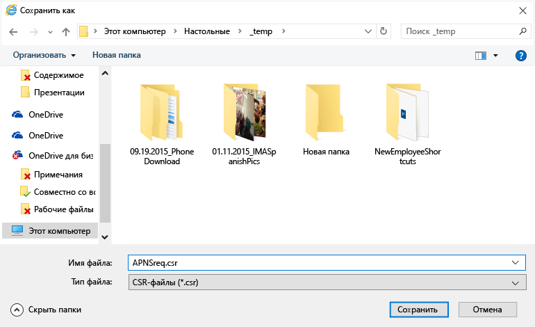

    4.  Щелкните **Портал сертификатов Apple Push**, чтобы открыть новую вкладку.

        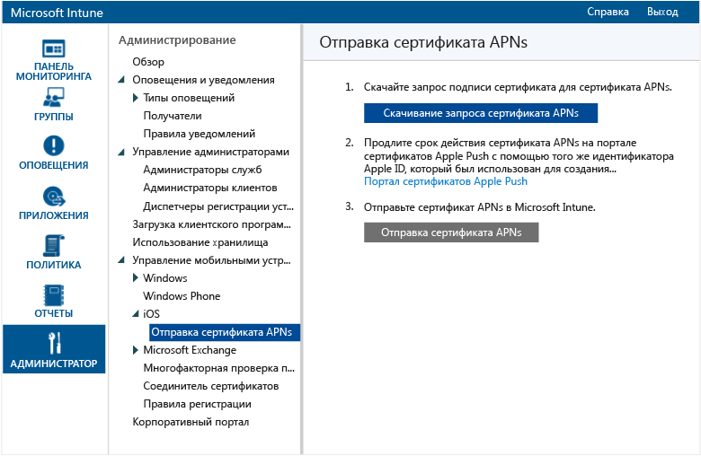

    5.  Введите идентификатор Apple ID и пароль и щелкните **Войти**. Это может быть тот же идентификатор, который используется для получения приложений в магазине iOS App Store.

        

    6.  Щелкните **Создать сертификат**.

        

    7.  Прочитайте условия использования Apple, установите флажок и нажмите кнопку **Принимаю**.

        

    8.  Нажмите кнопку **Обзор**.

        

    9. Выберите сохраненный ранее CSR-файл и нажмите кнопку **Открыть**.

        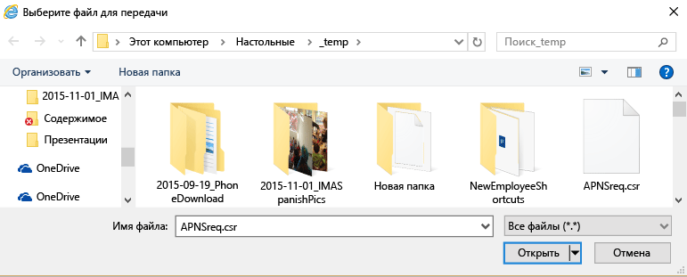

    10. Нажмите кнопку **Отправить**.

        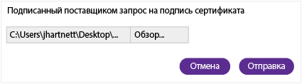

    11. При отображении запроса на скачивание JSON-файла нажмите кнопку **Сохранить как**.

        

    12. Укажите расположение для JSON-файла и нажмите кнопку **Сохранить**.

        

        Если через несколько секунд на странице не выполняется автоматическое перенаправление, нажмите кнопку **Отмена**.

        

    13. Чтобы получить созданный файл сертификата, нажмите кнопку **Скачать**.

        

    14. При отображении запроса на скачивание PEM-файла нажмите кнопку **Сохранить как**.

        

    15. Укажите расположение PEM-файла и нажмите кнопку **Сохранить**.

        

    16. Вернитесь на вкладку консоли управления Intune и нажмите щелкните **Отправить сертификат APNs**.

        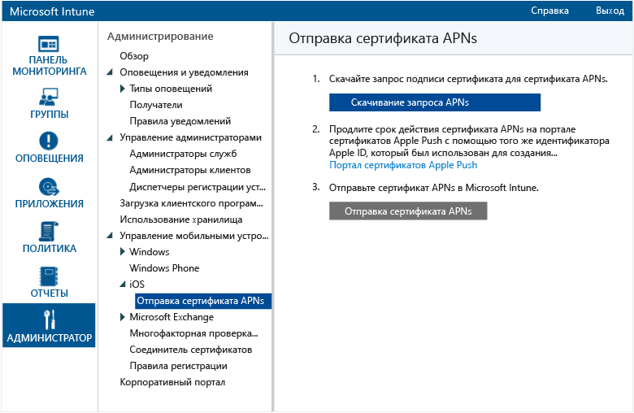

    17. Введите свой идентификатор Apple ID и нажмите кнопку **Обзор**.

        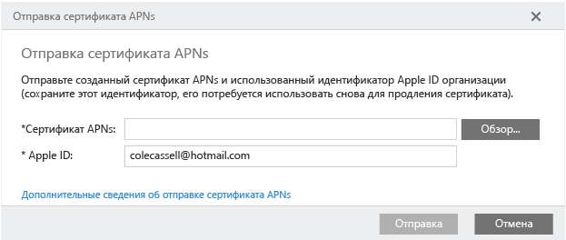

    18. Выберите сохраненный PEM-файл и нажмите кнопку **Открыть**.

        

    19. Нажмите кнопку **Отправить**.

        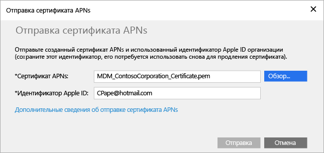

        Теперь сертификат APNs настроен.

        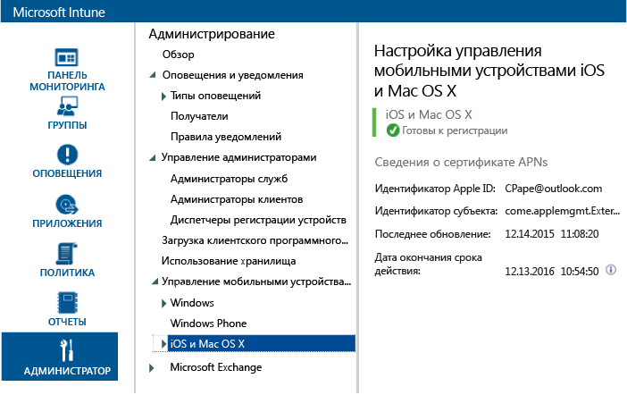

3.  Создайте тестовую группу пользователей для нацеливания политик:

    1.  На левой панели щелкните **Группы**.

        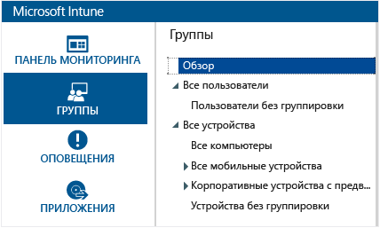

    2.  Щелкните элемент **Создать группу**, расположенный у правого края.

        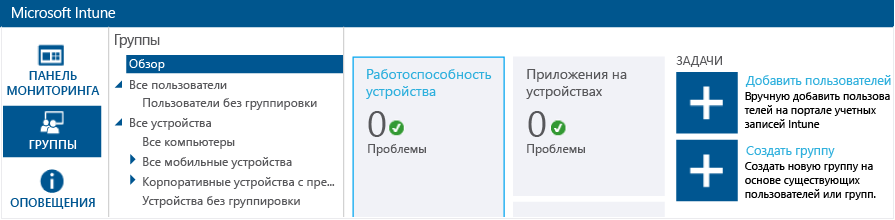

    3.  Введите имя группы, выберите **Все пользователи** в качестве родительской группы и нажмите кнопку **Далее**.

        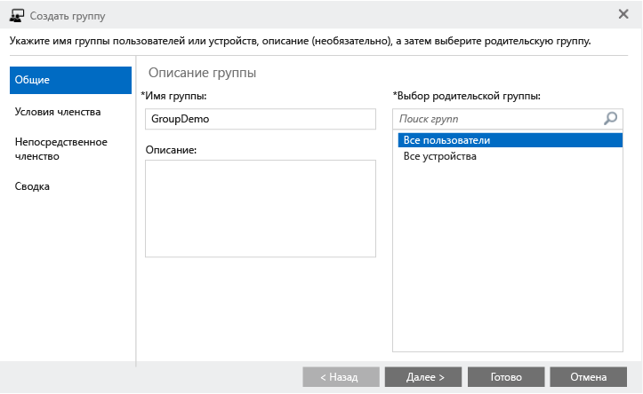

    4.  В поле **Начать членство в группе с** выберите **Все пользователи в родительской группе** и нажмите кнопку **Готово**.

        

4.  Создайте политику iOS в отношении ПИН-кодов и нацельте ее тестовую группу пользователей:

    1.  На левой панели щелкните **Политика**.

        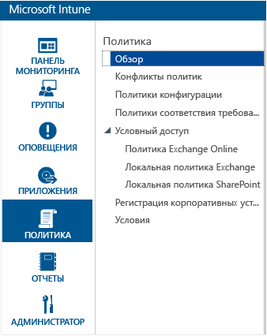

    2.  Щелкните элемент **Добавить политику**, расположенный у правого края.

        

    3.  Разверните узел iOS, выберите строку **Общая конфигурация** и нажмите кнопку **Создать политику**.

        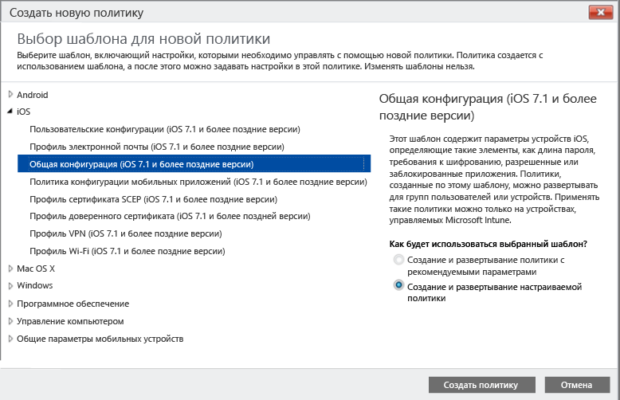

    4.  Введите имя для политики, включите параметр **Запрашивать пароль для разблокировки мобильных устройств** и задайте для параметра **Минимальная длина пароля** значение **4**.

        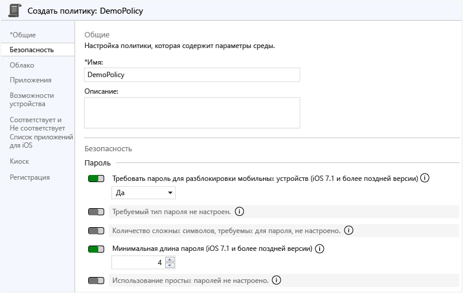

    5.  Нажмите кнопку **Да**, чтобы развернуть политику.

        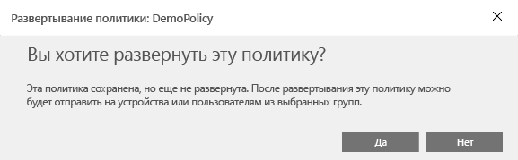

    6.  Выберите ранее созданную группу пользователей, щелкните **Добавить** и нажмите кнопку **ОК**.

        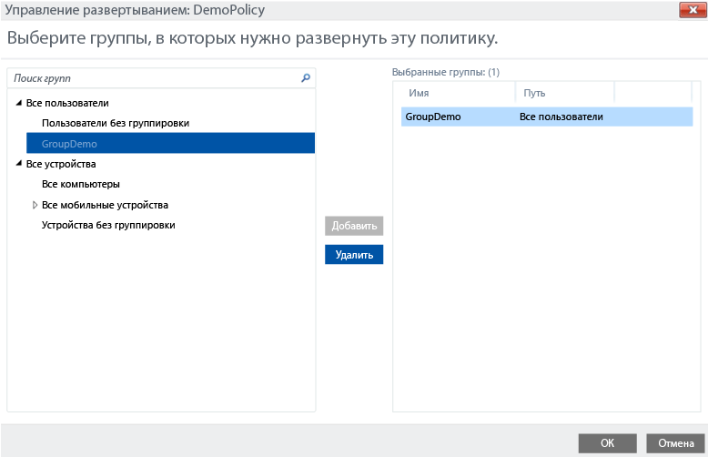

        Теперь у вас есть политика iOS в отношении ПИН-кодов, нацеленная на тестовую группу пользователей.

        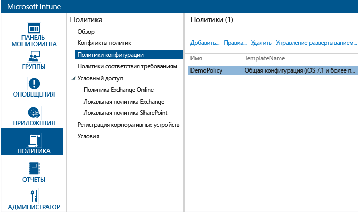

## Проверка применения политики на устройстве iOS

1.  На iPad запустите магазин iOS App Store, установите бесплатное приложение **корпоративного портала Microsoft** и откройте его.

    

2.  Введите имя и пароль учетной записи тестового пользователя, а затем нажмите кнопку **Войти**.

    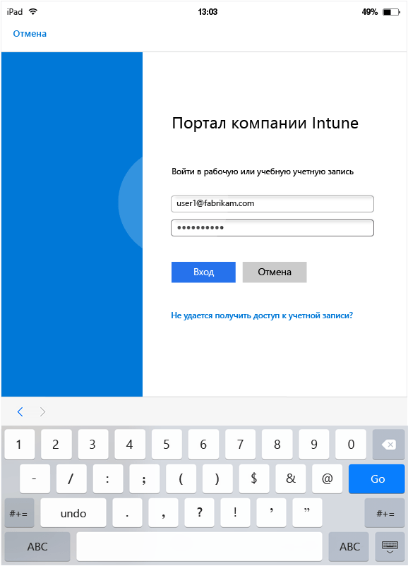

3.  Коснитесь элемента **Зарегистрировать**, чтобы запустить регистрацию устройства в Intune.

    

4.  На экране **Установить профиль** щелкните элемент **Установить**.

    

5.  В диалоговом окне **Установить профиль** щелкните элемент **Установить**.

    

6.  На экране **Предупреждение** щелкните элемент **Установить**.

    

7.  В диалоговом окне **Удаленное управление** коснитесь элемента **Доверие**.

    

8.  После окончания установки профиля управления коснитесь элемента **Готово**. Регистрация завершена.

    

9. Нажмите кнопку **ОК** и закройте приложение корпоративного портала.

    

10. Когда вам будет предложено настроить секретный код, коснитесь элемента **Продолжить**.

    

11. Введите секретный код, коснитесь элемента **Продолжить**, введите код еще раз и нажмите кнопку **Сохранить**.

    

12. Нажмите кнопку питания, чтобы заблокировать iPad, проведите пальцем для его разблокировки и убедитесь, что выводится запрос на ввод секретного кода.

### См. также
[Руководство по оценке Intune](get-started-with-a-30-day-trial-of-microsoft-intune.md)

<!--HONumber=May16_HO2-->

