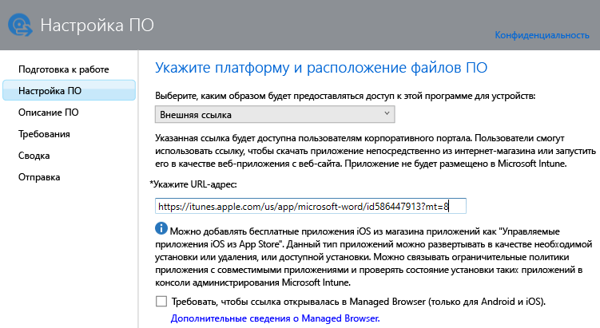
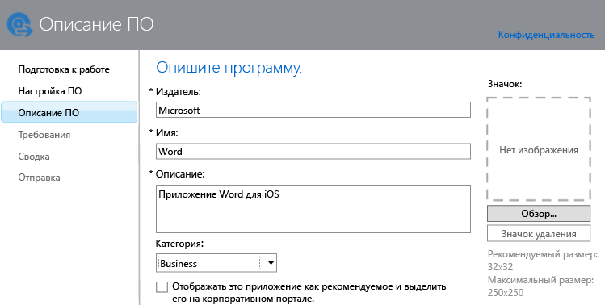

# Добавление приложений для зарегистрированных устройств в Intune

[!INCLUDE[classic-portal](../includes/classic-portal.md)]

Перед развертыванием приложения и управлением им его необходимо добавить в Microsoft Intune. В этом разделе показано, как добавить приложения для зарегистрированных устройств.

> [!IMPORTANT]
> Сведения в этом разделе помогут добавить приложения, которые вы хотите развернуть на зарегистрированных устройствах и компьютерах с ОС Windows. Если вы хотите добавить приложения на компьютеры Windows, которыми вы управляете с помощью клиентского программного обеспечения Intune, см. раздел [Добавление приложений для компьютеров с ОС Windows в Microsoft Intune](add-apps-for-windows-pcs-in-microsoft-intune.md).

## Добавление приложения
Здесь используется издатель ПО Intune для настройки свойств приложения и (где применимо) его отправки в облачное хранилище. Воспользуйтесь следующей процедурой.

1.  В [консоли администрирования Microsoft Intune](https://manage.microsoft.com) последовательно выберите **Приложения** &gt; **Добавить приложения**, чтобы запустить издатель ПО Intune.

    > [!TIP]
    > Перед запуском издателя может потребоваться ввести имя пользователя и пароль Intune.

2.  На странице **Установка ПО** издателя в разделе **Выберите, каким образом будет предоставляться доступ к этой программе для устройств** выберите один из указанных ниже вариантов.
    - **Установщик программ** — для приложений с расширением **MSI** выполните указанные ниже действия.
        - **Выберите тип файла установщика программ**. Указывает тип программного обеспечения, которое необходимо развернуть. Например, если нужно установить приложение iOS, выберите **Пакет приложения для iOS (IPA-файл)**.
        - **Укажите расположение файлов установки ПО**. Введите расположение файлов установки или нажмите кнопку **Обзор**, чтобы выбрать расположение из списка.
        - **Добавлять дополнительные файлы и вложенные папки из одной и той же папки**. Этот параметр доступен только для типа файла **установщика Windows**. Для некоторых программ, использующих установщик Windows, требуются вспомогательные файлы, которые обычно находятся в одной папке с файлами установки. Выберите этот параметр, если помимо прочего требуется развернуть эти файлы. Этот тип установки использует определенное пространство в облачном хранилище.

  -   **Внешняя ссылка** — для приложений, которые вы хотите создать, задав ссылку на хранилище приложений.

        - **Укажите URL-адрес**. Укажите один из следующих URL-адресов:
            - URL-адрес хранилища приложений для приложения, которое требуется развернуть. Например, если требуется развернуть приложение удаленного рабочего стола Microsoft для Android, укажите **https://play.google.com/store/apps/details?id=com.microsoft.rdc.android**. Чтобы найти URL-адрес приложения, используйте поисковую систему для поиска страницы хранилища, содержащей приложение. Например, чтобы найти приложение удаленного рабочего стола, выполните поиск по запросу **Удаленный рабочий стол Microsoft Android**.
            - Веб-сайт. Intune развернет на устройстве ярлык, ссылающийся на сайт (так называемый веб-клип).
            - URL-адрес приложения в Интернете. Intune развернет на устройстве ярлык, ссылающийся на приложение.
        - **Требовать, чтобы ссылка открывалась в Managed Browser (только для Android и iOS)**. При развертывании ссылки на веб-сайт или веб-приложение для пользователей они смогут открыть ее только в управляемом браузере Intune. Такой браузер должен быть установлен на устройстве. Дополнительные сведения об управляемом браузере см. в разделе [Управление доступом в Интернет с помощью политик управляемого браузера в Microsoft Intune](manage-internet-access-using-managed-browser-policies.md). Этот тип установки не использует пространство в облачном хранилище.

  -   **Управляемое приложение iOS из магазина App Store** — для бесплатных приложений из магазина iTunes, которыми вы хотите управлять с помощью политик управления мобильными приложениями (MAM).

        - **Укажите URL-адрес**. Введите URL-адрес хранилища приложений для приложения, которое требуется развернуть. Например, если вы хотите развернуть приложение Microsoft Work Folders для iOS, укажите **https://itunes.apple.com/us/app/work-folders/id950878067?mt=8**. Этот тип установки не использует пространство в облачном хранилище.

        Например, если вы хотите развернуть на устройствах приложение Microsoft Word из магазина iTunes, страница будет выглядеть следующим образом:

        

> [!NOTE]
> Чтобы конечные пользователи могли установить приложение, которое вы добавили в магазин и развернули, у них должна быть учетная запись для магазина.

3.  На странице **Описание программного обеспечения** настройте следующие параметры.

    > [!TIP]
    > В зависимости от используемого типа установщика некоторые из этих значений могут быть введены автоматически.

    - **Издатель**. Введите имя издателя приложения.
    - **Имя**. Введите имя приложения так, как оно будет отображаться на корпоративном портале. Убедитесь, что все имена приложений являются уникальными. Если имя приложения существует два раза, пользователи корпоративного портала увидят только одно из приложений.
    - **Описание**. Введите описание приложения. Оно будет отображаться для пользователей на корпоративном портале.
    - **URL-адрес страницы сведений о ПО**. Этот параметр доступен только в том случае, если выбран **Установщик программ**. Дополнительно можно ввести URL-адрес веб-сайта со сведениями об этом приложении. Этот URL-адрес будет отображаться для пользователей на корпоративном портале.
    - **URL-адрес политики конфиденциальности**. Этот параметр доступен только в том случае, если выбран **Установщик программ**. Дополнительно можно ввести URL-адрес веб-сайта со сведениями о политике конфиденциальности для этого приложения. Этот URL-адрес будет отображаться для пользователей на корпоративном портале.
    - **Категория** (необязательно). Выберите одну из встроенных категорий приложений. Это облегчит поиск приложения при просмотре пользователями корпоративного портала.
    - **Отображать это приложение как рекомендуемое и выделить его на портале организации**. Отображать приложение на видном месте главной страницы корпоративного портала при просмотре приложений пользователями.
    - **Значок** (необязательно). Загрузите значок, который будет связан с приложением. Это значок, который будет отображаться с приложением при просмотре пользователями корпоративного портала.

        В этом примере вы настроили описание приложения Microsoft Word для iOS:

        

4.  На странице **Требования** укажите требования, которые должны быть выполнены перед установкой приложения на устройство. Например, для пакета приложений для iOS можно выбрать минимальную требуемую версию iOS. Дополнительно можно выбрать тип устройства, например iPhone или iPad.

    > [!TIP]
    > Страница **Требования** отображается только для некоторых типов приложений.

5.  Дополнительные страницы мастера отображаются при выборе типа файла **Установщик Windows**. Этот тип файлов используется при развертывании программного обеспечения на компьютеры под управлением Windows 10 или более поздней версии, которые зарегистрированы с помощью Intune.

6.  На странице **Сводка** проверьте указанные сведения. Когда будете готовы, нажмите кнопку **Отправить**.

7.  Чтобы завершить работу мастера, нажмите кнопку **Закрыть**.

Приложение отображается в узле **Приложения** в рабочей области **Приложения**.

## Пример: развертывание приложений MSI на устройствах Windows 10
Из этого четырехминутного видеоролика вы узнаете о том, как развернуть приложения установщика Windows (MSI) на зарегистрированных устройствах под управлением Windows 10.  

<iframe src="https://channel9.msdn.com/Series/How-to-Control-the-Uncontrolled/6--How-to-Deploy-MSI-Applications-to-Windows-10-Using-Intune-and-Mobile-Device-Management-MDM/player" width="640" height="360" allowFullScreen frameBorder="0"></iframe>

## Дальнейшие действия

После создания приложения его необходимо развернуть. Дополнительные сведения см. в статье [Развертывание приложений с помощью Microsoft Intune](deploy-apps.md).

