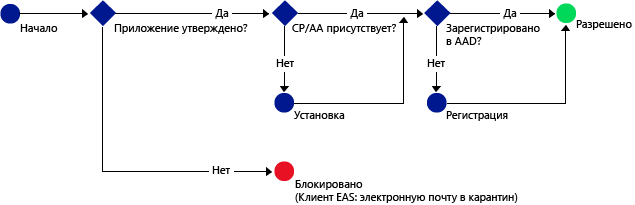

# Предоставление доступа к службам Office 365 только мобильным приложениям, которые поддерживают политики защиты приложений Intune

[!INCLUDE[classic-portal](../includes/classic-portal.md)]

[Политики защиты приложений Intune](protect-apps-and-data-with-microsoft-intune.md) помогают защитить данные компании на устройствах, зарегистрированных для управления в Intune. Политики защиты приложений также можно использовать на **устройствах, принадлежащих сотрудникам, которые не зарегистрированы для управления в Intune**.  В этом случае, даже если контроля над устройством нет, все равно необходимо обеспечить защиту данных и ресурсов компании. Используя условный доступ на основе приложений с MAM, можно создать политику, которая позволяет обращаться к службам Office 365, таким как Exchange Online, только мобильным приложениям, поддерживающим политики защиты приложений Intune.

Например, разрешив обращаться к Exchange Online только **приложению Microsoft Outlook**, можно **блокировать работу встроенных почтовых приложений на iOS и Android**, которые не имеют защиты данных на базе политик Intune MAM при получении сообщений электронной почты из **Exchange Online**.

На следующей схеме показан поток, с помощью которого политики условного доступа на основе приложений определяют, когда нужно разрешать, а когда блокировать доступ: .

Описание сокращений, используемых на схемах:
* **CP**: приложение корпоративного портала
* **AA**: приложение для проверки подлинности Azure
* **AAD**: Azure Active Directory
* **EAS**: Exchange Active Sync

## Необходимые компоненты
**Перед** настройкой политики условного доступа на основе приложений необходимо установить набор **Enterprise Mobility + Security или оформить премиальную подписку Azure Active Directory**, а у пользователей должна быть лицензия на работу с EMS или Azure AD. Дополнительные сведения см. на странице [Цены Enterprise Mobility](https://www.microsoft.com/en-us/cloud-platform/enterprise-mobility-pricing) или [Цены Azure Active Directory](https://azure.microsoft.com/en-us/pricing/details/active-directory/).

## Поддерживаемые приложения
**Exchange Online**: **Microsoft Outlook** для Android и iOS.

Дополнительные сведения о взаимодействии с пользователем в приложении с политиками условного доступа на основе приложений см. в статье [Что произойдет при использовании приложения с MAM CA](use-apps-with-mam-ca.md).

## Дальнейшие действия
[Создание политики Exchange Online для приложений MAM](mam-ca-for-exchange-online.md)

[Блокировка приложений, не поддерживающих современные средства проверки подлинности](block-apps-with-no-modern-authentication.md)

### См. также

[Защита данных приложений с помощью политик защиты приложений](protect-app-data-using-mobile-app-management-policies-with-microsoft-intune.md)

