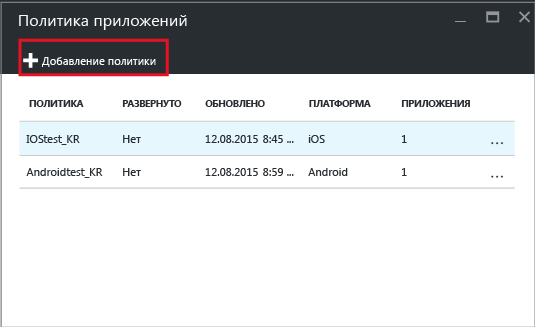
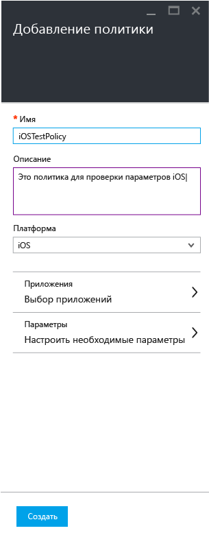
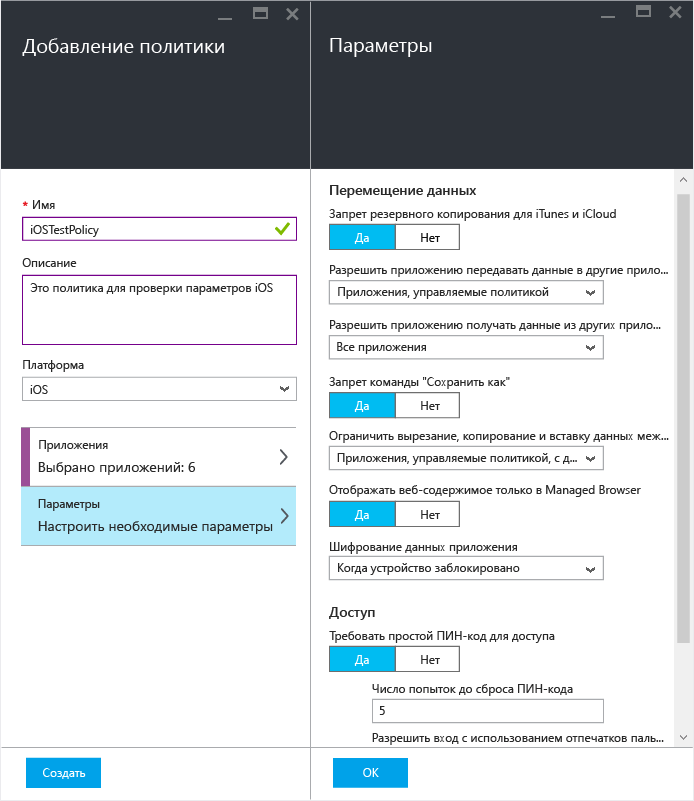
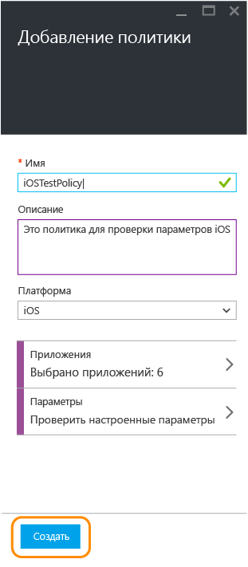
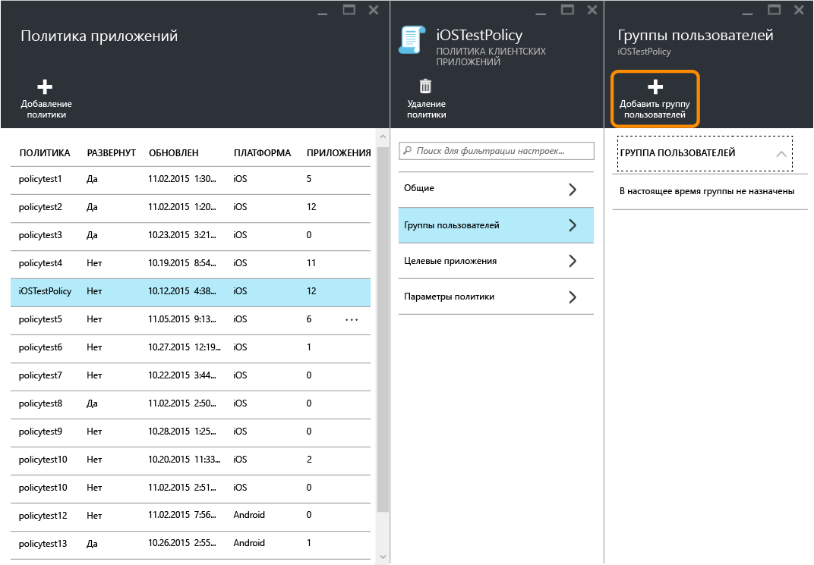
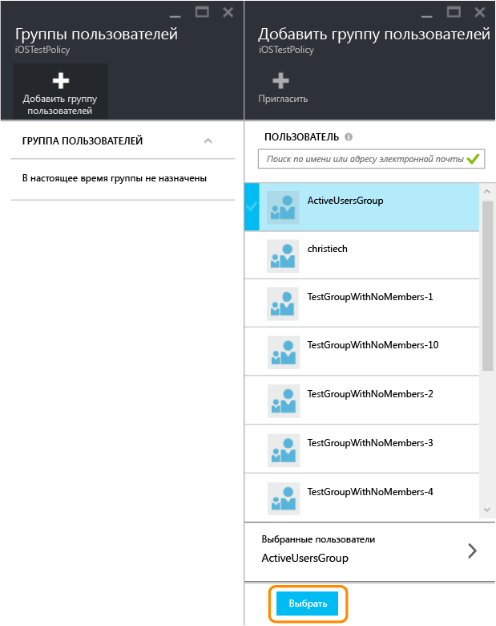
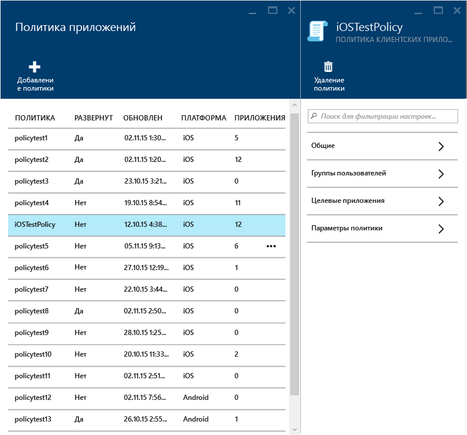
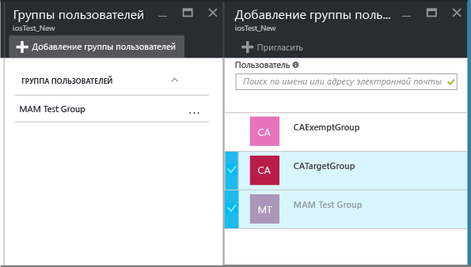
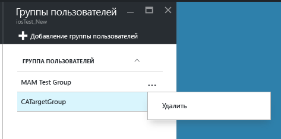
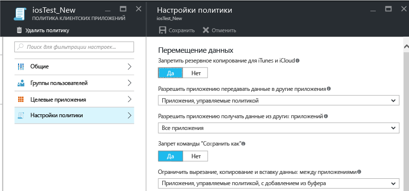

# Создание и развертывание политик защиты приложений с помощью Microsoft Intune

[!INCLUDE[classic-portal](../includes/classic-portal.md)]

В этом разделе описывается процедура создания политики защиты приложений на **портале Azure**. Портал Azure — это новая консоль администрирования, которую рекомендуется использовать для создания политик защиты приложений. Портал Azure поддерживает следующие сценарии MAM:

- устройства, зарегистрированные в Intune;
- устройства под управлением решения MDM стороннего производителя;
- устройства, не находящиеся под управлением какого-либо решения MDM (BYOD).

>[!IMPORTANT]
Учтите приведенные далее аспекты, если вы используете **консоль администрирования Intune** для управления устройствами.

> * Вы можете создать политику защиты приложений, которая поддерживает приложения для устройств, зарегистрированных в Intune с помощью [консоли администрирования Intune](configure-and-deploy-mobile-application-management-policies-in-the-microsoft-intune-console.md).
> * Политики защиты приложений, созданные в консоли администрирования Intune, невозможно импортировать на портал Azure.  Их потребуется создавать на портале Azure заново.

> * В консоли администрирования Intune могут отображаться не все параметры политики защиты приложений. Портал Azure — это новая консоль администрирования для создания политик защиты приложений.

> * Для развертывания управляемых приложений нужно создать политику защиты приложений в консоли администрирования Intune. В этом случае может потребоваться создать политики защиты приложений в консоли администрирования Intune и на портале Azure: в консоли администрирования Intune — для возможности выполнить развертывание управляемых приложений, а на портале Azure — так как он включает новую консоль администрирования со всеми параметрами политик защиты приложений.

> * При создании политик защиты приложений в консоли администрирования Intune и на портале Azure политики, созданные на портале Azure, применяются к приложениям.

Чтобы просмотреть список параметров политики, поддерживаемых для платформ Android и iOS, выберите один из следующих элементов:

> [!div class="op_single_selector"]
- [Политики iOS](ios-mam-policy-settings.md)
- [Политики Android](android-mam-policy-settings.md)

- Подробное описание использования политик защиты приложений и сценариев, поддерживаемых политиками защиты приложения Intune, см. в статье [Защита данных приложений с помощью политик защиты приложений](protect-app-data-using-mobile-app-management-policies-with-microsoft-intune.md).

##  Создание политики защиты приложений
Политики защиты приложений создаются на портале Azure. Если вы пользуетесь порталом Azure впервые, ознакомьтесь со статьей [Портал Azure для политик защиты приложений Microsoft Intune](azure-portal-for-microsoft-intune-mam-policies.md), чтобы подробнее узнать о его возможностях. Перед созданием политики защиты приложений ознакомьтесь с [предварительными требованиями и сведениями о поддержке](get-ready-to-configure-mobile-app-management-policies-with-microsoft-intune.md).

Выполните действия ниже, чтобы создать политики защиты приложений.

1. Перейдите на [портал Azure](http://portal.azure.com) и введите учетные данные.

2. Выберите **Больше служб** и введите "Intune".

3. Выберите пункт **Защита приложений в Intune**.

4. Последовательно выберите пункты **Управление мобильными приложениями Intune &gt; Параметры**, чтобы открыть колонку **Все параметры**.

    

2.  В колонке **Все параметры** щелкните пункт **Политика приложений**. Откроется колонка **Политика приложения**, в которой можно создавать и изменять политики. Выберите **Добавить политику**.

    

3.  Введите имя для политики, добавьте краткое описание и выберите тип платформы, чтобы создать политику для iOS или Android. Для каждой платформы можно создать несколько политик.

    

4.  Щелкните **Приложения**, чтобы открыть колонку **Приложения**, где приводится список доступных приложений. Выберите в списке одно или несколько приложений, которые вы хотите сопоставить с создаваемой политикой. Выбрав приложения, нажмите кнопку **Выбрать** в нижней части колонки **Приложения**, чтобы сохранить выбранные элементы.

    > [!IMPORTANT]
    > Для создания политики необходимо выбрать хотя бы одно приложение.

5.  В колонке **Добавление политики** щелкните **Настроить обязательные параметры**, чтобы открыть колонку параметров политики.

    Существуют две категории параметров политики: **перемещение данных** и **доступ**.  Политики перемещения данных применяются к перемещению данных в приложение и из него, а политики доступа определяют, как конечный пользователь получает доступ к приложениям в рабочем контексте.
    Чтобы вы быстрее могли приступить к работе, параметры политики снабжены значениями по умолчанию. Если значения по умолчанию удовлетворяют вашим требованиям, никаких изменений вносить не нужно.

    > [!TIP]
    > Эти параметры политики применяются только при использовании приложения в рабочем контексте.  Когда конечный пользователь применяет приложение в личных целях, эти политики на него не распространяются.

    

6.  Нажмите кнопку **ОК**, чтобы сохранить конфигурацию. Выполняется возврат к колонке **Add a policy** (Добавить политику). Щелкните **Создать** для создания политики и сохранения параметров.

    

После завершения создания политики, описанного в предыдущей процедуре, политика не развертывается ни для одного из пользователей. Чтобы развернуть политику, см. следующий раздел "Развертывание политики для пользователей".

> [!IMPORTANT]
> Если вы создаете политику защиты приложений для приложения с помощью консоли администрирования Intune и политику защиты приложений с помощью портала Azure, то политика, созданная на портале Azure, будет иметь приоритет. При этом функции ведения отчетов в консоли Intune или Configuration Manager будут выводить параметры политики, созданные в консоли администрирования Intune. Например:
>
> -   Вы создали в консоли администрирования Intune политику защиты приложений, которая запрещает копирование из приложения.
> -   Вы создали в консоли администрирования Intune политику защиты приложений, которая разрешает копирование из приложения.
> -   Вы сопоставили обе эти политики с одним и тем же приложением.
> -   Приоритет имеет политика, созданная из консоли Azure, поэтому копирование разрешено.
> -   Однако функции отображения состояния и отчеты в консоли Intune неверно указывают, что копирование запрещено.

## Бизнес-приложения (необязательно)

Начиная с версии Intune 1703 поддерживается добавление бизнес-приложений в Intune при создании новой политики защиты приложений. Это дает возможность определять политики защиты приложений для бизнес-приложений с помощью пакета SDK для MAM в отсутствие полного набора разрешений для развертывания приложения.

> [!TIP] 
> Бизнес-приложения можно также добавить в Intune при выполнении рабочего процесса [пакета SDK для приложений Intune](https://docs.microsoft.com/intune/develop/intune-app-sdk-get-started).

> [!IMPORTANT]
> Если пользователи имеют только определенные разрешения для развертывания приложений MAM, но не полный набор разрешений развертывания, который позволил бы им развертывать любые приложения в Intune, они не смогут выполнить рабочий процесс пакета SDK для Intune, но, тем не менее, смогут добавлять свои бизнес-приложения в рамках рабочего процесса создания политики защиты приложений MAM.

### Добавление бизнес-приложений (iOS и Android)

1.  В колонке "Добавление политики" выберите "Настройка **приложений**", чтобы открыть колонку приложений.

    

2.  Щелкните **Дополнительные приложения**, затем введите **идентификатор пакета** (для iOS), **идентификатор пакета** (для Android) и щелкните "Выбрать", чтобы добавить бизнес-приложения.

    

### Добавление бизнес-приложений (Windows)

> [!IMPORTANT] 
> При создании новой политики защиты приложения в раскрывающемся списке платформ необходимо выбрать Windows 10.

1.  В колонке "Добавление политики" выберите **Разрешенные приложения** или **Исключенные приложения**, чтобы открыть колонку разрешенных или исключенных приложений.

    > [!NOTE]
    > 
    - **Разрешенные приложения** — это приложения, которые должны соответствовать этой политике.
    - **Исключенные приложения** — эти приложения будут исключены из политики и могут получать доступ к корпоративным данным без ограничений.
  
2. В колонке разрешенных или исключенных приложений щелкните **Добавить приложения**. Можно добавить рекомендуемые приложения Майкрософт, приложения магазина или классические приложения.

    а.  **Рекомендуемые приложения** — предварительно заполненный список приложений (обычно Office), которые администраторы могут легко импортировать в политику.

    b.  **Приложения магазина** — администратор может добавить в политику любое приложение из магазина Windows.

    в.  **Классические приложения Windows** — администратор может добавить в политику любые классические приложения Windows (например, EXE, DLL и т. д.)

## Развертывание политики для пользователей

1.  В колонке **Политика** щелкните **Группы пользователей**, чтобы открыть колонку **Группы пользователей**. Выберите пункт **Добавить группу пользователей** в колонке **Группы пользователей**, чтобы открыть колонку **Добавить группу пользователей**.

    

2.  В колонке **Add user group** (Добавить группу пользователей) отображается список групп пользователей. Этот список включает в себя все группы безопасности в вашем **Azure Active Directory**. Выберите группы пользователей, к которым должна применяться эта политика, а затем нажмите кнопку **Выбрать**. При нажатии кнопки **Выбрать** политика развертывается для пользователей.

    

    Вы создали политику и развернули ее для пользователей.

Эта политика затрагивает только пользователей с назначенными лицензиями [!INCLUDE[wit_nextref](../includes/wit_nextref_md.md)]. Пользователей из выбранной вами группы безопасности, у которых нет назначенной лицензии [!INCLUDE[wit_nextref](../includes/wit_nextref_md.md)], эта политика не затрагивает.

>[!IMPORTANT]
> При использовании Intune с Configuration Manager для управления устройствами iOS и Android политика применяется только к пользователям, находящимся непосредственно в выбранной вами группе. Члены дочерних групп, вложенных в выбранную вами группу, не затрагиваются.

Конечные пользователи могут загрузить приложения из магазина App Store или Google Play. Дополнительные сведения см. на странице
* [Что происходит при управлении приложением Android с помощью политик защиты приложений](user-experience-for-mam-enabled-android-apps-with-microsoft-intune.md)
* [Что происходит при управлении приложением iOS с помощью политик защиты приложений](user-experience-for-mam-enabled-ios-apps-with-microsoft-intune.md)

##  Изменение существующих политик
Вы можете изменить существующую политику и применить ее к целевым пользователям. Однако при изменении существующих политик пользователи, которые уже выполнили вход в приложения, не заметят никаких изменений в течение 8 часов.

Чтобы сразу увидеть эффект изменений, пользователям необходимо выйти из приложений и войти снова.

### Изменение списка приложений, сопоставленных с политикой

1.  В колонке **Политика приложения** выберите политику, которую хотите изменить. Открывается колонка, соответствующая недавно выбранной политике.

    

2.  В колонке политики щелкните **Целевые приложения**, чтобы открыть список приложений.

3.  Удалите или добавьте приложения в списке и щелкните значок **Сохранить** для сохранения изменений.

### Изменение списка групп пользователей

1.  В колонке **Политика приложения** выберите политику, которую хотите изменить. Открывается колонка, соответствующая выбранной политике.

2.  В колонке политики щелкните **Группы пользователей**, чтобы открыть колонку **Группа пользователей**, в которой приводится список текущих групп пользователей с этой политикой.

3.  Чтобы добавить новую группу пользователей в политику, щелкните **Добавить группу пользователей** и выберите группу пользователей. Нажмите кнопку **Выбрать**, чтобы развернуть политику для выбранной группы.

    

4.  Чтобы удалить группу пользователей, выделите ее. Затем нажмите кнопку с многоточием (...) и кнопку **Удалить** для удаления группы.

    

### Изменение параметров политики

1.  В колонке **Политика приложения** выберите политику, которую хотите изменить. Открывается колонка, соответствующая недавно выбранной политике.

    

2.  Щелкните **Параметры политики**, чтобы открыть колонку **Параметры политики**.

3.  Измените параметры и щелкните значок **Сохранить** для сохранения изменений.

    

## Параметры политики
Чтобы просмотреть полный список параметров политики для iOS и Android, выберите один из следующих элементов:

> [!div class="op_single_selector"]
- [Политики iOS](ios-mam-policy-settings.md)
- [Политики Android](android-mam-policy-settings.md)

## Дальнейшие действия
[Мониторинг соответствия требованиям и состояния пользователей](monitor-mobile-app-management-policies-with-microsoft-intune.md)

### См. также
* [Что происходит при управлении приложением Android с помощью политик защиты приложений](user-experience-for-mam-enabled-android-apps-with-microsoft-intune.md)
* [Что происходит при управлении приложением iOS с помощью политик защиты приложений](user-experience-for-mam-enabled-ios-apps-with-microsoft-intune.md)

