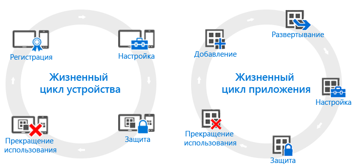

# Общие сведения о жизненных циклах устройств и приложений

Несмотря на то что у каждой организации особые потребности, следует отметить наличие определенных общих шагов, которые потребуется выполнить в любом случае. Их можно объединить в две основные категории, которые называются **жизненными циклами**. Жизненный цикл развертывания, которому вы следуете, зависит от реализуемого сценария. Например, может потребоваться только жизненный цикл устройств, жизненный цикл приложений или оба цикла.

Все устройства имеют жизненный цикл управления. Он начинается с первоначальной регистрации устройств и продолжается до снятия их с учета. [Жизненный цикл управления устройствами](overview-of-device-lifecycle-in-microsoft-intune.md) предполагает знакомство со всеми вариантами регистрации, способов настройки и защиты устройств, а также их последующего удаления из управления.

Точно так же, приложения имеют собственный [жизненный цикл](overview-of-app-lifecycle-in-microsoft-intune.md) с этапами от добавления приложений в Intune и вплоть до их удаления, когда они больше не требуются.

<!--HONumber=Nov16_HO5-->

