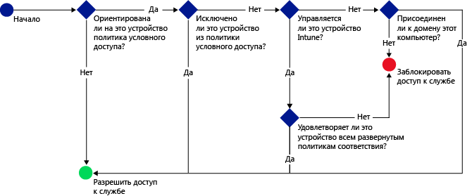

# Защита доступа к электронной почте, Office 365 и другим службам при помощи Microsoft Intune

[!INCLUDE[classic-portal](../includes/classic-portal.md)]

Вы можете защитить доступ к электронной почте организации, службам Office 365, таким как **локальная организация Exchange**, **Exchange Online**, **выделенная среда Exchange Online**, **SharePoint Online**, **Skype для бизнеса Online** и другим службам при помощи условного доступа Enterprise Mobility + Security (EMS). Эта возможность позволяет ограничить доступ к корпоративной электронной почте и службам Office 365 теми устройствами, которые удовлетворяют правилам условного доступа, заданным в консоли администрирования Intune или на классическом портале Azure.
## Как работает условный доступ?
Для оценки соответствия устройства используются параметры политики соответствия. Политика условного доступа применяет эту оценку для разрешения и ограничения доступа к конкретной службе. При использовании политики условного доступа в сочетании с политикой соответствия устройств доступ к службе получают только соответствующие устройства. Политика соответствия требованиям и политика условного доступа развертываются для пользователя. Любое устройство, используемое пользователем для доступа к службам, проверяется на соответствие политикам.

> [!IMPORTANT]
> Имейте в виду, что у пользователя, использующего устройство, должна быть развернута политика соответствия требованиям, оценивающая соответствие устройства.
> Если политика соответствия не развернута для пользователя, устройство считается соответствующим, поэтому ограничения доступа к нему не применяются.

Если устройство не соответствует условиям политик, запускается процесс регистрации устройства и исправления проблемы, из-за которой устройство не является соответствующим.

Типовой алгоритм условного доступа:

## Рекомендации по настройке

### Лицензирование

Microsoft Intune и Azure Active Directory (Azure AD) Premium прекрасно совместимы друг с другом, обеспечивая несколько уровней управления за счет условного доступа EMS. Если вы хотите развернуть политики условного доступа с помощью Intune, вам требуется лицензия для обоих продуктов.

**Лицензии на Azure AD Premium** можно приобрести в качестве отдельной службы и (вместе с Intune) в составе соглашения Enterprise. В случае развертывания политик условного доступа с помощью Intune убедитесь, что получены соответствующие лицензии на Azure AD Premium или **EMS**.

- Дополнительные сведения о Enterprise Mobility см. на странице [цен на Enterprise Mobility](https://www.microsoft.com/cloud-platform/enterprise-mobility-pricing) или [цены на Azure Active Directory](https://azure.microsoft.com/pricing/details/active-directory/).

Кроме того, убедитесь, что пользователям, к которым вы планируете применять политики условного доступа, [назначены лицензии Azure AD Premium или EMS](/Intune/get-started/start-with-a-paid-subscription-to-microsoft-intune-step-4.md).

### Параметры соответствия устройств

Чтобы настроить условный доступ, настройте политику соответствия устройств и политику условного доступа. Политика соответствия включает в себя такие параметры, как секретный код, шифрование, а также наличие рутирования. Устройство должно соответствовать этим правилам, чтобы считаться соответствующим.

- Вы можете узнать дополнительные сведения о [политике соответствия устройств и принципах ее работы](introduction-to-device-compliance-policies-in-microsoft-intune.md).

### Политика условного доступа

Вы можете задать политику условного доступа для защиты доступа на основе следующих факторов.
- Состояние соответствия устройства.
- Платформа на устройстве.
- Тип приложений, используемый для доступа к службам.

В отличие от других политик Intune развертывание политик условного доступа не выполняется. Вместо этого после настройки политики и выбора пользователей, которые должны использовать ее, политика применяется ко всем целевым пользователям. Если на пользователя распространяется действие политики, каждое используемое им устройство должно соответствовать этой политике, чтобы он мог получить доступ к ресурсам.

## Дальнейшие действия

2. [Создайте политику соответствия устройства](create-a-device-compliance-policy-in-microsoft-intune.md).

2.  Создайте политику условного доступа из одной из следующих облачных служб или продуктов Майкрософт:

  - [Создание политики условного доступа для Exchange Online](restrict-access-to-exchange-online-with-microsoft-intune.md)
  - [Создание политики условного доступа для локальной организации Exchange](restrict-access-to-exchange-onpremises-with-microsoft-intune.md)
  - [Создание политики условного доступа для новой выделенной среды Exchange Online](restrict-access-to-exchange-online-with-microsoft-intune.md)
  - [Создание политики условного доступа для прежней выделенной среды Exchange Online](restrict-access-to-exchange-onpremises-with-microsoft-intune.md)
  - [Создание политики условного доступа для SharePoint Online](restrict-access-to-sharepoint-online-with-microsoft-intune.md)
  - [Создание политики условного доступа для Skype для бизнеса Online](restrict-access-to-skype-for-business-online-with-microsoft-intune.md)
  - [Создание политики условного доступа для Dynamics CRM Online](restrict-access-to-dynamics-crm-online-with-microsoft-intune.md)

