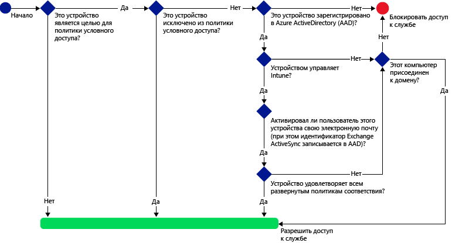
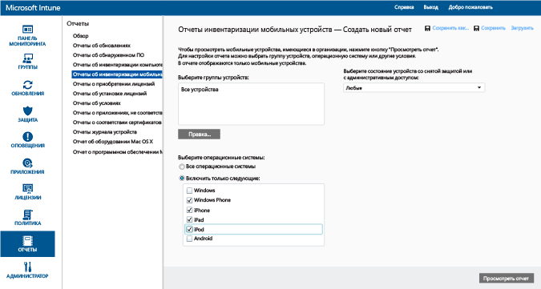
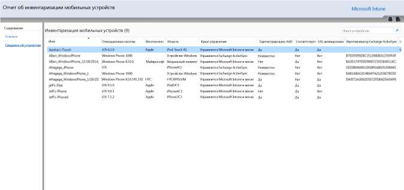
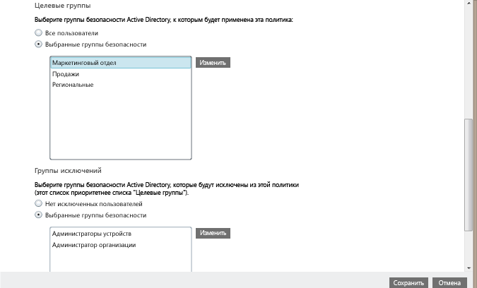
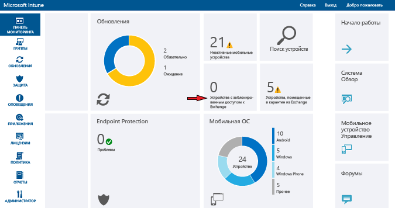

# Защита доступа к электронной почте в Exchange Online и новой выделенной среде Exchange Online при помощи Intune

[!INCLUDE[classic-portal](../includes/classic-portal.md)]

Вы можете настроить условный доступ для Exchange Online или выделенной среды Exchange Online с помощью Microsoft Intune. Дополнительные сведения о принципах работы условного доступа см. в статье [Защита доступа к электронной почте, Office 365 и другим службам](restrict-access-to-email-and-o365-services-with-microsoft-intune.md).

> [!NOTE]
>Если для выделенной среды Exchange Online требуется определить, используется ли в ней новая или устаревшая конфигурация, обратитесь к менеджеру по работе с клиентами.

## Подготовка к работе

Как настроить условный доступ?

-   Использовать подписку **Office 365, включающую в себя Exchange Online (например, E3)**, а пользователи должны иметь лицензию на Exchange Online.

- Получить **подписку Enterprise Mobility + Security (EMS)** или **Azure Active Directory (Azure AD) Premium**, а пользователи должны иметь лицензию для EMS или Azure AD. Дополнительные сведения см. на странице [Цены Enterprise Mobility](https://www.microsoft.com/en-us/cloud-platform/enterprise-mobility-pricing) или [Цены Azure Active Directory](https://azure.microsoft.com/en-us/pricing/details/active-directory/).

-  Рекомендуется настроить дополнительный соединитель служб **Intune Service To Service Connector**, который подключает [!INCLUDE[wit_nextref](../includes/wit_nextref_md.md)] к Exchange Online и позволяет управлять устройствами с помощью консоли [!INCLUDE[wit_nextref](../includes/wit_nextref_md.md)]. Соединитель не требуется для использования политик соответствия требованиям или политик условного доступа, но необходим для выполнения отчетов, которые помогут оценить влияние условного доступа.
    -  Дополнительные сведения о [соединителе Intune Service To Service Connector](intune-service-to-service-exchange-connector.md).

   > [!NOTE]
   > Если планируется использовать условный доступ одновременно и для Exchange Online, и для локальной среды Exchange, не следует настраивать соединитель Intune Service To Service Connector.

### Требования соответствия устройств

Если политики условного доступа настроены и ориентированы на пользователя, то для подключения к электронной почте его **устройство** должно удовлетворять следующим требованиям:

-   Компьютер, присоединенный к домену, или **регистрация** в [!INCLUDE[wit_nextref](../includes/wit_nextref_md.md)].

-  **Регистрация в Azure Active Directory**. Это происходит автоматически при регистрации устройства в [!INCLUDE[wit_nextref](../includes/wit_nextref_md.md)]. Кроме того, идентификатор клиента Exchange ActiveSync должен быть зарегистрирован в Azure Active Directory.

  Служба регистрации устройств Azure Active Directory активируется автоматически для клиентов Intune и Office 365. Клиенты, которые уже развернули службу регистрации устройств ADFS, не будут видеть зарегистрированные устройства в локальном Active Directory.

-   Устройство должно **удовлетворять** любым развернутым на нем политикам соответствия [!INCLUDE[wit_nextref](../includes/wit_nextref_md.md)] или быть присоединенным к локальному домену.

### Если устройство не соответствует требованиям

Если политика условного доступа не соблюдается, устройство сразу же помещается в карантин и пользователь получает по электронной почте соответствующее сообщение. Кроме того, пользователь при входе увидит одно из следующих уведомлений о карантине.

- Если устройство не зарегистрировано в [!INCLUDE[wit_nextref](../includes/wit_nextref_md.md)] либо в Azure Active Directory, выводится сообщение с инструкциями о том, как установить приложение корпоративного портала, выполнить регистрацию и активировать электронную почту. Этот процесс также связывает идентификатор Exchange ActiveSync устройства с записью в Azure Active Directory.

-   Если устройство считается не соответствует правилам политики соответствия, пользователь направляется на веб-сайт корпоративного портала [!INCLUDE[wit_nextref](../includes/wit_nextref_md.md)] или в приложение корпоративного портала, где можно найти сведения о данной проблеме и способах ее устранения.

### Как работает условный доступ с Exchange Online

На следующей схеме показан процесс, используемый политиками условного доступа для Exchange Online.

## Поддержка мобильных устройств
Доступ к электронной почте Exchange Online можно защитить в **Outlook** и других **приложениях, которые используют современную проверку подлинности**. Поддерживаются:

- Android 4.0 и более поздней версии, Samsung Knox Standard 4.0 и более поздней версии и Android for Work
- Устройства iOS 8.0 и более поздней версии

[!INCLUDE[wit_nextref](../includes/afw_rollout_disclaimer.md)]

**Современная проверка подлинности** активирует для клиентов Microsoft Office процедуру входа на основе библиотеки проверки подлинности Active Directory (ADAL).

-   Процедура проверки подлинности на основе ADAL позволяет клиентам Office применять проверку подлинности на основе браузера (также называемую пассивной проверкой подлинности). Для проверки подлинности пользователь перенаправляется на веб-страницу входа в систему.
-   Этот новый метод входа обеспечивает более высокий уровень безопасности за счет **многофакторной проверки подлинности** и **проверки подлинности на основе сертификатов**. Дополнительные сведения см. в разделе [Принципы работы современной проверки подлинности](https://support.office.com/en-US/article/How-modern-authentication-works-for-Office-2013-and-Office-2016-client-apps-e4c45989-4b1a-462e-a81b-2a13191cf517). Вы можете настроить правила утверждений ADFS для блокирования несовременных протоколов проверки подлинности. Подробные инструкции представлены в разделе [Сценарий 3. Полная блокировка доступа к Office 365, за исключением браузерных приложений](https://technet.microsoft.com/library/dn592182.aspx).

Вы можете защитить доступ к **Outlook Web Access (OWA)** в Exchange Online, если доступ осуществляется из браузера на устройствах с ОС **iOS** и **Android**. Доступ разрешен только из поддерживаемых браузеров на соответствующих устройствах:

* Safari (iOS)
* Chrome (Android)
* Intune Managed Browser (iOS, Android 5.0 или более поздней версии)

   > [!IMPORTANT]
   > **Неподдерживаемые браузеры блокируются**.

**Приложение OWA для iOS и Android может быть изменено для запрета современной проверки подлинности и не поддерживается. Доступ из приложения OWA следует заблокировать с помощью правил утверждений ADFS.**

Вы можете защитить доступ к электронной почте Exchange при помощи встроенного **почтового клиента Exchange ActiveSync** на следующих платформах:

- Android 4.0 и более поздние версии, Samsung KNOX Standard 4.0 и более поздние версии

- Устройства iOS 8.0 и более поздней версии

- Windows Phone 8.1 и более поздней версии

## Поддержка для ПК

Условный доступ к **Exchange Online** и **SharePoint Online** можно настроить для компьютеров с классическими приложениями Office, которые отвечают следующим требованиям:

-   Компьютер должен работать под управлением Windows 7.0, Windows 8.1 или Windows 10.

  >[!NOTE]
  > Чтобы использовать условный доступ с компьютерами под управлением Windows 10, необходимо установить на них юбилейное обновление Windows 10.

  Компьютер должен быть присоединен к домену или удовлетворять правилам политики соответствия.

  Чтобы считаться соответствующим, ПК должен быть зарегистрирован в [!INCLUDE[wit_nextref](../includes/wit_nextref_md.md)] и удовлетворять политикам.

  Для ПК, присоединенных к домену, нужно настроить условный доступ для [автоматической регистрации устройства](https://azure.microsoft.com/documentation/articles/active-directory-conditional-access-automatic-device-registration/) в Azure Active Directory.

  >[!NOTE]
    >Условный доступ не поддерживается на компьютерах, где выполняется клиент Intune.

-   [Должна быть включена современная проверка подлинности Office 365](https://support.office.com/en-US/article/Using-Office-365-modern-authentication-with-Office-clients-776c0036-66fd-41cb-8928-5495c0f9168a), а также должны быть установлены все последние обновления Office.

    Современная проверка подлинности активирует для клиентов Office 2013/Windows процедуру входа на основе библиотеки проверки подлинности Active Directory (ADAL). Это обеспечивает более высокий уровень безопасности за счет **многофакторной проверки подлинности** и **проверки подлинности на основе сертификатов**.

-   Правила утверждений ADFS настроены для блокирования несовременных протоколов проверки подлинности. Подробные инструкции представлены в разделе [Сценарий 3. Полная блокировка доступа к Office 365, за исключением браузерных приложений](https://technet.microsoft.com/library/dn592182.aspx).

## Настройка условного доступа
### Шаг 1. Настройка и развертывание политики соответствия требованиям
Убедитесь, что [создана](create-a-device-compliance-policy-in-microsoft-intune.md) и [развернута](deploy-and-monitor-a-device-compliance-policy-in-microsoft-intune.md) политика соответствия для групп пользователей, к которым также будет применяться политика условного доступа.

> [!IMPORTANT]
> Если политика соответствия не развернута, устройства считаются соответствующими и получают доступ к Exchange.

### Шаг 2. Оценка влияния политики условного доступа
Чтобы найти устройства, для которых после настройки политики условного доступа может быть заблокирован доступ к Exchange, можно использовать **Отчеты инвентаризации мобильных устройств**

Для этого настройте подключение между [!INCLUDE[wit_nextref](../includes/wit_nextref_md.md)] и Exchange с помощью [соединителя служб Microsoft Intune](intune-service-to-service-exchange-connector.md).
1.  Выберите **Отчеты** > **Отчеты об инвентаризации мобильных устройств**.

2.  В параметрах отчета выберите группу [!INCLUDE[wit_nextref](../includes/wit_nextref_md.md)], которую следует оценить и, при необходимости, платформы устройств, для которых будет действовать политика.
3.  После выбора условий, удовлетворяющих потребностям вашей организации, выберите **Просмотреть отчет**.
В новом окне открывается средство просмотра отчетов.

После запуска отчета изучите эти четыре столбца, чтобы определить, будет ли пользователь заблокирован:

-   **Канал управления** — указывает, управляется ли устройство Intune и (или) Exchange ActiveSync.

-   **Зарегистрировано в AAD** — указывает, зарегистрировано ли устройство в Azure Active Directory (этот процесс называется присоединением к рабочей области).

-   **Соответствует** — указывает, соответствует ли устройство развернутым политикам соответствия.

-   **Идентификатор Exchange ActiveSync** — идентификатор Exchange ActiveSync устройств iOS и Android должен быть сопоставлен с записью регистрации устройства в Azure Active Directory. Это происходит, когда пользователь щелкает ссылку **Активировать электронную почту** в сообщении о карантине.

    > [!NOTE]
    > Устройства Windows Phone всегда отображают в этом столбце значение.

Устройствам, которые являются частью целевой группы, блокируется доступ к Exchange, пока значения столбцов не будут совпадать со значениями, перечисленными в следующей таблице:

--------------------------
|Канал управления|Зарегистрировано в AAD|Соответствие|Идентификатор Exchange ActiveSync|Результирующее действие|
|----------------------|------------------|-------------|--------------------------|--------------------|
|**Управляется Microsoft Intune и Exchange ActiveSync**|Да|Да|Отображается значение|Доступ к электронной почте разрешен|
|Любое другое значение|Нет|Нет|Значение не отображается|Доступ к электронной почте заблокирован|
----------------------
Вы можете экспортировать содержимое отчета и использовать столбец **Адрес электронной почты** для информирования пользователей о том, что они будут заблокированы.

### Шаг 3. Настройка групп пользователей для политики условного доступа
Политики условного доступа нацелены на разные группы безопасности Azure Active Directory. Можно также исключить определенные группы пользователей из этой политики. Когда пользователь становится целью для политики, каждое используемое им устройство должно быть соответствующим, чтобы получить доступ к электронной почте.

Эти группы можно настроить в **Центре администрирования Office 365** или на **портале учетных записей Intune**.

В каждой политике можно указать два типа групп:

-   **Целевые группы** — группы пользователей, к которым применяется данная политика.

-   **Исключенные группы** — группы пользователей, которые исключены из политики (необязательно).

Если пользователь входит в обе группы, то он будет исключен из политики.

Оценка производится только для тех групп, которые являются целевыми для политики условного доступа.

### Шаг 4. Настройка политики условного доступа

>[!NOTE]
> Можно также создать политику условного доступа в консоли управления Azure AD. Консоль управления Azure AD позволяет создать политику условного доступа для устройств Intune (в Azure AD ее называют **политикой условного доступа на основе устройств**), а также другие политики условного доступа, такие как многофакторная проверка подлинности.

>Можно также задать политики условного доступа для сторонних корпоративных приложений, поддерживаемых Azure AD, таких как Salesforce и Box. Дополнительные сведения см. в статье [Настройка политики условного доступа на основе устройств Azure Active Directory для контроля доступа к подключаемым приложениям Azure Active Directory](https://azure.microsoft.com/en-us/documentation/articles/active-directory-conditional-access-policy-connected-applications/).

1.  В [консоли администрирования Microsoft Intune](https://manage.microsoft.com) выберите **Политика** > **Условный доступ** > **Политика Exchange Online**.

2.  На странице **Политика Exchange Online** выберите **Включить политику условного доступа для Exchange Online**.

    > [!NOTE]
    > Если политика соответствия не развернута, устройства считаются соответствующими.
    >
    > Независимо от состояния соответствия, все пользователи, на которых распространяется политика, должны регистрировать свои устройства в [!INCLUDE[wit_nextref](../includes/wit_nextref_md.md)].

3.  В разделе **Доступ приложения** выбрать платформы, к которым должна применяться политика, для приложений, использующих современную проверку подлинности, можно двумя способами. К поддерживаемым платформам относятся Android, iOS, Windows и Windows Phone.

    -   **Все платформы**

        Любое устройство, используемое для доступа к **Exchange Online**, должно быть зарегистрировано в Intune и удовлетворять заданным политикам. Любое клиентское приложение, использующее **современную проверку подлинности**, регулируется политикой условного доступа. Если в настоящее время платформа не поддерживается службой Intune, доступ к **Exchange Online** блокируется.

        Выбор варианта **Все платформы** означает, что Azure Active Directory применяет эту политику ко всем запросам проверки подлинности независимо от платформы, о которой сообщает клиентское приложение. Все платформы должны быть зарегистрированными и соответствующими со следующими исключениями:
        *    Устройства Windows должны быть зарегистрированными и соответствующими, присоединенными к домену с локальным каталогом Active Directory, либо для них могут выполняться оба этих условия.
        * Неподдерживаемые платформы, такие как Mac OS. Однако приложения, использующие современные способы проверки подлинности, реализованные в этих платформах, по-прежнему блокируются.

    -   **Определенные платформы**

         Политика условного доступа применяется для любого клиентского приложения, использующего **современную проверку подлинности**, на выбранных вами платформах устройств.

4. В разделе **Outlook Web Access (OWA)** можно разрешить доступ к Exchange Online только через поддерживаемые браузеры: Safari (iOS) и Chrome (Android). Доступ из других браузеров блокируется. Здесь также применяются те же ограничения платформ, которые были заданы в разделе "Доступ приложений" для Outlook.

  На устройствах **Android** пользователям требуется включить доступ через браузер. Для этого пользователю потребуется включить параметр **Включить доступ в браузере** на зарегистрированном устройстве следующим образом:
  1.    Откройте **приложение корпоративного портала**.
  2.    Перейдите на страницу **Настройки**, нажав кнопку с тремя точками (...) или аппаратную кнопку меню.
  3.    Нажмите кнопку **Включить доступ браузера**.
  4.    В браузере Chrome выйдите из Office 365 и перезагрузите Chrome.

  На платформах **iOS** и **Android** для идентификации устройства, используемого для доступа к службе, Azure Active Directory выдаст устройству сертификат безопасности TLS. На устройстве этот сертификат отображается вместе с запросом на выбор сертификата, как показано на снимках экрана ниже. Пользователь должен выбрать этот сертификат, прежде чем сможет продолжить работать с браузером.

  **iOS**

  

  **Android**

  

5.  В разделе **Приложения Exchange ActiveSync** можно заблокировать доступ несоответствующих устройств к Exchange Online. Также можно разрешить или запретить доступ к электронной почте, когда устройство работает на неподдерживаемой платформе. К поддерживаемым платформам относятся Android, iOS, Windows и Windows Phone.

 Приложения Exchange Active Sync на устройствах **Android for Work**:
 -  На устройствах Android for Work поддерживаются только приложения **Gmail** и **Nine Work** в **профиле работы**. Чтобы условный доступ работал для устройств Android for Work, нужно развернуть профиль электронной почты для приложения Gmail или Nine Work, а также развернуть эти приложения в качестве **обязательной** установки.

6.  В разделе **Целевые группы** выберите группы безопасности Active Directory пользователей, к которым применяется политика. В качестве целевой аудитории можно выбрать всех пользователей или отдельные их группы.

    > [!NOTE]
    > Для пользователей, которые являются членами **целевых групп**, политики Intune заменяют правила и политики Exchange.
    >
    > Exchange может разрешать, блокировать и помещать в карантин правила, а также политики Exchange только в том случае, если:
    >
    > -   У пользователя нет лицензии на Intune.
    > -   У пользователя есть лицензия на Intune, но он не входит ни в одну из групп безопасности, на которые распространяется политика условного доступа.

6.  В разделе **Исключенные группы**выберите группы безопасности Active Directory пользователей, которые будут исключены из этой политики. Если пользователь входит в обе указанные группы, то он исключается из политики.

7.  По окончании нажмите кнопку **Сохранить**.

-   Развертывать политику условного доступа не нужно, она вступает в силу немедленно.

-   Устройство блокируется сразу, как только пользователь создает учетную запись электронной почты.

-   Если заблокированный пользователь регистрирует устройство в [!INCLUDE[wit_nextref](../includes/wit_nextref_md.md)] и устраняет несоответствие, доступ к электронной почте будет разблокирован в течение 2 минут.

-   Если пользователь отменяет регистрацию устройства, электронная почта будет заблокирована приблизительно через 6 часов.

**Примеры сценариев, в которых выполняется настройка политики условного доступа для защиты доступа к устройству**, см. в статье [Ситуации-примеры, связанные с защитой доступа к электронной почте](restrict-email-access-example-scenarios.md).

## Мониторинг соответствия и политик условного доступа

#### Просмотр устройств, которым заблокирован доступ к Exchange

На панели мониторинга [!INCLUDE[wit_nextref](../includes/wit_nextref_md.md)] выберите элемент **Устройства с заблокированным доступом к Exchange**, чтобы показать количество заблокированных устройств и ссылки на дополнительные сведения.

## Дальнейшие действия
- [Защита доступа к SharePoint Online](restrict-access-to-sharepoint-online-with-microsoft-intune.md)

- [Защита доступа к Skype для бизнеса Online](restrict-access-to-skype-for-business-online-with-microsoft-intune.md)

