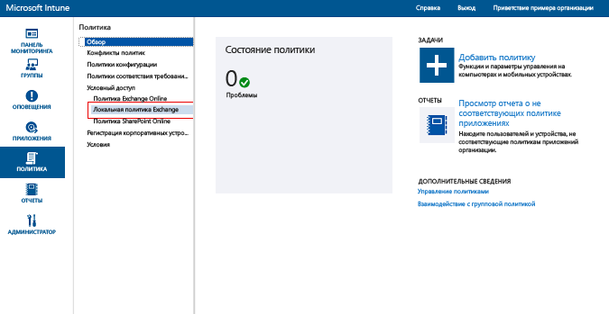
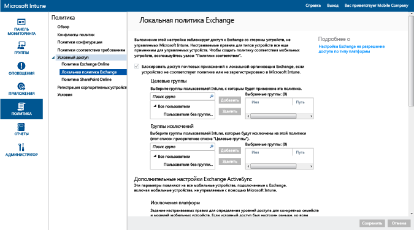

# Защита доступа к электронной почте в локальной организации Exchange и прежней выделенной среде Exchange Online при помощи Intune

[!INCLUDE[classic-portal](../includes/classic-portal.md)]

Вы можете настроить условный доступ для управления доступом к электронной почте в локальной организации Exchange или устаревшей выделенной среде Exchange Online с помощью Microsoft Intune.
Дополнительные сведения о принципах работы условного доступа см. в статье [Защита доступа к электронной почте и службам Office 365](restrict-access-to-email-and-o365-services-with-microsoft-intune.md).

> [!NOTE]
> Если для выделенной среды Exchange Online требуется определить, используется ли в ней новая или устаревшая конфигурация, обратитесь к менеджеру по работе с клиентами.

## Подготовка к работе

Обязательно проверьте следующее:

-   Следует использовать **Exchange 2010 или Exchange более поздней версии**. Массивы сервера клиентского доступа (CAS) сервера Exchange Server поддерживаются.

-   Нужно использовать [локальный соединитель Intune с Exchange](intune-on-premises-exchange-connector.md), который подключает [!INCLUDE[wit_nextref](../includes/wit_nextref_md.md)] к локальной организации Exchange. Это позволяет управлять устройствами с помощью консоли [!INCLUDE[wit_nextref](../includes/wit_nextref_md.md)].

    -   Доступный в консоли Intune локальный соединитель Exchange привязан к вашему клиенту Intune и не может использоваться с любым другим клиентом. Рекомендуется убедиться, что соединитель Exchange для вашего клиента устанавливается **только на одном компьютере**.

        Этот соединитель можно скачать из консоли администрирования Intune. Пошаговое руководство по настройке локального соединителя Exchange см. в статье [Настройка локального соединителя Exchange для локальной или размещенной службы Exchange](intune-on-premises-exchange-connector.md).

    -   Соединитель можно установить на любом компьютере при условии, что этот компьютер может взаимодействовать с сервером Exchange.

    -   Этот соединитель поддерживает **среду серверов клиентского доступа Exchange**. С технической точки зрения можно установить соединитель прямо на сервере клиентского доступа Exchange. Однако делать это не рекомендуется, так как увеличится нагрузка на сервер. Соединитель нужно настроить так, чтобы он обменивался данными с одним из серверов клиентского доступа Exchange.

-   **Exchange ActiveSync** можно настроить с помощью проверки подлинности на основе сертификатов или записи учетных данных пользователя.

### Требования соответствия устройств

Если политики условного доступа настроены и ориентированы на пользователя, то для подключения к электронной почте его **устройство** должно удовлетворять следующим требованиям:

-  Компьютер, присоединенный к домену, или **регистрация** в [!INCLUDE[wit_nextref](../includes/wit_nextref_md.md)].

-  **Регистрация в Azure Active Directory**. Кроме того, идентификатор клиента Exchange ActiveSync должен быть зарегистрирован в Azure Active Directory.

  Служба регистрации устройств Azure Active Directory активируется автоматически для клиентов Intune и Office 365. Клиенты, которые уже развернули службу регистрации устройств ADFS, не будут видеть зарегистрированные устройства в локальном Active Directory. **Это не относится к ПК под управлением Windows и к устройствам Windows Phone**.

-   **Удовлетворение** любым развернутым на нем политикам соответствия [!INCLUDE[wit_nextref](../includes/wit_nextref_md.md)].

### Как работает условный доступ с локальной системой Exchange

Следующая схема показывает процедуру, применяемую политиками условного доступа для локальной организации Exchange, чтобы предоставить или заблокировать доступ для устройств:

Если политика условного доступа не соблюдается, через 10 минут устройство будет заблокировано. Кроме того, пользователь при входе увидит одно из следующих уведомлений о карантине:

- Если устройство не зарегистрировано в [!INCLUDE[wit_nextref](../includes/wit_nextref_md.md)] либо в Azure Active Directory, выводится сообщение с инструкциями о том, как установить приложение корпоративного портала, выполнить регистрацию и активировать электронную почту. Этот процесс также связывает идентификатор Exchange ActiveSync устройства с записью в Azure Active Directory.

-   Если устройство не соответствует требованиям, отображается сообщение, направляющее пользователя на веб-сайт или в приложение корпоративного портала [!INCLUDE[wit_nextref](../includes/wit_nextref_md.md)], где можно найти сведения о данной проблеме и способах ее решения.

## Поддержка мобильных устройств
Поддерживаются:
-   Windows Phone 8.1 и более поздней версии.

-   Собственное почтовое приложение в iOS.

-   Почтовые клиенты Exchange ActiveSync, например Gmail на Android 4 или более поздней версии.
-   Почтовые клиенты Exchange ActiveSync на **устройствах Android for Work**: на устройствах Android for Work поддерживаются только приложения **Gmail** и **Nine Work** в **рабочем профиле**. Чтобы условный доступ работал для Android for Work, необходимо развернуть профиль электронной почты для приложения Gmail или Nine Work, а также развернуть эти приложения в качестве обязательной установки. 

> [!NOTE]
> Приложение Microsoft Outlook в iOS и Android не поддерживается.

## Поддержка для ПК
Следующие возможности не поддерживаются:
-   Приложение **Почта** в Windows 8.1 и более поздних версиях (при регистрации компьютера в [!INCLUDE[wit_nextref](../includes/wit_nextref_md.md)]).

##  Настройка политики условного доступа

1.  В [консоли администрирования Microsoft Intune](https://manage.microsoft.com) выберите **Политика** > **Условный доступ** > **Локальная политика Exchange**.

2.  Настройте политику с необходимыми параметрами: 

  - **Блокировать доступ почтовых приложений к локальной организации Exchange, если устройство не соответствует политике или не зарегистрировано в Microsoft Intune:** при выборе этого параметра устройствам, которые не управляются с помощью [!INCLUDE[wit_nextref](../includes/wit_nextref_md.md)] или не удовлетворяют политике соответствия, будет заблокирован доступ к службам Exchange.

  - **Переопределение правила по умолчанию — всегда разрешать зарегистрированным и соответствующим требованиям устройствам получать доступ к Exchange:** если выбран этот параметр, устройства, зарегистрированные в Intune и соответствующие политикам, получают доступ к Exchange.
  Это правило переопределяет **Правило по умолчанию**, то есть даже если вы настроите **Правило по умолчанию** на помещение в карантин или блокировку доступа, зарегистрированные и соответствующие требованиям устройства по-прежнему имеют доступ к Exchange.

  - **Целевые группы:** выберите группы пользователей [!INCLUDE[wit_nextref](../includes/wit_nextref_md.md)], которые должны зарегистрировать устройство в [!INCLUDE[wit_nextref](../includes/wit_nextref_md.md)] для получения доступа к Exchange.

  - **Исключенные группы:** выберите группы пользователей [!INCLUDE[wit_nextref](../includes/wit_nextref_md.md)], которые исключаются из политики условного доступа. Пользователи из этого списка исключаются, даже если они также указаны в списке **Целевые группы**.

  - **Исключения платформы:** нажмите кнопку **Добавить правило**, чтобы настроить правило, определяющее уровни доступа для указанных семейств и моделей мобильных устройств. Так как эти устройства могут быть любого типа, то можно настроить те типы устройств, которые не поддерживаются в [!INCLUDE[wit_nextref](../includes/wit_nextref_md.md)].

  - **Правило по умолчанию:** для устройства, на которое не распространяются никакие другие правила, можно разрешить доступ к Exchange, заблокировать такой доступ или поместить устройство в карантин. Когда вы настраиваете правило, чтобы разрешить доступ для устройств, которые зарегистрированы и соответствуют требованиям, доступ к электронной почте для устройств Windows, iOS и Samsung KNOX предоставляется автоматически. Пользователю не нужно проходить какую-либо процедуру, чтобы получить доступ к электронной почте.
      - На устройствах Android без Samsung KNOX пользователи получают сообщение электронной почты о карантине с пошаговыми инструкциями по проверке регистрации и соответствия. Доступ к электронной почте пользователи могут получить, только выполнив эти инструкции. Если вы настроили правило для блокировки доступа или помещения в карантин, доступ к Exchange запрещается для всех устройств независимо от того, зарегистрированы ли они в Intune. Чтобы предотвратить применение этого правила к зарегистрированным и соответствующим устройствам, установите флажок **Переопределение правила по умолчанию**.
>[!TIP]
>Если вы хотите предварительно блокировать все устройства перед предоставлением доступа к электронной почте, выберите правило блокировки доступа или помещения в карантин. Правило по умолчанию применяется ко всем типам устройств, включая типы устройств, которые настраиваются в качестве исключений платформы и не поддерживаются [!INCLUDE[wit_nextref](../includes/wit_nextref_md.md)].

  - **Уведомление для пользователей:** кроме уведомления из Exchange, Intune отправляет сообщение электронной почты с описанием действий по разблокировке устройства. Исходное сообщение можно изменить в соответствии с актуальными потребностями. В случае, если устройство пользователя блокируется, прежде чем он получит уведомление Intune с инструкциями по исправлению (это сообщение доставляется в почтовый ящик Exchange), пользователь может использовать незаблокированное устройство или другой способ для доступа к Exchange и просмотра сообщения.
      - Это особенно актуально, когда **Правило по умолчанию** настроено на блокировку доступа или помещение в карантин. В этом случае пользователю требуется перейти в Магазин приложений, скачать приложение корпоративного портала Майкрософт и зарегистрировать свое устройство. Это применимо к устройствам Windows, iOS и Samsung KNOX. Для устройств, на которых не выполняется Samsung KNOX, нужно отправить электронное сообщение о помещении в карантин на альтернативную учетную запись электронной почты. Пользователю нужно скопировать электронное сообщение с заблокированного устройства, чтобы завершить процесс регистрации и обеспечения соответствия.
  > [!NOTE]
  > Чтобы система Exchange могла отправить уведомление по электронной почте, нужно указать учетную запись, которая будет использоваться для отправки такого уведомления.
  >
  > Дополнительные сведения см. в статье [Настройка локального соединителя Exchange для локальной или размещенной службы Exchange](intune-on-premises-exchange-connector.md).

3.  По окончании нажмите кнопку **Сохранить**.

-   Развертывать политику условного доступа не нужно, она вступает в силу немедленно.

-   После того как пользователь настроит профиль Exchange ActiveSync, блокировка устройства может занять от 1 до 3 часов (если оно не находится под управлением [!INCLUDE[wit_nextref](../includes/wit_nextref_md.md)]).

-   Если заблокированный пользователь регистрирует устройство в [!INCLUDE[wit_nextref](../includes/wit_nextref_md.md)] (и устраняет несоответствие), доступ к электронной почте будет разблокирован в течение 2 минут.

-   Если пользователь отменяет регистрацию из [!INCLUDE[wit_nextref](../includes/wit_nextref_md.md)], блокировка устройства может занять от 1 до 3 часов.

**Примеры сценариев, в которых выполняется настройка политики условного доступа для защиты доступа к устройству, см. в статье [Ситуации-примеры, связанные с защитой доступа к электронной почте](restrict-email-access-example-scenarios.md).**

## Дальнейшие действия
-   [Защита доступа к SharePoint Online](restrict-access-to-sharepoint-online-with-microsoft-intune.md)

-   [Защита доступа к Skype для бизнеса Online](restrict-access-to-skype-for-business-online-with-microsoft-intune.md)

