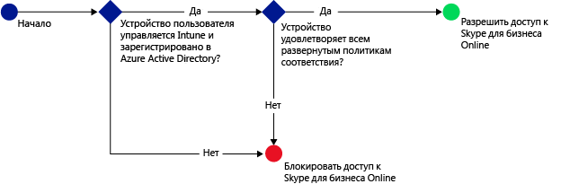
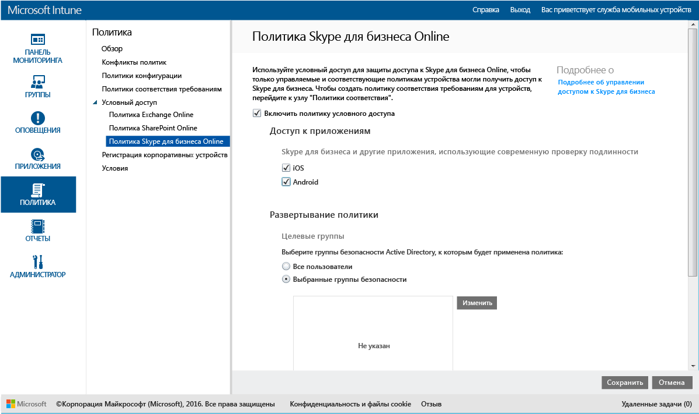

# Ограничение доступа к Skype для бизнеса Online с помощью Microsoft Intune
Вы можете использовать политику условного доступа для **Skype для бизнеса Online**, чтобы управлять доступом к Skype для бизнеса Online.
Условный доступ состоит из двух компонентов:
- Политика соответствия устройств, которой устройства должны удовлетворять, чтобы считаться соответствующими.
- Политика условного доступа, где указываются условия, которым должно удовлетворять устройство для доступа к службе.
Дополнительные сведения о принципах работы условного доступа см. в статье [Ограничение доступа к электронной почте и службам Office 365](restrict-access-to-email-and-o365-services-with-microsoft-intune.md).

Когда целевой пользователь пытается подключиться к Skype для бизнеса Online на устройстве, выполняется следующая оценка:

**Перед** настройкой политики условного доступа для Skype для бизнеса Online необходимо выполнить следующие условия:
- Получить **подписку Skype для бизнеса Online** и назначить лицензии Skype для бизнеса Online пользователям.
- Получить **подписку Enterprise Mobility + Security (EMS)** или **Azure Active Directory (Azure AD) Premium** и предоставить пользователям лицензии для EMS или Azure AD. Дополнительные сведения см. в статье [Цены на Enterprise Mobility](https://www.microsoft.com/en-us/cloud-platform/enterprise-mobility-pricing) или [Цены на Azure Active Directory](https://azure.microsoft.com/en-us/pricing/details/active-directory/).

-   [Включение современной проверки подлинности](https://docs.microsoft.com/en-us/intune/deploy-use/restrict-access-to-skype-for-business-online-with-microsoft-intune) для Skype для бизнеса Online.
-  Все пользователи должны использовать **Skype для бизнеса Online**. Если имеется развертывание Skype для бизнеса Online и локальной версии Skype для бизнеса, политика условного доступа для пользователей не применяется.

Устройство, которому требуется доступ к Skype для бизнеса Online должно соответствовать следующим условиям:

-   Устройство должно относиться к платформе **Android** или **iOS**.

-   Устройство должно быть **зарегистрировано** в [!INCLUDE[wit_nextref](../includes/wit_nextref_md.md)].

-   Устройство должно **удовлетворять** всем развернутым политикам соответствия [!INCLUDE[wit_nextref](../includes/wit_nextref_md.md)].

Состояние устройства хранится в службе Azure Active Directory, которая предоставляет или блокирует доступ на основе указанных условий.

Если условие не выполняется, при входе пользователь получает одно из следующих сообщений:

-   Если устройство не зарегистрировано в [!INCLUDE[wit_nextref](../includes/wit_nextref_md.md)] либо в Azure Active Directory, выводится сообщение с инструкциями о том, как установить приложение корпоративного портала и выполнить регистрацию.

-   Если устройство не соответствует требованиям, отображается сообщение, направляющее пользователя на веб-сайт или в приложение корпоративного портала [!INCLUDE[wit_nextref](../includes/wit_nextref_md.md)], где можно найти сведения о данной проблеме и способах ее решения.

## Настройка условного доступа для Skype для бизнеса Online

### Шаг 1. Настройка групп безопасности Azure Active Directory
Прежде чем начать, настройте политику условного доступа в группах безопасности Azure Active Directory. Эти группы можно настроить в **Центре администрирования Office 365**. Они будут использоваться для назначения пользователей политике или исключения их из нее. Если на пользователя распространяется действие политики, каждое используемое им устройство должно соответствовать этой политике, чтобы он мог получить доступ к ресурсам.

Для политики Skype для бизнеса можно указать два типа групп:

-   **Целевые группы** — группы пользователей, к которым применяется политика.

-   **Исключенные группы** — группы пользователей, которые исключены из политики.

Если пользователь входит в обе группы, то он будет исключен из политики.

### Шаг 2. Настройка и развертывание политики соответствия требованиям
[Создайте](create-a-device-compliance-policy-in-microsoft-intune.md) и [разверните](deploy-and-monitor-a-device-compliance-policy-in-microsoft-intune.md) политику соответствия для всех устройств, которые будет затрагивать эта политика. Это все устройства, которые используются пользователями в **целевых группах**.

> [!NOTE]
> Во время развертывания политик в группах [!INCLUDE[wit_nextref](../includes/wit_nextref_md.md)] политики условного доступа нацелены на группы безопасности Azure Active Directory.

> [!IMPORTANT]
> Если политика соответствия не развернута, устройства считаются соответствующими.

Когда будете готовы, перейдите к **шагу 3**.

### Шаг 3. Настройка политики Skype для бизнеса Online
Далее настройте в политике требование, разрешающее доступ к Skype для бизнеса Online только для управляемых и соответствующих политике устройств. Эта политика будет храниться в Azure Active Directory.

1.  В [консоли администрирования Microsoft Intune](https://manage.microsoft.com) выберите **Политика** > **Условный доступ** > **Политика Skype для бизнеса Online**.

  

2.  Выберите параметр **Включить политику условного доступа**.

3.  В разделе **Доступ приложения ** можно выбрать область применения политики условного доступа:

    -   **iOS**

    -   **Android**

4.  В разделе **Целевые группы** нажмите кнопку **Изменить**, чтобы выбрать группы безопасности Azure Active Directory, к которым будет применена политика. В качестве целевой аудитории можно выбрать всех пользователей или отдельные группы пользователей.

5.  Дополнительно в разделе **Исключенные группы** можно нажать кнопку **Изменить**, чтобы выбрать группы безопасности Azure Active Directory, которые будут исключены из этой политики.

6.  По окончании нажмите кнопку **Сохранить**.

Настройка условного доступа для Skype для бизнеса Online выполнена. Развертывать политику условного доступа не нужно, она вступает в силу немедленно.

## Мониторинг соответствия и политик условного доступа
В рабочей области **Группы** вы можете просмотреть состояние условного доступа своих устройств.

Выберите любую группу мобильных устройств. Затем на вкладке **Устройства** выберите один из следующих **фильтров**:

* **Устройства, не зарегистрированные в AAD** — для этих устройств заблокирован доступ к Skype для бизнеса Online.

* **Устройства, не соответствующие условиям** — для этих устройств заблокирован доступ к Skype для бизнеса Online.

* **Устройства, соответствующие условиям и зарегистрированные в AAD** — эти устройства могут получить доступ к Skype для бизнеса Online.

<!--HONumber=Dec16_HO2-->

