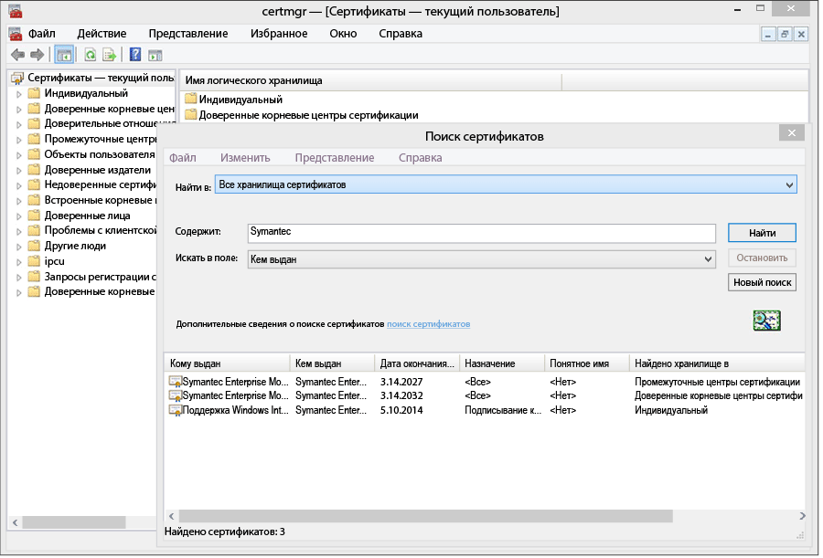
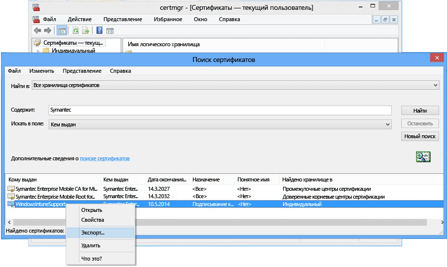

# <a name="sign-line-of-business-apps-so-they-can-be-deployed-to-windows-devices-with-intune"></a>Подписывание бизнес-приложений для развертывания на устройствах Windows с помощью Intune

Администратор Intune может развертывать бизнес-приложения (LOB), включая приложение корпоративного портала, на устройствах Windows и Windows 10 Mobile. Чтобы развертывать приложения APPX или XAP на устройствах Windows 10 или Windows 10 Mobile либо любое бизнес-приложение на устройствах Windows 8.1 или Windows Phone 8.1, необходимо получить **сертификат подписи мобильного кода Symantec Enterprise**. Только сертификат Symantec является доверенным для этих приложений соответствующих устройств Windows. Для приложений Windows 10 и "универсальных" приложений можно использовать собственный центр сертификации. Этот сертификат необходим для выполнения следующих задач:

-   подписывание приложения корпоративного портала для развертывания на компьютерах под управлением Windows, устройствах Windows 10 Mobile и Windows Phone;

-   подписывание бизнес-приложений компании, чтобы система Intune могла развернуть их на устройствах Windows.

Ниже приводятся процедуры получения необходимого сертификата и подписывания приложений. Вам потребуется учетная запись центра разработки для Windows Phone, а затем необходимо будет приобрести сертификат Symantec.


1. **Присоединение к Центру разработки для Windows Phone**<br>
   Присоединитесь к [Центру разработки для Windows Phone](http://go.microsoft.com/fwlink/?LinkId=268442) , используя сведения о корпоративной учетной записи при входе для приобретения учетной записи компании. Запрос должен быть утвержден должностным лицом организации, прежде чем вы сможете получить сертификат подписи кода.

2. **Получение сертификата Symantec для компании**<br>
  Приобретите сертификат на [веб-сайте Symantec](http://go.microsoft.com/fwlink/?LinkId=268441) , используя свой идентификатор Symantec. После покупки сертификата утверждающая организация, назначенная вами в учетной записи центра разработчиков Windows Phone, получит сообщение электронной почты с просьбой утвердить запрос сертификата. Дополнительные сведения о требованиях к сертификату Symantec см. в разделе [Почему для управления Windows Phone требуется сертификат Symantec?](https://technet.microsoft.com/en-us/library/dn764959.aspx#BKMK_Symantec). Регистрация устройств Windows. Часто задаваемые вопросы.

3.  **Импорт сертификатов**<br>
    После утверждения запроса вы получите сообщение электронной почты с инструкциями по импорту сертификатов. Следуйте инструкциям в сообщении, чтобы импортировать сертификаты.

4.  **Проверка импорта сертификатов**<br>
    Чтобы проверить, правильно ли импортированы сертификаты, перейдите в оснастку **Сертификаты**, щелкните пункт **Сертификаты** правой кнопкой мыши и выберите пункт **Поиск сертификатов**. В поле **Содержит** введите Symantec и нажмите кнопку **Найти**. Импортированные сертификаты должны появиться в списке результатов.

    

5. **Экспорт сертификата подписи**<br>
    Убедившись в наличии сертификатов, можно экспортировать PFX-файл для подписывания корпоративного портала. Выберите сертификат Symantec с **целью выдачи** "подписывание кода". Щелкните сертификат подписи кода правой кнопкой мыши и выберите пункт **Экспортировать**.

    

    В окне **Мастер экспорта сертификатов**установите переключатель **Да, экспортировать закрытый ключ** и нажмите кнопку **Далее**. **Выберите файл обмена личной информацией –PKCS #12 (PFX)** и установите флажок **По возможности включать все сертификаты в путь сертификации**. Завершите работу мастера. Дополнительные сведения см. в статье [Экспорт сертификата с закрытым ключом](http://go.microsoft.com/fwlink/?LinkID=203031).

6.  **Отправка приложения в Intune**<br>
    Отправьте подписанный файл приложения и сертификат подписи кода, чтобы предоставить приложение конечным пользователям.

    1.  В [консоли администрирования Intune](http://manage.microsoft.com) щелкните **Администрирование** &gt; **Windows Phone**.

    2.  Щелкните **Отправить подписанный файл приложения** и выполните вход с помощью вашего ИД администратора Intune.

    3.  Добавьте файл сертификата (PFX), экспортированный в **Сертификат подписывания кода**, и создайте пароль для сертификата.

    4.  Завершите работу мастера.

## <a name="example-download-sign-and-deploy-the-company-portal-app-for-windows-devices"></a>Пример. Скачивание, подписывание и развертывание приложения корпоративного портала для устройств Windows

Вы можете развернуть приложение корпоративного портала на устройствах Windows, включая Windows Phone и Windows 10 Mobile, с помощью Intune вместо того, чтобы устанавливать его из Магазина Windows. Необходимо скачать приложение корпоративного портала и подписать его с помощью сертификата.  Это необходимо сделать, только если пользователи не будут использовать Магазин компании и если вы хотите развернуть портал компании на устройствах Windows Phone 8.1.


1.  **Скачайте портал компании**

    Чтобы развернуть приложение корпоративного портала с помощью Intune, скачайте [приложение корпоративного портала Microsoft Intune для Windows Phone 8.1](http://go.microsoft.com/fwlink/?LinkId=615799) из Центра загрузки и запустите самоизвлекающийся файл (EXE). Этот файл содержит два файла:

    -   CompanyPortal.appx — приложение установки портала компании для Windows Phone 8.1;

    -   WinPhoneCompanyPortal.ps1 — скрипт PowerShell, который можно использовать для подписи файла для приложения портала компании, чтобы его можно было развернуть на устройствах Windows Phone 8.1.

    Кроме того, корпоративный портал Windows Phone 8.1 (автономный лицензированный пакет) или корпоративный портал Windows 10 можно скачать из [Магазина Windows для бизнеса](http://businessstore.microsoft.com/). Приложение корпоративного портала необходимо получить с помощью автономной лицензии и соответствующего пакета, скачанного для использования в режиме "вне сети". Списки платформ Windows 8 и Windows Phone 8 в выделенной области относятся к соответствующим аналогам 8.1. Дополнительные сведения о выполнении этой задачи в Intune см. в статье [Управление приложениями, которые вы приобрели в Магазине Windows для бизнеса](manage-apps-you-purchased-from-the-windows-store-for-business-with-microsoft-intune.md).

2.  **Скачивание пакета SDK для Windows Phone.** Скачайте пакет SDK для Windows Phone версии 8.0](http://go.microsoft.com/fwlink/?LinkId=615570) и установите его на компьютере. Этот пакет SDK необходим для создания токена регистрации приложения.

3.  **Создание AETX-файла** Создайте файл токена регистрации приложения (AETX) из PFX-файла Symantec с помощью программы AETGenerator.exe, входящей в состав пакета SDK для Windows Phone версии 8.0. Инструкции по созданию AETX-файла см. в разделе [Создание токена регистрации приложения для Windows Phone](https://msdn.microsoft.com/library/windows/apps/jj735576.aspx).

4.  **Скачивание пакета SDK для Windows 8.1** Скачайте и установите [пакет SDK для Windows Phone](http://go.microsoft.com/fwlink/?LinkId=613525) (http://go.microsoft.com/fwlink/?LinkId=613525). Обратите внимание, что скрипт PowerShell, входящий в состав приложения портала компании, использует расположение установки по умолчанию — `${env:ProgramFiles(x86)}\Windows Kits\8.1`. Если установка производится в другое расположение, необходимо включить его в параметр командлета.

5.  **Подписание кода приложения с помощью PowerShell** С правами администратора откройте **Windows PowerShell** на главном компьютере с пакетом SDK для Windows, затем корпоративный сертификат подписи кода мобильных устройств Symantec, перейдите к файлу Sign-WinPhoneCompanyPortal.ps1 и запустите скрипт.

    **Пример 1**

    ```
    .\Sign-WinPhoneCompanyPortal.ps1 -InputAppx 'C:\temp\CompanyPortal.appx' -OutputAppx 'C:\temp\CompanyPortalEnterpriseSigned.appx' -PfxFilePath 'C:\signing\cert.pfx' -PfxPassword '1234' -AetxPath 'C:\signing\cert.aetx'
    ```
    В этом примере подписывается файл CompanyPortal.appx в C:\temp\ и создается файл CompanyPortalEnterpriseSigned.appx. Он будет использовать пароль PFX 1234 и считывать идентификатор издателя из PFX-файла. Он также считывает идентификатор организации из файла cert.aetx.

    **Пример 2**

    ```
    .\Sign-WinPhoneCompanyPortal.ps1 -InputAppx 'C:\temp\CompanyPortal.appx' -OutputAppx 'C:\temp\CompanyPortalEnterpriseSigned.appx' -PfxFilePath 'C:\signing\cert.pfx' -PfxPassword '1234' -PublisherId 'OID.0.9.2342.19200300.100.1.1=1000000001, CN="Test, Inc.", OU=Test 1' -EnterpriseId 1000000001
    ```
    В этом примере подписывается файл CompanyPortal.appx в C:\temp\ и создается файл CompanyPortalEnterpriseSigned.appx. Он будет использовать пароль PFX 1234 и указанный идентификатор издателя.

    **Параметры:**

    -   `-InputAppx` — локальный путь к файлу CompanyPortal.appx в одинарных кавычках. Например, 'C:\temp\CompanyPortal.appx'.

    -   `-OutputAppx` — локальный путь и имя файла для подписанного приложения портала компании в одинарных кавычках. Например, 'C:\temp\CompanyPortalEnterpriseSigned.appx'.

    -   `-PfxFilePath` — локальный путь и имя экспортированного PFX-файла сертификата Symantec. Например, 'C:\signing\cert.pfx'.

    -   `-PfxPassword` — пароль, используемый для подписания PFX-файла, в одинарных кавычках. Например, '1234'.

    -   `-AetxPath` — локальный путь к AETX-файлу, который используется для считывания идентификатора организации, если аргумент EnterpriseId не задан. Необходимо указать либо этот аргумент, либо EnterpriseId. Например, 'C:\signing\cert.aetx'.

    -   `-PublisherId` — идентификатор издателя организации. Если он отсутствует, используется поле Subject (Тема) корпоративного сертификата подписи кода для мобильных устройств Symantec. Например, 'OID.0.9.2342.19200300.100.1.1=1000000001, CN="Test, Inc.", OU=Test 1'.

    -   `-SdkPath` — путь к корневой папке Windows SDK для Windows 8.1. Этот аргумент является необязательным и по умолчанию имеет значение ${env:ProgramFiles(x86)}\Windows Kits\8.1.

    -   `-EnterpriseId` — идентификатор организации. Необходимо указать либо этот аргумент, либо AetxPath. Если этот аргумент не задан, идентификатор организации считывается из AETX-файла. Например, 1000000001.

6.  Разверните приложение портала компании Windows Phone 8.1 (SSP.appx). Дополнительные сведения см. в статье [Развертывание приложений в Microsoft Intune](deploy-apps-in-microsoft-intune.md).

## <a name="how-to-renew-the-symantec-enterprise-code-signing-certificate"></a>Инструкции по обновлению корпоративного сертификата Symantec для подписи кода

Сертификат Symantec, используемый для развертывания мобильных приложений Windows и Windows Phone, должен периодически обновляться.

1.  Дождитесь сообщения электронной почты об обновлении, которое отправляет компания Symantec приблизительно за 14 дней до истечения срока действия сертификата. Это сообщение электронной почты содержит указания компании Symantec об обновлении корпоративного сертификата.

    Для получения дополнительных сведений о сертификатах Symantec посетите сайт [www.symantec.com](http://www.symantec.com) или позвоните по телефону +7 (495) 641-22-91 или +44 11 89-22-4660.

2.  Откройте веб-сайт (например, [https://products.websecurity.symantec.com/orders/enrollment/microsoftCert.do](https://products.websecurity.symantec.com/orders/enrollment/microsoftCert.do)) и выполните вход с использованием идентификатора издателя Symantec, а также адреса электронной почты, связанного с сертификатом. Не забудьте использовать тот же компьютер для запуска обновления, который будет использоваться для загрузки сертификата.

3.  После утверждения и оплаты обновления загрузите сертификат.

### <a name="how-to-install-the-updated-certificate-for-line-of-business-lob-apps"></a>Установка обновленного сертификата для бизнес-приложений

1.  Подпишите последнюю версию бизнес-приложения.

2.  Откройте [консоль администрирования Intune](https://admin.manage.microsoft.com) (https://admin.manage.microsoft.com) и перейдите в раздел **Администрирование** &gt; **Управление мобильными устройствами** &gt; **Windows Phone**, а затем нажмите кнопку **Отправить подписанное приложение**.

3.  Отправьте вновь подписанный корпоративный портал. Вам понадобятся вновь подписанный SSP.xap и новый PFX-файл, полученный от Symantec, или маркер регистрации приложения, который был создан с использованием этого нового PFX-файла.

4.  После завершения передачи удалите старую версию портала компании в рабочей области **Программное обеспечение**  .

5.  Подпишите все новые и обновленные корпоративные бизнес-приложения с помощью нового сертификата. Существующие приложения не требуется заново подписывать и развертывать.


<!--HONumber=Dec16_HO2-->


