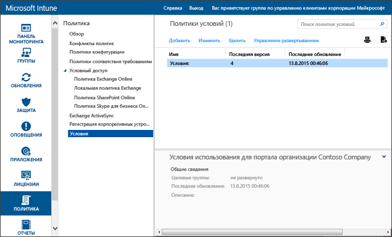

# Параметры политики условий в Microsoft Intune
Можно развернуть условия Intune для групп пользователей, чтобы объяснить, как регистрация, доступ к рабочим ресурсам и приложение корпоративного портала влияют на устройства и пользователей. Пользователи должны сначала принять эти условия, чтобы в дальнейшем использовать корпоративный портал для регистрации и доступа к своей работе.

Можно создать и развернуть несколько политик, содержащих различные условия. Также можно создать несколько версий одних и тех условий на разных языках, а затем развернуть их в соответствующих группах.

## Создание политики условий

1.  В [консоли администрирования Microsoft Intune](http://manage.microsoft.com) выберите **Политика** &gt; **Условия**.

    

2.  Щелкните **Добавить** для создания новой политики условий.

    Существующую политику можно, помимо прочего, **Изменить** или **Удалить**.

3.  На странице **Создать условия** введите следующие данные.

    -   **Имя**&mdash;Уникальное имя политики, отображаемое в консоли Intune.

    -   **Описание**&mdash;Подробные сведения, помогающие найти политику в консоли Intune.

    -   **Заголовок**&mdash;Заголовок, который пользователи видят на корпоративном портале.

    -   **Текст, разъясняющий, что значит согласие пользователя**&mdash;Выводимая пользователям метка, которая относится к принятию условий. Пример: "Я принимаю условия".

4.  По завершении нажмите кнопку **Сохранить**. Новая политика отображается в узле **Условия** рабочей области **Политика**.

## Развертывание политики условий

1.  В [консоли администрирования Microsoft Intune](http://manage.microsoft.com) выберите **Политика** &gt; **Условия**.

2.  В списке **Политики условий** выберите политику, которую нужно развернуть, и щелкните **Управление развертыванием**.

3.  В диалоговом окне **Управление развертыванием** выберите группы пользователей, для которых требуется развернуть политику, а затем нажмите кнопку **ОК**.

    При доступе целевых пользователей к корпоративному порталу служба Intune отображает развернутые условия. Чтобы получить доступ к корпоративным ресурсам, пользователи должны сначала принять эти условия.

## Мониторинг политики условий

1.  В [консоли администрирования Microsoft Intune](http://manage.microsoft.com) выберите **Политика** &gt; **Условия**.

2.  В окне **Создать новый отчет** нажмите кнопку **Просмотреть отчет**. Появится отчет с подробными сведениями о пользователях, которые приняли развернутые условия.

### Обновления и управление версиями для условий
При изменении существующей политики условий можно выбрать поведение в ходе развертывания политики. Для обновления существующих политик условий используйте следующую процедуру.

## Работа с несколькими версиями условий

1.  В [консоли администрирования Microsoft Intune](http://manage.microsoft.com) выберите **Политика** &gt; **Условия**.

2.  Выберите политику условий, которую требуется изменить, и нажмите кнопку **Изменить**.

3.  На странице **Изменить условия** внесите необходимые изменения, а затем укажите, требуется ли в этой новой версии, чтобы условия приняли все пользователи, или новую версию увидят только новые пользователи.

    Мы рекомендуем увеличивать номер версии и требовать принимать условия при каждом внесении существенных изменений в политику условий. При исправлении опечаток или, например, изменении форматирования, не изменяйте номер текущей версии.

### См. также
[Управление параметрами и компонентами на устройствах с помощью политик Microsoft Intune](manage-settings-and-features-on-your-devices-with-microsoft-intune-policies.md)

<!--HONumber=Nov16_HO2-->

