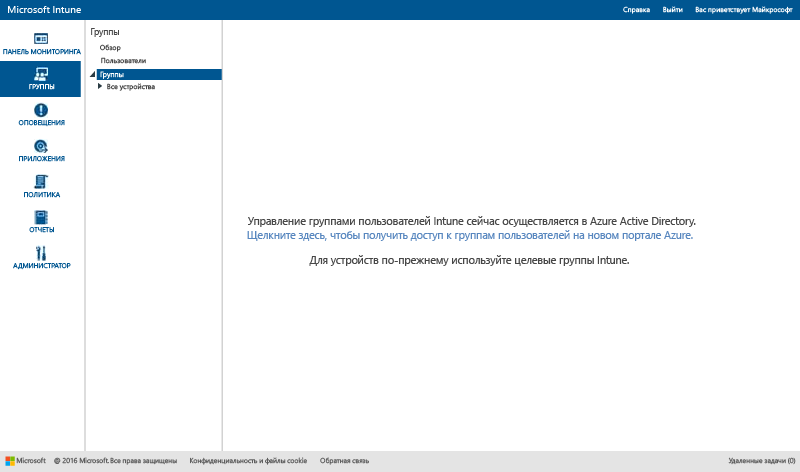

# Использование групп для управления пользователями и устройствами в Microsoft Intune

В этой статье описывается создание групп в Intune. Здесь также содержатся сведения о том, какие изменения в управлении группами произойдут в ближайшие месяцы. 

>[!IMPORTANT]
>
>Если при открытии рабочей области "Группы" на портале Intune отображается ссылка на портал Azure Active Directory (Azure AD), то вы уже используете *новый* подход к управлению группами безопасности Azure AD в Intune, описанный в разделе [Уведомление о предстоящих улучшениях в среде администрирования групп](#notice-of-upcoming-improvements-to-the-admin-experience-for-groups). Щелкните ссылку на портал Azure AD, чтобы приступить к созданию групп и управлению ими.
>
> 
>
>Если ссылка на портал Azure AD отсутствует, значит вы все еще используете *текущий* подход к управлению группами, описанный в разделе [Создание групп для управления пользователями и устройствами с помощью Microsoft Intune](#Create-groups-to-manage-users-and-devices-with-Microsoft-Intune) этой статьи.

## Уведомление о предстоящих улучшениях в среде администрирования групп

Вы сообщали нам, что предпочли бы единую среду работы с группированием и нацеливанием для Enterprise Mobility + Security. Мы услышали ваши пожелания. На основе ваших отзывов группы Intune вскоре будут преобразованы в группы безопасности на основе Azure Active Directory. Это изменение позволит унифицировать управление группами в Intune и Azure Active Directory (Azure AD). Новая среда работы означает, что вам не потребуется дублировать группы между службами. Кроме того, будет реализована расширяемость на основе Windows PowerShell и Microsoft Graph.

### Как это повлияет на работу?
Если вы уже являетесь клиентом Intune, это изменение на вас не повлияет. Но вскоре вы можете ожидать следующие изменения.

-   В новых учетных записях будут использоваться группы безопасности Azure AD вместо групп *пользователей* Intune.   
-   В ноябре 2016 г. новые учетные записи, подготовленные после ежемесячного выпуска службы, будут управлять группами пользователей и устройств на портале Azure AD. Это не повлияет на существующих клиентов.
-   В декабре 2016 г. группа разработчиков Intune начнет миграцию существующих клиентов в новую среду управления группами на основе Azure AD. Все текущие группы пользователей и устройств Intune будут перенесены в группы безопасности Azure AD. Мы не приступим к миграции, пока не будем уверены в возможности свести к минимуму влияние на вашу повседневную работу и удобство работы пользователей. Перед переносом вашей учетной записи вы получите уведомление.

### Как и когда будет выполняться переход на новые группы?
Миграция существующих клиентов Intune будет выполняться постепенно. Мы составим расписание миграции и обновим этот раздел через несколько недель, чтобы предоставить вам дополнительные сведения. Вы получите предварительное уведомление о миграции. Если при миграции у вас возникнут проблемы, обратитесь к рабочей группе по миграции по адресу [intunegrps@microsoft.com](mailto:intunegrps@microsoft.com). Сведения о переносе групп см. в разделе [Перенос групп в Azure Active Directory](migrating-groups-to-azure-active-directory.md).

### Что произойдет с существующими группами пользователей и устройств?
 Группы пользователей и группы устройств, которые вы создали в Intune, будут перенесены в группы безопасности Azure AD. Группы Intune по умолчанию, например "Все пользователи", будут перенесены, только если вы используете их в развертываниях на момент миграции. Процесс миграции для некоторых групп может быть более сложным. Мы уведомим вас, если потребуются дополнительные действия для миграции в вашей организации.

### Какие новые возможности будут доступны?
Ниже представлены новые функциональные возможности в рамках миграции групп Intune в Azure Active Directory.

-    Группы безопасности Azure AD будут поддерживаться в Intune для всех типов развертывания.
-    Группы безопасности Azure AD будут поддерживать группирование пользователей и устройств.
-    Группы безопасности Azure AD будут поддерживать динамические группы с атрибутами устройств Intune. Например, вы сможете динамически группировать устройства по платформе, например iOS. При регистрации нового устройства iOS в вашей организации оно будет автоматически добавляться в динамическую группу устройств iOS.
-    Вам будут доступны возможности совместного администрирования для управления группами Azure AD и Intune.
- Роль администратора службы Intune будет добавлена в Azure AD, чтобы разрешить администраторам служб Intune выполнять задачи управления группами в Azure AD.

### Какие функции Intune не будут доступны?
Несмотря на то что среда работы с группами будет улучшена, некоторые функциональные возможности Intune станут недоступными после миграции групп Intune в группы безопасности Azure AD.

#### Функции управления группами

-   После миграции вы не сможете исключать членов и группы при создании новой группы. Тем не менее с помощью динамических групп Azure AD вы сможете использовать атрибуты для создания расширенных правил, которые можно использовать для исключения членов из группы на основе заданных критериев.
-   Группы "Несгруппированные пользователи" и "Несгруппированные устройства" поддерживаться не будут. Мы не будем переносить эти группы из Intune в Azure AD.

#### Функции, зависящие от групп

-   Роль администратора служб утратит разрешения на **управление группами**.
-   Вы не сможете группировать устройства Exchange ActiveSync. Группа "Все управляемые устройства EAS" будет преобразована из представления группы в представление отчета.
-  Сведение с группами в отчетах будет недоступно.
-  Настраиваемое нацеливание правил уведомлений для групп будет недоступно.

### Как можно подготовиться к этому изменению?
 Ниже приведены рекомендации, которые помогут вам упростить переход.

- Удалите все нежелательные или ненужные группы Intune перед миграцией.
- Оцените использование режима исключения в группах и рассмотрите возможность преобразования групп таким образом, чтобы отказаться от исключений.
-  Если в организации есть администраторы, у которых нет разрешений на создание групп в Azure AD, попросите администратора Azure AD добавить их в роль Azure AD "Администратор служб Intune".

## Создание групп для управления пользователями и устройствами в Microsoft Intune

В этом разделе описывается создание групп Intune в консоли администрирования Intune.

Для создания групп и управления ими используется рабочая область **Группы** в консоли администрирования Microsoft Intune. На странице **Обзор групп** выводятся сводные данные о состоянии, позволяющие выявлять проблемы и определять их приоритеты в следующих направлениях. Данные в сводках состояния относятся к следующим областям:

-   Предупреждения
-   Обновления программного обеспечения
-   Endpoint Protection
-   Политика
-   Управление программным обеспечением

Для иерархии групп также отображаются сводки состояния, помогающие выявлять и устранять проблемы для членов выбранной группы.

## Создание групп

> [!TIP]
> При создании групп учитывайте, как именно планируется применить политики. Например, можно использовать политики для конкретных операционных систем устройств и политики для различных ролей в организации или для подразделений, уже определенных в Active Directory. Может быть более удобно иметь отдельные группы устройств для iOS, Android и Windows, а также группы пользователей для каждой роли в организации.
>
> Возможно, вам также потребуется создать политику по умолчанию, которая применяется ко всем группам и устройствам, чтобы обеспечить соответствие некоторым основным требованиям вашей организации. Затем можно создать более конкретные политики для наиболее широких категорий пользователей и устройств. Например, можно создать политики электронной почты для каждой операционной системы устройства.
>
> Ответственно отнеситесь к именованию политик, чтобы их можно было легко найти впоследствии. Например, хорошим и содержательным именем политики является **Политика электронной почты WP для всей компании**.
>
> Каждый раз при создании ограничительной политики вам потребуется донести ее смысл до пользователей. После создания более общих групп и политик уделите особое внимание созданию групп меньшего размера, чтобы исключить излишнее взаимодействие.

### Создание группы устройств

1.  В консоли администрирования Intune выберите **Группы** &gt; **Обзор** &gt; **Создать группу**.

2.  Укажите имя и описание (необязательное) группы и выберите группу устройств в качестве родительской группы. Нажмите кнопку **Далее**.

3.  На странице **Определение условий членства** выберите тип устройств, которые будут входить в группу. В зависимости от типов устройств, включаемых в группу, предусмотрены дополнительные группы параметров конфигурации.

    -   **Компьютер**. Выберите, следует ли включать всех членов родительской группы, а также включаемые или исключаемые подразделения и домены. Сведения о подразделениях и доменах для компьютера можно получить из данных инвентаризации.

    -   **Мобильные**. Выберите, следует ли включать мобильные устройства, управляемые Intune и (или) Exchange ActiveSync.

    -   **Все устройства**. Этот параметр включает все устройства без исключений на основании каких-либо условий.

4.  На странице **Определение прямого членства** нажмите кнопку **Обзор**, чтобы выбрать отдельные устройства для включения или исключения. При выборе устройств, не входящих в указанную родительскую группу, Intune автоматически добавляет эти устройства в родительскую группу.

5.  На странице **Сводка** проверьте выбранные элементы, после чего нажмите кнопку **Готово**.

Созданная группа появится в списке **Группы** в рабочей области **Группы** в родительской группе. Здесь также можно изменять или удалять группу.

### Создание группы пользователей

1.  В консоли администрирования Intune выберите **Группы** &gt; **Обзор** &gt; **Создать группу**.

2.  Укажите имя и описание (необязательное) группы и выберите группу пользователей в качестве родительской группы. Нажмите кнопку **Далее**.

3.  На странице **Определение условий членства** выберите, следует ли включать всех членов родительской группы или нужно начать с пустой группы. Затем включите или исключите членов на основе групп безопасности пользователей, настраиваемых вручную в [Центре администрирования Office 365](http://go.microsoft.com/fwlink/?LinkId=698854) или синхронизируемых из Active Directory. При изменении членства в группе безопасности происходит изменение членства в группах пользователей, основанных на этой группе безопасности.

    > [!IMPORTANT]
    > В настоящее время, если ваша группа содержит членов из определенных групп безопасности или групп руководителей и вы исключаете членов из некоторых групп, изначально включенные вами члены будут удалены. Чтобы создать группу, содержащую включенных и исключенных членов, рекомендуется сначала создать родительскую группу, содержащуювключенных членов. Затем создайте дочернюю группу для этой родительской группы. В новую дочернюю группу добавьте исключенных членов. Затем используйте эту дочернюю группу для управления политиками, профилями и распространением приложений в Intune.

    > [!NOTE]
    > На портале Azure можно создать группы, основанные на руководителях, которым подчиняются пользователи. Эти группы относятся к динамическому типу и изменяются по мере добавления или удаления сотрудников в команде этого руководителя в Azure Active Directory. Процедура создания группы Azure на основе имени руководителя описана в разделе **Настройка группы в качестве группы "Руководитель"** статьи [Использование атрибутов для создания расширенных правил](https://azure.microsoft.com/en-us/documentation/articles/active-directory-accessmanagement-groups-with-advanced-rules/).

4.  На странице **Определение прямого членства** нажмите кнопку **Обзор**, чтобы выбрать отдельных пользователей для включения или исключения. При выборе пользователей, не входящих в указанную родительскую группу, эти пользователи автоматически добавляются в родительскую группу. В нижней части диалогового окна **Выбор членов** находится элемент для добавления пользователей вручную. Это удобно, если вы хотите добавить пользователя, у которого пока нет зарегистрированного устройства.

5.  На странице **Сводка** проверьте выбранные элементы, после чего нажмите кнопку **Готово**.

Созданная группа появится в списке **Группы** в рабочей области **Группы** в родительской группе. Здесь также можно изменять или удалять группу.

> [!TIP]
> Группы безопасности хорошо подходят для заполнения групп пользователей. Так как группы безопасности определяют, кто именно имеет доступ к определенным ресурсам, эти сведения можно легко преобразовать в группы пользователей Intune. Все группы безопасности, синхронизируемые из Active Directory в Azure Active Directory или созданные непосредственно в Azure Active Directory с помощью Центра администрирования Office 365 или портала Azure, доступны для создания групп пользователей в Intune.

## Фильтрация представлений администратора по ролям
В отфильтрованных представлениях групп можно настраивать элементы, доступные для ИТ-администраторов в зависимости от роли администратора. Кроме того, можно ограничить число групп, которым может управлять каждый ИТ-администратор. Это может быть полезно в следующих случаях.

-   ИТ-администраторы должны иметь возможность развертывать элементы только для определенных пользователей и устройств.
-   ИТ-администраторы должны иметь возможность просматривать только те группы, которые имеют к ним отношение.

Отфильтрованные представления групп можно настроить для администраторов службы в консоли администрирования Intune. Дополнительные сведения см. в статье [Предварительные сведения перед началом работы с Microsoft Intune](/intune/get-started/what-to-know-before-you-start-microsoft-intune).

После настройки отфильтрованных представлений групп для администратора служб при развертывании администратором программного обеспечения или политик (или выполнении отчетов), администратор может просматривать и выбирать только указанные вами группы. Кроме того, администратору недоступны сведения о состоянии на следующих страницах консоли администрирования:

-   **Обзор системы**
-   **Общие сведения о группах**
-   **Обзор Endpoint Protection**
-   **Общие сведения о предупреждениях**
-   **Обзор программного обеспечения**
-   **Общие сведения о политике**

### Создание отфильтрованного представления группы

1.  В консоли администрирования Intune выберите **Администрирование** &gt; **Управление администраторами** &gt; **Администраторы служб**.

2.  Выберите администратора службы, для которого требуется создать отфильтрованное представление группы, а затем выберите **Управление группами**.

3.  В диалоговом окне **Выбор группы, видимой администратору службы** добавьте группы, доступ к которым может получить администратор служб, а затем нажмите кнопку **ОК**.

После настройки отфильтрованных представлений групп ИТ-администратор сможет просматривать и выбирать только указанные вами группы.

## Управление группами
После создания групп ими можно управлять в соответствии с потребностями организации.

Вы можете изменить имя или описание группы, а также ее членов.

Вы можете удалить группу, если она больше не удовлетворяет потребностям вашей организации. При удалении группы пользователи, которые входят в нее, не удаляются.

## Дальнейшие шаги
После настройки групп и политик изучите **Предполагаемое значение** и **Состояние**, чтобы оценить практическую значимость такой структуры.

### Проверка структуры

1. Выберите любое устройство в группе устройств и просмотрите категории сведений в верхней части страницы.
2. Выберите **Политика**. Вы увидите нечто похожее на этот снимок экрана с параметрами политик устройства Android.

Каждая политика имеет **Предполагаемое значение** и **Состояние**. Предполагаемое значение — это то, чего вы намереваетесь достичь при назначении политики. Состояние — это совокупный результат всех примененных к устройству политик, а также требований и ограничений оборудования и операционной системы. На снимке экрана можно увидеть два понятных примера:

-   Для параметра **Разрешить использование простых паролей** задано значение **Да**, как показано в столбце **Предполагаемое значение**, однако он имеет **Состояние** **Неприменимо**. Это вызвано тем, что простые пароли не поддерживаются для устройств Android.
-   Аналогично, элемент расширенной политики **Параметры электронной почты для устройств iOS** не применяется к этому устройству, так как оно работает под управлением Android.

> [!NOTE]
> Помните, что при наличии двух политик с разными уровнями ограничений, применимых к одному и тому же устройству или пользователю, используется более строгая политика.

<!--HONumber=Nov16_HO1-->

