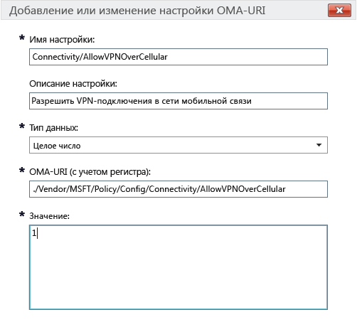

# Параметры политики Intune для устройств на базе Windows 10 в Microsoft Intune

[!INCLUDE[classic-portal](../includes/classic-portal.md)]

Сведения в этом разделе помогут вам разобраться в параметрах политик Intune, которые можно использовать для управления устройствами на базе ОС Windows 10. Ознакомьтесь с этим разделом и процедурами из раздела [Управление настройками и компонентами на устройствах с помощью политик Microsoft Intune](manage-settings-and-features-on-your-devices-with-microsoft-intune-policies.md), чтобы настроить стандартные и пользовательские параметры для зарегистрированных устройств на базе ОС Windows 10 Desktop и Windows 10 Mobile. Эти политики нельзя использовать на компьютерах под управлением [клиентского программного обеспечения Intune](/intune/get-started/windows-pc-management-capabilities-in-microsoft-intune).

Можно выбрать один из двух типов политик:

- **Настраиваемая политика** — используйте **настраиваемую политику** Microsoft Intune для Windows 10 и Windows 10 Mobile, чтобы развернуть параметры OMA-URI (универсальный код ресурса Open Mobile Alliance), которые могут применяться для управления функциями на устройствах. Windows 10 предоставляет множество параметров через [поставщика службы конфигурации (CSP) политик](https://technet.microsoft.com/itpro/windows/manage/how-it-pros-can-use-configuration-service-providers).
- **Общая политика конфигурации** — используйте этот тип политики, если хотите выбрать параметры из встроенного списка, поставляемого вместе с Microsoft Intune.

## Параметры настраиваемой политики

Укажите следующие параметры в настраиваемой политике.

### Общие

Введите имя и при необходимости описание политики для идентификации ее в консоли Intune.

### Параметры OMA-URI

Для каждого добавляемого параметра OMA-URI введите указанные ниже сведения. Сведения о параметрах, которые можно использовать, см. в [справочнике по настройкам URI для Windows 10](/intune/deploy-use/windows-10-policy-settings-in-microsoft-intune#Windows-10-URI-settings) в этом разделе.

- **Имя параметра** — введите уникальное название параметра OMA-URI, чтобы его было проще найти в списке параметров.
- **Описание параметра** — введите необязательное описание параметра.
- **Тип данных** — выберите один из следующих типов данных:
    - **Строка**
    - **Строка (XML)**
    - **Дата и время**
    - **Целое число**
    - **Число с плавающей запятой**
    - **Логическое значение**
- **OMA-URI (с учетом регистра)** — задайте OMA-URI, для которого необходимо указать параметр.
- **Значение** — укажите значение, которое требуется связать с заданным OMA-URI.

### Пример
На следующем снимке экрана параметр **Connectivity/AllowVPNOverCellular** был включен. Это позволяет устройству с Windows 10 открыть VPN-подключение по сети мобильной связи.

> 

## Настройки URI Windows 10
Этот раздел содержит сведения о параметрах OMA-URI, которые можно настроить с помощью **настраиваемой политики Windows 10**.

### Политика

|Имя политики и URI|Подробные сведения|
|---------------|------------|-----------|
|**Разрешить автоматическое обновление** ./Vendor/MSFT/Policy/Config/Update/AllowAutoUpdate|Только для настольных компьютеров **Тип данных:** целочисленный **Значения:** **0** - **5** (по умолчанию: **1**)|
|**День установки по расписанию** ./Vendor/MSFT/Policy/Config/Update/ScheduledInstallDay|Только для мобильных устройств **Тип данных:** целочисленный **Значения:** **0** — каждый день (по умолчанию) **1** — воскресенье **2** — понедельник **3** — вторник **4** — среда **5** — четверг **6** — пятница **7** — суббота|
|**Время установки по расписанию** ./Vendor/MSFT/Policy/Config/Update/ScheduledInstallTime|Для настольных компьютеров и мобильных устройств **Тип данных:** целочисленный **Значения:**  **0** – **23** часов (**0** — полночь) (по умолчанию: **3**)|
|**DeviceLock/AllowIdleReturnWithoutPassword** ./Vendor/MSFT/Policy/Config/DeviceLock/AllowIdleReturnWithoutPassword|Только для мобильных устройств **Тип данных:** целочисленный **Значения:** **0** — пользователь не может установить таймер периода отсрочки пароля, и задано значение "каждый раз". **1** — пользователь может установить таймер периода отсрочки пароля (по умолчанию)|
|**WiFi/AllowWiFi** ./Vendor/MSFT/Policy/Config/WiFi/AllowWiFi|Только для мобильных устройств **Тип данных:** целочисленный **Значения:** **0** — запретить **использовать подключения Wi-Fi**. **1** — разрешить **использовать подключения Wi-Fi** (значение по умолчанию).|
|**WiFi/AllowInternetSharing** ./Vendor/MSFT/Policy/Config/WiFi/AllowInternetSharing|Для настольных компьютеров и мобильных устройств **Тип данных:** целочисленный **Значения: ** **0** — запретить общий Интернет.   **1** — разрешить общий Интернет (значение по умолчанию).|
|**WiFi/AllowAutoConnectToWiFiSenseHotspots** ./Vendor/MSFT/Policy/Config/WiFi/AllowAutoConnectToWiFiSenseHotspots|Для настольных компьютеров и мобильных устройств **Тип данных:** целочисленный **Значения: ** **0** — запрещено.  **1** — разрешено (значение по умолчанию).|
|**WiFi/AllowManualWiFiConfiguration** ./Vendor/MSFT/Policy/Config/WiFi/AllowManualWiFiConfiguration|Только для мобильных устройств **Тип данных:** целочисленный **Значения:** **0** — разрешить только подключения Wi-Fi, настроенные при помощи MDM. **1** — разрешить добавление идентификаторов SSID новой сети помимо идентификаторов SSID, которые уже были созданы MDM (значение по умолчанию).|
|**System/AllowLocation** ./Vendor/MSFT/Policy/Config/System/AllowLocation|Для настольных компьютеров и мобильных устройств **Тип данных:** целочисленный **Значения: ** **0** — запрещено.  **1** — разрешено (значение по умолчанию).|
|**System/AllowTelemetry** ./Vendor/MSFT/Policy/Config/System/AllowTelemetry|Для настольных компьютеров и мобильных устройств **Тип данных:** целочисленный **Значения:** **0** — запрещено (параметр только для выпуска Корпоративная) **1** — ограничено **2** — полностью (по умолчанию) **3** — полностью и диагностическая информация|
|**System/AllowExperimentation** ./Vendor/MSFT/Policy/Config/System/AllowExperimentation|Для настольных компьютеров и мобильных устройств **Тип данных:** целочисленный **Значения:** **0** — запрещено **1** — только параметры (по умолчанию) **2** — параметры и эксперименты|
|**Security/AntiTheftMode** ./Vendor/MSFT/Policy/Config/Security/AntiTheftMode|Только для мобильных устройств **Тип данных:** целочисленный **Значения:** **0** — запретить режим защиты от краж **1** — по усмотрению пользователя (значение по умолчанию).|
|**Connectivity/AllowUSBConnection** ./Vendor/MSFT/Policy/Config/Connectivity/AllowUSBConnection|Только для мобильных устройств **Тип данных:** целочисленный **Значения: ** **0** — запрещено.  **1** — разрешено (значение по умолчанию).|
|**System/AllowUserToResetPhone** ./Vendor/MSFT/Policy/Config/System/AllowUserToResetPhone|Только для мобильных устройств **Тип данных:** целочисленный **Значения: ** **0** — запрещено. **1** — разрешено (значение по умолчанию).|
|**Connectivity/AllowCellularDataRoaming** ./Vendor/MSFT/Policy/Config/Connectivity/AllowCellularDataRoaming|Для настольных компьютеров и мобильных устройств **Тип данных:** целочисленный **Значения: ** **0** — запрещено.  **1** — разрешено (значение по умолчанию).|
|**Connectivity/AllowVPNOverCellular** ./Vendor/MSFT/Policy/Config/Connectivity/AllowVPNOverCellular|Для настольных компьютеров и мобильных устройств **Тип данных:** целочисленный **Значения:** **0** — VPN через сотовую сеть запрещена **1** — VPN может использовать любые соединения, включая сотовые сети (по умолчанию)|
|**Connectivity/AllowVPNRoamingOverCellular** ./Vendor/MSFT/Policy/Config/Connectivity/AllowVPNRoamingOverCellular|Только для мобильных устройств **Тип данных:** целочисленный **Значения: ** **0** — запрещено.  **1** — разрешено (значение по умолчанию).|
|**Connectivity/AllowVPNRoamingOverCellular** ./Vendor/MSFT/Policy/Config/Connectivity/AllowVPNRoamingOverCellular|Только для мобильных устройств **Тип данных:** целочисленный **Значения: ** **0** — запрещено.  **1** — разрешено (значение по умолчанию).|
|**Connectivity/AllowBluetooth** ./Vendor/MSFT/Policy/Config/Connectivity/AllowBluetooth|Для настольных компьютеров и мобильных устройств **Тип данных:** целочисленный **Значения:** **0** — пользователю запрещено включить Bluetooth. **1** — зарезервировано. Пользователь может включить и настроить Bluetooth (не поддерживается в Windows Phone 8.1 для MDM, EAS Windows 10 Desktop или Windows 10 Mobile). **2** — разрешено. Пользователь может включить и настроить Bluetooth (значение по умолчанию).|
|**Experience/AllowScreenCapture** ./Vendor/MSFT/Policy/Config/Experience/AllowScreenCapture|Только для мобильных устройств **Тип данных:** целочисленный **Значения: ** **0** — запрещено.  **1** — разрешено (значение по умолчанию).|
|**Experience/AllowTaskSwitcher** ./Vendor/MSFT/Policy/Config/Experience/AllowTaskSwitcher|Только для мобильных устройств **Тип данных:** целочисленный **Значения: ** **0** — запрещено.  **1** — разрешено (значение по умолчанию).|
|**Experience/AllowVoiceRecording** ./Vendor/MSFT/Policy/Config/Experience/AllowVoiceRecording|Только для мобильных устройств **Тип данных:** целочисленный **Значения: ** **0** — запрещено.  **1** — разрешено (значение по умолчанию).|
|**Experience/AllowSyncMySettings** ./Vendor/MSFT/Policy/Config/Experience/AllowSyncMySettings|Только для мобильных устройств **Тип данных:** целочисленный **Значения: ** **0** — запретить роуминг.  **1** — разрешить роуминг (по умолчанию)|
|**Experience/AllowManualMDMUnenrollment** ./Vendor/MSFT/Policy/Config/Experience/AllowManualMDMUnenrollment|Для настольных компьютеров и мобильных устройств **Тип данных:** целочисленный **Значения: ** **0** — запрещено.  **1** — разрешено (значение по умолчанию).|
|**Accounts/AllowMicrosoftAccountConnection** ./Vendor/MSFT/Policy/Config/Accounts/AllowMicrosoftAccountConnection|Для настольных компьютеров и мобильных устройств **Тип данных:** целочисленный **Значения:**  **0** — запрещено  **1** — разрешено (значение по умолчанию).|
|**Accounts/AllowAddingNonMicrosoftAccountsManually** ./Vendor/MSFT/Policy/Config/Accounts/AllowAddingNonMicrosoftAccountsManually|Для настольных компьютеров и мобильных устройств **Тип данных:** целочисленный **Значения:**  **0** — запрещено  **1** — разрешено (значение по умолчанию).|
|**Security/AllowManualRootCertificateInstallation** ./Vendor/MSFT/Policy/Config/Security/AllowManualRootCertificateInstallation|Только для мобильных устройств **Тип данных:** целочисленный **Значения: ** **0** — запрещено.  **1** — разрешено (значение по умолчанию).|
|**Security/AllowAddProvisioningPackages** ./Vendor/MSFT/Policy/Config/Security/AllowAddProvisioningPackages|Для настольных компьютеров и мобильных устройств **Тип данных:** целочисленный **Значения: ** **0** — запрещено.  **1** — разрешено (значение по умолчанию).|
|**Search/DisableBackoff** ./Vendor/MSFT/Policy/Config/Search/DisableBackoff|Для настольных компьютеров и мобильных устройств **Тип данных:** целочисленный **Значения:**  **0** (по умолчанию)  **1**|
|**Search/PreventRemoteQueries** ./Vendor/MSFT/Policy/Config/Search/PreventRemoteQueries|Для настольных компьютеров и мобильных устройств **Тип данных:** целочисленный **Значения:**  **0**  **1** (по умолчанию)|
|**Search/AllowUsingDiacritics** ./Vendor/MSFT/Policy/Config/Search/AllowUsingDiacritics|Для настольных компьютеров и мобильных устройств **Тип данных:** целочисленный **Значения:**  **0** (по умолчанию)  **1**|
|**Search/AlwaysUseAutoLangDetection** ./Vendor/MSFT/Policy/Config/Search/AlwaysUseAutoLangDetection|Для настольных компьютеров и мобильных устройств **Тип данных:** целочисленный **Значения:**  **0** (по умолчанию)  **1**|
|**Search/DisableRemovableDriveIndexing** ./Vendor/MSFT/Policy/Config/Search/DisableRemovableDriveIndexing|Для настольных компьютеров и мобильных устройств **Тип данных:** целочисленный **Значения: ** **0** (значение по умолчанию).  **1**|
|**Search/PreventIndexingLowDiskSpaceMB** ./Vendor/MSFT/Policy/Config/Search/PreventIndexingLowDiskSpaceMB|Для настольных компьютеров и мобильных устройств **Тип данных:** целочисленный **Значения:**  **0**  **1** (по умолчанию)|
|**Search/AllowIndexingEncryptedStoresOrItems** ./Vendor/MSFT/Policy/Config/Search/AllowIndexingEncryptedStoresOrItems|Для настольных компьютеров и мобильных устройств **Тип данных:** целочисленный **Значения:**  **0** (по умолчанию)  **1**|
|**Security/AllowRemoveProvisioningPackage** ./Vendor/MSFT/Policy/Config/Security/AllowRemoveProvisioningPackage|Для настольных компьютеров и мобильных устройств **Тип данных:** целочисленный **Значения: ** **0** — запрещено.  **1** — разрешено (значение по умолчанию).|
|**Security/RequireProvisioningPackageSignature** ./Vendor/MSFT/Policy/Config/Security/RequireProvisioningPackageSignature|Для настольных компьютеров и мобильных устройств **Тип данных:** целочисленный **Значения: ** **0** (значение по умолчанию).  **1**|
|**AboveLock/AllowActionCenterNotifications** ./Vendor/MSFT/Policy/Config/AboveLock/AllowActionCenterNotifications|Для настольных компьютеров и мобильных устройств **Тип данных:** целочисленный **Значения: ** **0** — запрещено.  **1** — разрешено (значение по умолчанию).|
|**TextInput/AllowIMENetworkAccess** ./Vendor/MSFT/Policy/Config/TextInput/AllowIMENetworkAccess|Только для настольных компьютеров **Тип данных:** целочисленный **Значения:** **0** — запретить. Словарь Open Extended Dictionary отключен. Пользователь не может выполнять следующие действия: — Добавление нового словаря Open Extended Dictionary. — Добавление нового файла конфигурации интеграции поиска. – Использование подбора кандидатов в облаке. — Отправка зарегистрированного пользователем слова **1** — разрешить По умолчанию словарь Open Extended Dictionary можно добавлять и использовать. Кроме того, по умолчанию можно применить функцию интеграции поиска. Пользователь может выполнять следующие действия: – Использование подбора кандидатов в облаке.|
|**TextInput/AllowIMELogging** ./Vendor/MSFT/Policy/Config/TextInput/AllowIMELogging|Только для настольных компьютеров **Тип данных:** целочисленный **Значения:** **0** — ведение журнала ошибок преобразования отключено **1** — ведение журнала ошибок преобразования включено (по умолчанию)|
|**TextInput/AllowJapaneseNonPublishingStandardGlyph** ./Vendor/MSFT/Policy/Config/TextInput/AllowJapaneseNonPublishingStandardGlyph|Только для настольных компьютеров **Тип данных:** целочисленный **Значения: ** **0** — запрещено.  **1** — разрешено (значение по умолчанию).|
|**TextInput/AllowJapaneseIVSCharacters** ./Vendor/MSFT/Policy/Config/TextInput/AllowJapaneseIVSCharacters|Только для настольных компьютеров **Тип данных:** целочисленный **Значения: ** **0** — запрещено.  **1** — разрешено (значение по умолчанию).|
|**TextInput/AllowJapaneseUserDictionary** ./Vendor/MSFT/Policy/Config/TextInput/AllowJapaneseUserDictionary|Только для настольных компьютеров **Тип данных:** целочисленный **Значения: ** **0** — запрещено.  **1** — разрешено (значение по умолчанию).|
|**TextInput/AllowJapaneseIMESurrogatePairCharacters** ./Vendor/MSFT/Policy/Config/TextInput/AllowJapaneseIMESurrogatePairCharacters|Только для настольных компьютеров **Тип данных:** целочисленный **Значения: ** **0** — запрещено.  **1** — разрешено (значение по умолчанию).|
|**TextInput/ExcludeJapaneseIMEExceptShiftJIS** ./Vendor/MSFT/Policy/Config/TextInput/ExcludeJapaneseIMEExceptShiftJIS|Только для настольных компьютеров **Тип данных:** целочисленный **Значения:** **0** — никакие символы не фильтруются (по умолчанию) **1** — фильтруется все, за исключением символов Shift JIS|
|**TextInput/ExcludeJapaneseIMEExceptJIS0208** ./Vendor/MSFT/Policy/Config/TextInput/ExcludeJapaneseIMEExceptJIS0208|Только для настольных компьютеров **Тип данных:** целочисленный **Значения:** **0** — никакие символы не фильтруются (по умолчанию) **1** — фильтруется все, за исключением символов JIS0208|
|**TextInput/ExcludeJapaneseIMEExceptJIS0208andEUDC** ./Vendor/MSFT/Policy/Config/TextInput/ExcludeJapaneseIMEExceptJIS0208andEUDC|Только для настольных компьютеров **Тип данных:** целочисленный **Значения:** **0** — никакие символы не фильтруются (по умолчанию) **1** — фильтруется все, за исключением символов JIS0208 и EUDC|
|**TextInput/AllowInputPanel** ./Vendor/MSFT/Policy/Config/TextInput/AllowInputPanel|Только для настольных компьютеров **Тип данных:** целочисленный **Значения: ** **0** — запрещено.  **1** — разрешено (значение по умолчанию).|
|**Bluetooth/AllowDiscoverableMode** ./Vendor/MSFT/Policy/Config/Bluetooth/AllowDiscoverableMode|Для настольных компьютеров и мобильных устройств **Тип данных:** целочисленный **Значения: ** **0** — запрещено.  **1** — разрешено (значение по умолчанию).|
|**Bluetooth/AllowAdvertising** ./Vendor/MSFT/Policy/Config/Bluetooth/AllowAdvertising|Для настольных компьютеров и мобильных устройств **Тип данных:** целочисленный **Значения: ** **0** — запрещено.  **1** — разрешено (значение по умолчанию).|
|**Settings/AllowDataSense** ./Vendor/MSFT/Policy/Config/Settings/AllowDataSense|Для настольных компьютеров и мобильных устройств **Тип данных:** целочисленный **Значения: ** **0** — запрещено.  **1** — разрешено (значение по умолчанию).|
|**Settings/AllowVPN** ./Vendor/MSFT/Policy/Config/Settings/AllowVPN|Для настольных компьютеров и мобильных устройств **Тип данных:** целочисленный **Значения: ** **0** — запрещено.  **1** — разрешено (значение по умолчанию).|
|**Settings/AllowWorkplace** ./Vendor/MSFT/Policy/Config/Settings/AllowWorkplace|Только для настольных компьютеров **Тип данных:** целочисленный **Значения: ** **0** — запрещено.  **1** — разрешено (значение по умолчанию).|
|**Settings/AllowDateTime** ./Vendor/MSFT/Policy/Config/Settings/AllowDateTime|Для настольных компьютеров и мобильных устройств **Тип данных:** целочисленный **Значения: ** **0** — запрещено.  **1** — разрешено (значение по умолчанию).|
|**Settings/AllowLanguage** ./Vendor/MSFT/Policy/Config/Settings/AllowLanguage|Только для настольных компьютеров **Тип данных:** целочисленный **Значения: ** **0** — запрещено.  **1** — разрешено (значение по умолчанию).|
|**Settings/AllowRegion** ./Vendor/MSFT/Policy/Config/Settings/AllowRegion|Только для настольных компьютеров **Тип данных:** целочисленный **Значения: ** **0** — запрещено.  **1** — разрешено (значение по умолчанию).|
|**Settings/AllowSignInOptions** ./Vendor/MSFT/Policy/Config/Settings/AllowSignInOptions|Только для настольных компьютеров **Тип данных:** целочисленный **Значения: ** **0** — запрещено.  **1** — разрешено (значение по умолчанию).|
|**Settings/AllowYourAccount** ./Vendor/MSFT/Policy/Config/Settings/AllowYourAccount|Для настольных компьютеров и мобильных устройств **Тип данных:** целочисленный **Значения: ** **0** — запрещено.  **1** — разрешено (значение по умолчанию).|
|**Settings/AllowPowerSleep** ./Vendor/MSFT/Policy/Config/Settings/AllowPowerSleep|Только для настольных компьютеров **Тип данных:** целочисленный **Значения: ** **0** — запрещено.  **1** — разрешено (значение по умолчанию).|
|**Settings/AllowAutoPlay** ./Vendor/MSFT/Policy/Config/Settings/AllowAutoPlay|Только для настольных компьютеров **Тип данных:** целочисленный **Значения: ** **0** — запрещено.  **1** — разрешено (значение по умолчанию).|
|**Experience/AllowCortana** ./Vendor/MSFT/Policy/Config/Experience/AllowCortana|Для настольных компьютеров и мобильных устройств **Тип данных:** целочисленный **Значения: ** **0** — запрещено.  **1** — разрешено (значение по умолчанию).|
|**Search/SafeSearchPermissions** ./Vendor/MSFT/Policy/Config/Search/SafeSearchPermissions|Только для мобильных устройств **Тип данных:** целочисленный **Значения:** **0** — строгий режим: наибольшая фильтрация содержимого для взрослых **1** — умеренный режим: умеренная фильтрация содержимого для взрослых (допустимые результаты поиска не будут фильтроваться — по умолчанию)|
|**Experience/AllowCopyPaste** ./Vendor/MSFT/Policy/Config/Experience/AllowCopyPaste|Только для настольных компьютеров **Тип данных:** целочисленный **Значения: ** **0** — запрещено.  **1** — разрешено (значение по умолчанию).|
|**Размер принудительного запуска** ./Vendor/MSFT/Policy/Config/Start/ForceStartSize|Только для мобильных устройств **Тип данных:** целочисленный **Значения:** **0** — разрешить пользователю изменять размер (по умолчанию) **1** — принудительно использовать неполноэкранный режим. **2** — принудительно использовать полноэкранный режим.|
|**Update/RequireDeferUpgrade** ./Vendor/MSFT/Policy/Config/Update/RequireDeferUpgrade|Для настольных компьютеров и мобильных устройств **Тип данных:** целочисленный **Значения:** **0** — не откладывать обновление (остаться в текущей ветви, CB — значение по умолчанию). **1** — разрешить откладывать обновления и установку новых версий (устройство следует правилам Current Branch for Business, CBB). Дополнительные сведения см. в разделе: [Общие сведения об обслуживании Windows 10](https://technet.microsoft.com/library/mt598226.aspx) [Планирование развертывания Windows 10](https://technet.microsoft.com/library/mt574241.aspx)|
|**Update/DeferUpdatePeriod** ./Vendor/MSFT/Policy/Config/Update/DeferUpdatePeriod|Для настольных компьютеров и мобильных устройств **Описание**: политика отсрочки обновлений программного обеспечения на период до четырех недель. **Тип данных:** целочисленный **Значения:**  **0** — немедленное применение обновлений (значение по умолчанию). **1**-**4** — число недель, на которое откладываются обновления программного обеспечения. Дополнительные сведения см. в разделе: [Общие сведения об обслуживании Windows 10](https://technet.microsoft.com/library/mt598226.aspx) [Планирование развертывания Windows 10](https://technet.microsoft.com/library/mt574241.aspx)|
|**Update/DeferUpgradePeriod** ./Vendor/MSFT/Policy/Config/Update/DeferUpgradePeriod|Для настольных компьютеров и мобильных устройств **Описание**: политика отсрочки обновлений компонентов на период до восьми месяцев **Тип данных:** целочисленный **Значения:** **0** — немедленное применение обновлений (значение по умолчанию). **1**-**8** — число месяцев, на которое откладывается установка новых версий компонентов. Дополнительные сведения см. в разделе: [Общие сведения об обслуживании Windows 10](https://technet.microsoft.com/library/mt598226.aspx) [Планирование развертывания Windows 10](https://technet.microsoft.com/library/mt574241.aspx)|
|**Update/PauseDeferrals** ./Vendor/MSFT/Policy/Config/Update/PauseDeferrals|Для настольных компьютеров и мобильных устройств **Описание:** позволяет устройству прекратить получение обновлений в течение 5 недель. **Тип данных:** целочисленный **Значения:** **0** — немедленное применение обновлений (значение по умолчанию). **1** — приостановка обновлений и установки новых версий (срок действия — пять недель)|

### Защитник Windows

|Имя политики и URI|Подробные сведения|
|---------------|-----------|
|**AllowRealtimeMonitoring** ./Vendor/MSFT/Policy/Config/Defender/AllowRealtimeMonitoring|Только для настольных компьютеров **Тип данных:** целочисленный **Значения: ** **0** — запрещено.  **1** — разрешено (значение по умолчанию).|
|**AllowBehaviorMonitoring** ./Vendor/MSFT/Policy/Config/Defender/AllowBehaviorMonitoring|Только для настольных компьютеров **Тип данных:** целочисленный **Значения: ** **0** — запрещено.  **1** — разрешено (значение по умолчанию).|
|**AllowIntrusionPreventionSystem** ./Vendor/MSFT/Policy/Config/Defender/AllowIntrusionPreventionSystem|Только для настольных компьютеров **Тип данных:** целочисленный **Значения: ** **0** — запрещено.  **1** — разрешено (значение по умолчанию).|
|**AllowIOAVProtection** ./Vendor/MSFT/Policy/Config/Defender/AllowIOAVProtection|Только для настольных компьютеров **Тип данных:** целочисленный **Значения:**  **0** — запрещено  **1** — разрешено (значение по умолчанию).|
|**AllowScriptScanning** ./Vendor/MSFT/Policy/Config/Defender/AllowScriptScanning|Только для настольных компьютеров **Тип данных:** целочисленный **Значения: ** **0** — запрещено.  **1** — разрешено (значение по умолчанию).|
|**AllowOnAccessProtection** ./Vendor/MSFT/Policy/Config/Defender/AllowOnAccessProtection|Только для настольных компьютеров **Тип данных:** целочисленный **Значения: ** **0** — запрещено.  **1** — разрешено (значение по умолчанию).|
|**RealTimeScanDirection** ./Vendor/MSFT/Policy/Config/Defender/RealTimeScanDirection|Только для настольных компьютеров **Тип данных:** целочисленный **Значения:** **0** — мониторинг всех файлов (по умолчанию) **1** — мониторинг входящих файлов **2** — мониторинг исходящих файлов|
|**DaysToRetainCleanedMalware** ./Vendor/MSFT/Policy/Config/Defender/DaysToRetainCleanedMalware|Только для настольных компьютеров **Тип данных:** целочисленный **Значения:** **0** - **90** — представляет время хранения вредоносных программ **0** — вечное хранение вредоносных программ в папке карантина без автоматического удаления (значение по умолчанию).|
|**AllowUserUIAccess** ./Vendor/MSFT/Policy/Config/Defender/AllowUserUIAccess|Только для настольных компьютеров **Тип данных:** целочисленный **Значения: ** **0** — запрещено.  **1** — разрешено (значение по умолчанию).|
|**ScanParameter** ./Vendor/MSFT/Policy/Config/Defender/ScanParameter|Только для настольных компьютеров **Тип данных:** целочисленный **Значения:** **1** — быстрая проверка (по умолчанию) **2** — полная проверка|
|**ScheduleScanDay** ./Vendor/MSFT/Policy/Config/Defender/ScheduleScanDay|Только для настольных компьютеров **Тип данных:** целочисленный **Значения:** **0** — каждый день (по умолчанию) **1** — понедельник **2** — вторник **3** — среда **4** — четверг **5** — пятница **6** — суббота **7** — воскресенье **8** — нет запланированной проверки|
|**ScheduleScanTime** ./Vendor/MSFT/Policy/Config/Defender/ScheduleScanTime|Только для настольных компьютеров **Тип данных:** целочисленный **Значения:** **0** — 12:00 **60** — 01:00 **120** — 02:00 (по умолчанию) **180** — 03:00 **240** — 04:00 **300** — 05:00 **360** — 06:00 **420** — 07:00 **480** — 08:00 **540** — 09:00 **600** — 10:00 **660** — 11:00 **720** — 12:00 **780** — 13:00 **840** — 14:00 **900** — 15:00 **960** — 16:00 **1020** — 17:00 **1080** — 18:00 **1140** — 19:00 **1200** — 20:00 **1260** — 21:00 **1320** — 22:00 **1381** — период обслуживания|
|**ScheduleQuickScanTime** ./Vendor/MSFT/Policy/Config/Defender/ScheduleQuickScanTime|Только для настольных компьютеров **Тип данных:** целочисленный **Значения:** **0** — 12:00 **60** — 01:00 **120** — 02:00 (по умолчанию) **180** — 03:00 **240** — 04:00 **300** — 05:00 **360** — 06:00 **420** — 07:00 **480** — 08:00 **540** — 09:00 **600** — 10:00 **660** — 11:00 **720** — 12:00 **780** — 13:00 **840** — 14:00 **900** — 15:00 **960** — 16:00 **1020** — 17:00 **1080** — 18:00 **1140** — 19:00 **1200** — 20:00 **1260** — 21:00 **1320** — 22:00 **1380** — 23:00|
|**AVGCPULoadFactor** ./Vendor/MSFT/Policy/Config/Defender/AVGCPULoadFactor|Только для настольных компьютеров **Тип данных:** целочисленный **Значения: ** **0** - **100** (значение по умолчанию — **50**).|
|**AllowArchiveScanning** ./Vendor/MSFT/Policy/Config/Defender/AllowArchiveScanning|Только для настольных компьютеров **Тип данных:** целочисленный **Значения: ** **0** — запрещено.  **1** — разрешено (значение по умолчанию).|
|**AllowEmailScanning** ./Vendor/MSFT/Policy/Config/Defender/AllowEmailScanning|Только для настольных компьютеров **Тип данных:** целочисленный **Значения: ** **0** — запрещено (значение по умолчанию).  **1** — разрешено.|
|**AllowFullScanRemovableDriveScanning** ./Vendor/MSFT/Policy/Config/Defender/AllowFullScanRemovableDriveScanning|Только для настольных компьютеров **Тип данных:** целочисленный **Значения: ** **0** — запрещено (значение по умолчанию).  **1** — разрешено.|
|**AllowFullScanOnMappedNetworkDrives** ./Vendor/MSFT/Policy/Config/Defender/AllowFullScanOnMappedNetworkDrives|Только для настольных компьютеров **Тип данных:** целочисленный **Значения: ** **0** — запрещено.  **1** — разрешено (значение по умолчанию).|
|**AllowScanningNetworkFiles** ./Vendor/MSFT/Policy/Config/Defender/AllowScanningNetworkFiles|Только для настольных компьютеров **Тип данных:** целочисленный **Значения: ** **0** — запрещено.  **1** — разрешено (значение по умолчанию) — также выполняется, когда RTP включен и разрешен.|
|**SignatureUpdateInterval** ./Vendor/MSFT/Policy/Config/Defender/SignatureUpdateInterval|Только для настольных компьютеров **Тип данных:** целочисленный **Значения:** **0** — не проверять подписи с определенным интервалом **1** — проверять подписи каждый час **2** — проверять каждые два часа  **24** — проверять каждый день. **8** — проверять каждые восемь часов (значение по умолчанию).|
|**AllowCloudProtection** ./Vendor/MSFT/Policy/Config/Defender/AllowCloudProtection|Только для настольных компьютеров **Тип данных:** целочисленный **Значения: ** **0** — запрещено.  **1** — разрешено (значение по умолчанию).|
|**SubmitSamplesConsent** ./Vendor/MSFT/Policy/Config/Defender/SubmitSamplesConsent|Только для настольных компьютеров **Тип данных:** целочисленный **Значения:** **0** — всегда запрашивать (по умолчанию) **1** — автоматически отправлять безопасные образцы **2** — никогда не отправлять **3** — автоматически отправлять все образцы|
|**ExcludedExtensions** ./Vendor/MSFT/Policy/Config/Defender/ExcludedExtensions|Только для настольных компьютеров **Тип данных:** строковый **Значения:** *&lt;Список расширений, разделенных точкой с запятой&gt;*, например **obj;lib** **По умолчанию** — никакие расширения не исключаются.|
|**ExcludedPaths** ./Vendor/MSFT/Policy/Config/Defender/ExcludedPaths|Только для настольных компьютеров **Тип данных:** строковый **Значения:** *&lt;Список путей, разделенных точкой с запятой&gt;* Например, **c:\test;c:\test1.exe** **По умолчанию** — никакие пути не исключаются.|
|**ExcludedProcesses** ./Vendor/MSFT/Policy/Config/Defender/ExcludedProcesses|Только для настольных компьютеров **Тип данных:** строковый **Значения:** *&lt;Список путей, разделенных точкой с запятой&gt;* Например, **c:\test.exe;c:\test1.exe** **По умолчанию** — никакие процессы не исключаются.|

### Браузер Edge

|Имя политики и URI|Подробные сведения|
|---------------|------------|-----------|
|**Разрешить браузер** ./Vendor/MSFT/Policy/Config/Browser/AllowBrowser|Только для мобильных устройств **Тип данных:** целочисленный **Значения: ** **0** — просмотр веб-страниц отключен.  **1** — просмотр веб-страниц включен (значение по умолчанию).|
|**AllowSearchSuggestionsinAddressBar** ./Vendor/MSFT/Policy/Config/Browser/AllowSearchSuggestionsinAddressBar|Для настольных компьютеров и мобильных устройств **Тип данных:** целочисленный **Значения: ** **0** — не показывать предложения.  **1** — показывать предложения (значение по умолчанию).|
|**SendIntranetTraffictoInternetExplorer** ./Vendor/MSFT/Policy/Config/Browser/SendIntranetTraffictoInternetExplorer|Только для настольных компьютеров **Тип данных:** целочисленный **Значения:** **0** — отключено (открывать сайты интрасети в браузере Edge — значение по умолчанию). **1** — включено (открывать сайты интрасети в Internet Explorer)|
|**Разрешить Do Not Track** ./Vendor/MSFT/Policy/Config/Browser/AllowDoNotTrack|Для настольных систем и мобильных устройств **Тип данных:** целочисленный **Значения: ** **0** — отключено (не отправлять DNT — значение по умолчанию).  **1** — включено (отправлять DNT)|
|**Настройка SmartScreen** ./Vendor/MSFT/Policy/Config/Browser/AllowSmartScreen|Для настольных компьютеров и мобильных устройств **Тип данных:** целочисленный **Значения: ** **0** — запретить.  **1** — разрешить (по умолчанию)|
|**Разрешить всплывающие окна** ./Vendor/MSFT/Policy/Config/Browser/AllowPopups|Только для настольных компьютеров **Тип данных:** целочисленный **Значения: ** **0** — блокировать всплывающие окна (значение по умолчанию).  **1** — разрешить всплывающие окна.|
|**Разрешить файлы cookie** ./Vendor/MSFT/Policy/Config/Browser/AllowCookies|Для настольных компьютеров и мобильных устройств **Тип данных:** целочисленный **Значения:** **0** — разрешить использование файлов cookie со всех веб-сайтов (по умолчанию) **1** — блокировать только сторонние файлы cookie **2** — блокировать все файлы cookie|
|**Разрешить сохранение пароля** ./Vendor/MSFT/Policy/Config/Browser/AllowPasswordManager|Для настольных компьютеров и мобильных устройств **Тип данных:** целочисленный **Значения:** **0** — диспетчер паролей отключен  **1** — диспетчер паролей включен (по умолчанию).|
|**Разрешить автозаполнение** ./Vendor/MSFT/Policy/Config/Browser/AllowAutofill|Только для настольных компьютеров **Тип данных:** целочисленный **Значения**:  **0** — отключено (по умолчанию)  **1** — включено|
|**Настройка списка корпоративных сайтов** ./Vendor/MSFT/Policy/Config/Browser/EnterpriseModeSiteList|Только для настольных компьютеров **Тип данных:** строковый **Значения:** **0** — не настроено. **1** — использовать список сайтов в режиме предприятия Internet Explorer, если он настроен (по умолчанию) **2** — укажите расположение списка сайтов предприятия|

## Параметры общей политики конфигурации

Используйте **общую политику конфигурации** Microsoft Intune для Windows 10, чтобы настроить встроенные параметры для зарегистрированных устройств на базе Windows 10 Mobile и Windows 10 Desktop.

### Пароль

|Имя параметра|Дополнительные сведения (если требуются)|
|----------------|----------------------|
|**Требовать пароль для разблокировки устройств**|-|
|**Требуемый тип пароля**|Указывает, должен ли пароль содержать буквы и цифры или только цифры|
|**Требуемый тип пароля** - **Минимальное число наборов символов**| Указывает, сколько наборов символов (строчных и прописных букв, цифр и символов) должно быть в пароле.|
|**Минимальная длина пароля**|Применяется только для Windows 10 Mobile|
|**Число разрешенных неудачных попыток входа перед очисткой устройства**.|Для устройств под управлением Windows 10: если для устройства включен BitLocker, после указанного числа неудачных попыток входа оно переключается в режим восстановления BitLocker. Если BitLocker для устройства не включен, этот параметр не применяется. Для устройств под управлением Windows 10 Mobile: после указанного числа неудачных попыток входа устройство будет очищено.|
|**Период бездействия до отключения экрана (в минутах)**|Указывает период бездействия устройства, по истечении которого экран блокируется.|
|**Срок действия пароля (дней)**|Указывает время, по истечении которого требуется сменить пароль устройства.|
|**Запоминать историю паролей**|Указывает, следует ли запретить пользователю применять использованные ранее пароли.|
|**Вести журнал паролей** - **Запретить использование предыдущих паролей**|Указывает число предыдущих паролей устройства, которые нельзя использовать.|
|**Требовать пароль при возвращении устройства из состояния простоя**|Указывает, что пользователь должен ввести пароль для разблокировки устройства (только Windows 10 Mobile).|

### Encryption

|Имя параметра|Дополнительные сведения (если требуются)|
|----------------|----------------------|
|**Требовать шифрование на мобильном устройстве**|Включает шифрование на целевых устройствах. (только для Windows 10 Mobile)|

### System (система)

|Имя параметра|Дополнительные сведения (если требуются)|
|----------------|----------------------|
|**Разрешить снимок экрана**|Позволяет пользователю сохранять содержимое экрана устройства в виде изображения (только Windows 10 Mobile).|
|**Разрешить регистрацию вручную**|Позволяет пользователю вручную удалить рабочую учетную запись с устройства.|
|**Разрешить установку корневого сертификата вручную**|Применяется к Windows 10 Mobile|
|**Разрешить отправку диагностических данных и данных об использовании в Майкрософт**|Возможные значения:  **Нет** — данные не передаются в корпорацию Майкрософт. **Основные** — в Майкрософт отправляются ограниченные сведения. **Расширенный** — в Майкрософт отправляются расширенные диагностические сведения. **Полный (рекомендуется)** — отправляются те же данные, что и в режиме **Расширенный**, а также дополнительные сведения о состоянии устройства.|

### Учетная запись и синхронизация

|Имя параметра|Дополнительные сведения (если требуются)|
|----------------|----------------------|---------------------|
|**Разрешить использование учетной записи Майкрософт**|Позволяет пользователю сопоставить учетную запись Майкрософт с устройством.|
|**Разрешить добавление учетных записей сторонних производителей вручную**|Позволяет пользователю добавлять на устройство учетные записи электронной почты, которые не сопоставлены с учетной записью Майкрософт.|
|**Разрешить синхронизацию настроек для учетных записей Майкрософт**|Разрешает синхронизацию параметров устройств и приложений, связанных с учетной записью Майкрософт, между устройствами.|

### Microsoft Edge

|Имя параметра|Дополнительные сведения (если требуются)|
|----------------|----------------------|
|**Разрешить веб-браузер**|Разрешает использовать браузер Edge на устройстве. (только для Windows 10 Mobile)|
|**Разрешить варианты поиска в адресной строке**|Позволяет поисковой системе предлагать сайты при вводе фраз для поиска.|
|**Разрешить отправку трафика интрасети в Internet Explorer**|Позволяет пользователям открывать сайты интрасети в Internet Explorer. (только для Windows 10 Desktop)|
|**Разрешить Do Not Track**|Настраивает в браузере Edge отправку заголовков Do Not Track на посещаемые веб-сайты.|
|**Включить SmartScreen**||
|**Разрешить выполнение активных сценариев**|Разрешает выполнять скрипты, такие как JavaScript, в браузере Edge.|
|**Разрешить всплывающие окна**|Применяется только для Windows 10 Desktop.|
|**Разрешить файлы cookie**||
|**Разрешить автозаполнение**|Разрешает пользователям изменять параметры автозаполнения в браузере. (только для Windows 10 Desktop)|
|**Разрешить диспетчер паролей**|Включает или отключает функцию диспетчера паролей в Edge.|
|**Расположение списка сайтов режима предприятия**|Указывает, где можно найти список веб-сайтов, которые будут открываться в режиме предприятия. Пользователи не могут изменять этот список. (только для Windows 10 Desktop)|

### Приложения

|Имя параметра|Дополнительные сведения (если требуются)|
|----------------|----------------------|---------------------|
|**Разрешить Магазин приложений**|Применяется только для Windows 10 Mobile|

### Сотовая сеть

|Имя параметра|Дополнительные сведения (если требуются)|
|----------------|----------------------|---------------------|
|**Разрешить передачу данных в роуминге**|Разрешает роуминг между сетями при доступе к данным.|
|**Разрешить VPN через сеть мобильной связи**|Определяет, может ли устройство получить доступ к VPN-подключениям при подключении к сети мобильной связи.|
|**Разрешить передачу данных VPN в роуминге через сеть мобильной связи**|Определяет, может ли устройство получить доступ к VPN-подключениям при роуминге в сети мобильной связи.|

### Оборудование

|Имя параметра|Дополнительные сведения (если требуются)|
|----------------|----------------------|
|**Разрешить камеру**|-|
|**Разрешить съемные носители**|Указывает, можно ли использовать на устройстве внешние запоминающие устройства, например SD-карты.|
|**Разрешить Wi-Fi**|Применяется только для Windows 10 Mobile|
|**Разрешить общий Интернет**|Разрешает использовать на устройстве общий доступ к интернет-подключению.|
|**Разрешить настройку Wi-Fi вручную**|Указывает, может ли пользователь настраивать подключения Wi-Fi либо использовать только подключения на базе профиля Wi-Fi. (только для Windows 10 Mobile)|
|**Разрешить автоматическое подключение к свободным хот-спотам Wi-Fi**|Позволяет устройству автоматически подключаться к хот-спотам Wi-Fi и автоматически принимать любые условия, действующие для такого соединения.|
|**Разрешить геолокацию**|Указывает, может ли устройство использовать сведения о службах определения местоположения.|
|**Разрешить NFC**|Разрешает устройству использовать функции радиочастотной связи ближнего действия (NFC).|
|**Разрешить Bluetooth**|-|
|**Разрешить режим обнаружения Bluetooth**|Разрешает обнаружение устройства другими устройствами, поддерживающими Bluetooth.|
|**Разрешить рекламу по Bluetooth**|Позволяет устройствам получать объявления через Bluetooth.|
|**Разрешить сброс по телефону**|Управляет возможностью сброса пользователем параметров устройства до заводских.|
|**Разрешить USB-подключение**|Указывает, разрешен ли доступ устройства к внешним запоминающим устройствам через USB-подключение.|
|**Разрешить режим защиты от кражи**|Укажите, включен ли режим защиты от кражи Windows.|

### Функции

|Имя параметра|Дополнительные сведения (если требуются)|
|----------------|----------------------|---------------------|
|**Разрешить копирование и вставку**|Применяется только для Windows 10 Mobile|
|**Разрешить запись голоса**|Применяется только для Windows 10 Mobile|
|**Разрешить использование Кортаны**|Включает или отключает голосовой помощник — Кортану|
|**Разрешить уведомления центра уведомлений**|Включает или отключает отображение уведомлений из центра уведомлений на экране блокировки устройства (только для Windows 10 Mobile)|

### Защитник Windows

Все параметры относятся только к Windows 10 Desktop.

|Имя параметра|Дополнительные сведения (если требуются)|
|----------------|----------------------|---------------------|
|**Разрешить мониторинг в режиме реального времени**|Позволяет в режиме реального времени проверять наличие вредоносных программ, шпионского ПО и другого нежелательного программного обеспечения.|
|**Разрешить мониторинг поведения**|Позволяет Защитнику отслеживать наличие определенных типичных подозрительных действий на устройствах.|
|**Включить систему проверки сети**|Система проверки сети (NIS) помогает защитить устройства от сетевых эксплойтов, используя сигнатуры известных уязвимостей из Microsoft Endpoint Protection Center для обнаружения и блокировки вредоносного трафика.|
|**Проверять все скачиваемые файлы**|Указывает, проверяет ли Защитник все файлы, загруженные из Интернета.|
|**Разрешить сканирование сценариев**|Позволяет Защитнику проверять скрипты, используемые в Internet Explorer.|
|**Мониторинг действий файлов и программ**|Разрешает Защитнику отслеживать действия, выполняемые с файлами и программами на устройствах.|
|**Дни отслеживания устраненной вредоносной программы**|Позволяет Защитнику продолжить отслеживание устраненной вредоносной программы определенное число дней, чтобы можно было вручную проверить затронутые ранее устройства. Если задать число дней равным **0**, вредоносная программа остается в папке карантина и не удаляется автоматически. |
|**Разрешить доступ к пользовательскому интерфейсу клиента**|Определяет, скрыт ли пользовательский интерфейс Защитника Windows от пользователей. Изменение этого параметра вступает в силу при следующей перезагрузке компьютера.|
|**Запланировать ежедневную быструю проверку**|Позволяет запланировать ежедневную быструю проверку в заданное время.|
|**Запланировать проверку системы**|Позволяет запланировать регулярную полную или быструю проверку системы, указав день и время.|
|**Ограничить загрузку ЦП при проверке**|Позволяет ограничить объем ресурсов ЦП, который может использовать проверка (от **1** до **100**).|
|**Проверять архивные файлы**|Разрешает Защитнику проверять архивные файлы, например ZIP или CAB.|
|**Проверять сообщения электронной почты**|Позволяет Защитнику проверять электронные письма при их поступлении на устройство.|
|**Проверять съемные носители**|Позволяет Защитнику проверять съемные носители, например USB-накопители.|
|**Проверять подключенные сетевые диски**|Позволяет Защитнику проверять файлы на сопоставленных сетевых дисках. Если файлы на диске доступны только для чтения, Защитник не сможет удалить найденные на нем вредоносные программы.|
|**Проверять файлы, открытые из общих сетевых папок**|Позволяет Защитнику проверять файлы на общих сетевых дисках (например, доступных по UNC-пути). Если файлы на диске доступны только для чтения, Защитник не сможет удалить найденные на нем вредоносные программы.|
|**Интервал обновления сигнатур**|Указывает интервал, с которым Защитник проверяет наличие новых файлов сигнатур.|
|**Разрешить защиту в облаке**|Разрешает или запрещает Microsoft Active Protection Service получать с управляемых устройств сведения об активности вредоносных программ. Эти сведения используются для дальнейшего улучшения службы.|
|**Запрашивать у пользователей примеры отправляемых файлов**|Указывает, следует ли отправлять файлы, для определения вредоносности которых может потребоваться дополнительный анализ, в корпорацию Майкрософт автоматически.|
|**Обнаружение потенциально нежелательных приложений**|Защищает зарегистрированные настольные компьютеры с Windows от программ, которые Защитник Windows определил как потенциально нежелательные. Можно настроить защиту от запуска этих приложений или использовать режим аудита для оповещения об установке потенциально нежелательного приложения.|
|**Файлы и папки, которые следует пропускать при выполнении проверки или использовании защиты в режиме реального времени**|Добавляет один файл или папку либо несколько, такие как **C:\Path** или **%ProgramFiles%\Path\имя_файла.exe**, в список исключений. Эти файлы и папки не учитываются при проверках в режиме реального времени или по расписанию.|
|**Расширения файлов, которые следует пропускать при проверке или использовании защиты в режиме реального времени**|Добавляет одно или несколько расширений файла, например **jpg** или **txt**, в список исключений. Все файлы с такими расширениями не учитываются при проверках в режиме реального времени или по расписанию.|
|**Процессы, которые следует пропускать при проверке или использовании защиты в режиме реального времени**|Добавляет один процесс или несколько типа **.exe**, **.com** или **.scr** в список исключений. Эти процессы не учитываются при проверках в режиме реального времени или по расписанию.|

### Updates

|Имя параметра|Дополнительные сведения (если требуются)|
|----------------|---------------|
|**Разрешить автоматические обновления**|Разрешает автоматические обновления. Настройте один из следующих параметров, чтобы контролировать поведение при обновлении. **Уведомление о загрузке** **Автоматическая установка во время обслуживания** **Автоматическая установка и перезагрузка во время обслуживания** **Автоматическая установка и перезагрузка в запланированное время**. Примечание. При выборе этого параметра можно также настроить следующие параметры: **Не отображать уведомления для конечного пользователя** и **Указать день установки запланированных обновлений**. (только для Windows 10 Desktop)|
|**Разрешить функции предварительной версии**|Позволяет корпорации Майкрософт развертывать на устройствах Windows 10 предварительные версии настроек и компонентов. Вы можете разрешить установку только настроек или всех настроек и компонентов, находящихся на этапе предварительной версии.|

### См. также
[Управление параметрами и компонентами на устройствах с помощью политик Microsoft Intune](manage-settings-and-features-on-your-devices-with-microsoft-intune-policies.md)

<!--HONumber=Dec16_HO2-->

