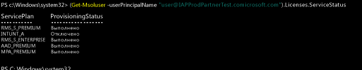

# Назначение лицензий Intune учетным записям пользователей

[!INCLUDE[classic-portal](../includes/classic-portal.md)]

Независимо от того, добавляете ли вы пользователей вручную или выполняете синхронизацию из локальной службы Active Directory, прежде чем пользователи смогут регистрировать свои устройства в Intune, вам нужно назначить каждому из них лицензию Intune.

## Назначение лицензии Intune в центре администрирования Office 365

Используйте [портал Office 365](http://go.microsoft.com/fwlink/p/?LinkId=698854), чтобы вручную добавить облачных пользователей и назначить лицензии облачным учетным записям пользователей, а также учетным записям, синхронизированным из локальной службы Active Directory в Azure AD.

1.  Войдите на [портал Office 365](http://go.microsoft.com/fwlink/p/?LinkId=698854) с использованием учетных данных администратора клиента и последовательно выберите пункты **Пользователи** > **Все пользователи**.

2.  Выберите учетную запись пользователя, которой требуется назначить лицензию пользователя Intune, а затем выберите пункты **Product licenses** (Лицензии на продукты) > **Изменить**.

3.  Переключите **Intune** или **Enterprise Mobility + Security** в положение **Вкл.** и выберите **Сохранить**.

4. Теперь учетная запись пользователя имеет необходимые разрешения на использование службы и регистрацию устройств для управления.

> [!NOTE]
> Пользователи появятся в консоли администрирования после регистрации устройства. Кроме того, вы можете выбрать целую группу пользователей, которую следует изменить. Для этого выберите добавление или замену лицензии для всех этих пользователей.

## Использование PowerShell для избирательного управления пользовательскими лицензиями EMS
Организации, использующие Microsoft Enterprise Mobility + Security (ранее Enterprise Mobility Suite), могут иметь пользователей, которым в пакете EMS нужны только службы Azure Active Directory Premium или Intune. Можно назначить одну службу или подмножество служб с помощью [командлетов PowerShell для Azure Active Directory](https://msdn.microsoft.com/library/jj151815.aspx).

Чтобы выборочно назначить лицензии пользователя для служб EMS, откройте PowerShell с правами администратора на компьютере с установленным [модулем Azure Active Directory для Windows PowerShell](https://msdn.microsoft.com/library/jj151815.aspx#bkmk_installmodule). PowerShell можно установить на локальном компьютере или на сервере ADFS.

Необходимо создать новое определение SKU для лицензии, которое применяется только к нужным планам обслуживания. Чтобы сделать это, отключите планы, которые не нужно применять. Например, можно создать определение SKU лицензии, не назначающее лицензию Intune. Чтобы просмотреть список доступных служб, введите:

    (Get-MsolAccountSku | Where {$_.SkuPartNumber -eq "EMS"}).ServiceStatus

Можно выполнить следующую команду, чтобы исключить план обслуживания Intune. Вы можете воспользоваться тем же методом для работы со всей группой безопасности или применить более детализированные фильтры.

**Пример 1** 
Создайте нового пользователя в командной строке и назначьте лицензию EMS, не включая ту ее часть, которая относится к Intune:

    Connect-MsolService

    New-MsolUser -DisplayName “Test User” -FirstName FName -LastName LName -UserPrincipalName user@<TenantName>.onmicrosoft.com –Department DName -UsageLocation US

    $CustomEMS = New-MsolLicenseOptions -AccountSkuId "<TenantName>:EMS" -DisabledPlans INTUNE_A
    Set-MsolUserLicense -UserPrincipalName user@<TenantName>.onmicrosoft.com -AddLicenses <TenantName>:EMS -LicenseOptions $CustomEMS

Проверьте:

    (Get-MsolUser -UserPrincipalName "user@<TenantName>.onmicrosoft.com").Licenses.ServiceStatus

**Пример 2** 
Отключите связанную с Intune часть лицензии EMS для пользователя, которому уже назначена с лицензия:

    Connect-MsolService

    $CustomEMS = New-MsolLicenseOptions -AccountSkuId "<TenantName>:EMS" -DisabledPlans INTUNE_A
    Set-MsolUserLicense -UserPrincipalName user@<TenantName>.onmicrosoft.com -LicenseOptions $CustomEMS

Проверьте:

    (Get-MsolUser -UserPrincipalName "user@<TenantName>.onmicrosoft.com").Licenses.ServiceStatus

>[!div class="step-by-step"]

>[&larr; **Синхронизация пользователей с Intune**](.\start-with-a-paid-subscription-to-microsoft-intune-step-2.md)     [**Организация пользователей и устройств** &rarr;](.\start-with-a-paid-subscription-to-microsoft-intune-step-5.md)  

