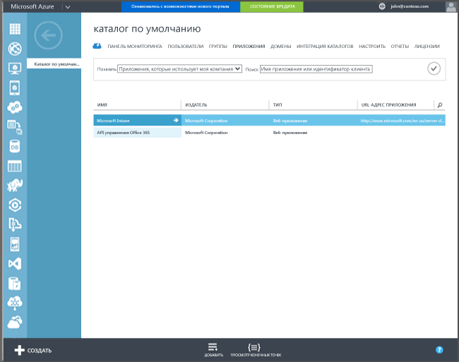

## Регистрация в Azure Active Directory

Автоматическая регистрация позволяет пользователям регистрировать принадлежащие организации или личные компьютеры с Windows 10 и устройства с Windows 10 Mobile в Intune, добавив рабочую или учебную учетную запись и дав согласие на управление. Проще простого. Устройство пользователя в фоновом режиме регистрируется и присоединяется к Azure Active Directory. После регистрации устройство управляется с помощью Intune.

**Предварительные требования**
- Подписка Azure Active Directory Premium ([пробная подписка](http://go.microsoft.com/fwlink/?LinkID=816845))
- Подписка Microsoft Intune

### Настройка автоматической регистрации MDM

1. На [портале управления Azure](https://manage.windowsazure.com) (https://manage.windowsazure.com) перейдите к узлу **Active Directory** и выберите свой каталог.

2. Откройте вкладку **Приложения** и убедитесь, что в списке приложений есть **Microsoft Intune**.

    

3. Щелкните стрелку для **Microsoft Intune**, чтобы отобразить страницу, позволяющую настроить Microsoft Intune.

4. Щелкните элемент **Настройка**, чтобы приступить к настройке автоматической регистрации MDM с помощью Microsoft Intune.

5. Укажите URL-адреса для Intune:

  - **URL-адрес регистрации MDM** — используйте значение по умолчанию.
  - **URL-адрес условий использования MDM** — используйте значение по умолчанию. Этот URL-адрес отображает условия использования для пользователей при регистрации устройства.
  - **URL-адрес соответствия MDM** — используйте значение по умолчанию. Если устройство определено как несоответствующее, для этого URL-адреса отображается сообщение **Отказано в доступе**. URL-адрес указывает на страницу, которая помогает пользователям понять, почему их устройство не соответствуют политике и как можно восстановить такое соответствие.

6.  Укажите устройства пользователей, которыми требуется управлять с помощью Microsoft Intune. Устройства Windows 10 этих пользователей будут автоматически регистрироваться для управления в Microsoft Intune.

  - **Все**
  - **Группы**
  - **Нет**

7. Выберите **Сохранить**.

<!--HONumber=Jan17_HO1-->

