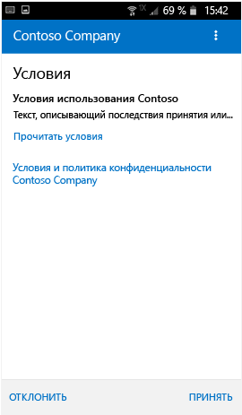
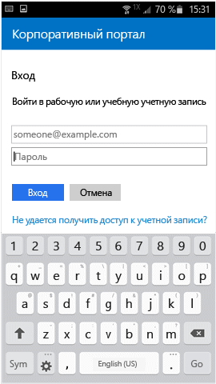

# Регистрация устройства Android в Intune

Если в вашей компании или учебном заведении используется Microsoft Intune, вы можете зарегистрировать устройство Android, чтобы получить доступ к электронной почте, файлам и другим ресурсам организации. Регистрация устройств позволяет ИТ-отделу управлять рабочими или учебными ресурсами и обеспечивать их безопасность, предоставляя вам свободу выбора устройств для выполнения рабочих задач. Дополнительные сведения о регистрации см. в разделе [Что произойдет, если установить приложение "Корпоративный портал" и зарегистрировать устройство?](what-happens-if-you-install-the-Company-Portal-app-and-enroll-your-device-in-intune-android.md)

> [!VIDEO https://channel9.msdn.com/Series/IntuneEnrollment/Android-Enrollment/player]

Эти инструкции описывают регистрацию устройств Android с ПО Samsung Knox и устройств Android. Samsung Knox — это программа для обеспечения безопасности, используемая для дополнительной защиты на некоторых устройствах Samsung под управлением Android. Чтобы определить, используете ли вы устройство Samsung Knox, последовательно выберите **Settings** > **About device** (Настройки | Сведения об устройстве). Если вы не видите строку "Knox version" (Версия Knox), значит у вас устройство Android.

Возможно, до или после регистрации вам потребуется выбрать категорию, которая наилучшим образом соответствует характеру использования устройства. Служба поддержки вашей компании использует эту категорию для определения приложений, к которым у вас есть доступ.

**Чтобы зарегистрировать устройство Android, выполните указанные ниже действия.**

1. Установите бесплатное приложение корпоративного портала Intune из [Google Play](http://play.google.com/store/apps/details?id=com.microsoft.windowsintune.companyportal).

2. Откройте приложение корпоративного портала.

3. На экране **приветствия** корпоративного портала выберите **Войти**, а затем выполните вход с использованием рабочей или учебной учетной записи.

      

4. Если служба поддержки вашей компании задала условия соглашения, нажмите **ПРИНЯТЬ**, чтобы принять их. Этот экран может немного отличаться от снимка экрана на следующем рисунке с учетом используемой версии Android.

   

5. Войдите в приложение корпоративного портала, выбрав рабочую или учебную учетную запись, указав пароль и нажав **Войти**.

   

6. На экране **Настройка доступа к ресурсам организации** коснитесь элемента **ПРОДОЛЖИТЬ**.

   

   > [!NOTE]
   > Желтые треугольники не означают, что уже произошла ошибка. Эти значки указывают, что еще остаются действия, которые необходимо выполнить в процессе регистрации.

7. Просмотрите сведения о том, что именно служба поддержки вашей компании может просматривать на вашем устройстве, и нажмите **ПРОДОЛЖИТЬ**.

   

8. На экране **Дальнейшие действия** прочитайте о том, что происходит во время регистрации, а затем нажмите **ЗАРЕГИСТРИРОВАТЬ**.

   

9. Если вы используете Android 6.0 или более поздней версии, выполните это действие. В противном случае перейдите к следующему шагу.

   Если служба поддержки вашей компании настроила определенные политики, может появиться следующее сообщение:
   - **Разрешить корпоративному порталу совершать телефонные звонки и управлять ими?**

     

   Если вы видите это сообщение, коснитесь элемента **Разрешить**. Это безопасно, так как **корпорация Майкрософт не выполняет телефонные вызовы и не управляет ими**. Текст сообщения устанавливается компанией Google, и корпорация Майкрософт не может изменить его. Когда вы разрешаете доступ, вы просто позволяете устройству отправлять свой IMEI-номер в Intune. IMEI — это номер, аналогичный серийному номеру, который однозначно идентифицирует мобильное устройство.

   Если запретить доступ, сообщение появится снова при следующем входе на корпоративный портал, но отображение последующих сообщений можно отключить, установив флажок **Больше не спрашивать**. Если вы захотите разрешить доступ в дальнейшем, потребуется перейти в раздел **Settings** (Настройки) &gt; **Apps** (Приложения) &gt; **Company Portal** (Корпоративный портал) &gt; **Permissions** (Разрешения) &gt; **Phone** (Телефон) и предоставить разрешение.

   - **Разрешить корпоративному порталу доступ к вашим контактам?**

     

     Если вы видите это сообщение, коснитесь элемента **Разрешить**. Это безопасно, так как **корпорация Майкрософт не получает доступ к вашим контактам**. Текст сообщения устанавливается компанией Google, и корпорация Майкрософт не может изменить его. При разрешении доступа приложение корпоративного портала сможет только создавать вашу рабочую учетную запись, а также использовать ее и управлять ею.

     Если запретить доступ, сообщение появится снова при следующем входе на корпоративный портал, но отображение последующих сообщений можно отключить, установив флажок **Больше не спрашивать**. Если вы захотите разрешить доступ в дальнейшем, потребуется перейти в раздел **Settings** (Настройки) &gt; **Apps** (Приложения) &gt; **Company Portal** (Корпоративный портал) &gt; **Permissions** (Разрешения) &gt; **Phone** (Телефон) и предоставить разрешение.

10. На экране **Activate device administrator** (Активация администратора устройства) щелкните **Активировать**.

    

    Роль администратора устройств нужна для управления устройствами на корпоративном портале. Она позволяет администратору видеть определенные вещи, например число попыток разблокировать экран, и предпринимать определенные действия.

    Главное, что нужно запомнить, — эти действия производятся во имя безопасности. Служба поддержки вашей компании не пытается нарушить вашу конфиденциальность или стереть ваши данные без причины, но хочет убедиться в том, что корпоративные данные хранятся в безопасности.

    Корпорация Майкрософт не контролирует это сообщение, и мы понимаем, что оно может показаться немного радикальным. Нет возможности показывать на корпоративном портале только ограничения и доступ, которые имеют отношение к вашей организации. Все они предоставляются на этом экране за один раз. Обратитесь в службу поддержки вашей компании за дополнительными сведениями через контактные данные на [веб-сайте корпоративного портала](https://go.microsoft.com/fwlink/?linkid=2010980), если у вас есть вопросы, относящиеся к использованию в вашей организации.

11. Следуйте инструкциям на экране для ввода ПИН-кода или пароля. Если вы уже настроили ПИН-код или пароль на этом устройстве, этот экран не отображается либо потребуется ввести новый ПИН-код или пароль.

    

12. Если вы используете устройство Samsung Knox, коснитесь кнопки **Подтвердить**, после чего появится сообщение о регистрации устройства. При использовании обычного устройства Android обратите внимание на экран ниже, на котором показано, что идет регистрация устройства.

    

    На этом экране показано, что идет регистрация устройства.

    

13. При появлении экрана **Настройка доступа к ресурсам организации** нажмите **ПРОДОЛЖИТЬ**. Если отображается сообщение о том, что устройство не соответствует требованиям, следуйте инструкциям для устранения проблемы, а затем нажмите **ПРОДОЛЖИТЬ**.

    

    

    Чтобы получить дополнительные сведения о проблемах, коснитесь этих проблем.

    

      

14. На экране **Настройка доступа к ресурсам организации завершена** нажмите **ГОТОВО**. Теперь ваше устройство зарегистрировано.

    

Перед установкой приложений компании выберите **Настройки** &gt; **Безопасность** и включите параметр **Неизвестные источники**. В противном случае при попытке установки выводится сообщение "Install blocked. For security reasons, your device is set to block installations of apps obtained from unknown sources." (Установка заблокирована. По соображениям безопасности на вашем устройстве включена блокировка приложений, полученных из неизвестных источников). Можно нажать **Настройки** в диалоговом окне ошибки, чтобы перейти к параметру **Неизвестные источники**.

> [!Note]
> Если в вашей организации используется программное обеспечение для управления затратами на телекоммуникации, для полной регистрации устройства потребуется выполнить дополнительные действия. Дополнительные сведения см. [здесь](enroll-your-device-with-telecom-expense-management-android.md).

Если при попытке регистрации устройства в Intune появляется сообщение об ошибке, вы можете [отправить сведения об ошибке регистрации в службу поддержки вашей компании](send-enrollment-errors-to-your-it-admin-android.md).

По-прежнему нужна помощь? Обратитесь в службу поддержки вашей компании (см. контактные данные на [веб-сайте корпоративного портала](https://go.microsoft.com/fwlink/?linkid=2010980)) или отправьте письмо <a href="mailto:wintunedroidfbk@microsoft.com?subject=I'm having trouble with enrolling my Android device&body=Describe the issue you're experiencing here.">команде разработчиков Майкрософт для Android</a>.
